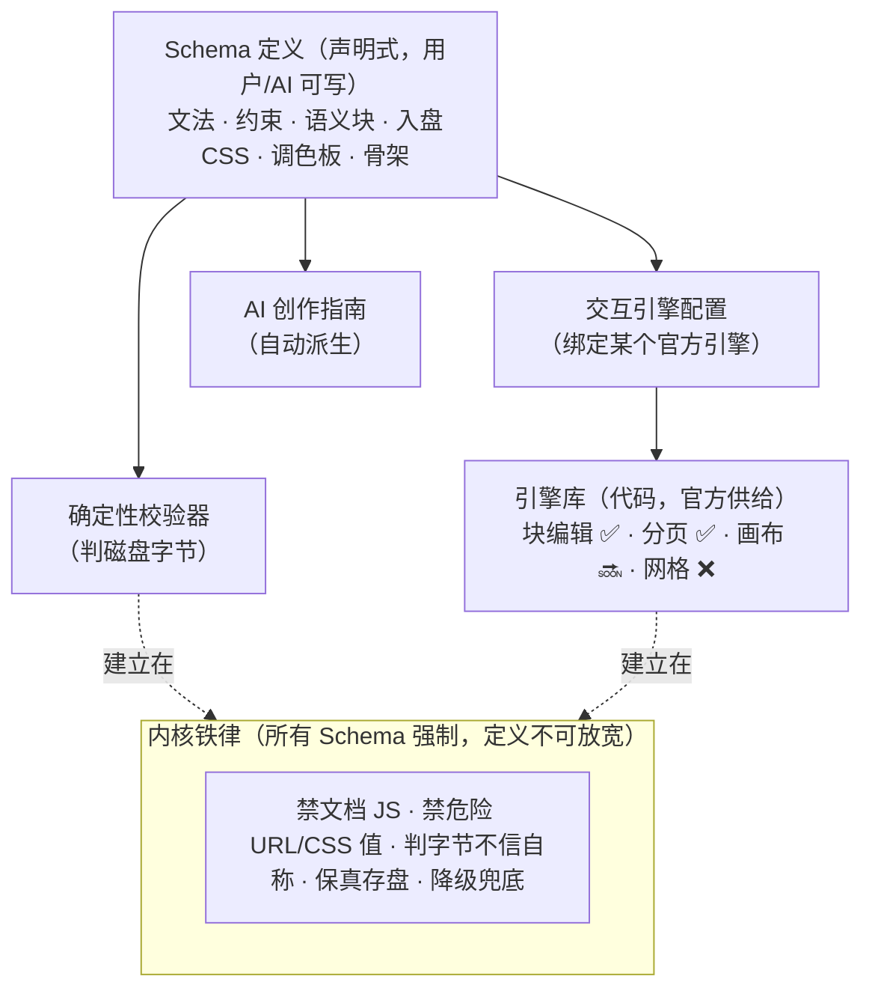

# 用户自定义 Schema——Schema 即文档类型的开放机制

## Summary

让用户像官方一样定义自己的 Schema。愿景口径（Colin）：**Schema = 一种文档类型**——Word、Excel、PowerPoint、Notion、Photoshop 那样的交互模式与呈现内容，只要原生 HTML 承载得了、在 Wordspace 框架内，都可以成为一个 Schema；官方 Schema 和用户 Schema 是同一种东西。本文回答三个研究问题：① Schema 由什么构成、哪些固定哪些灵活；② 要向用户暴露哪些接口；③ 用户怎么定义（结论：AI 辅助是主路径）。核心研究结论：**呈现与合法性可以完全声明式地开放给用户；交互是编辑器代码**——近期由官方引擎供给（用户 Schema = 选引擎 + 声明式定义，校验器、编辑器配置、AI 创作指南从同一份定义派生）；终局把「造引擎」本身也开放给用户（编辑器插件 + AI 代写，见 Tier 3 / KD5——Colin 拍板为目标，不是可选项）。

---

## 词汇边界

四个容易串味的概念，先钉死（前两条是 `docs/schema-1-draft-v0.md` §0 冻结的）：

| 概念 | 是什么 | 本文管不管 |
|---|---|---|
| **Schema** | 结构规则 + 编辑方式 + 最小语义 CSS——管「能放什么、怎么编辑」 | ✅ 本文对象 |
| **Template** | Schema 约束内的视觉装饰（配色/字体/排版主题） | ❌ 另一个 feature |
| **起始模板 / 模板库** | 新建文档的内容骨架（`src/lib/doc-templates.js`；`docs/product-vision.md`「模板」节的模板库属于这层+装饰层） | ❌ 但用户 Schema 可附带自己的起始骨架 |
| **交互引擎** | 编辑器代码实现的一种编辑范式（块编辑、分页排版、画布拖拽……）——本文为讲清「交互从哪来」引入的概念 | ✅ 是本文的关键机制 |

---

## Problem Frame

Schema #1 已经把 schema-first 路线跑通：确定性校验器当脊梁、合规走完整块编辑、不合规降级基础编辑、AI 按创作指南在范式内生成（`skills/wordspace`）。但 Schema #1 只是**一种**文档类型（Notion 型块文档）。世界上的文档类型远不止这一种，官方不可能一个个定制到位——所以要把「定义一种文档类型」的能力开放出去，让用户（和用户的 AI）自己定义。

这是前瞻性的平台布局，目前**没有具体用户案例**在催（见 Dependencies / Assumptions）。

还要和隔壁的「模板库」划清差异（Q4 的排序对象）：起始骨架 + 定制 AI 创作指南能满足「我想要一类长这样的文档」的大半需求，而且轻得多。用户 Schema 的差异化只在模板给不了的三样上：**结构强制校验**（跑偏的文件被指出哪里不合，而不是只在创建时给个起点）、**自定义语义块进编辑器**（自己的块出现在斜杠菜单/调色板里）、**机器可执行的类型身份**（校验器和 AI 都认得这个类型）。v1 的验证必须对着这三样打，否则建成的重机制证明不了任何模板做不到的事（见 Assumptions）。

一个物理事实决定了开放机制怎么切：**Wordspace 的文档文件里不跑 JS**（安全模型根基：iframe sandbox 无 `allow-scripts`，校验器见 `<script>`/内联事件直接判非合规）。HTML 能静态表达几乎任何呈现——表格是 Excel 的格子、固定尺寸的页是幻灯片、绝对定位图层是画布——但单元格导航、公式重算、图层拖拽这些**交互全部住在编辑器代码里**，不在文件里。一份用户写的定义能描述「文件长什么样、什么算合法」，变不出「编辑器里没有的交互」。

---

## Key Decisions

对话中已拍板的（Colin，2026-07-14）：

- **KD1 — 自定义的对象是 Schema（结构层）。** 不是 Template（装饰），也不是起始骨架——那两层是别的 feature。
- **KD2 — 用户 Schema 的成立底线是三件套，缺一不算成立：** 文件能被识别/校验；AI 能按它生成和修改；在 Wordspace 里有 Schema #1 级别的**结构化编辑体验**。
- **KD3 — Schema = 文档类型，官方与用户 Schema 同一机制。** `src/lib/schema-registry.js` 的 descriptor 形状（`{id, detect, validate}`）本来就是为多 Schema 留的口，用户 Schema 走同一个 registry / classify，地位对等。
- **KD4 —（沿用 schema-foundation KD4）文件内的 schema 标记只当提示，永不当权威。** 识别永远以校验器核实际内容为准。收窄语义（评审后补）：「提示」可以且应当决定 classify **先按哪个 Schema 试**（候选排序，见 R12）；「权威」始终指合规与否只由内容校验裁决——两者不冲突。
- **KD5 —「用户定义交互/UX」是终局目标，不是可选远期。** 用户不仅定义文档长什么样，还要能定义它怎么编辑、UX 怎么设计。实现通道 = 编辑器插件（代码住编辑器、永不住文档，文件安全模型不变）+ AI 按用户的自然语言描述代写插件。分阶段抵达：v1 做声明式层（Tier 1），同时引擎接口按未来公开 SDK 的标准设计（R15）；插件平台的实现与安全模型是后续阶段（见 Tier 3、Scope Boundaries）。

---

## 核心发现：呈现与交互分离

把 KD2 的三件套和「文档不跑 JS」放在一起推，得出本文最重要的架构判断（终局方向 Colin 已拍 = KD5；分阶段路线与 Wendi 对齐见 Q1）：

> **一个 Schema = 声明式定义（呈现 + 合法性，用户可完全自定义） + 交互引擎绑定（代码——近期官方供给；终局用户经插件/AI 代写也能造，KD5）。**

用 Colin 的五个例子对照今天的引擎现状：

| 范式 | 交互引擎现状 | 用户何时能定义这类 Schema |
|---|---|---|
| Notion 型 | ✅ 块编辑引擎（Schema #1 在用） | 现在就能（v1 主战场） |
| Word 型 | ✅ 分页已实现（官方引擎能力 + 极小的声明式 `@page` 设置面，`docs/features/paged-doc.md`） | 内建设置已可用；用户 Schema 可引用分页配置（Q2） |
| PPT / 画布型 | 🔜 自由画布引擎在 roadmap（F01 方向） | 引擎落地后 |
| Photoshop 型 | 画布引擎可覆盖图层摆放；专业修图不现实 | 部分 |
| Excel 型 | ❌ 无网格/公式引擎 | 要先造引擎 |

分页的实证要读准它证明了什么：Word 式呈现确实没有开新 Schema，但解锁它的主力是官方手写的整套分页视图机制（V4 推挤引擎，见 `docs/features/paged-doc.md`），声明式的面只有 `@page` 那几个参数。所以它是 **Tier 2 的实证**——「引擎能力 + 极小声明式配置面」就能解锁新范式；Tier 1（用户定义驱动引擎行为）尚无实证，它的第一个实证正是本文的自举试金石（见 Dependencies / Assumptions）。

由此得到三层能力模型：

- **Tier 1 · 引擎内自定义（本文主体，近期可落地）**——用户 Schema = 挑一个已有引擎 + 声明式配置（文法、约束、语义块、入盘 CSS、骨架）。校验器和 AI 指南从定义派生，编辑体验由引擎保证（KD2 三件套全数成立）。v1 的用户文法空间限定为 **Schema #1 方言**——在 Schema #1 内容模型不变的前提下：只收紧规则、新增语义变体块（callout 变体式）、附加结构性约束。这是现有块引擎能真实保证文法闭合（R4）的范围；放宽内容模型（如「引用里允许列表」）要动引擎闭合逻辑，不在 v1。
- **Tier 2 · 引擎库扩张（官方 roadmap）**——画布、网格、幻灯片引擎逐个落地；每落一个，Tier 1 可定义的范式空间扩一格。这正是官方已在走的路。
- **Tier 3 · 引擎级自定义（终局目标，KD5）**——让用户真正「造游戏机」：交互与 UX 由用户定义。机制 = 编辑器插件平台（稳定 Editor SDK + 插件安全模型：能力沙箱、权限授予、来源签名），普通用户的通道 = **AI 按自然语言描述代写插件**（与「AI 在范式内生成」哲学同构——普通用户不写代码，AI 写、平台把关）。两个不动摇的前提：① 插件代码住**编辑器**、永不住文档——文件仍是死的 HTML，没装插件的人打开同一份文件 = 静态呈现 + 声明式层的编辑，装了才有该玩法，文档安全模型一寸不变；② 行为代码无法像 HTML 结构那样确定性校验，插件的「校验器等价物」= 沙箱能力边界 + 权限模型 + 测试 harness，是独立的大研究课题（先例：Obsidian 社区插件 / VS Code marketplace / Figma 沙箱插件——都是产品成熟后才开放）。v1 不实现，但 Tier 1 拆层产出的「引擎 ↔ 定义」接口就是未来 SDK 的雏形（R15）——Tier 1 不是绕路，是同一条路的第一段。

---

## Schema 解剖：固定 vs 灵活（研究问题 ①）

以 Schema #1 反推 + registry 现状，一个完整的 Schema 由八个部件构成：

| # | 部件 | 现状（Schema #1） | 开放后归谁 |
|---|---|---|---|
| 1 | 身份（id / 名称 / 版本） | `schema-1`，无版本字段 | 用户定义 |
| 2 | 识别 detect（宽容候选筛） | 恒真（兜底 schema） | 从定义派生 |
| 3 | 文法 / 校验规则（权威 validate） | `src/lib/schema-validate.js` 手写 | **用户定义（声明式）** |
| 4 | 语义 baseline CSS（`data-ws-schema-css` 入盘） | todo/callout/table + 排版底线 | 用户定义（受约束） |
| 5 | 交互引擎绑定 + 引擎配置 | 隐式硬编码（块编辑器） | 用户**从引擎库里选**，配置声明式 |
| 6 | AI 创作指南 | `skills/wordspace` 人工维护 | **从定义自动派生** |
| 7 | 编辑器配置（调色板 / 斜杠菜单可用块等） | 硬编码 | 用户定义 |
| 8 | 起始骨架（新建该类型文档时） | `src/lib/doc-templates.js`（与 schema 无关联） | 用户定义（可选） |

**固定层（内核铁律）**——对一切 Schema 无条件强制，用户定义**不可放宽**（fail-closed，定义里试图放宽 = 定义本身被拒）：

- 禁文档 JS：`<script>`、`<template>`、内联事件属性（`on*`）。
- 禁危险 URL scheme：`javascript:` / `file:` / `blob:` / 非图片 `data:`（href、src、srcset、xlink:href 全查）。
- 禁危险 style/CSS 值：`url()` 外链请求、`expression()`、`-moz-binding`、`behavior:`、`@import`、`javascript:` 对一切 Schema（含画布类）永不协商；检查范围不只行内 `style` 属性——**用户 Schema 自带的入盘 baseline CSS 内容同样受此约束**（现校验器对 `<style data-ws-schema-css>` 的内容零检查，这是拆层时必须补的门，否则 R2 的注册拒绝没有判据）。
- 禁导航/加载劫持：`<base>`、`meta http-equiv`、外联 `<link>`。
- 校验判**磁盘字节 reparse 的 DOM**，绝不信 `<meta>` 自称（schema-foundation KD1/KD4 原样沿用）。
- 保真存盘：编辑器注入物按精确白名单剥离，绝不动用户内容。
- 本地单文件 `.html`。
- 兜底不变：不合规 / 未知 Schema → 基础文字编辑降级，任何文件永远打得开。

**灵活层（每 Schema 声明式定义）**：

- **布局模型**：文档流 / 分页版式 / 绝对定位画布……`position:absolute` 在 Schema #1 是禁的、对画布 Schema 是核心能力，所以布局自由度随布局模型下放给 Schema 层（这是「哪些固定」最容易划错的一条）——但它同时是校验器实测过的点击劫持面（KV-7：透明全幅覆盖交互元素），所以是**有条件开放**：仅对声明了画布布局模型的 Schema 放行，且该 Schema/引擎必须给出覆盖层劫持的等效缓解，作为 R2 fail-closed 的判据之一。上一节固定层的危险 CSS 执行/外链向量不随任何布局模型下放。
- 块/元素集合与内容模型、嵌套规则、结构要求（如「必须以 H1 开头、必须含一个决议表格」）。
- 属性 / class 白名单、语义变体块（如「警告框」= callout 变体 + 自带入盘 CSS）。
- 入盘 baseline CSS、调色板、head 内作者样式政策。

**代码信号**（细节归 planning，这里只记方向）：`schema-validate.js` 目前把内核安全检查和 Schema #1 文法焊在一个文件里，开放前要拆成「内核校验（全 Schema 共用、不可配置）+ 按定义解释执行的文法校验」两层。

---

## 用户接口（研究问题 ②）

用户接触一个 Schema 的全部界面，共六类：

1. **定义格式**——一份声明式 manifest（载体待定：独立文件，或者「Schema 定义本身就是一份 Wordspace 文档」——后者产品叙事更漂亮，见 Q3）。
2. **注册 / 安装**——定义放进工作区（或 app 级）即被 registry 认识；打开文件时 classify 自动遍历。
3. **文档 ↔ Schema 关联**——文档可带 schema 提示标记；标记是 classify 候选排序的一等信号（决定先按哪个 Schema 校验——v1 的用户 Schema 多为 Schema #1 文法子集，没有它会被恒真兜底的 Schema #1 抢先认领，见 R12），合规与否仍只由内容校验裁决（KD4）。
4. **校验反馈**——违规清单人话化展示（现有 `violations` 机制的自然延伸），告诉用户「为什么这份文件不算你的 Schema、差在哪」。
5. **未安装 Schema 的文档**——自然降级到基础编辑 + 明确提示「此文档声明了 Schema X，本机未安装」。
6. **版本与演进**——旧文档默认按其声明且本机已安装的定义版本校验；「升级到新版本重校验」是用户显式动作（R11），**绝不静默改用户文件**。

分发/共享（公司私有库、公共池——`docs/product-vision.md` 模板库的同款思路）划到远期，见 Scope Boundaries。

---

## 定义工作流（研究问题 ③）

**要不要借助 AI：要，而且 AI 辅助是主路径。** 三种入口按门槛排：

1. **AI 对话定义（主推）**——用户描述想要的文档类型（「我要一个会议纪要 Schema：必须有参会人列表和决议表格」），或直接丢一份范例文档让 AI 反推。AI 起草声明式定义 → **确定性自检**（按草案生成样例文档、跑校验器闭环，复用 `docs/schema-1-ai-generation-eval.md` 的失败驱动方法论）→ 可视化预览（用起始骨架渲染样例）→ 用户确认注册。
2. **范例反推**——只丢文件不对话，AI 从范例归纳定义，其余同上。
3. **手写 manifest**——专家/调试通道，格式文档化即可，不做重 UI。

现实约束（评审后补）：入口 1 依赖**应用内 AI 对话能力**，真 app 今天没有——现有 AI 接入只是「复制 Prompt / 安装 Skill」的外部通道（见 Dependencies）。v1 的机制验证走入口 2/3 就够：外部 AI（现有 skill 通道）起草定义、确定性自检照跑；应用内对话流等该依赖落地后再上。

这条链路成立的依据：`skills/wordspace` 已经证明「AI 读规则 → 产合规文档」跑得通且有 eval 方法；「AI 定义 Schema」是同一链路反着用（AI 产规则而不是产文档），校验器还是那道确定性的门。

---

## Requirements

**定义模型**

- R1. Schema 定义是**声明式数据（非代码）**、单一真相源：校验行为、引擎配置、AI 创作指南三者从同一份定义派生，不允许三处各自维护。
- R2. 内核铁律对一切 Schema 无条件强制；用户定义无法放宽任何一条——试图放宽的定义在注册时被整体拒绝（fail-closed）。
- R3. 用户 Schema 与官方 Schema 走同一 registry / classify 机制，能力与地位对等（官方 Schema 最终也应重述为同一种声明式定义——自举，见 Assumptions）。
- R14. Schema id 全局唯一：注册时校验，与已注册 Schema（官方或用户）撞号的定义**整份拒绝**（R2 同款 fail-closed）并提示占用——否则一份更宽松的定义可以冒充/遮蔽被信任的 Schema 身份，且全程不触碰任何内核铁律。
- R15. 架构不得封死引擎级扩展（KD5）：Tier 1 拆层产出的「引擎 ↔ Schema 定义」接口，按「未来会成为公开插件 SDK」的标准设计与评审（能力边界清晰、不泄漏引擎内部实现细节）；v1 只内部使用、不对外承诺稳定。

**编辑体验**

- R4. 每个 Schema 绑定一个**已有交互引擎**；其合规文档获得该引擎完整的结构化编辑，且编辑动作对该 Schema 的**内容模型（文法）闭合**（合法进 → 合法出）。文档级结构要求（存在性/顺序约束，如「必须含一个决议表格」）无法由删块这类合法编辑动作维持，不在闭合承诺范围内——其行为由 R13 规定。
- R5. 定义界面**如实呈现能力边界**：只提供已落地的引擎选项；引擎没有的交互不可能通过定义文件产生。
- R13. 违反结构完整性约束（存在性/顺序类）**不触发降级、不改判 Schema**：文档保持该引擎的结构化编辑，编辑器实时显示「未达标」状态与人话违规清单，直到用户补齐或显式改类型。只有文法/内核层违规才走基础编辑降级——否则「删一个必需块就静默丢掉结构化编辑」会成为高频灾难。

**识别与校验**

- R6. 打开文件即 classify：按裁决规则（R12）确定唯一 Schema 且合规 → 该引擎完整编辑；都不中 → 基础编辑降级（现行为不变，是所有新路径的兜底）。
- R7. 校验只认内容不认自称；违规输出人话清单（rule + 位置 + 说明）。
- R8. 文档可携带 schema 提示标记；本机未安装该 Schema 时降级并明确提示。
- R12. classify 有**确定性的多重命中裁决规则**：提示标记（若有且该 Schema 已安装）决定候选校验顺序 → 特异性 detect 的 Schema 先于恒真兜底 → Schema #1 兜底永远最后判；validate 仍是合规唯一权威（KD4 不破）。v1 的用户 Schema 几乎都是 Schema #1 的文法子集，没有这条规则它们会被兜底 Schema 永远抢先认领、形同虚设。

**AI**

- R9. 每个 Schema 自动派生一份 AI 创作指南（`skills/wordspace` 同款形态），外部与应用内 AI 都按它生成/修改该类型文档；指南随定义更新再生，不许手工漂移。派生器把定义内容当**数据**渲染：定义里的自由文本字段（规则说明、违规文案等）经转义/结构化隔离进入指南，不得原样拼接成可被下游 AI 当作指令执行的文本（防提示注入——定义作者要按潜在攻击者对待）。
- R10. 提供 AI 辅助定义流：描述或范例 → AI 起草定义 → 确定性自检（样例生成 + 校验闭环）→ 预览 → 用户确认注册。AI 起草不可靠没关系——注册前的确定性自检是门，跟 schema-foundation「校验器把门、不赌 AI 完美」同一哲学。

**演进**

- R11. Schema 定义带版本；旧文档默认按其**声明且本机已安装**的定义版本校验（标记仍只作提示、合规仍判内容），「升级到新版本重校验」是用户显式动作，重校验不过按违规层级走 R13 的未达标态或降级；绝不静默迁移用户文件。显式排除的政策：「定义一变更就对存量文档全量重校验」——那会让用户每收紧一次定义、存量文档整批跌出结构化编辑。深度版本管理（批量迁移工具、多版本并存策略）不在 v1（见 Scope Boundaries）。

---

## Key Flows

- F1. **定义一个 Schema**
  - **Trigger:** 用户在 app 内发起「新建 Schema」（对话或丢范例）。
  - **Steps:** 描述意图 → AI 起草声明式定义（选引擎 + 文法 + 语义块 + CSS + 骨架）→ 自检（样例生成 + 校验器闭环）→ 预览 → 用户确认 → 注册进 registry。
  - **Outcome:** 新文档类型即刻可用。**Covers R1, R2, R5, R10。**
- F2. **使用自定义 Schema**
  - **Trigger:** 用户新建该类型文档或打开一份合规文件。
  - **Steps:** classify 按 R12 裁决命中 → 加载引擎 + 该 Schema 配置 → 结构化编辑 → 保真存盘 → 重开仍命中（结构约束未达标时仍命中该 Schema、以未达标态打开，见 R13）。
  - **Outcome:** 与 Schema #1 同级的编辑体验。**Covers R3, R4, R6, R12, R13。**
- F3. **AI 按用户 Schema 生成文档**
  - **Trigger:** 外部 agent（或应用内 AI）拿到该 Schema 派生的创作指南。
  - **Steps:** AI 按指南产 `.html` → 用户打开 → classify 命中 → 完整编辑。
  - **Outcome:** 用户定义的类型获得与官方同款的 AI 生态。**Covers R9。**
- F4. **打开未安装 Schema 的文档**
  - **Trigger:** 文件声明了本机没有的 Schema。
  - **Steps:** classify 都不中 → 基础编辑降级 + 提示所声明的 Schema 名。
  - **Outcome:** 永远打得开、不丢内容、去向清晰。**Covers R6, R8。**

---

## Acceptance Examples

- AE1. **Covers R4, R10, R13.** Given 用户对 AI 说「会议纪要 Schema：必须 H1 开头、必须有参会人列表和一个决议表格」，When 定义注册完成并新建一份该类型文档，Then 编辑器是完整块编辑；删掉决议表格后文档进入「未达标」状态——保持块编辑**不降级**，实时显示人话违规项（缺决议表格），补回即恢复达标。
- AE2. **Covers R2.** Given AI 起草（或用户手写）的定义里允许 `<script>` 或 `javascript:` 链接，When 注册，Then 整份定义被拒且指明撞了内核哪条铁律——没有「部分注册」。
- AE3. **Covers R8.** Given 同事发来一份声明了「发票 Schema」的文档而本机没装，When 打开，Then 基础编辑可用、内容完好，界面提示「声明了 Schema『发票』，未安装」。
- AE4. **Covers R5.** Given 画布引擎尚未落地，When 用户想定义 PPT 型 Schema，Then 定义界面不出现画布引擎选项（而不是注册成功却给半残体验）。
- AE5. **Covers R3.** Given 把 Schema #1 用声明式定义格式完整重述、registry 消费该定义（校验与引擎配置都从它派生、不走硬编码旁路），When 跑全量既有测试套件，Then 结果与手写实现等价、全部通过——此门未过之前，不对用户开放 Schema 注册通道。

---

## Scope Boundaries

**Deferred for later**

- Tier 3 插件平台的**实现**（Editor SDK 对外开放、插件安全模型、AI 代写插件的把关机制）：是终局目标（KD5）但不在 v1——过早开放 API 会把还在演进的引擎内部冻结成对外契约（Obsidian/Figma 都是产品成熟后才开插件）。v1 的义务 = R15 的接口纪律 + 把「插件安全模型」立为独立研究项。
- Schema 分发共享（私有库 / 公共池）、跨 Schema 文档转换、网格（Excel）引擎与公式计算。
- 深度版本管理：定义变更的批量迁移工具、多版本定义并存策略（v1 只保 R11 的最小政策）。

**Outside this product's identity**

- 允许文档内运行 JS 的「schema」——不管以什么形式包装，违反安全根基，永不。
- Schema 定义能触碰/放宽内核铁律。

---

## Dependencies / Assumptions

- **假设：这是前瞻布局，没有实证用户需求。** v1 的评价标准应是「机制被验证」（官方 Schema 能用同一套定义重述、一个真实的用户 Schema 全链路跑通），不是行业功能覆盖度；且那个用户 Schema 必须用到模板机制给不了的能力（结构强制校验 / 自定义语义块进编辑器），否则验证不了差异化价值。
- **依赖：引擎库演进。** 可定义空间的天花板 = 引擎库丰富度（画布引擎 F01 方向是下一个大扩格）。
- **依赖：校验器拆层。** `src/lib/schema-validate.js` 的内核安全与 Schema #1 文法要解耦，才有「按定义解释执行」的文法校验。
- **依赖：编辑器内容模型拆层（工作量大头，别漏估）。** 闭合逻辑现焊死 Schema #1：`src/lib/schema-model.js`（叶子块集合、列表拍平、容器多段等适配）与 `src/editor/blockedit.js`（classify、斜杠菜单、todo 样式注入）都要改为消费 per-Schema 声明式配置。量级与校验器拆层相当甚至更大，是 Tier 1 的最长关键路径。
- **依赖：应用内 AI 对话能力。** R10/F1 的「对话定义」主路径依赖它，真 app 今天只有「复制 Prompt / 安装 Skill」的外部通道。该依赖落地前定义工作流走入口 2/3，机制验证不因此阻塞。
- **试金石（自举）：把 Schema #1 自己重述成第一份声明式定义**，registry 消费它跑通全量既有测试，且**引擎配置同样从该定义派生、不得继续走硬编码旁路**（否则试金石只踩了校验半边）——格式被自己人踩实之前不对用户开放。若重述发现 Schema #1 的个别规则声明式表达不了（表格矩形、figure 恰含一图、summary 首子这类关系/计数约束），既定路线是：用户 Schema 语言 = **有界的声明式子集** + 一组**内核内置谓词**（官方维护，manifest 可引用、不可自定义）；R1 不开代码逃生舱，R3 的「对等」相应读作「同 registry 同校验管线，表达力有界」。
- **依赖：AI 定义自检复用既有 eval 方法论**（`docs/schema-1-ai-generation-eval.md` / `schema-1-ai-edit-eval.md` 的失败驱动改规则循环）。

---

## Outstanding Questions

**Resolve Before Planning**

- Q1. 分阶段路线与 Wendi 对齐：终局 =「用户连交互/UX 都能定义」（KD5，Colin 已拍），v1 = 声明式层（Tier 1）+ SDK 接口纪律（R15）。要对齐的是这个梯子本身，以及「插件安全模型」（能力沙箱/权限/AI 代写插件的把关——行为代码没有确定性校验器可用）作为独立研究课题何时启动。
- Q2. v1 目标引擎范围：只块编辑引擎，还是含分页版式配置？（建议：块引擎 + 分页配置，两者今天都在。）
- Q3. 定义载体：独立 manifest 文件，还是「Schema 定义本身是一份 Wordspace 文档」？后者叙事漂亮（用 Wordspace 定义 Wordspace），但校验/解析成本要评估。
- Q4. 优先级排序：用户自定义 Schema vs Template（装饰层）vs 模板库——product-vision 里 Wendi 明确写了模板库，三者用户感知有重叠，先后要 Wendi 排。

**Deferred to Planning**

- registry / 校验器拆层的具体切法；manifest 的字段设计；版本化与迁移机制；AI 定义流的 eval 设计；定义 UI 的形态。

---

## Sources

- `src/lib/schema-registry.js` — descriptor `{id, detect, validate}`，多 Schema 的口已留好。
- `src/lib/schema-validate.js` — 内核安全与 Schema #1 文法现焊在一起（拆层信号）。
- `docs/schema-1-draft-v0.md` §0/§1 — Schema/Template 冻结、六条物理约束（含「不跑文档 JS」「保真存盘」）。
- `docs/brainstorms/2026-06-30-schema-foundation-requirements.md` — KD1–KD6（校验器脊梁、标记不当权威、非合规降级），本文全部沿用。
- `skills/wordspace/SKILL.md` + `docs/schema-1-ai-authoring.md` — AI 创作指南的形态与「规则优先于用户要求」原则 = R9 派生指南的模板。
- `docs/schema-1-ai-generation-eval.md` / `docs/schema-1-ai-edit-eval.md` — 失败驱动的 eval 方法论 = R10 自检的依据。
- `docs/features/paged-doc.md` — 分页 = Schema #1 上的声明式版式设置，「声明式 + 引擎参数化」的实证。
- `docs/product-vision.md`「模板」节 — 模板库属于装饰/骨架层，与本文的 Schema 定义是不同层（Q4 的排序对象）。
