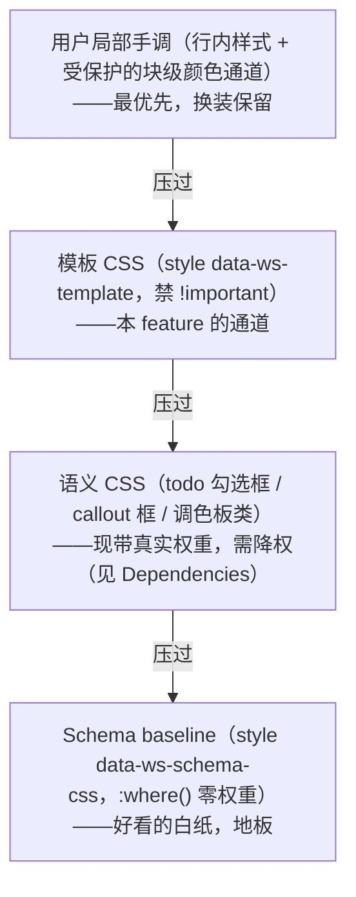

# 用户自定义模板——版式即数据、文件自包含、零后端分享

## Summary

允许用户自定义模板（Wendi 2026-07-14 澄清：本 feature 的对象是 **Template，不是 Schema**）。一个模板 = 一小包数据：**受管制的样式 CSS + 可选起始骨架 + 元数据**。应用模板 = 把样式盖章写进文档 `<head>`（带标记的 `<style>`），文件自包含——发给别人、导 PDF、浏览器直开都好看，对方什么都不用装。支持：从模板新建、给既有文档一键换装/卸装、把当前文档存为模板、AI 按描述生成模板。分享零后端：本地文件导出导入 → 公司库 = 共享云盘文件夹（复用已有多根工作区能力）→ 公共池 = 静态索引一次 GET，全程不需要账号或自建云——**Q3 已拍（Colin 2026-07-14）：v1 只做本地档，公司库/公共池机制成立、整体挪后**。走 ui-demo-first（Q4 已拍）。

---

## 词汇边界

| 概念 | 是什么 | 本文管不管 |
|---|---|---|
| **Template（本文对象）** | 版式包 = 受约束的样式 CSS + 可选起始骨架。Wendi product-vision「模板」节的语义：手册/标书/演示文稿的**版式**存为模板、人和 Agent 都能调用 | ✅ |
| **Schema** | 结构规则 + 编辑方式（`docs/schema-1-draft-v0.md` §0：Template = Schema 约束内的视觉装饰）。模板**永不**改结构 | ❌ 用户自定义 Schema 是另一个远期 feature（PR #182 研究） |
| **起始骨架（现状）** | `src/lib/doc-templates.js` 的内置「新建文档模板」——只有内容骨架、**没有样式层**，也不能给既有文档换装 | 被本 feature 吸收为模板的骨架部分 |

---

## Problem Frame

一个现状事实是这个 feature 的起点：**今天的合规文档都是「素颜」的**。校验器规定 `<head>` 里只允许官方的 `<style data-ws-schema-css>`（排版底线 baseline），用户自己写的 `<style>` 会让文档被判非合规、掉进基础编辑。也就是说，合规世界里目前**不存在**用户可用的装饰通道——所有合规文档长得都一样。

Wendi 的愿景（`docs/product-vision.md`「模板」节，canonical）：公司的手册、标书、演示文稿等常用文档的版式可以保存为模板，此后无论是人还是 Agent 都能调用模板快速生成带公司既有样式的文档；模板有公司私有库和公开共享池两类来源。

所以本 feature 在技术上就一件事：**给装饰开一条受管制的通道**——带标记、过安全门的 head CSS。加上骨架和分享机制，就是完整的模板系统。它和已有的「新建文档骨架」的差异化：骨架只管起点内容、不管样式，而且救不了已经写了一半的文档；模板管样式、可以随时给既有文档换装。

---

## Key Decisions

- **KD1 — 本 feature 的对象是 Template（Wendi 2026-07-14 澄清拍板）。** 结构层不动：模板永不改文法、不产生块级 `style` 属性、不把合规文档变非合规。用户自定义 Schema 是另一个 feature（研究见 PR #182 的 `docs/brainstorms/2026-07-14-user-defined-schema-requirements.md`，待合，远期）。
- **KD2 — 模板 = 声明式数据包，应用 = 盖章入盘。** `{ 名字, 受约束的 CSS, 可选骨架, 元数据/预览 }`；应用时把 CSS 写进文档 head 的 `<style data-ws-template="...">`。**文件自包含**：样式随文件走，接收方/发布端/PDF 导出零依赖——这是本地优先产品的关键红利，也是「分享不需要联网」的根基。
- **KD3 — 换装必须干净。** 模板段有明确标记，换模板/卸模板 = 替换/删除那一段 style，正文内容零改动、可撤销（撤销覆盖 head 是要新建的能力，见 Dependencies——现有撤销栈只快照 body）。「手动标红的那句话，换装后还是红的」是本 feature 的**不变式**，但它不是标准层叠白送的定律，须由三件事共同保障：模板 CSS 禁 `!important`（R2）、语义 CSS 降权、块级颜色手调纳入保护通道（后两件见 Dependencies 与「技术原理」）。
- **KD4 — 本地优先、零后端。** v1 本地库 + 文件级分享；公司私有库 = 共享云盘文件夹（复用已在 main 的多根工作区能力，共享文件夹里的模板自动进画廊）；公开模板池 = 静态索引（GitHub repo / 官网 JSON，一次 GET，app 内置浏览器已证明网络能力不是新基建）。不做账号、不自建云。
- **KD5 — 模板 CSS 按用户可控输入对待，过内核级 CSS 安全门。** 禁 `url()` 外链请求、`@import`、`expression()` 等执行/外呼向量、全屏覆盖劫持类——与 Schema 研究（PR #182）发现的「校验器对 style 块内容零检查」是**同一道缺口、同一道门**，先建它、两个 feature 共用。违规的模板在导入/保存时整份拒绝（fail-closed）。
- **KD6 — v1 范围拍板（Colin 2026-07-14，Wendi 可在 PR review 翻案）。** 模板 = 版式 + 可选骨架（Q1）；既有文档一键换装**进 v1**（Q2）；分发只做本地库 + 文件导出导入，公司库（R11）与公共池（R12）整体挪后（Q3，`.md` 通道随之挪后）；**ui-demo-first**（Q4）——画廊/换装预览/管理页交互先在 ui-demo 定稿给 Wendi 过目，再按 `/align-feature` 惯例移植真 app。
- **KD7 — 品牌字体政策（Q5，Colin 授权代拍）。** 允许 `data:font` 内嵌（R2 窄放行不变），v1 **不做子集化**；体积用预算管理而不是禁止——本地优先产品的稀缺资源是「无外呼」不是磁盘：模板内字体总量超软阈值（暂定 5MB）时保存/应用给体积提示，超硬上限（暂定 20MB）整份拒绝（数值 planning 校准）。AI 生成指南写入最佳实践：优先系统字体栈，品牌字体只嵌标题所需的一两个字重。字体子集化管线（按常用字表裁剪，中文字体从数 MB 降到数百 KB）列 deferred——它是后续优化，不是 v1 门槛。

---

## 技术原理

**唯一的校验器改动**：`src/lib/schema-validate.js` 的 `validateHead` 现在只放行 `<style data-ws-schema-css>`；扩一条——放行 `<style data-ws-template="...">`，前提是其内容通过 KD5 的 CSS 安全门。应用了模板的合规文档**仍然合规**（AE1）。

**层叠模型**（目标形态；现实里有第四层，见图后说明）：

评审核出的两个现实（不修正则 KD3 不成立）：① head 里除 baseline 外还有一层**带真实权重的语义 CSS**（todo/callout/颜色，编辑器 attach 时覆写重排）——模板压得过它就能改坏勾选框，压不过就换不了 callout 配色；所以语义层要降权（`:where()` 化），其承载「意义/状态」的关键视觉由 R2 的视觉完整性规则兜底。② 用户「改块颜色」走的是 `ws-color-*` 类而**非行内样式**，不在「行内最优先」保护伞下——该手调通道须迁移为行内样式或等价受保护形态。两件都列为 Dependencies 的前置技术工作。

**换装语义**：应用 = 写入/替换标记段；卸装 = 删除标记段（回到 baseline 素颜）；全程不碰 body 内容，一次操作 = 一次可撤销的编辑。模板只作用于文档内容，不作用于编辑器 chrome。

**骨架**：合规 HTML 片段，仅在「从模板新建」时落盘为初始内容（`doc-templates.js` 机制的自然扩展，内置骨架被吸收为「官方模板」）。

**导出/发布链路白捡**：显示永远按原生渲染（§0 冻结），所以模板样式在 PDF 导出、浏览器直开、发布场景自动生效，零额外工作。

**模板从哪来（三条路）**：① 官方内置一批当起步（把现有骨架升级成带样式的官方模板）；② **AI 生成**——用户描述风格（「黑白极简杂志风」）→ AI 产 CSS（+可选骨架）→ 安全门校验 → 预览 → 保存；与 Schema 研究同款工作流，同样先走外部 AI 通道（复制 Prompt / skill），应用内 AI 落地后接同一链路；③ **存现有文档为模板**——提取其 head 里的模板样式段（+勾选是否含内容骨架）。要诚实：v1 里这是**派生/fork 通道**而非创作通道——合规文档 head 里只可能有「已应用过的模板段」，提取不出全新样式（app 内没有产出新 head CSS 的手段，块级行内 `style` 又是非合规的）；全新版式的自产在 v1 只有路 ② AI 生成一条，配 R9 的「编辑模板 CSS」做最低限度迭代闭环。

---

## 用户接口与 UI/UX

三个入口 + 一页管理：

1. **新建文档**：模板画廊，分组为**官方 / 我的 / 团队**（「团队」= 来自工作区根目录的模板文件夹；多个根都有模板目录时按来源根目录分组显示，不合并成一个桶），缩略图预览。
2. **文档内换装**：右上 ⋯ 菜单「应用模板 / 更换模板」→ 画廊弹层，悬停或键盘聚焦（Tab/方向键）即时预览套装效果——两种输入等价，键盘用户不盲选；点击确认落盘；「移除模板」回素颜。预览的实现层级（真实内容实时套用 vs 静态缩略图合成）、大文档/分页文档的降级策略、以及「确认前渲染不受信 CSS」的时机，是 planning 必答。
3. **存为模板**：同菜单「将当前文档存为模板…」→ 命名 + 勾选「包含内容骨架」。
4. **模板管理页**：列表 + 预览 + 重命名 / 删除 / 导出文件 / 导入文件。

非合规文档（基础编辑态）：换装入口禁用并说明原因（「此文件不符合 Schema，模板仅适用于合规文档」）——不给半残体验。

---

## Requirements

**模板模型**

- R1. 模板是**声明式数据包**（名字 + 受约束 CSS + 可选骨架 + 元数据），无任何可执行内容；单一真相源，画廊/应用/AI 可见性都从同一份包派生。名字/元数据与 CSS 同样按**不受信输入**对待：渲染进画廊/管理页等应用 UI 时一律转义（textContent，绝不 innerHTML）。
- R2. **CSS 安全门（内核级，fail-closed）**：违规的模板在保存/导入/拉取时**整份拒绝**并给出人话原因；此门与 Schema 内核铁律的 CSS 条目同源共用。四类规则：
  - **外呼/执行**：禁外链 `url()`、`@import`、`expression()`/`-moz-binding`/`behavior:`。`url()` 采用与校验器现有 `srcUnsafe` 同款的窄放行：仅允许 `url(data:font/*)` 与 `url(data:image/*)`（拒 svg）——这是内嵌品牌字体/logo 的通道（零外呼），其余一律拒。
  - **覆盖劫持**：禁 `position:fixed/sticky/absolute`。
  - **层叠纪律**：禁 `!important`——这是 R6/AE3「手调保留」不变式的正确性条件，与安全规则并列，planning 写规则集时不得漏。
  - **视觉完整性**：模板 CSS 不得隐藏或伪造正文内容（`content` 文本注入、对正文的 `display:none`/`visibility:hidden`、前景背景同色一类）——具体判定规则是 planning 必答项。
- R3. 应用模板 = 盖章写入 `<style data-ws-template="...">`；**应用后合规文档仍合规**（校验器 head 白名单仅相应放行带标记且过安全门的 style）；文件自包含，接收方无需安装模板。

**应用与换装**

- R4. 从模板新建：画廊选择 → 骨架 + 样式一起落盘。
- R5. 既有**合规**文档可一键换装/卸装：只替换/删除标记 style 段，正文内容字节零改动，操作可撤销。
- R6. 用户局部手调（行内样式）优先于模板且换装后保留——层叠序 baseline < 模板 < 行内（KD3）。
- R7. 非合规文档不提供换装入口，禁用态说明原因。`.md` 文档同样不提供换装：markdown 后端存盘只保留 body、head 载入时再生（`src/main/md-adapter.js`），模板样式段无法持久化会静默蒸发——要不要给 `.md` 开模板通道并入 Q3 一起拍。

**保存与管理**

- R8. 「存为模板」：从当前文档提取模板样式段 + 可选内容骨架，命名保存进本地库；提取物过 R2 门；与已有模板重名时提示改名/覆盖确认，绝不静默覆盖。要诚实：这条路在 v1 是**派生通道**（fork）——合规文档 head 里只可能有「已应用过的模板段」，提取不出全新样式；全新版式的自产在 v1 只有 AI 生成一条路（见 Scope Boundaries）。
- R9. 模板管理页：列表、预览、重命名、删除、导出为单文件、从文件导入（导入过 R2 门）、**编辑模板 CSS**（最低限度：纯文本编辑 → 重过 R2 门 → 预览 → 保存——公司版式「微调主色/改个字号」的维护闭环，没有它用户只能导出手改再导入）。删除走既有 toast+撤销模式（与侧栏文件删除一致），不静默即毁；无用户模板时管理页给空态引导（去「存为模板」/ 导入文件 / 浏览官方模板）。

**分享与分发（零后端）**

- R10. 模板可导出/导入为单文件；文件里没有可执行内容（R1），导入时照过 R2 门——「装模板」**无执行/外呼风险**（注意这不等于零风险：CSS 的视觉欺骗面由 R2 视觉完整性条目管，其判定细则是 planning 必答）。
- R11.（Q3 已拍：**不进 v1**，机制描述保留供后续阶段）工作区内的模板目录自动进画廊：公司私有库 = 把共享云盘文件夹加进工作区（复用多根能力）。扫描按模板文件**逐个**过 R2 门：单个违规模板被排除并可查原因、不连坐同文件夹其余模板；共享目录首次出现新模板时给来源提示（哪个文件夹、何时出现），不完全静默生效。
- R12.（Q3 已拍：**不进 v1**，机制描述保留供后续阶段）公开模板池 = 静态索引拉取（无账号）；拉到的模板与本地模板走完全相同的 R2 门与管理界面。

**AI 与 Agent**

- R13. AI 生成模板：自然语言描述 → CSS（+可选骨架）→ R2 门 → 预览 → 保存。先走外部 AI 通道（现有「复制 Prompt / 安装 Skill」形态），应用内 AI 落地后接同一链路。
- R14. 模板对 Agent 可编程取用（product-vision：「无论是人还是 Agent，都能调用模板」）：v1 最低配 = 模板包本身是可读文件、骨架是合规 HTML，Agent 直接读文件并按其生成文档，无需专用 API（验收见 AE7）。
- R15. **表达力底线**：安全门收紧不得低于「真实公司版式可表达」的下限——以一份真实标书/手册模板（内嵌品牌字体、logo、封面版式）为黄金用例（AE8），R2 必须放行它；表达不了的部分（如依赖绝对定位的版式）明写降级或后续通道，不许隐性落空。

---

## Key Flows

- F1. **从模板新建**
  - **Trigger:** 新建文档。
  - **Steps:** 画廊（官方 / 我的 / 团队分组，缩略图）→ 选中 → 骨架 + 样式落盘 → 进入编辑。
  - **Outcome:** 一份自带版式的合规文档。**Covers R1, R3, R4。**
- F2. **给既有文档换装**
  - **Trigger:** 文档 ⋯ 菜单「应用模板 / 更换模板」。
  - **Steps:** 画廊弹层 → 悬停/聚焦即时预览 → 确认 → 替换标记 style 段 → 可撤销（撤销覆盖 head 依赖 Dependencies 的撤销栈扩展）。
  - **Outcome:** 版式切换、内容与局部手调分毫不动。**Covers R5, R6。**
- F3. **存为模板**
  - **Trigger:** ⋯ 菜单「将当前文档存为模板…」。
  - **Steps:** 命名 + 勾选是否含骨架 → 提取样式段（+骨架）→ R2 门 → 入本地库。
  - **Outcome:** 画廊出现新模板，新建/换装即可用。**Covers R8。**
- F4. **公司模板库（Q3 已拍：不进 v1，流程保留供后续）**
  - **Trigger:** 同事把公司云盘的 templates 共享文件夹加进工作区。
  - **Steps:** Wordspace 扫描到模板文件 → 过 R2 门 → 画廊出现「团队」分组。
  - **Outcome:** 全员共享公司版式，零后端零账号。**Covers R11。**
- F5. **AI 生成模板**
  - **Trigger:** 用户描述想要的风格（外部 AI 通道）。
  - **Steps:** AI 产 CSS+骨架 → 导入 → R2 门 → 预览 → 保存。
  - **Outcome:** 不会写 CSS 的用户也能做模板。**Covers R13。**

---

## Acceptance Examples

- AE1. **Covers R3, R5.** Given 一份**经本编辑器保存过**的合规文档应用了模板 A，When 换成模板 B 后保存并重开，Then 文件 diff 只在 head 的标记 style 段、正文字节不变，且文档仍被判合规、仍走完整块编辑。（外部/AI 产的文档首次经编辑器保存允许序列化规范化——「字节不变」的承诺从第二次保存起算。）
- AE2. **Covers R2.** Given 一份模板的 CSS 含 `url(http://…)` 或 `@import`，When 保存/导入/从公共池拉取，Then 整份被拒并指明违规条目——没有「部分导入」。
- AE3. **Covers R6.** Given 用户手动把某句话标红，When 换装到任意模板，Then 那句话仍是红的（行内样式压过模板）。
- AE4. **Covers R7.** Given 一份非合规文档（基础编辑态），When 打开 ⋯ 菜单，Then 「应用模板」为禁用态并说明原因。
- AE5. **Covers R8, R4.** Given 用户把调好版式的文档存为模板（含骨架），When 用它新建，Then 新文档视觉与原文档一致、结构为骨架内容。
- AE6. **Covers R10.** Given 同事发来一个模板文件，When 导入，Then 过安全门后出现在画廊（违规则整份拒绝并可查原因）；全程无任何网络请求或账号操作。（共享文件夹/公共池的对应场景随 R11/R12 挪后，届时按「逐个过门不连坐 + 来源提示」执行。）
- AE7. **Covers R14.** Given 一个模板包文件，When Agent（外部 AI 通道，衔接现有「复制 Prompt / 安装 Skill」形态）读取它并生成一份该版式的文档，Then 产出被校验器判合规、模板样式段在位且生效。
- AE8. **Covers R15, R2.** Given 一份真实公司标书模板（内嵌 `data:font` 品牌字体 + `data:image` logo + 封面版式，零外呼），When 保存/导入过 R2 门，Then 整份放行——安全门规则集以此为表达力验收下限。

---

## Scope Boundaries

**Deferred for later**

- 公司私有库（R11 共享文件夹）与公开模板池（R12 静态索引）——Q3 已拍：v1 只做本地库 + 文件导出导入，这两档整体挪后（机制设计保留在 R11/R12 原文，届时直接消费）。
- 公开模板池的正式运营（官方索引的策展、更新节奏）。
- 字体子集化管线（按骨架/常用字表裁剪内嵌字体，中文字体数 MB → 数百 KB）——KD7 的后续优化。
- **「非合规文档收编/转换为合规」**——换装可达面的直接放大器：v1 换装只服务合规文档，而公司真实存量的手册/标书多为非合规 HTML（块级 style 属性即非合规，是高频路径不是边缘）——「写了一半想换装」的主人群暂在服务范围外。独立邻接 feature，拍 Q2 时带着这层漏斗上下文。
- 模板感知分页版式（页眉/页脚/页码的版式化）——标书/手册是分页交付物，而 R2 禁 position 类，两者的交集是独立邻接课题。
- 模板市场化（评分/评论/付费）、模板版本管理与更新推送。
- 应用内 AI 对话生成模板（依赖应用内 AI 能力，与 Schema 研究同一个依赖）。
- 可视化主题编辑器（拖滑块调字体/色板的重 theming UI）——v1 的版式创作 = 内置 + AI 生成（唯一的全新自产通道）+ 存文档为模板（派生 fork）+ R9 文本编辑闭环；重 UI 后铺。

**Outside this product's identity**

- 模板携带任何可执行内容（JS、外链请求、字体外呼）——永不，无论来源。
- 模板改动文档结构/文法——那是 Schema 的领域（KD1）。
- 为分享引入账号体系/自建云后端——本 feature 全程零后端（KD4）。

---

## Dependencies / Assumptions

- **依赖：CSS 内容安全门（新建）。** 现校验器对 `<style>` 块内容零检查（只查行内 style 属性值）——这是 Schema 研究（PR #182）发现的同一内核缺口。本 feature 是第一个消费者：先建门，模板与未来的用户 Schema 共用。
- **依赖：校验器 head 白名单扩展。** `validateHead` 放行 `<style data-ws-template>`（内容过安全门）——这是本 feature 唯一的校验器行为变更，要配套测试与变异自检。
- **依赖：撤销栈扩展到 head。** 现有 UndoManager 只快照/恢复 body（`src/editor/undo.js`），换装的「可撤销」是要新建的能力——或换装走独立的「恢复上一模板」机制并明说不进 Cmd+Z 栈，形态归 planning。
- **依赖：语义 CSS 降权 + 块级颜色手调通道保护。** todo/callout/调色板语义 CSS 现带真实权重、块级颜色手调走 `ws-color-*` 类——这两件不处理，KD3 的层叠不变式不成立（见「技术原理」）。
- **假设：Wendi 的「模板」= 版式 + 可选骨架。** 本文按此立义（product-vision「版式」一词 + 「快速生成一份带公司既有样式的文档」都指向两者兼有）；PR 上请 Wendi 确认（Q1）。
- **现状锚点**：`src/lib/doc-templates.js` 只有骨架无样式层；合规文档现状无装饰通道；多根工作区 + 云盘文件夹能力已在 main（公司库的地基）；内置浏览器已证明 app 具备网络能力（公共池的一次 GET 不是新基建）。
- **假设：模板存放采用「app 级本地库 + 工作区级目录」双轨**（本地库管个人模板，工作区目录天然支持团队共享）——具体格式与路径归 planning（Q4）。

---

## Outstanding Questions

**已拍板（Colin 2026-07-14；Wendi 可在 PR review 时翻案）**

- Q1 模板语义 = **版式 + 可选骨架**；「存为模板」时是否含骨架由用户勾选（KD6）。
- Q2 既有文档一键换装**进 v1**（相对 Word/Notion 的差异化点，KD6）。
- Q3 v1 分发**只做本地库 + 文件导出导入**；公司库/公共池整体挪后（R11/R12/F4/AE6 已相应标注），`.md` 模板通道随之挪后。
- Q4 **走 ui-demo-first**：画廊/换装预览/管理页交互先在 ui-demo 定稿给 Wendi 过目，再移植真 app（KD6）。
- Q5 品牌字体：**允许 `data:` 内嵌、v1 不子集化、体积预算管理**（软阈值提示 + 硬上限拒绝，见 KD7）。

**Deferred to Planning**

- 模板文件格式与存放路径（单文件封装格式、工作区目录约定）；缩略图与悬停预览的实现层级（真实内容实时套用 vs 静态合成）、大文档/分页文档的性能降级与不受信 CSS 的预览渲染时机；换装对「head 被手工改过 / 存在多个模板段」的文档的边界处理；CSS 安全门的具体规则集与测试——含视觉完整性判定与 `!important` 检测，且**正则不够、需要真 CSS 解析**（转义/注释可绕过正则，如 `\75 rl(`、`url(/**/…)`）；R2 整份拒绝时的人话反馈质量（fail-closed 门的挫败感控制）。

---

## Sources

- `docs/product-vision.md`「模板」节 — Wendi 的 canonical 语义：版式存为模板、人与 Agent 调用、公司私有库 + 公开共享池。
- `docs/schema-1-draft-v0.md` §0 — Template = Schema 约束内的视觉装饰（冻结）；baseline v2 = `:where()` 零权重地板；显示永远按原生渲染。
- `src/lib/schema-validate.js` `validateHead` — head 白名单现状（只放行 `data-ws-schema-css`；author style = 违规）＝「合规文档素颜」的出处与本 feature 唯一的校验器改动点。
- `src/lib/doc-templates.js` — 内置骨架现状（无样式层），被本 feature 吸收。
- `docs/brainstorms/2026-07-14-user-defined-schema-requirements.md`（**在 PR #182 分支上、尚未合 main**——两文都合入后此引用才落地）— CSS 内核安全门缺口（同一道门）、AI 生成 + 确定性把关工作流（同款复用）、Schema/Template 分层。
- 多根工作区 + 云盘文件夹（已在 main）— 公司模板库（R11）的现成地基。
