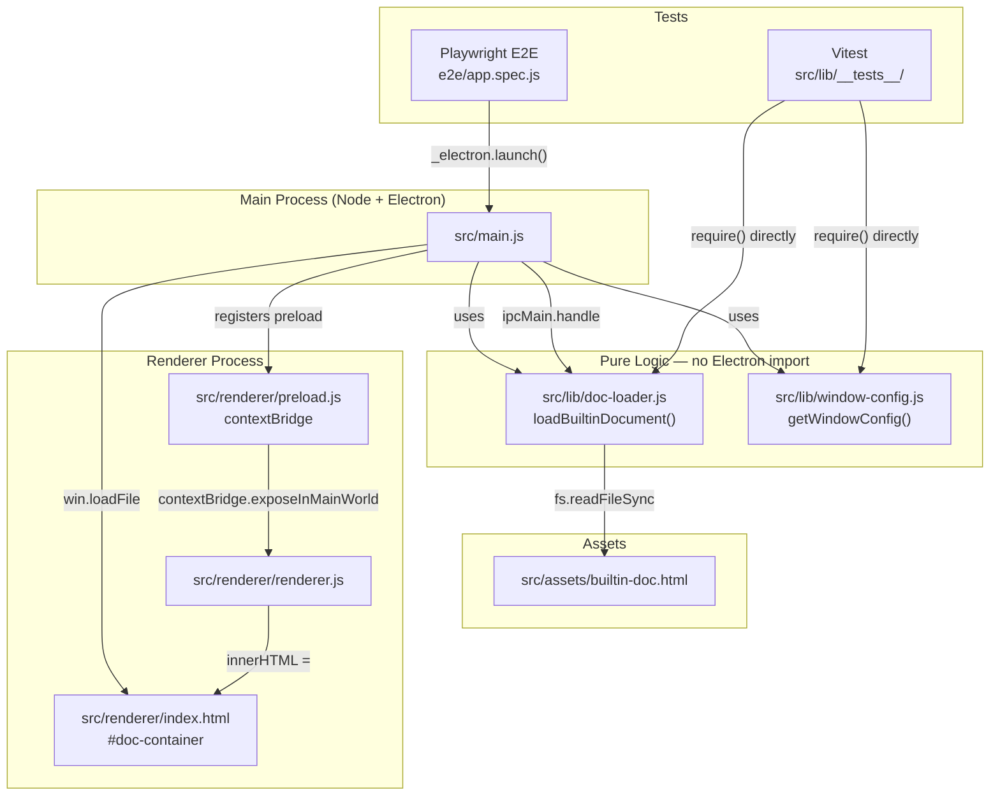

# feat: Minimal Electron Skeleton

## Summary

Build the minimal Electron desktop app described in spec S1: a `BrowserWindow` that loads an app shell, renders a built-in HTML document into a container element, with Vitest unit tests for Electron-decoupled pure logic modules and a Playwright E2E test that auto-skips in headless (no-DISPLAY) environments. Also appends environment lessons to `CLAUDE.md` as the spec's compound deliverable.

---

## Problem Frame

The repo is a greenfield demo vehicle for an autonomous feature-shipping workflow. Spec S1 establishes the foundational skeleton all subsequent specs build on. Currently there is no source code, no test infrastructure, and no app entry point — only `package.json` with three devDependencies declared (`electron`, `vitest`, `@playwright/test`). The `npm test` and `npm run test:e2e` scripts exist but would fail immediately with no test files.

**Scope boundary:** Only what spec S1 defines. No editing, no file tree, no theming, no menus, no packaging. The goal is a working, window-displaying skeleton with a green `npm test` in the headless container.

---

## Requirements

From spec S1 §2 (In Scope) and §5 (Acceptance Criteria):

- **R1** — Open a `BrowserWindow` on startup; user sees a window with document content
- **R2** — Render the built-in HTML document inside a container element (`<div id="doc-container">`) — not directly filling the bare window — leaving the shell/document seam for S2
- **R3** — Vitest unit tests wired; `npm test` exits 0 in headless container
- **R4** — Pure logic modules (doc loading, window config) import no Electron; directly importable by Vitest in `node` environment
- **R5** — Playwright E2E wired; `npm run test:e2e` exits 0 in headless container via auto-skip; test runs on macOS with DISPLAY
- **R6** — All §5.2 Vitest assertions passing (4 test cases, P1)
- **R7** — `CLAUDE.md` appended with lessons from this run (§5.4 compound deliverable)

---

## Key Technical Decisions

**KTD1: Plain JavaScript (CommonJS) — no TypeScript compiler step**
No TypeScript in the current `devDependencies`. Adding it would pull in `typescript`, compiler config, and build wiring. Plain CJS `.js` files are directly runnable by Electron (Node.js) and directly importable by Vitest — no transpile step. `package.json` has no `"type": "module"`, so `.js` defaults to CJS throughout.

**KTD2: App shell + preload/contextBridge for document injection**
`BrowserWindow` loads `src/renderer/index.html` (the app shell). A preload script exposes `window.api.getDocContent()` via `contextBridge`. The renderer calls this, receives the HTML string, and injects it into `<div id="doc-container">`. This is the idiomatic secure Electron pattern (`contextIsolation: true`, `nodeIntegration: false`) and keeps Electron IPC concerns out of the pure logic layer.

**KTD3: Pure logic in `src/lib/` — only Node built-ins (`fs`, `path`)**
`doc-loader.js` and `window-config.js` never `require('electron')`. Vitest imports them in `node` environment — no Electron mocking needed. `doc-loader.js` throws a descriptive `Error` synchronously when the target file does not exist (satisfies §5.2 test 3 and §4.3 edge-case requirement).

**KTD4: Playwright skip via `test.skip(!process.env.DISPLAY, ...)`**
Placed at the top of each E2E test function body. In the headless container `process.env.DISPLAY` is unset → test skips before attempting `electron.launch()`. On macOS with DISPLAY set the test runs. This is the idiomatic Playwright conditional-skip and satisfies spec §5.3.

**KTD5: Vitest config scoped to `src/`, environment `node`**
`vitest.config.js` sets `include: ['src/**/*.test.js']` and `environment: 'node'`. The `e2e/` directory is never collected by Vitest. Playwright's own runner collects `e2e/` via `playwright.config.js`.

---

## High-Level Technical Design



---

## Output Structure

```
src/
  assets/
    builtin-doc.html          ← built-in document (title + body paragraphs)
  lib/
    doc-loader.js             ← pure: loadBuiltinDocument(), getBuiltinDocPath()
    window-config.js          ← pure: getWindowConfig()
    __tests__/
      doc-loader.test.js      ← Vitest unit tests (§5.2 tests 1–3)
      window-config.test.js   ← Vitest unit tests (§5.2 test 4)
  renderer/
    index.html                ← app shell with <div id="doc-container">
    renderer.js               ← renderer script: fetches doc via api, injects
    preload.js                ← contextBridge: exposes getDocContent() via IPC
  main.js                     ← Electron entry point
e2e/
  app.spec.js                 ← Playwright E2E (auto-skip without DISPLAY)
vitest.config.js              ← Vitest config (node env, src only)
playwright.config.js          ← Playwright config (testDir: e2e)
package.json                  ← add "main", add "start" script
CLAUDE.md                     ← append lessons section
```

---

## Implementation Units

### U1. Project configuration and test framework wiring

**Goal:** Configure Vitest and Playwright so `npm test` and `npm run test:e2e` resolve correctly; add Electron entry point and `start` script to `package.json`.

**Requirements:** R3, R5

**Dependencies:** none

**Files:**
- `vitest.config.js` (create)
- `playwright.config.js` (create)
- `package.json` (modify)

**Approach:**
- `vitest.config.js`: export a `defineConfig` with `test.environment = 'node'`, `test.include = ['src/**/*.test.js']`. Use `import { defineConfig } from 'vitest/config'` — but since the project is CJS, use `require`-style or dynamic: actually, Vitest config accepts CommonJS too via `module.exports`. Use `module.exports = { test: { environment: 'node', include: ['src/**/*.test.js'] } }`.
- `playwright.config.js`: `module.exports = { testDir: './e2e', testMatch: '**/*.spec.js' }`. No browser projects needed — Electron tests use the `_electron` launcher directly within tests.
- `package.json`: add `"main": "src/main.js"` (Electron entry) and `"start": "electron ."` under `scripts`.

**Test scenarios:**
- Test expectation: none — pure configuration; verified by running the test suite in U3

**Verification:** `npm test` exits 0 (no test files found initially is OK — Vitest exits 0 on empty suite). `npm run test:e2e` exits 0 (Playwright finds no tests yet or exits cleanly).

---

### U2. Built-in document asset

**Goal:** Create the HTML document the app renders as its content.

**Requirements:** R2, spec §5.2 ("文件存在且非空", "包含可识别标记")

**Dependencies:** none

**Files:**
- `src/assets/builtin-doc.html` (create)

**Approach:**
A minimal valid HTML5 file. Must contain a recognizable unique title string — e.g., `<h1>Wordspace</h1>` — that unit tests can assert on with a simple string-includes check. Must have at least one `<p>` body paragraph. The title text becomes the "recognizable marker" referenced throughout the spec's test assertions.

**Test scenarios:**
- Test expectation: none — the file is the asset; §5.2 assertions are in U3's test files

**Verification:** File exists at `src/assets/builtin-doc.html`, is non-empty, contains the agreed title marker.

---

### U3. Pure logic modules and Vitest unit tests

**Goal:** Implement `doc-loader.js` and `window-config.js` as pure Node.js modules (no Electron), with Vitest tests covering all four §5.2 acceptance criteria.

**Requirements:** R4, R6

**Dependencies:** U1 (Vitest config), U2 (asset file must exist for happy-path tests)

**Files:**
- `src/lib/doc-loader.js` (create)
- `src/lib/window-config.js` (create)
- `src/lib/__tests__/doc-loader.test.js` (create)
- `src/lib/__tests__/window-config.test.js` (create)

**Approach:**

`doc-loader.js` exports two functions:
- `getBuiltinDocPath()` → resolves and returns the absolute path to `src/assets/builtin-doc.html` via `path.resolve(__dirname, '../../assets/builtin-doc.html')` (from `src/lib/` up two levels to `src/`, then into `assets/`)
- `loadBuiltinDocument(docPath)` → if `docPath` not provided, uses `getBuiltinDocPath()`; checks existence with `fs.existsSync`; throws `new Error('Built-in document not found: ' + target)` if missing; returns `fs.readFileSync(target, 'utf8')`

`window-config.js` exports one function:
- `getWindowConfig()` → returns `{ width: 1024, height: 768, webPreferences: { preload: path.resolve(__dirname, '../renderer/preload.js'), contextIsolation: true, nodeIntegration: false } }`. No Electron import — this is a plain JS object that `new BrowserWindow(config)` consumes directly.

**Test scenarios for `doc-loader.test.js`:**
- Happy path — given the built-in doc file exists, `loadBuiltinDocument()` (no argument) returns a string containing the title marker (e.g., `'Wordspace'`). Covers §5.2 test 1.
- File existence — `fs.existsSync(getBuiltinDocPath())` is `true` AND the result of `loadBuiltinDocument()` has `.length > 0`. Covers §5.2 test 2.
- Error path — `loadBuiltinDocument('/nonexistent/path/doc.html')` throws an `Error`; the thrown value is an instance of `Error` with a non-empty `.message`. Covers §5.2 test 3.

**Test scenarios for `window-config.test.js`:**
- `getWindowConfig().width` is a positive number (> 0). Covers §5.2 test 4 (first half).
- `getWindowConfig().height` is a positive number (> 0). Covers §5.2 test 4 (second half).
- `getWindowConfig().webPreferences.contextIsolation` is `true`.
- `getWindowConfig().webPreferences.nodeIntegration` is `false`.

**Patterns to follow:** Vitest `describe` / `it` / `expect` BDD style. No mocking needed — tests use the real filesystem.

**Verification:** `npm test` exits 0; all 7 test assertions pass; no Electron import in either lib file (grep confirms).

---

### U4. Electron main process and renderer shell

**Goal:** Wire the full Electron app — main process creates the window and serves doc content over IPC; renderer shell injects that content into the container element.

**Requirements:** R1, R2

**Dependencies:** U2 (asset), U3 (lib modules), U1 (`package.json` `main` entry)

**Files:**
- `src/main.js` (create)
- `src/renderer/index.html` (create)
- `src/renderer/renderer.js` (create)
- `src/renderer/preload.js` (create)

**Approach:**

`src/main.js`:
- `require` Electron's `app`, `BrowserWindow`, `ipcMain`
- `require` `getWindowConfig` from `./lib/window-config`
- `require` `loadBuiltinDocument` from `./lib/doc-loader`
- Register `ipcMain.handle('get-doc-content', async () => loadBuiltinDocument())` before `app.whenReady()`
- In `app.whenReady()`: call `getWindowConfig()`, create `new BrowserWindow(config)`, call `win.loadFile(path.join(__dirname, 'renderer/index.html'))`
- `app.on('window-all-closed', () => { if (process.platform !== 'darwin') app.quit(); })`
- `app.on('activate', ...)` for macOS dock re-open

`src/renderer/preload.js`:
- `const { contextBridge, ipcRenderer } = require('electron')`
- `contextBridge.exposeInMainWorld('api', { getDocContent: () => ipcRenderer.invoke('get-doc-content') })`

`src/renderer/index.html`:
- Standard HTML5 boilerplate with `<meta charset="UTF-8">`, `<meta name="viewport" ...>`
- `<div id="doc-container"></div>` — the container element the spec requires for shell/document seam
- `<script src="renderer.js"></script>` at end of `<body>`

`src/renderer/renderer.js`:
- `window.addEventListener('DOMContentLoaded', () => { window.api.getDocContent().then(html => { document.getElementById('doc-container').innerHTML = html; }).catch(err => { document.getElementById('doc-container').textContent = 'Error: ' + err.message; }); })`

**Test scenarios:**
- Test expectation: none for this unit — Electron main/renderer are integration surfaces; the E2E in U5 covers them; unit logic is already covered in U3

**Verification:** `npm start` on macOS opens a window; the container div displays the title and body of `builtin-doc.html`.

---

### U5. Playwright Electron E2E test

**Goal:** Write a Playwright test using the `_electron` launcher that asserts the window displays the document content; auto-skip when `DISPLAY` is unset.

**Requirements:** R5, spec §5.3

**Dependencies:** U4 (working app), U1 (Playwright config)

**Files:**
- `e2e/app.spec.js` (create)

**Approach:**

```js
// Directional guidance — not implementation specification
const { test, expect, _electron: electron } = require('@playwright/test');
const path = require('path');

test('app window shows built-in document content', async () => {
  test.skip(!process.env.DISPLAY, 'No DISPLAY — skipping in headless container');

  const app = await electron.launch({ args: [path.join(__dirname, '../src/main.js')] });
  const window = await app.firstWindow();
  await window.waitForLoadState('domcontentloaded');

  const container = window.locator('#doc-container');
  await expect(container).toContainText('Wordspace'); // title marker from builtin-doc.html

  await app.close();
});
```

The `test.skip()` conditional fires before any Electron process is spawned. No DISPLAY → immediate skip. `npm run test:e2e` exits 0 in container (all-skipped counts as pass). On macOS with DISPLAY, the full flow runs.

**Test scenarios:**
- Without DISPLAY: `test.skip(!process.env.DISPLAY, ...)` fires; 0 tests run; exit 0 — covers spec §5.3 second bullet
- With DISPLAY: `electron.launch()` succeeds; `app.firstWindow()` resolves; `#doc-container` contains the title marker — covers spec §5.3 first bullet

**Verification:** `npm run test:e2e` in headless container exits 0 with tests reported as skipped. On macOS: 1 test passes.

---

### U6. CLAUDE.md lessons

**Goal:** Append environment and architectural lessons to `CLAUDE.md` as the spec §5.4 compound deliverable, with a recognizable marker that `run-spec.sh`'s `COMPOUND` check can detect via `git diff`.

**Requirements:** R7, spec §5.4

**Dependencies:** U3, U4, U5 (lessons drawn from implementation experience across the run)

**Files:**
- `CLAUDE.md` (modify — append lessons section)

**Approach:**

Append a section with a recognizable heading, e.g.:

```markdown
## Spec S1 Lessons — 2026-06-03

**Electron + Vitest: decouple pure logic from Electron imports.**
Keep document-loading and window-config logic in plain Node.js modules under `src/lib/`
with no `require('electron')`. Vitest can import them directly in `node` environment
without any mocking or environment shim.

**Playwright Electron E2E: skip when no DISPLAY.**
Use `test.skip(!process.env.DISPLAY, 'No DISPLAY ...')` inside each Electron test.
The dev container has no X server; the skip makes `npm run test:e2e` green in CI
while the real test runs on macOS with a display.

**npm install: set ELECTRON_SKIP_BINARY_DOWNLOAD=1 in this container.**
GitHub release binary domain is firewalled in the dev container.
`run-spec.sh` sets this env var automatically before `npm install`.
Any manual install step (new deps, fresh container) must also set it.
```

The heading `## Spec S1 Lessons` is the recognizable marker `run-spec.sh`'s compound check detects.

**Test scenarios:**
- Test expectation: none — verified by `git diff` showing non-empty CLAUDE.md additions; `run-spec.sh` reports `COMPOUND=WROTE`

**Verification:** `git diff HEAD -- CLAUDE.md` shows non-empty additions with the `## Spec S1 Lessons` heading.

---

## Risks & Dependencies

- **Playwright `_electron` API in v1.49**: The `_electron` launcher is marked experimental in Playwright. It is present in v1.49 but the import syntax (`require('@playwright/test')` destructuring `_electron`) should be verified against the installed version during implementation. If the path differs, adjust accordingly.
- **Electron 33 `contextBridge` behavior**: The preload/IPC pattern assumes standard Electron 33 security defaults. If any future Electron policy change affects `contextBridge` behavior, the preload script is the single touch point to update.
- **`__dirname` path resolution in tests**: `doc-loader.js` uses `__dirname` to resolve the asset path. Vitest runs tests in-process, so `__dirname` for the lib module resolves correctly to `src/lib/` regardless of where Vitest is invoked from — as long as the working directory is the repo root (which `npm test` guarantees).

---

## Scope Boundaries

### In Scope
Everything in spec S1 §2 (✅ In Scope): window open, built-in doc render in container, Vitest + Playwright wired, pure logic modules, `CLAUDE.md` lessons.

### Deferred to Follow-Up Work
- Theme system / dark-light toggle (spec S2)
- App shell UX polish beyond the container element
- Distribution / packaging

### Out of Scope
Everything in spec S1 §2 (🚫 Out of Scope): editing/input, file tree, file dialogs, themes, app menus, settings, auto-update, packaging, multi-window.
