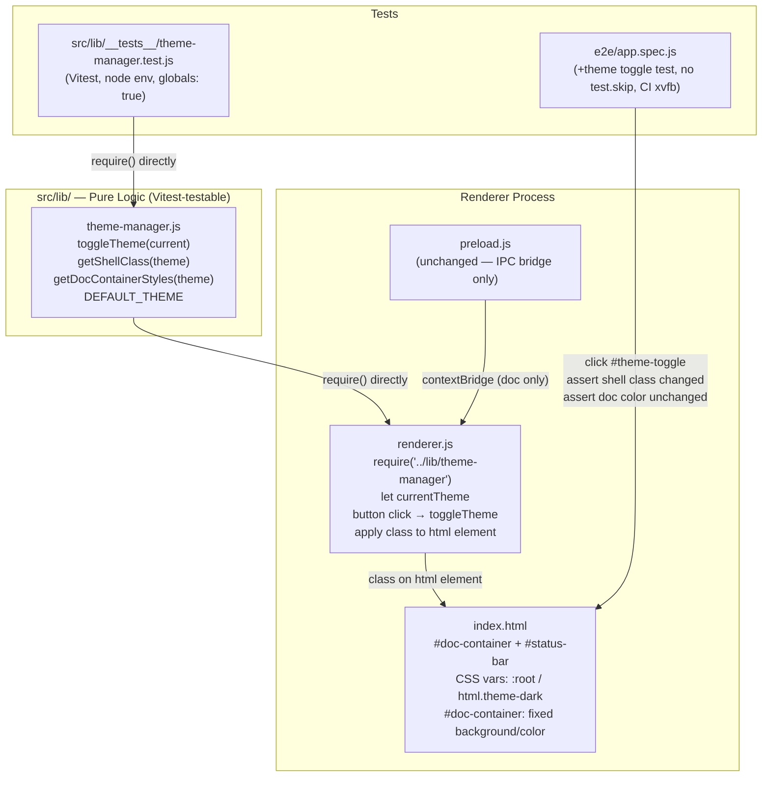

# feat: Dark/Light Theme Toggle — App Shell Isolation (S2)

## Summary

Add a persistent bottom status bar to the S1 Electron skeleton with a dark/light toggle button. The toggle switches the app shell (status bar, window background) between themes while keeping the document paper colors fixed. Theme logic is extracted into a pure Node.js module (`src/lib/theme-manager.js`) with no Electron/DOM imports so Vitest can test it directly. Renderer.js requires theme-manager directly (preload stays as-is per S3 sandbox lesson). A Playwright E2E test runs in CI with xvfb to verify visual behavior.

---

## Problem Frame

The S1 skeleton renders a document in a bare window with no UI chrome. S2 adds the first persistent shell element — a status bar at the bottom — and wires a dark/light theme toggle that only affects the app shell, never the document content area. The core correctness requirement is that the shell theme is architecturally isolated from the document paper: no CSS variable or cascade from the shell can reach inside `#doc-container`.

**Scope boundary:** Only what spec S2 defines. No persistence across restarts, no multi-theme system, no Windows/macOS consistency guarantee, no reverse-color preview, no large-document performance work.

---

## Requirements

From spec S2 §2 (In Scope) and §5 (Acceptance Criteria):

- **R1** — Persistent bottom status bar present in the app window
- **R2** — Dark/light toggle button in the status bar; click switches shell theme instantly
- **R3** — App shell (status bar + window background outside the doc) reflects the chosen theme
- **R4** — Document paper colors (background, text, any user-set colors) are unaffected by theme switches
- **R5** — Theme state machine and shell style mapping are pure functions in `src/lib/theme-manager.js` with no `require('electron')` or DOM references; directly importable by Vitest in `node` environment
- **R6** — All §5.2 Vitest assertions passing (theme state machine, default, shell styles differ, doc styles invariant)
- **R7** — Playwright E2E: click toggle → shell class changes, doc element computed color unchanged; runs in CI with xvfb (no `test.skip(!DISPLAY)` guard); `electron.launch` args include `--no-sandbox`
- **R8** — `CLAUDE.md` appended with any new lessons from this run (§5.4 compound deliverable)

---

## Key Technical Decisions

**KTD1: Pure theme-manager.js in src/lib/ — no Electron, no DOM**
Mirrors the S1 pattern for `doc-loader.js` and `window-config.js`. Vitest imports it directly in `environment: node` with no mocking. The module exports: `DEFAULT_THEME`, `toggleTheme(current)`, `getShellClass(theme)`, `getDocContainerStyles(theme)`. The last function always returns the same value regardless of `theme`, providing the testable proof that the model does not derive doc styles from theme state.

**KTD2: Renderer.js directly requires theme-manager — preload unchanged**
Per CLAUDE.md S3 lessons, preload in default `sandbox: true` cannot `require` custom project modules — only Electron and Node built-ins. `theme-manager.js` is a pure, stateless, no-Node-dependency module; it belongs in `renderer.js` via `require('../lib/theme-manager')` (renderer has full `require` under `contextIsolation: true`). `preload.js` stays unchanged (only the IPC bridge). Theme state (current theme string) lives in `renderer.js`. This keeps `sandbox` default true — no security regression.

**KTD3: Theme class on `<html>`, fixed paper on `#doc-container`**
Apply theme as a class on `document.documentElement` (`html.theme-dark` / `html.theme-light`). CSS variables in `:root` and `html.theme-dark` cascade only to shell elements (`body`, `#status-bar`). `#doc-container` gets explicit, non-variable `background` and `color` values, breaking the cascade at the container boundary. This is the rendering-layer guarantee; the model-layer guarantee is tested via `getDocContainerStyles`.

**KTD4: No IPC for theme — session-only state in renderer**
Theme is not persisted (spec §2 explicitly out of scope). State is a single `let currentTheme = DEFAULT_THEME` variable in `renderer.js`. No main process involvement, no `userData` writes. Toggling is purely a renderer-side DOM operation using the contextBridge-exposed pure functions.

---

## High-Level Technical Design



**Theme layer stack:**

```
html.theme-light (default)          html.theme-dark
  :root CSS vars (light)              html.theme-dark CSS vars (dark)
    body { background: var(--shell-bg) }
      #status-bar { background: var(--statusbar-bg) }
      #doc-container {
        background: #ffffff   ← FIXED, not var(...)
        color: #000000        ← FIXED, breaks cascade into doc
        }
          [injected builtin-doc.html content — untouched by theme]
```

---

## Output Structure

New files created in this plan:

```
src/
  lib/
    theme-manager.js               ← new: pure theme logic
    __tests__/
      theme-manager.test.js        ← new: Vitest tests for theme-manager
  renderer/
    index.html                     ← modify: add #status-bar, theme CSS
    renderer.js                    ← modify: wire toggle button, apply class
    preload.js                     ← modify: expose window.api.theme.*
e2e/
  app.spec.js                      ← modify: add theme toggle E2E test
CLAUDE.md                          ← modify: append S2 lessons if new
```

---

## Implementation Units

### U1. Theme manager pure module + Vitest tests

**Goal:** Implement `src/lib/theme-manager.js` as a pure CJS module with the full theme logic, and write Vitest tests covering all four §5.2 Vitest acceptance criteria.

**Requirements:** R5, R6

**Dependencies:** none

**Files:**
- `src/lib/theme-manager.js` (create)
- `src/lib/__tests__/theme-manager.test.js` (create)

**Approach:**

`theme-manager.js` exports:
- `DEFAULT_THEME` — string constant `'light'`
- `THEMES` — object `{ LIGHT: 'light', DARK: 'dark' }` (optional enum for clarity)
- `toggleTheme(current)` — pure: returns `'dark'` when given `'light'`, `'light'` when given `'dark'`. This is the state machine transition function.
- `getShellClass(theme)` — pure: returns a CSS class string that differs between `'light'` and `'dark'` (e.g., `'theme-light'` vs `'theme-dark'`). This is the "theme → shell style mapping" the spec requires.
- `getDocContainerStyles(theme)` — pure: always returns the same fixed object regardless of `theme` (e.g., `{ background: '#ffffff', color: '#000000' }`). This is the model-layer proof that doc styles don't derive from theme.

No `require('electron')`, no DOM references, no side effects.

**Patterns to follow:** `src/lib/window-config.js` — pure exports, no Electron import, same module structure.

**Test scenarios for `theme-manager.test.js`:**
- *State machine parity*: Start from `DEFAULT_THEME`, apply `toggleTheme` 1 time → result is `'dark'`; apply 2 times → result is `'light'`; apply 3 times → result is `'dark'`. Covers spec §5.2 P1 state machine parity criterion.
- *Default theme*: `DEFAULT_THEME` equals `'light'`. Covers spec §5.2 P1 initial state criterion.
- *Shell styles differ*: `getShellClass('light') !== getShellClass('dark')` — the two values are not equal. Covers spec §5.2 P1 shell style mapping criterion.
- *Doc container styles invariant*: `deepEqual(getDocContainerStyles('light'), getDocContainerStyles('dark'))` — both calls return the same object shape and values. Covers spec §5.2 P1 document paper decoupling criterion.
- *Doc styles are non-empty*: `getDocContainerStyles('light')` has at least one key (sanity check that it is not an empty stub).

**Verification:** `npm test` exits 0; all 5 theme-manager test assertions pass; `grep -r "require('electron')" src/lib/theme-manager.js` returns empty.

---

### U2. App shell HTML + CSS with status bar and theme support

**Goal:** Update `src/renderer/index.html` to introduce the bottom status bar element and the complete CSS for both shell themes, while ensuring `#doc-container` has fixed paper colors that do not inherit from theme variables.

**Requirements:** R1, R3, R4

**Dependencies:** none (parallel with U1)

**Files:**
- `src/renderer/index.html` (modify)

**Approach:**

Layout restructure: `body` becomes a `display: flex; flex-direction: column; height: 100vh;` container. `#doc-container` gets `flex: 1; overflow: auto;`. `#status-bar` is a fixed-height bottom element (`flex-shrink: 0`).

CSS structure in `<style>`:
- `:root` block declares light-theme CSS variables: `--shell-bg`, `--shell-text`, `--statusbar-bg`, `--statusbar-border`
- `html.theme-dark` block overrides those same variables with dark values
- `body` uses `background: var(--shell-bg); color: var(--shell-text)` — inherits theme
- `#doc-container` uses **literal values** for background and color (no `var(...)`) — breaks the cascade. Also `max-width: 800px; margin: 0 auto; padding: 2rem`
- `#status-bar` uses `background: var(--statusbar-bg); border-top: 1px solid var(--statusbar-border)`
- `#theme-toggle` (button inside status bar): minimal styling, text label `"☀ Light"` / `"☾ Dark"` (renderer.js will update it)

HTML body structure:
```html
<body>
  <div id="doc-container"></div>
  <div id="status-bar">
    <button id="theme-toggle">☀ Light</button>
  </div>
  <script src="renderer.js"></script>
</body>
```

The `<html>` element starts without a theme class; `renderer.js` applies the initial class on load.

**Test scenarios:** None — pure HTML/CSS; verified by U4 E2E test and macOS manual validation.

**Verification:** `npm start` on macOS shows the status bar at the bottom with the toggle button visible; document content is above it.

---

### U3. Renderer theme wiring

**Goal:** Wire the toggle button click handler and initial theme application in `renderer.js` by directly requiring `theme-manager.js`. `preload.js` is not modified — per S3 lessons, preload in sandbox mode cannot require custom modules.

**Requirements:** R2, R3, R4

**Dependencies:** U1 (theme-manager must exist), U2 (HTML elements must exist)

**Files:**
- `src/renderer/renderer.js` (modify)

**Approach:**

`renderer.js` additions — at the top of the file, directly require theme-manager:
- `const themeManager = require('../lib/theme-manager')`
- Declare `let currentTheme = themeManager.DEFAULT_THEME`
- Define helper `applyTheme(theme)`:
  - Sets `document.documentElement.className = themeManager.getShellClass(theme)`
  - Updates `#theme-toggle` button text to reflect current theme
- Call `applyTheme(currentTheme)` inside `DOMContentLoaded` to set the initial class
- Wire `document.getElementById('theme-toggle').addEventListener('click', ...)` to toggle and re-apply

`preload.js` is unchanged — it keeps only the `getDocContent` IPC bridge. No `window.api.theme.*` namespace is needed; all theme logic is handled by the renderer directly.

**Test scenarios:** None for this unit — the integration is covered by U4 E2E. The pure logic it delegates to is covered by U1's Vitest tests.

**Verification:** `npm start` on macOS: initial state shows `html.theme-light` class; clicking toggle switches to `html.theme-dark`; clicking again switches back; document text color is unchanged throughout.

---

### U4. Playwright E2E theme toggle test

**Goal:** Add a second Playwright test to `e2e/app.spec.js` that clicks the status bar toggle and asserts (a) the app shell class changed and (b) a document element's computed color did not change. Auto-skips when `DISPLAY` is unset.

**Requirements:** R7, spec §5.3

**Dependencies:** U2 (status bar HTML exists), U3 (toggle wiring works)

**Files:**
- `e2e/app.spec.js` (modify — add new test block)

**Approach:**

Add a second `test(...)` block after the existing document-content test. The new test:
1. Launch the app via `electron.launch({ args: ['--no-sandbox', path.join(...)] })` — same pattern as existing test (no `test.skip(!DISPLAY)` guard; per S3 lessons this would be fake green)
2. Get `app.firstWindow()` and wait for `domcontentloaded`
3. Wait for `#doc-container h1` to be present (doc is injected dynamically by renderer.js)
4. Capture the initial computed color of `h1` inside `#doc-container` using `window.evaluate(() => getComputedStyle(document.querySelector('#doc-container h1')).color)`
5. Click `#theme-toggle` button
6. Assert the `<html>` element has a class containing `'dark'`
7. Assert the computed color of `#doc-container h1` has **not changed** (same value as captured in step 4)
8. `await app.close()`

The existing test (`app window shows built-in document content`) is left unchanged.

**Test scenarios:**
- Toggle click changes `html.className` to include `'dark'`; `h1` computed color is unchanged — covers spec §5.3 first bullet
- App preload/integration broken (window.api missing, doc blank): E2E assertion on `#doc-container h1` fails → CI e2e job red — covers spec §5.3 second bullet (the "fake green" guard)

**Verification:** CI e2e job (with xvfb) runs both tests and both pass. `npm run test:e2e` in the dev container is not run as part of the standard test workflow (container has no xvfb).

---

### U5. CLAUDE.md lessons (if new lessons found)

**Goal:** Append any new S2-specific lessons to `CLAUDE.md` as the spec §5.4 compound deliverable. If no new lessons are discovered during implementation, this unit produces no output (S1 lessons already present cover the disciplinary baseline).

**Requirements:** R8, spec §5.4

**Dependencies:** U1–U4 (lessons drawn from implementation experience across the run)

**Files:**
- `CLAUDE.md` (modify if new lessons found)

**Approach:**

During implementation of U1–U4, track any new constraints or surprises not already documented in the existing `## Spec S1 Lessons` section. Candidates:
- Any new Electron / contextBridge / preload behavior discovered
- CSS isolation surprises (cascade behavior, CSP interactions)
- Any new Vitest/Playwright patterns that differ from S1 expectations

If new lessons found: append a `## Spec S2 Lessons — 2026-06-04` section with the same format as the S1 lessons section. This heading is the recognizable marker for the compound check.

If no new lessons: no change to `CLAUDE.md`; this is acceptable per spec §5.4 which says "撞到新坑则追加" (only add if new issues hit).

**Test scenarios:** None — verified by presence of new heading in `git diff` output, or absence if no new lessons.

**Verification:** If new lessons: `git diff HEAD -- CLAUDE.md` shows non-empty additions with `## Spec S2 Lessons` heading. If no new lessons: CLAUDE.md unchanged.

---

## Risks & Dependencies

- **CSS cascade into doc container**: The core risk of this feature. Using literal `background`/`color` values on `#doc-container` (not CSS variables) is the primary defense. During implementation, verify no other CSS selector with higher specificity can override these from the shell theme classes.
- **contextBridge synchronous return**: The preload exposes `theme.defaultTheme` as a plain string value (not a function). Verify this is legal in Electron 33's contextBridge serialization — plain primitives are always safe, but object references require `contextBridge.exposeInMainWorld` wrapping.
- **Playwright `window.evaluate` for computed style**: The E2E test uses `window.evaluate(() => getComputedStyle(...).color)` to capture doc element color. Verify this API path works against the injected `innerHTML` content in Playwright Electron mode (the `h1` exists inside `#doc-container` whose content is set dynamically by renderer.js, so wait for `domcontentloaded` may need to be supplemented with a `waitForSelector('#doc-container h1')` to be safe).
- **Existing E2E test stability**: The existing `app.spec.js` test should be unaffected (it only reads `#doc-container` text), but the E2E runner will now run two tests on macOS. Confirm the second test closes the app properly to avoid port/resource conflicts between tests.

---

## Scope Boundaries

### In Scope
Everything in spec S2 §2 (✅ In Scope): bottom status bar, dark/light toggle, app shell theming, document paper fidelity, pure theme logic module, Vitest tests, Playwright E2E (DISPLAY-skipped), CLAUDE.md compound deliverable.

### Deferred to Follow-Up Work
- Full F46 theme system (color palette editor, multiple themes) — deliberately narrowed from F46

### Out of Scope
Everything in spec S2 §2 (🚫 Out of Scope): reverse-color preview, AI document rewriting, cross-platform consistency, large-document performance, theme persistence across restarts, multi-theme system.
