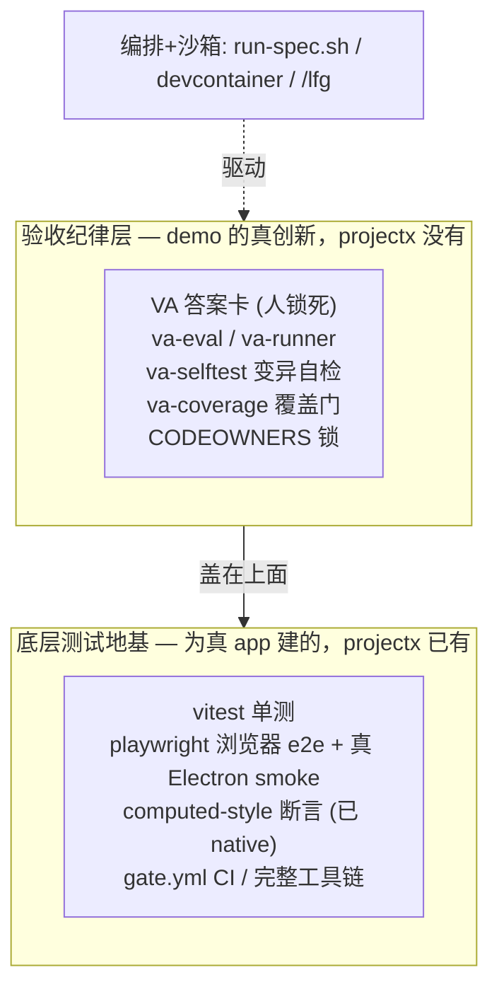

> ⚠ **已作废（2026-06-11）**：本计划的前提（把 spec 落到老 React app 上）已被「从零重写 wordspace-next」决策取代；流水线**不**迁回 projectx，本仓（已改名 wordspace-next）转正为官方主仓。决策依据与替代方案见 `docs/brainstorms/2026-06-11-wordspace-next-repo-home-requirements.md`。本文保留作研究存档，**勿执行**。

# refactor: 把无人值守 spec→PR 流水线从 demo 迁到真 app (projectx)

> **目标仓**：流水线最终落在 `projectx`（worktree `colin_pm-track`，app 代码在 `dev/`）。本规划文档暂存在 `wordspace-next-demo/docs/plans/`，落地时随迁。所有 projectx 内路径以 `dev/` 为根写相对路径。

## Summary

把"写 spec → AI 无人值守 → 测试过的 PR"这套流水线，从玩具仓 `wordspace-next-demo` 迁到真 app `projectx/dev`，以便给真产品 ship 真功能。

**核心决策（本规划要让 Colin 拍板的那个分叉）的结论：不是"复用 projectx 的 CI vs 移植 demo 的"二选一——这是个假二选一。** 两者是**两层**：projectx 有一套**为真 app 建的底层测试地基**（vitest + playwright 双层 + 已 native 的 computed-style 断言 + 4 条 CI workflow），demo 的真正价值是**盖在地基之上的"验收纪律层"**（人锁死的 VA + 变异自检 + 覆盖门），这一层 projectx 没有。所以推荐：**复用 projectx 的地基，把 VA 层重写盖上去**。唯一前提：projectx 的地基冻了 3.5–7 周，**落地第一步必须先验证它现在还是绿的**（Phase 0 健康检查），绿了再往上盖。

---

## Problem Frame

流水线（`scripts/run-spec.sh` 编排 + `/lfg` 驱动 + VA 验收门 + devcontainer 沙箱）现在全在 `wordspace-next-demo` 这个**玩具骨架仓**里。真 app 在 `projectx/dev`（pkg `wordspace` v0.3.0，Electron + React 19 + Vite 6 + TS）。**玩具仓里没有真 app 的代码，从它 ship 不出真功能**——所以流水线必须迁到 projectx 去操作真 app。

迁移要回答四个 Colin 明确提出的问题：① 测试/CI 复用 projectx 自己的还是移植 demo 的？② 到底要搬/建多少（"不止建 VA 层"）？③ 跨 repo 怎么搬、当前 session 扎在 demo 仓算不算障碍？④ 落地顺序。

**Scope boundary**：本规划只管"把流水线迁到能在 projectx 上跑通 F46 主题这一条真 spec"的迁移工程；不含 F46/F15 各自的功能实现细节（那是各自的 spec + ce-work），也不含地基功能（编辑器 F40 / 多文档 F01）的新建（见 audit 的"地基轨"，平行另算）。

---

## 核心决策：复用 vs 移植（证据化 pros/cons）

### 先破题：这是假二选一

Colin 的问法隐含"projectx 的 CI 和 demo 的 VA 流水线在抢同一个位子"。实际它们是**叠在一起的两层**：

地基（L1）必须是 projectx 的，因为**它是为真 React app 建的**；demo 的地基是为一个 200 行 vanilla-JS 玩具建的，根本测不了真 app。纪律层（L2）必须从 demo 移上来，因为 **projectx 没有**。所以"复用 vs 移植"的真问题是**分层**，不是取舍。

### 证据对照

| 维度 | projectx/dev 的地基 | demo 的流水线 |
|---|---|---|
| 为谁建的 | **真 app**（React+Vite+Electron+server） | 200 行 vanilla-JS **玩具** |
| 测试体量 | ~23 vitest 单测 + 3 electron-smoke + 3 集成 + computed-style e2e；4 条 CI workflow；`ci` 脚本串 typecheck+lint+test+build+smoke | 6 个 vitest 文件 + 2 个 e2e；3 个 npm script |
| computed-style 断言 | **已 native**（`dev/tests/e2e/doc-background-white.spec.ts`、`default-text-color.spec.ts` 读 getComputedStyle 断 rgb） | 有（va-eval 的 luminance/color/text） |
| 真 Electron e2e | 有（`dev/tests/electron-smoke/`，`_electron.launch`，macOS runner 无需 xvfb） | 有（e2e + CI xvfb） |
| 人锁死的 VA 答案卡 | **无** | **有**（核心创新，~318 行） |
| 变异自检（证门有牙） | **无** | **有**（`e2e/va-selftest.spec.js`） |
| CODEOWNERS（裁判≠运动员的硬锁） | **无** | 有（spec/va.json 锁 owner） |
| 最近改动 | 代码/测试 2026-05-13、CI 配置 2026-04-21（**冻 3.5–7 周**） | 本周刚建/刚验证 |
| "测过"的真实含义 | 为真 app 建、推测当时绿，但**近 7 周没人验** | 在**玩具**上跑通过，**从没碰过真 app** |
| GitHub 账号 | `wl1390/projectx`（`github.com-work` host） | `jizhoutang10thglobal`（另一个账号） |

### 对 Colin "用我们新测过的那套"的直接回应

合理的内核：demo 的 VA 纪律层是**新的、刚验证过的**，确实该用它（移上去）。但"用 demo 整套地基替换 projectx 的"是个范畴错误——demo 的地基是给玩具用的，**对真 app 的活，它不比 projectx 那套更可信**（它从没测过 React app）。而 projectx 的地基虽然冻着，却是唯一真为这个 app 建的。所以：**地基复用 projectx 的、纪律层用 demo 的（重写盖上去）**。

合理的担忧：projectx 地基冻了快两个月、**还能不能跑绿没人验证**。这个担忧成立，且**直接决定推荐成不成立**——所以落地第一步（U1 / Phase 0）就是验证它现在还绿；绿了复用才稳，红了再评估修复成本 vs 重建成本。

### 推荐

**复用 projectx 的底层测试地基；把 demo 的 VA 纪律层重写盖上去；先做健康检查再动手。** 不要整套移植 demo 的流水线（那等于把 projectx 已有的真 app 地基扔了重建一个更差的）。

---

## Requirements

- **R1** 复用 projectx/dev 现有的 vitest + playwright（浏览器 e2e + electron-smoke）+ gate.yml CI 作为底层权威门，不重建。
- **R2** 把 VA 纪律层**重写**进 projectx/dev：`va-eval`（扩展 metric）/ `va-runner`（改 SPA 启动 + fixture-open）/ `va-selftest` / `va-coverage`，落成 TS、进 projectx 的测试目录与 CI。
- **R3** 新建 `dev/.github/CODEOWNERS`，锁 VA 相关文件 + gate.yml 给 Colin。
- **R4** 新建 B3"禁留口" grep 的 CI 步骤（board ruleset 已定义、projectx 未接）。
- **R5** 把 `run-spec.sh` 编排 + devcontainer 沙箱 + host-verify 移植并改配置以适配 projectx（命令/分支/账号/防火墙白名单）。
- **R6** 修 `gate.yml` 触发分支（当前只在 PR→`[main, colin_dev]` 触发，graduation 分支 `colin_pm-track` 零 CI）。
- **R7** 先于一切：验证 projectx 现有 `npm run ci` / e2e 在当前 `colin_pm-track` 上仍绿（冻结 3.5–7 周后的健康检查）。
- **R8** 采用前面已起草的 pipeline 级 spec 模板（`pm/templates/spec-template-pipeline-grade.md`）作为 projectx spec 的母版。
- **R9** （Colin 手动）在 `wl1390/projectx` 上配 push/CI 鉴权 + 分支保护 + 必需检查（与 demo 的 jizhoutang 账号完全两套）。

---

## Key Technical Decisions

| 决策 | 选择 | 理由（证据） |
|---|---|---|
| 底层测试地基 | **复用 projectx 的** | projectx 有 ~29 测试文件 + 完整工具链 + computed-style native；demo 地基为玩具建、测不了真 app。重建非理性。 |
| VA 纪律层 | **重写进 projectx，不复制** | demo 的 va-runner 是 `electron.launch(index.html)` + 立即采集；真 app 是 Vite SPA，要 `goto('/')` + `openFile(fixture)` 才有内容。~318 行重新表达。 |
| 编排 + 沙箱 | **移植 + 改配置** | run-spec.sh 255 行：把 `npm test` 等换成 projectx 命令、分支换 `colin_pm-track`、账号换 `wl1390`、防火墙白名单按 projectx 依赖调。 |
| `/lfg` | **自动跟随，零搬运** | Claude 插件、非仓内代码；插件自动装的固化已在 demo 做过、同法搬一份。 |
| 流水线的家 | **projectx/dev @ colin_pm-track**；ship 功能的 session 扎根 projectx | app 与 CI 都在那；demo 仓退成"参考/存档"。 |
| GitHub 账号/CI | **wl1390/projectx，全新一套鉴权** | 与 demo 的 jizhoutang 完全两个账号；token/必需检查/分支保护都得 Colin 在 wl1390 那边新配。 |
| 复用前置门 | **Phase 0 健康检查（U1）** | projectx CI 冻 7 周、跨账号查不到 run；动手前必须确认现还绿。 |

---

## 迁移清单（诚实、量化 —— 回答"到底要搬/建多少"）

Colin 的判断对：**远不止"建 VA 层"**。但要点是——**最重的那块（真 app 测试地基）是复用、不是建**。按动作分类：

| 类别 | 内容 | 量级 |
|---|---|---|
| **自动跟随（0 搬运）** | `/lfg`（Claude 插件） | 0 |
| **复用 projectx 现成（不动）** | vitest / playwright 双层 / computed-style 断言 / gate.yml / build 工具链 | 0（最重的一块，靠它省下重建） |
| **新建/重写进 projectx** | va-eval(扩 metric) + va-runner(SPA 重写) + va-selftest + va-coverage(.test.ts + [P1]标签校验) | ~重写 318 行逻辑 |
| | `dev/.github/CODEOWNERS`（新建） | 小但承重 |
| | B3 禁留口 grep CI 步骤（新建） | 小 |
| | 采用 pipeline 级 spec 模板（已起草） | 已有草稿 |
| **移植 + 改配置** | run-spec.sh(255) + devcontainer(5 文件) + host-verify.js(137) | ~改 ~500 行 + 容器配置 |
| **Colin 手动（agent 做不了）** | wl1390 账号 push/CI 鉴权、分支保护、必需检查、修 gate.yml 触发分支 | 服务端配置 |

**一句话量级**：真正要"写代码"的是"重写 VA 层 ~318 行 + 移植改配 ~500 行 + 几个小新建"；外加 Colin 一摊服务端账号配置。**不算小，但有边界**——而且因为地基复用，没有"重建一个真 app 测试体系"那种无底洞。

---

## 跨 repo & session-scope 机制（回答"怎么搬、session 扎在 demo 算不算障碍"）

- **不是障碍，但要换地方干。** 我现在这个 session 的工作目录扎在 `wordspace-next-demo`。读写 projectx 路径本身没问题（本规划就是这么调研的）。但**真正建 VA 层、跑 projectx 测试，应该开一个扎根 projectx 的 session**——因为测试/CI 在那跑，cwd 在 projectx 操作真 app 文件更顺、不易出错。
- **无人值守那次**：容器挂载的是某个具体 repo。demo 的 devcontainer 挂 demo 仓；projectx 版要把 devcontainer 指向 `projectx/dev`，并按 projectx 的依赖调防火墙白名单。
- **三个真坑**（都已实测/确认）：
  1. **跨账号**：projectx 在 `wl1390`（`github.com-work` SSH host），demo 在 `jizhoutang10thglobal`。`gh run list` 在这边直接查不到 projectx 的 CI——push/开 PR/读 CI/分支保护**全是 wl1390 那套，要 Colin 重新配**，demo 的 owner-账号-切换那套用不上。
  2. **worktree**：projectx 是 worktree，干活落 `colin_pm-track`；别碰陈旧的 `projectx-dev`（fix/tooltip-contrast）。
  3. **CI 触发**：`gate.yml` 只在 PR→`[main, colin_dev]` 触发，`colin_pm-track` 零 CI（见 R6）。

---

## Implementation Units

### U1. Phase 0 健康检查：验证 projectx 地基现在还绿

**Goal:** 在复用承诺成立之前，确认 projectx/dev 冻结 3.5–7 周后 `npm run ci` 与 e2e 仍能跑绿。

**Requirements:** R7

**Dependencies:** 无（必须最先）

**Files:**
- `projectx/dev/`（运行 `npm ci && npm run ci`、`npm run test:e2e`、`npm run test:electron-smoke`；不改代码）

**Approach:** 在扎根 projectx 的环境跑现有权威门；记录哪些绿/红。红的话定位是"小修就能复活"还是"真烂了"，据此决定是否仍走复用路线。这是个**门控调查**：绿 → 进 U2；红且大 → 回炉重评 reuse-vs-rebuild。

**Test expectation:** none —— 本单元是跑现有测试、不新增。

**Verification:** 产出一份"projectx 地基健康报告"：`npm run ci` 退出码、e2e/electron-smoke 通过情况、修复成本评估。

### U2. 重写 VA 纪律层进 projectx/dev

**Goal:** 把 demo 的 va-eval/runner/selftest/coverage 按真 app 形态重写进 projectx 的测试体系。

**Requirements:** R2

**Dependencies:** U1

**Files:**
- `projectx/dev/tests/va/va-eval.ts`（重写：保留 luminance/color/text，**新增 transform-scale / boundingRect metric** 给 zoom 类，fail-closed 守卫）
- `projectx/dev/tests/va/va-runner.spec.ts`（**重写**：浏览器 baseURL 启动模式 + va.json 的 `open` fixture 步骤；electron 路径 build-aware）
- `projectx/dev/tests/va/va-selftest.spec.ts`（重写变异探针）
- `projectx/dev/tests/va-coverage.test.ts`（重写为 TS、扫 specs、校验每条 `[P1][va:id]` 解析到 check）

**Approach:** 不复制玩具版——真 app 是 SPA，启动后无内容、要先 `openFile` 开 fixture（参照 `dev/tests/e2e/helpers.ts` 的 `openFile()`）。va-runner 默认走浏览器 baseURL（projectx 强门已在此跑）；判定逻辑（va-eval）是纯函数、vitest 可单测。

**Test scenarios:**
- **[纯逻辑] va-eval**：luminance/color/text/新 transform-scale metric 各自的阈值判定 + fail-closed（CSS 全废时 alpha<0.99 → 红）。
- **[集成] va-runner**：对一个 fixture 真开 app、采集、按一份样例 va.json 判 → 绿/红正确。
- **[变异] va-selftest**：杀全部 CSS + 清空 textContent 后，样例 VA 必翻红。
- **[覆盖] va-coverage**：缺 va.json 的 requires_va spec → 红；有 va.json 但某条 [P1] 标签解析不到 check → 红。

**Verification:** projectx `npm test` 含上述新测试且绿；va-selftest 对**当前 projectx app** 跑变异探针确实翻红（证明在真 app 上有牙，不只在玩具）。

### U3. CODEOWNERS + B3 禁留口 CI 门

**Goal:** 把"裁判≠运动员"从自觉变成机械锁，并接上 board ruleset 已定义的 B3 禁留口检查。

**Requirements:** R3, R4

**Dependencies:** U2

**Files:**
- `projectx/dev/.github/CODEOWNERS`（新建）或仓根 `.github/CODEOWNERS`——锁 `tests/va/**`、`*.va.json`、`gate.yml`、`playwright*.config.*` 给 Colin
- `projectx/.github/workflows/gate.yml`（加一个 B3 grep 步骤：`由 ?dev ?(决定|定|实现)|留给.{0,4}开发|由设计稿决定` 命中即 fail，放行 impl-detail 形式）

**Approach:** CODEOWNERS 路径要落在 projectx repo 真正生效的位置（按 GitHub 规则，仓根或 `.github/`）。B3 grep 复用 board `pm/templates/spec-ruleset.md` 的词表。

**Test expectation:** none（配置 + CI 步骤）；正确性由 U5 的端到端真跑验证。

**Verification:** 故意写一条带"由 dev 决定"的假 spec → CI B3 步骤红。

### U4. 移植编排 + 沙箱 + 修 CI 触发

**Goal:** 把 run-spec.sh / devcontainer / host-verify 移植进 projectx 并改配置，修 gate.yml 触发分支。

**Requirements:** R5, R6, R8

**Dependencies:** U2

**Files:**
- `projectx/dev/scripts/run-spec.sh`（移植 + 改：命令换成 projectx 的 `npm run ci`/`test:e2e`、分支 `colin_pm-track`、账号 wl1390、`requires_va` 与四件套路径）
- `projectx/.devcontainer/*`（移植 demo 的 5 文件 + 插件固化；防火墙白名单按 projectx 依赖（npm registry 等）调）
- `projectx/dev/scripts/host-verify.js`（移植 + 改 app 启动方式为真 app）
- `projectx/.github/workflows/gate.yml`（`on.pull_request.branches` 加 `colin_pm-track`，或约定 graduation PR 打向 `colin_dev`/`main`）
- projectx 采用 `pm/templates/spec-template-pipeline-grade.md` 为 spec 母版

**Approach:** run-spec.sh 的"宿主→容器→/lfg→权威门→报 PR"骨架保留，逐处把 demo 假设替换成 projectx 现实。devcontainer 的 plugin 固化直接复用 demo 刚验证过的 `install-plugins.sh` 模式。

**Test expectation:** none（脚本/配置）；由 U5 端到端验证。

**Verification:** 在 projectx 手动 `run-spec.sh` 走一条 dry spec，编排各步不报致命错；CI 在目标分支真触发（一次 workflow run 真出现）。

### U5. 端到端真跑第一条真 spec：F46 主题（scoped）

**Goal:** 用迁好的流水线，在真 app 上无人值守跑通 F46 主题（缩到 theme-apply）。

**Requirements:** R1–R8 的集成验证

**Dependencies:** U1, U2, U3, U4；且 Colin 完成 R9（wl1390 鉴权 + 分支保护）

**Files:**
- `projectx/pm/product/specs/F46-*.{md,intent.md,va.json}`（Colin 写 intent + va.json，**实现分支创建前先 commit**）
- 实现落在真 `dev/src/hooks/useTheme.ts` 一带（由 /lfg 实现，不在本规划）

**Approach:** 这是迁移的验收实物：人写 intent+VA 先行 → /lfg 在 `colin_pm-track` 开 feature 分支实现 → projectx 权威门（npm ci + e2e + 新 va-runner + va-selftest）→ PR。用 demo 验证过的正交对（文档恒白 + 状态栏变深）保证 survive mutation。

**Test scenarios:** 由 F46 的 va.json 定义（人写）；本规划不预写断言。

**Verification:** 真 PR；projectx `npm run ci` 绿；CI e2e + va-runner + va-selftest 绿；va-selftest 变异探针证门有牙；Colin host-verify 真开 app 肉眼确认主题切换。

---

## Risks & Dependencies

| 风险 | 缓解 |
|---|---|
| **projectx 地基冻 7 周、实际已红/烂**（推荐路线的命门） | U1 门控健康检查先行；红了回炉重评 reuse-vs-rebuild，别在烂地基上盖楼。 |
| **跨账号 wl1390 鉴权/分支保护全要 Colin 重配**，agent 做不了 | R9 列为 Colin 手动前置；U5 依赖它。没配之前 CI"绿"不挡合并。 |
| `gate.yml` 在 `colin_pm-track` 零触发 → "CI 绿"不可观测 | U4 修触发分支；把"一次 workflow run 真出现"设为 U4 退出证据。 |
| VA 重写当成复制 → 对空 SPA 立即采集得假数据 | U2 明确：浏览器 baseURL + fixture-open；参照 dev 现有 helpers.ts。 |
| 在 demo session 里远程改 projectx 易错 | 真正建 VA 层时开一个扎根 projectx 的 session（见跨 repo 机制）。 |
| 迁移期两套流水线/两个账号并存，配置漂移 | demo 仓迁后明确退成"参考/存档"，单一真源放 projectx。 |

---

## Open Questions

| 问题 | 状态 | 决议路径 |
|---|---|---|
| projectx 现有 CI/测试在 colin_pm-track 上还绿吗？ | **未验证**（跨账号查不到 run，冻 3.5–7 周） | U1 健康检查，是整个复用推荐的前置门 |
| wl1390/projectx 上 agent 能不能拿到 push + CI 读权限？ | 未知（demo 那套 jizhoutang token 不通用） | Colin 在 wl1390 配；R9 |
| CODEOWNERS 放仓根还是 dev/.github？ | 待定（取决于 projectx 的 GitHub 生效规则） | U3 落地时按 GitHub 路径规则定 |

---

## Sources & Research

- 直接实测证据（2026-06-08）：`git -C projectx log` 各路径最近改动（dev/src 05-13、CI 04-21、近 3 周 0 个 app-code commit / 184 个 docs commit）；`git worktree list`；projectx remote = `wl1390/projectx`（github.com-work，跨账号 `gh run list` 失败）；`dev/tests` 结构（~29 测试文件）；`dev/package.json` scripts；projectx 无 va-层/无 CODEOWNERS、但有 computed-style e2e。
- `docs/projectx-graduation-audit.md` —— 前置多 agent 审计（能力对照 + 可复用资产明细）。
- `pm/templates/spec-template-pipeline-grade.md` —— 已起草的 pipeline 级 spec 母版。
