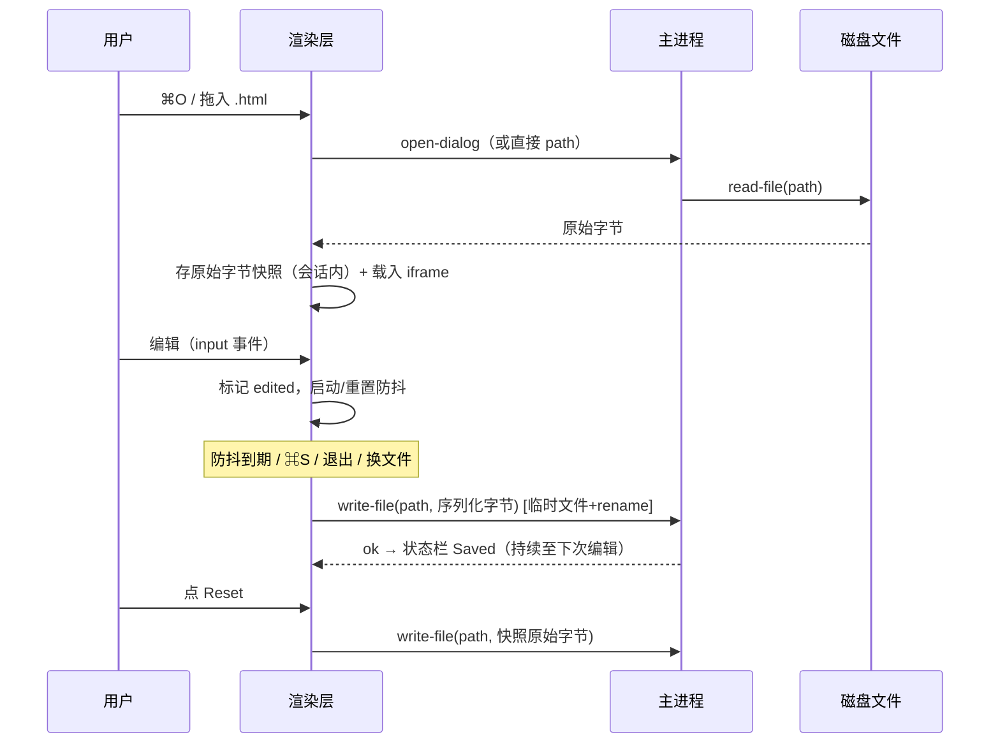

> ⚠ **已搁置（2026-06-13）**：被 `docs/plans/2026-06-13-001-feat-port-wordspace2-editor-plan.md` 取代。Wendi 自做的 wordspace2 块编辑器是本计划的超集且已可运行，Colin 拍板改为移植她的 app。本计划的核心思考（iframe sandbox 模型、JS 不执行、结构保真）被她的实现验证，未浪费；保留作参考。

# feat: v0.0.5 打开/编辑/保存 + iframe 文档地基

## Summary

把文档从"主页面里的 `#doc-container` div"换成内嵌 iframe 的真网页文档模型（文件自身 CSS/相对资源生效、JS 编辑态不执行），并打通单文档文件闭环：菜单/⌘O/拖拽打开 `.html` → 在 iframe 内编辑 → 防抖自动保存写回磁盘（退出/换文档前 flush）+ 打开时原始字节快照兜底。S6 编辑接线与三份人锁 VA 一并迁移到新地基。

---

## Problem Frame

本周可演示目标 = 打开 HTML、编辑、保存（见 origin）。S6 已有编辑，但只能编辑内置文档、持久化是 localStorage 权宜。Colin 拍板"打开就是浏览器里的样子"，现有 div 模型给不了（文件 CSS 与 app 界面互相污染），需换 iframe 文档模型——这把产品推向"文档=真网页"的 HTML-native 命题，代价是 S1–S6 的编辑接线与验收体系整体迁移。

最大未知是 Electron 下 iframe 能否同时满足五个性质（文件 CSS/相对资源生效、文档 JS 不执行、父页可脚本化以接编辑、不撞 app CSP、contenteditable 可编辑）。按仓库"教训要实证"纪律，计划以一道机制 spike（U1）作为去风险门，spike 不过则地基前提不成立、退回 brainstorm。

---

## Key Technical Decisions

- KTD1. **iframe 文档模型 + `sandbox="allow-same-origin"`（刻意不给 `allow-scripts`）为首选机制。** 该组合下：文档自身 `<script>`/内联事件处理器/`javascript:` URL 全部不执行（满足 R2 全向量禁执行 + 安全边界），而 contenteditable 由**父页脚本**驱动（父页有脚本权）、同源保留使父页可读写 `iframe.contentDocument`（满足 R3 编辑接线）。U1 spike 实证此组合在 `file://` 下成立；备选 = 自定义特权协议（`wsdoc://` 经 `protocol.handle` 提供文件字节，绕开 `file://` 同源不确定性）。**srcdoc 已排除**（继承宿主 CSP 拦文件 inline `<style>`，且 base URL 不指向文件目录——origin 已记）。
- KTD2. **app 外壳与文档是两套 DOM。** 主页面（index.html）只承载状态栏/菜单触发的外壳；文档活在 iframe 里。主题 CSS 只作用于外壳（满足 R12，f46"文档不被主题染色"变为架构天然成立）。
- KTD3. **打开/保存走"收路径的 IPC 接缝"。** 原生文件对话框 e2e 驱动不了——主进程暴露 `read-file(path)`/`write-file(path,bytes)`/`open-dialog()`，对话框内部也调同一条 `read-file` 路径。e2e 与 VA 通过 `window.api.file.open(path)` 直接喂路径，绕过原生弹窗（满足 AE 可测）。
- KTD4. **写盘原子化 + flush。** 防抖写采用临时文件 + rename（崩溃不留半文件）；退出 app / 打开新文件 / 关窗前若有防抖窗口内未落盘编辑，先同步 flush；⌘S = 立即 flush（不引入手动保存模型）。
- KTD5. **"编辑过"= 实际变更内容的输入；快照 = 打开时原始字节、会话内有效。** 点击/选区/聚焦不算编辑；编辑后撤销回原状仍算编辑过（接受规范化代价）。未编辑绝不写回、未编辑时 Reset 为 no-op。Reset 写回原始字节（字节级恢复打开时）。
- KTD6. **内置文档 carve-out。** 内置文档持久化目标恒为 localStorage（S6 行为），任何路径不得写 app bundle 内资源（写签名 bundle = 破坏签名 + 砸自动更新）。
- KTD7. **VA 采集升级为 frame-aware 是 VA 重冻结的技术前置。** 先有能穿透 iframe 的采集器（`e2e/helpers.js` snapshot 改造），三份 VA 重冻结才测得真。f40/f46 重冻结 gating，f14 尽力不堵发版。

---

## High-Level Technical Design

进程/组件关系与信任边界（父页可脚本化文档、文档脚本被 sandbox 挡在外）：

```mermaid
flowchart TB
  subgraph main["主进程 src/main.js"]
    MENU["应用菜单 File>Open ⌘O"]
    FILEIPC["file IPC: open-dialog / read-file / write-file（临时文件+rename）"]
    PROTO["（备选）自定义协议 handler"]
    QUIT["before-quit → 触发渲染层 flush"]
  end
  subgraph renderer["渲染层（外壳页 index.html）"]
    SHELL["状态栏：文件名 / Saving·Saved / 主题 / Reset(Revert)"]
    HOST["文档宿主：iframe sandbox=allow-same-origin（无 allow-scripts）"]
    WIRE["编辑接线：对 iframe.contentDocument 接 paste/input/undo（父页脚本）"]
    SAVE["autosave 调度：防抖 + flush + 快照/Reset"]
  end
  DOC["文档（iframe 内）：文件自身 CSS/相对资源生效；文档 JS 不执行"]
  FILE[("磁盘 .html 文件")]

  MENU --> FILEIPC
  FILEIPC -->|字节| HOST
  HOST --> DOC
  WIRE -->|execCommand 等| DOC
  SAVE -->|write-file| FILEIPC --> FILE
  QUIT --> SAVE
  DOC -. 脚本被 sandbox 挡住、够不到 window.api .-> WIRE
```

打开→编辑→保存的时序（含 flush 与快照）：



---

## Implementation Units

### Phase A — 去风险与原地搬迁（内置文档全程保持可用）

### U1. iframe 渲染机制 spike + 决策门

**Goal:** 用最小 harness 实证首选机制（iframe `sandbox="allow-same-origin"` 无 `allow-scripts` + `file://`）同时满足五性质，产出机制决策；不成立则采备选（自定义协议）或上报退回 brainstorm。

**Requirements:** R1, R2, R3（机制可行性前置）

**Dependencies:** 无（最先，门控全局）

**Files:**
- `spike/iframe-mechanism/`（一次性试验 harness：一个最小 main + 外壳页 + 含 `<script>`/`onerror`/inline `<style>`/相对 `<link>` 的样例文档；验证后删除或转 U2）
- 记录结论写入本计划 U2 的 Approach 前提（不新增长期文件）

**Approach:** 逐条验证并记录 PASS/FAIL：① 文件自身 inline `<style>` 与相对路径 `<link>`/`` 在 iframe 内生效；② 文档 `<script>alert>` 与 `onerror`/`javascript:` 均不执行；③ 父页能读写 `iframe.contentDocument`（取 body、设 contenteditable、`execCommand('insertText')` 生效）——**步骤 ③ 的标准用例必须是"外壳页在 asar/一处目录、被打开文件在另一处任意绝对路径"的跨目录组合**（这是 U5 真正发版的配置；`webSecurity:true` 默认下不同目录 `file://` 常被判跨源、`contentDocument` 访问抛 SecurityError——同目录 harness 会假绿放过）；④ 外壳页 CSP `default-src 'self'` 下 iframe 能加载（必要时仅加 `frame-src file:`，不动 `script-src`——记录是否需要，结论交 U2/U3 承接）；⑤ contenteditable 打字/退格/撤销在该 frame 内可用；并明确选 contenteditable 还是 designMode（二者在禁脚本 frame 内父页可脚本化特性不同，选定项即 ⑤ 的验证对象）。内置文档（asar 内 `file://`）同路验证。**备选触发条件：③ 跨目录 `file://` 同源失败 → 切自定义特权协议（`wsdoc://`）并对该协议重跑 ①–⑤ 全套（备选有独立 harness，不是口头兜底）。** 首选与备选都不过 → 上报退回 brainstorm。

**Execution note:** Spike-first，这是去风险门——五性质未全 PASS 不进 U2，按备选或退回 brainstorm 处置。

**Test scenarios:** Test expectation: none — 一次性 spike，结论以人工核验 PASS/FAIL 清单记录；正式验收由后续单元的 e2e/VA 承接。

**Verification:** 五性质 PASS/FAIL 清单完整；机制选定（首选或备选）并记录是否需要动 CSP（动则限 `frame-src`，`script-src` 不放宽，复核 S4 纪律）。

### U2. 文档宿主抽象 + 内置文档迁入 iframe + S6 编辑接线迁移

**Goal:** 把内置文档改为在 iframe 内按 U1 机制渲染；S6 编辑能力（点击定位/敲删/选择/纯文本粘贴/原生撤销）改为作用于 `iframe.contentDocument`；内置文档持久化仍走 localStorage。完成后 app 拿内置文档全绿，尚无文件 I/O。

**Requirements:** R1, R2, R3, R6（内置 carve-out 部分）, R11, R12, KTD2, KTD6

**Dependencies:** U1

**Files:**
- `src/renderer/index.html`（`#doc-container` 改为承载 `<iframe id="doc-frame">` 的宿主；CSP 按 U1 结论调整）
- `src/renderer/renderer.js`（编辑接线从主页面 div 改为对 `doc-frame.contentDocument`：paste 拦截、input→标脏、撤销；启动渲染内置文档进 iframe）
- `src/renderer/preload.js`（`window.api.editing` 沿用；如需新增 frame 相关桥接在此）
- `src/renderer/theme.css`（文档样式移出，主题仅作用外壳；iframe 宿主布局）
- `src/lib/doc-host.js`（新建纯逻辑：把"渲染源串/编辑后串/序列化"决策与 DOM 解耦，vitest 可测——序列化整文档保 doctype/head 的纯函数部分）
- `src/lib/__tests__/doc-host.test.js`（新建）
- `src/lib/editing.js`（沿用 normalizePasteText/isEdited；isEdited 现比对 iframe 文档序列化串）

**Approach:** iframe 加载内置文档（asar `file://` 或 U1 选定机制）；body 按 U1 选定项设 contenteditable/designMode；父页对 contentDocument 接 paste（preventDefault→纯文本 insertText）与 input（标脏→localStorage 草稿，沿用 S6 key）。序列化的纯部分（doctype + documentElement.outerHTML 拼装）抽 `doc-host.js`，DOM 读写留 renderer。脏标记基线 = 载入后序列化快照（沿用 S6 思路，跨 frame 取）。**严守 KTD6：内置文档只写 localStorage。localStorage 草稿读写恒在父页 renderer 上下文（S6 的 `wordspace.doc.html` key），iframe 只用于渲染/编辑——不得用 `iframe.contentWindow.localStorage`（其在 `sandbox="allow-same-origin"`/不同源加载下可能是另一分区或不可用，会让 AE9 的"重启见旧草稿"读空或抛错）；U1 spike 顺带确认所选机制下父页 localStorage 可正常读写。**

**Test scenarios:**
- `doc-host` 序列化：给定 doctype+head+body 结构 → 输出保留 doctype 与 head；空/缺 head 安全。
- `isEdited` 在新序列化串上：相同→false，敲字后→true，撤销回原状→（按 KTD5 仍算 true，文档已规范化）。
- Covers AE2（部分）：内置文档在 iframe 渲染、切主题外壳变暗、文档观感不变（此 AE 的内置文档版，真文件版在 U8）。
- 集成：父页 `execCommand('insertText')` 真的改了 `contentDocument` 且 input 事件冒到父页监听。

**Verification:** vitest 绿（含 doc-host 新测）；宿主 `npm start` 内置文档可编辑、纯文本粘贴生效、撤销可用、切主题文档不变色；localStorage 草稿写入、不写 bundle。

### U3. frame-aware VA 采集 + 三份现役 VA 重冻结

**Goal:** 升级 VA 采集穿透 iframe，重冻结 f40/f46（gating）与 f14（尽力）；变异自检在新模型下仍能让门翻红。

**Requirements:** R13, R14, KTD7

**Dependencies:** U2

**Files:**
- `e2e/helpers.js`（`snapshot()` 改为可按 selector 穿透 `#doc-frame` 取 iframe 内元素的 computed style/textContent；`collect` 的 click/type/press 作用到 frame 内——见下 frame-input 接缝）
- `specs/f40-basic-editing.va.json`、`specs/f46-theme-demo.va.json`、`specs/f14-render-source-toggle.va.json`（选择器/语义改写——人锁，AI 起草草案交 Colin 拍板冻结）
- `e2e/va-runner.spec.js`、`e2e/va-selftest.spec.js`（**va-selftest 的变异 harness 必须重写**，见下）
- `src/lib/va-eval.js`（判定逻辑尽量不动；仅当需要新 metric 才扩，扩则 CODEOWNERS 锁）

**Approach:** Playwright 经 frame 句柄读 iframe 内 DOM；helpers 提供 frame 感知的取值。两处是承重、不是选择器小改：

- **frame-input 接缝**：现 `collect()` 用父页 `window.locator(sel).click()` + `window.keyboard.type()`——父页 locator 选不中 iframe 内元素，打字会落到父页焦点而非 `contentDocument.body`。改用 `window.frameLocator('#doc-frame')` 定位 click/type 目标，并明确把焦点置入 `contentDocument.body` 再 `keyboard.type`（或直接走父页 `execCommand` 路径）。具体走法绑定 U1 ⑤ 的结论（首选 vs 备选机制下同源访问不同）。这是 f40 "typed-text-appears" 重冻结与 AE3/AE4 e2e 能否被驱动的命门。
- **va-selftest 变异 harness 重写（防 S4 假绿复发）**：现自检在**父页**跑 `document.querySelectorAll('link,style').forEach(remove)` 打掉样式。文档进 iframe 后，文件自身的 `<style>`/`<link>` 在 `contentDocument` 里，父页这句变成 no-op——破坏后门照绿、自检误判"门有牙"，正是自检要防的 S4 失效模式。变异必须改为进 `#doc-frame.contentDocument` 内移除文件样式 + 清被验元素，证门在文档侧仍能翻红。

f46 重冻结需专门验证"新模型下仍存在 app 侧可构造的破坏使门翻红"（防退化为恒真断言，origin R14）——iframe 隔离下 app CSS 天然进不去文档，变异探针要能构造一种 app 侧破坏（如向 contentDocument 注入覆盖样式）证门有牙；具体 selector/阈值由 Colin 冻结。三份 VA 草案标注变化交 Colin。

**Execution note:** VA 文件是人锁——AI 只起草草案，冻结由 Colin 拍板；helpers/采集层（非人锁）AI 直接改。

**Test scenarios:**
- 变异自检：f40/f46/f14 在新采集下，打坏后 VA 必翻红（门有牙）。
- f46 专项：构造一种 app 侧破坏使"文档不被染色"断言翻红，证明该门未退化为恒真。
- Covers AE2：f46 重冻结后真开 app，切暗色外壳变暗、iframe 文档观感不变。

**Verification:** 宿主真 Electron e2e 全绿（含三份 VA + 变异自检）；f46 变异专项确证门有牙；Colin 冻结三份 VA 草案。

### Phase B — 文件读写闭环

### U4. 主进程文件层 + preload 文件 API

**Goal:** 主进程提供文件读写/对话框 IPC，preload 暴露 `window.api.file.*`；写盘原子化。无 UI。

**Requirements:** R4（IPC 接缝）, R6, R9, KTD3, KTD4

**Dependencies:** U1（机制/协议确定）

**Files:**
- `src/main.js`（新增 ipcMain：`file:open-dialog`（showOpenDialog 限 .html/.htm）、`file:read`（path→bytes）、`file:write`（path,bytes→临时文件+rename）；如 U1 选自定义协议，在此注册）
- `src/renderer/preload.js`（`window.api.file = { openDialog, read, write }`）
- `src/lib/file-io.js`（新建纯逻辑：路径校验/扩展名判定/序列化字节准备等可解耦部分；vitest 测）
- `src/lib/__tests__/file-io.test.js`（新建）

**Approach:** `file:write` 写临时文件再 `fs.rename`（原子、崩溃不留半文件）；read 返回原始字节（保编码透明，UTF-8 假设见 origin）。对话框 handler 内部复用 read 路径（KTD3 接缝）。路径/扩展名判定逻辑抽 `file-io.js`。

**Test scenarios:**
- `file-io` 扩展名判定：`.html`/`.htm` 接受、`.md`/目录/无扩展拒绝。
- 集成（主进程）：write 走临时文件+rename，目标内容正确；目标只读时抛可识别错误（供 R9）。
- 边界：路径为符号链接 → 解析真实路径读写（origin 决策）。

**Verification:** vitest 绿（file-io）；手动经 `window.api.file.write` 写一个临时文件，内容正确且过程用了 rename；只读目标返回错误。

### U5. 打开入口：菜单 + ⌘O + 拖拽 + 快照捕获

**Goal:** 三个打开入口接好，载入文件进 iframe 并替换当前文档，捕获打开时原始字节快照；非 .html 拒绝、打开失败保现场。

**Requirements:** R4, R5, R8（快照捕获部分）, R15（换文件前 flush——占位钩子；完整实现依 U6）, AE1, AE5

**Dependencies:** U2, U4

**Files:**
- `src/main.js`（应用菜单 File>Open… ⌘O → `file:open-dialog`→`file:read`→送渲染层）
- `src/renderer/renderer.js`（接收文件字节：先 flush 旧文档待写编辑（依赖 U6 的 flush，或本单元先占位、U6 接全）、存原始字节快照、载入 iframe、切换持久化目标为磁盘）
- `src/renderer/index.html`（拖拽宿主 + 拖入悬停"释放以打开"指示）
- `src/lib/open-intent.js`（新建纯逻辑：判定拖拽 payload 是文件还是文本、文件是否 .html/可接受；vitest 测）
- `src/lib/__tests__/open-intent.test.js`（新建）

**Approach:** 拖拽用 `dragover`/`drop`：有 `dataTransfer.files` 且为 .html → 打开；纯文本拖动 → 不拦（交编辑）；非 .html/目录 → 拒绝 + 状态栏提示、现场不变、绝不写该文件。打开成功即存原始字节快照（**整文件原始字节驻内存、会话内有效——demo 规模下为有意接受的选择，非疏漏；F01 多文档落地前重审 N 份缓冲累积**）。判定逻辑抽 `open-intent.js`。**换文档前 flush 旧编辑：U5 只留 flush 钩子调用点，真实 flush 逻辑由 U6 接全（R15 完整实现归 U6）；且 flush 必须保证在途写指向"旧文件路径"并完成后，path 变量才重新赋值为新文件——否则旧编辑会写进新文件或丢失。**

**Test scenarios:**
- `open-intent`：files+`.html`→open；纯文本 payload→edit（不 open）；`.md`/目录/无扩展→reject。
- Covers AE5：拖 `.html`→打开；拖 `.md`/目录→拒绝提示、现场不变；文档内拖选中文本→移动文本不触发打开。
- Covers AE1：打开后只浏览（含点击/选区）→ 关闭/重开 → 文件零字节变化（依赖 U6 的"未编辑不写回"，AE1 完整验在 U8）。
- 错误路径：选中后文件被删/无权限 → 当前文档不变、状态栏提示。

**Verification:** 宿主真开 app，三入口都能打开 .html；拖 .md 被拒提示；拖文本不误开；打开后快照已存（供 Reset）。

### U6. 自动保存 + flush + Reset + "编辑过"语义

**Goal:** 防抖自动保存写回原文件；退出/换文件/关窗前 flush；⌘S 立即 flush；Reset 写回快照；内置文档 carve-out；"编辑过"判定落地。

**Requirements:** R6, R7, R8, R15, R16, KTD4, KTD5, KTD6, AE3, AE6, AE8

**Dependencies:** U2, U4, U5

**Files:**
- `src/renderer/renderer.js`（input→标脏→防抖调度 write；Reset→写快照字节并刷新视图；⌘S→立即 flush）
- `src/main.js`（`before-quit` 拦截 → 通知渲染层 flush 再退；窗口关闭同理）
- `src/lib/save-scheduler.js`（新建纯逻辑：防抖状态机——何时该写、待写标志、flush 决策、"编辑过"谓词；不依赖 DOM/Electron，vitest 测）
- `src/lib/__tests__/save-scheduler.test.js`（新建）
- `src/renderer/index.html`（Reset 文案改 Revert，R16）

**Approach:** `save-scheduler` 持有 dirty/pending 状态：input 标脏并重置防抖计时；到期触发 write 回调；`flush()` 立即触发并清 pending（供退出/换文件/⌘S）。"编辑过"谓词 = 实际内容变更（点击/选区不标脏）；撤销回原状仍 dirty（KTD5）。**`save-scheduler` 的 dirty 判定与 U2 的 `isEdited()` 是同一谓词（是否存在实际内容变更）——dirty 直接复用 isEdited 实现，不另写一份。** 注意两种"基线"语义不同且都对：`isEdited` 比对**序列化串**（首次编辑后基线即规范化串，KTD5 接受）；而 Reset 用的快照是**打开时原始字节**——二者不是同一份数据。

- **Reset 必须写回原始字节缓冲、绕过序列化**：Reset 不走 autosave 的 doc-host 序列化管道，而是把 U5 存的原始字节缓冲**原样** `file:write`，并用这份原始字节**重新载入 iframe**（重 parse），使磁盘与视图都回到打开时字节态。若 Reset 误走序列化路径，写回的是规范化版本、AE6 字节比对必败（"会重新规范化的 Reset 不是真 revert"）。

- **内置文档分支**：write 回调指向 localStorage，绝不调 file:write（KTD6）。

- **before-quit 异步 flush 握手（主进程当前无 before-quit handler，全新建）**：Electron `before-quit` 不能同步等异步 IPC 写完。协议：首次 before-quit → `event.preventDefault()` → 发 flush-request IPC → 渲染层等所有在途 `file:write` ack 完成 → 回 flush-done → 主进程置 `alreadyFlushed` 守卫 → 调 `app.quit()`（再次触发 before-quit，被守卫短路放行）。命名该往返 IPC 通道与守卫标志，由 U6 单独拥有，不要把它拆散在 U5 的"flush 钩子"里。**macOS 注意**：`window-all-closed` 在 darwin 不退出，关窗不经 before-quit——关窗路径也要挂 flush（绑到窗口 close 事件），不能只靠 before-quit。

**Technical design（方向性，非实现规范）:**
```
save-scheduler（纯状态机）
  onInput():      dirty=true; restart debounce timer
  onTimer():      if dirty: emit save(); (dirty 维持直至 save 确认)
  flush():        if dirty: emit save() now; cancel timer
  onSaved():      pending 清理（dirty→false 仅当无新输入）
  isEdited():     dirty 判定（点击/选区不触发 onInput）
```

**Test scenarios:**
- `save-scheduler`：连续输入只在停顿后触发一次 save；flush 立即触发且取消计时；未 dirty 时 flush/timer 不触发 save（覆盖 R7）；撤销回原状仍 dirty。
- Covers AE3：敲字停顿超防抖 → save 触发（真文件含编辑，e2e 在 U8）。
- Covers AE8：敲字后立即 flush（模拟 ⌘Q/换文件）→ save 已触发、不丢。
- Covers AE6：编辑后 Reset → 调 save 写**原始字节缓冲（绕过序列化）**、dirty 清。
- carve-out：内置文档 save 回调走 localStorage、绝不调 file:write。
- before-quit 握手：dirty 状态触发退出 → preventDefault→flush ack→守卫→真退；无 dirty 退出不被拦；macOS 关窗路径也触发 flush。

**Verification:** vitest 绿（save-scheduler 覆盖防抖/flush/未编辑不写/撤销仍脏）；宿主真编辑文件 → 停顿后磁盘更新；敲字立即 ⌘Q → 不丢；Reset 回原始字节；内置文档编辑只动 localStorage。

### U7. 保存反馈 + 错误处理 + 文件名状态栏

**Goal:** 状态栏显示文件 basename（全路径悬停）+ Saving…→Saved 持续态；保存失败持续报错、内容不丢可重试。

**Requirements:** R9, R10

**Dependencies:** U6

**Files:**
- `src/renderer/index.html`（状态栏文件名区 + 保存状态区）
- `src/renderer/theme.css`（文件名/状态样式；basename 截断 + title 悬停全路径）
- `src/renderer/renderer.js`（save 生命周期→Saving…/Saved/Error 渲染；Saved 持续显示至下次编辑）
- `src/lib/save-status.js`（新建纯逻辑：保存状态机 idle→saving→saved/error 的文案与转移；vitest 测）
- `src/lib/__tests__/save-status.test.js`（新建）

**Approach:** Saved 为**持续态**（至下次编辑才回文件名），便于 VA 强断言（origin 对 S4 假绿的回应）。错误态持续显示至下次成功保存清除；编辑内容保留在 iframe、可继续编辑重试（下次防抖再写）。文件名显 basename，全路径走 `title` 悬停。

**Test scenarios:**
- `save-status`：idle→saving→saved 转移；error 持续至下次 saved；saved 持续至 onInput。
- Covers AE3：状态栏出现 Saving…→Saved（持续）。
- Covers AE7：磁盘只读 → 持续错误提示、编辑内容保留。
- 边界：长路径只显 basename、悬停出全路径。

**Verification:** vitest 绿（save-status）；宿主编辑→见 Saving…→Saved 持续；只读目标→持续报错、内容在；长文件名不撑破状态栏。

### Phase C — 验收与收尾

### U8. 新功能 VA + 手写 e2e + 测试隔离

**Goal:** 为打开/保存可见效果配人锁 VA，手写 e2e 覆盖 AE1–AE9；e2e 用临时文件/临时 userData 隔离。

**Requirements:** R13, R14（新功能 VA）, AE1–AE9 全量

**Dependencies:** U3, U5, U6, U7

**Files:**
- `specs/<open-save 相关 slug>.va.json`（新建——人锁，AI 起草交 Colin；验"文件名显示""Saved 持续态"等可见效果）
- `e2e/open-save.spec.js`（新建——手写：经 `window.api.file.open(path)` 喂临时 .html，验打开/编辑/落盘/flush/Reset/非 html 拒绝/script 不执行）
- `e2e/helpers.js`（临时文件创建/清理；沿用临时 userData 隔离）
- `e2e/fixtures/`（样例 .html：含相对 CSS、含 `<script>`/`onerror`、非 .html 干扰文件）

**Approach:** e2e 经 KTD3 的 IPC 接缝直接喂路径，绕原生对话框。每测建临时 .html、用毕清理；userData 隔离沿用 S6 的 `WSND_USER_DATA`。`<script>`/`onerror` 不执行用"无弹窗 + 无脚本产生的 DOM 变动 + 保存后原样保留"三点验（AE4）。AE1 零字节用"打开只读不写"前后字节比对。

**Test scenarios:**
- Covers AE1：打开只浏览→关闭→文件字节不变。
- Covers AE3/AE8：编辑停顿→落盘含编辑；敲字立即触发退出路径 flush→不丢。
- Covers AE4：含 `<script>`+`onerror` → 均不执行、保存后原样保留。
- Covers AE5：拖 .html 打开 / 非 .html 拒绝 / 拖文本不开（拖拽若 e2e 难驱动，用 open-intent 单测 + 手动核验补）。
- Covers AE6：编辑后 Reset → 文档与磁盘回原始字节（**post-Reset 文件字节 vs 快照缓冲逐字节相等**断言，捕捉序列化路径回归）。
- Covers AE5（拖拽）：优先尝试 Playwright 合成 `drop` 事件带 `dataTransfer.files`（`editing.spec.js` 已有合成 `DataTransfer`+`ClipboardEvent` 先例，"难驱动"多半被高估）；确无法驱动再降级 open-intent 单测 + 手动核验。
- Covers AE7：只读目标 → 持续错误、内容在。
- Covers AE9：编辑真文件→关→重启→显示内置文档及旧草稿（互不污染）→重开该文件→编辑可见。
- 新 VA：真开 app 验文件名显示 + Saved 持续态可被强断言。

**Verification:** vitest 全绿；宿主真 Electron e2e 全绿（新 e2e + 三份重冻结 VA + 新 VA + 变异自检）；CI ubuntu+xvfb 同绿；Colin 冻结新 VA。

---

## Scope Boundaries

- 最近文件/重启恢复上次文件 → F05；多文档/tab → F01；文档 JS 执行/预览模式 → 另案；另存为/导出 → 不做；字节级保真 → 不承诺（结构保真为准）。
- 文件 watch/外部修改冲突 → 不做且显式接受：打开期间外部修改会被 autosave 静默覆盖、快照不保护外部修改（单写者假设，origin 已签收）。
- 跨会话快照/版本史 → 不做（会话内快照边界已接受）。
- 文档内允许外部 http(s) 子资源加载（浏览器同等行为，隐私面已知悉接受）。
- 非 UTF-8 文件读写一致性 → 本轮不承诺（假设 UTF-8）。

### Deferred to Follow-Up Work

- f14 VA 重冻结：尽力同轮，但**不堵 v0.0.5 发版**（origin R14）；若 spike/迁移耗时，f14 可在发版后单独补冻结。
- 大文件性能（每次防抖整文档 serialize+写盘）无规模假设——demo 场景预期无碍，超大文件降级留后续。
- 首次自动保存的信任提示 / "脚本未执行"可见指示：origin 提及但形态归 design，本轮不强制，留后续打磨。

---

## Risks & Dependencies

| 风险 | 缓解 |
|---|---|
| **U1 spike 五性质不全过**（地基命门：尤其 `file://` 父页脚本化 `file://` 子页在 webSecurity 下失败） | U1 设为去风险门 + 命名备选（自定义特权协议）；仍不过则退回 brainstorm，不硬上。 |
| contenteditable/execCommand 在 sandbox 无 allow-scripts 的 frame 内行为未在本仓实测 | U1 spike 第 ⑤ 项专验；"教训要实证"纪律，先证再建。 |
| 动 CSP 引入 S4 式假绿/削弱 | U1 记录是否需动；动则限 `frame-src file:`、`script-src` 不放宽，U3 变异自检兜底。 |
| f46 "文档不被染色" 变架构天然 → 变异自检退化为恒真断言 | U3 专项构造 app 侧破坏证门有牙，否则重设断言对象（origin R14）。 |
| 防抖窗口内退出/换文件丢编辑 | KTD4/U6 的 flush（before-quit + 换文件 + ⌘S）；老 wordspace before-quit flush 先例。 |
| 内置文档误写签名 bundle | KTD6 carve-out：内置文档恒走 localStorage，write 回调分支隔离，U6 测覆盖。 |
| 原生文件对话框 e2e 不可驱动 | KTD3 IPC 接缝：e2e/VA 经 `window.api.file.open(path)` 喂路径，对话框内部复用同路径。 |
| 体量 2–3× S6、含人锁 VA 等 Colin 瓶颈 | 分三阶段；Phase A 完即 app 绿（内置文档），VA 冻结集中在 U3/U8 末端，可先功能后冻结。 |

依赖：发版走现有签名/公证/自动更新工厂；v0.0.4 装机经显式更新弹窗升到 v0.0.5（弹窗第二次实战）。

---

## Sources & Research

- origin：`docs/brainstorms/2026-06-12-v005-open-edit-save-requirements.md`（R1–R16、AE1–AE9、全部 Key Decisions 与 7-persona 审查结论）。
- 现状实证（本 session 已读）：`src/lib/window-config.js`（`contextIsolation:true/nodeIntegration:false/sandbox:false`）、`src/main.js`（无菜单、仅 `get-doc-content` IPC + autoUpdater + `WSND_USER_DATA`）、`src/renderer/{preload,renderer}.js`、`src/lib/doc-loader.js`（asar 内 builtin-doc.html）、`e2e/helpers.js`（平面 `document.querySelector` 采集，需 frame 化）、`src/lib/va-eval.js`。
- 仓库教训：`CLAUDE.md` S4（CSP 假绿、变异自检证门有牙、不削弱 CSP）、"教训要实证"（spike 先行的依据）。
- 老 wordspace 先例：`projectx/dev/electron/main.cjs` 的 before-quit flush（U6 flush 的实证出处）；`docs/projectx-context.md` §4 老代码参考地图。
- 业界：TinyMCE/CKEditor 的 iframe 编辑文档隔离模式；macOS TextEdit/Pages 的 autosave + Versions（跨会话版本史为另案参照）。
