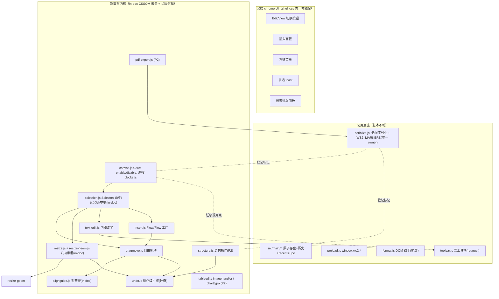

# feat: 把 F01 编辑器内核改造成 heyhtml 自由画布（完整照抄）

## Summary

把 wordspace-next 的编辑器从现在的「contenteditable 块流」内核，整套改造成 heyhtml（`heyhtml.com` / 开源 repo `joyxiaofan-beep/html-visual-editor`，MIT）的「自由画布直接操作」内核：点选任意元素、自由拖动（带智能对齐线）、八向缩放、内联改字、Float/Flow 插入、右键菜单、多选编组、图层、锁定、表格编辑、格式刷、图表排版、PDF 导出。做法是**新建一批画布模块对照 heyhtml 的 ~19 个 `HVE_*` 模块逐个抄**，复用已经落地的富工具栏（`src/editor/toolbar.js`）、无损保真序列化（`src/editor/serialize.js`）、`format.js` 助手、`src/main/*` 文件 I/O，等画布等价物就位后退役只服务块流的旧模块（`blocks.js` 分类、`draghandle.js` 块重排、`slashmenu.js` execCommand 插入）。分两期：**Phase 1 = 最小可用画布**，**Phase 2 = 富内容 + 结构操作 + 导出**。

本 plan 已吸收一轮对抗性验证（9 agent）挑出的 4 个 blocker：①两个 undo 设计合并为一；②`serialize.js` 白名单单一 owner；③`blocks.js` 退役必须与其调用点迁移在同一单元完成；④元素跟踪类覆盖层走 **in-doc CSSOM** 而非父层 chrome。

> 验收基准已在 origin（`specs/F01-local-html-editing.md`）重写：拖动/缩放一个元素会写上 `position`/尺寸样式 = **预期行为**，不再是「一字不乱」的流式保真。新基准 = 存盘是合法干净 HTML + 用户没主动操作过的元素不被无故改动。固定坐标、不 reflow 是画布模型已接受的代价。

---

## Problem Frame

现状（分支 `feat/editor-rich-toolbar`，parallel session 刚落地）：编辑器是块流模型——`shell.js` 把用户文档载入 `<iframe sandbox="allow-same-origin">`，`blocks.js applyEditable()` 把 body 设成 contenteditable 并把顶层元素分类成 text/list/divider/container/locked；`toolbar.js`（父层常驻富工具栏，跨帧 execCommand）、`slashmenu.js`（`/` 插入）、`draghandle.js`（块上下重排）、`undo.js`（整页 innerHTML 快照）围绕这个模型运转。

heyhtml 的内核是**另一个物种**：直接在真实 DOM 上做空间操作（选中/拖到任意坐标/缩放/图层），文字编辑只在被选元素上局部进行。要照抄它，得换掉交互内核——这不是给现有块流编辑器加功能，是替换 `blocks.js` 那条「推断块 + body 级 contenteditable」的交互核心，同时**保留**已经做对的两块资产：富工具栏（文字格式）和无损序列化（画布把坐标/尺寸写成 inline style，序列化原样保留 = 白嫖）。

约束（已实测）：①文档 iframe 是 `sandbox="allow-same-origin"`（无 allow-scripts），所有逻辑在父 renderer 里对 `frame.contentDocument` 跑；②renderer CSP 是 `style-src 'self' file:` 无 `unsafe-inline`——`setAttribute('style', …)` 和注入 `<style>` 块会被拦，但 **CSSOM 的 `el.style.x=` 不受 style-src 管**（`draghandle.js` 今天就这么往 iframe 注入带样式的覆盖节点，`fidelity.spec.js` 的「零 CSP 违规」门是过的）；③PDF 库不能像 heyhtml 那样从 cdnjs 拉，得本地 vendor。

---

## Requirements

来自 origin `specs/F01-local-html-editing.md`（重写后的画布版 F01）：

- **R1**：点选任意元素（悬停虚线高亮、点击实线选中、Esc 逐层选父、点空白取消选）。
- **R2**：自由拖动到任意位置，带智能对齐线 + 间距标注 + 吸附；方向键 1px / Shift 10px 微调。
- **R3**：八向手柄缩放（四角双轴、四边单轴），可撤销。
- **R4**：双击进入内联改字 + 富文本格式（复用现有工具栏，retarget 到被选元素）。
- **R5**：插入元素——Float（绝对定位）/ Flow（文档流）两模式，10 种元素类型。
- **R6**：右键菜单、多选 + 编组、图层 z-order、锁定、复制/粘贴/清除样式、格式刷。
- **R7**：表格编辑（插入/增删行列/改单元格/样式）、图片插入（磁盘/粘贴）+ 缩放、图表排版模板。
- **R8**：撤销/重做（操作级，100+ 步，拖拽/缩放高频可承受）。
- **R9**：PDF 导出（分页）。
- **R10**：Edit/View 模式切换（heyhtml 核心入口 UX）。
- **R11（保真红线，重写后）**：存盘是合法干净 HTML（编辑器标记/UI/contenteditable 全剥），用户没主动操作过的元素不被无故改动。

---

## Key Technical Decisions

**KTD1 — 新建画布模块，对照 heyhtml `HVE_*` 分解；复用而非重写资产。** 新模块：`canvas.js`(Core)、`selection.js`(Selector)、`dragmove.js`(DragMove)、`alignguide.js`(AlignGuide)、`resize-geom.js`+`resize.js`(Resize)、`text-edit.js`(TextEdit)、`insert.js`(InsertPanel)、`structure.js`+`contextmenu.js`+`formatbrush.js`+`multiselect.js`(ContextMenu/Group/Layer/Lock)、`tableedit.js`(TableEdit)、`imagehandler.js`(ImageHandler)、`charttypo.js`(ChartTypo)、`pdf-export.js`(PDFPaginator)、`pagesorter.js`(PageSorter)。复用：`toolbar.js`/`serialize.js`/`format.js`/`undo.js`(升级)/`src/main/*`/`preload.js`。退役：`blocks.js` 分类、`draghandle.js` 块重排、`slashmenu.js` execCommand 插入。每个模块沿用现有 IIFE + `module.exports` 双导出约定，作为 `<script src>` 进 `index.html`、可被 jsdom 单测 require。

**KTD2 — 元素跟踪类覆盖层走 in-doc CSSOM，不走父层 chrome。** 选中框、悬停框、8 个缩放手柄、对齐线，全部作为 `data-ws2-ui` 节点注入文档 iframe、**只用 CSSOM `el.style.x=` 设样式**（绝不 `setAttribute('style', …)`、绝不注入 `<style>` 块）。理由：①CSSOM 不受 doc `style-src` 管（`draghandle.js` 已验证）；②在文档自身坐标/滚动空间里，跟踪元素 rect「免费」，不需要父↔iframe 几何同步（父层覆盖会在快速拖动时慢一帧、且要挂 scroll/resize 监听）；③现有 e2e 合成事件 harness（向 iframe 派发 MouseEvent）够得着 in-doc 手柄，够不着父层手柄。**非跟踪类 UI（插入面板、右键菜单、多选 toast、图表面板、topbar Edit 按钮）才放父层 chrome**，用 `shell.css` 类（不是 inline style）满足 renderer CSP。顺带删掉 `shell.js` 的 `injectUiStyle`（注入 `<style>` 是对严格 CSP 用户文档的潜在违规，且它服务的 locked-hover 随 `blocks.js` 一起退役）。

**KTD3 — 单一操作级 undo 引擎。** 把 `undo.js` 从整页 innerHTML 快照升级为**有类型的 Operation 记录**：属性 op（move/resize/style/z-index/lock：记 target 元素 + before/after 的 inline style/属性，O(1)）+ 结构 op（insert/delete/reorder/group：记 outerHTML+父+锚点）。支持 100+ 级、新 op 砍掉 redo 尾、同 target 同 kind 的高频 op 合并（一次拖动多个 pointermove → 一个 op，`beginCoalesce`/`commit`）。**保留** `checkpoint`/`scheduleCheckpoint`/`undo`/`redo` 旧签名，让 contenteditable 文字路径（`toolbar.js`/`shell.js`）继续工作——快照作为 `kind:'html'` op 留存。

**KTD4 — `serialize.js` 是 `WS2_MARKERS` 白名单的唯一 owner。** 所有引入新标记的单元，都在「serialize 单元」拥有的那个 Set 里**登记自己的字符串**（`data-ws2-canvas`/`-eid`/`-oid`/`-editing`/`-locked`/`-group`/`-tablestyle`/`-chart` 等），不各自重写 `serialize.js:12-14`。`data-ws2-oid` 双claim 问题归 undo 单元、在 serialize 单元统一登记。保真自由收益：画布写的 `position/left/top/width/height/z-index` 是普通 inline style，序列化已原样保留，**白名单零改动就持久化**。每个引入标记的单元都要跑「存盘字节里没有 `data-ws2`」断言（现有 e2e 门已有，强）。

**KTD5 — `blocks.js` 退役与其调用点迁移原子完成。** `WS2Blocks` 现在被三处活引用：`shell.js` input 处理器的 `markBlocks`、`toolbar.js:42 run()` 的 `markBlocks`、`slashmenu.js:84` 的 `[data-ws2-block="text"]` `/` 触发守卫。退役 `blocks.js` 必须**在 Canvas-controller 同一单元里**把这三处迁走（否则工具栏命令和斜杠菜单会静默失效）。

**KTD6 — 固定坐标输出已接受，F01 验收已重写。** 见 origin 与 Summary 注。

**KTD7 — 单一 keydown 优先级表（`shell.js` 一个 capture-phase 监听器）。** Esc：text-edit-退出 > 选择-选父 > 取消选。方向键：slashmenu-导航（菜单开时）> nudge（有元素选中且非文字编辑）> 原生光标。Cmd+Z/S/B/I/U 维持现状。不再各模块各加 keydown，避免重复处理。

**KTD8 — PDF 库本地 vendor**（`vendor/jspdf.umd.min.js` + `vendor/html2canvas.min.js`，`<script src>` 进 index.html），CSP `script-src 'self' file:` 放行，不加 `unsafe-inline`、不碰 cdnjs。

**KTD9 — 两期交付**：Phase 1 = 最小可用画布（选中/拖动/对齐/缩放/改字/插入/撤销升级/Edit 切换）；Phase 2 = 结构操作/右键/多选/表格/图片/图表/PDF/PageSorter。

---

## High-Level Technical Design

架构分三层：**复用的稳定底座**（不动）／**父层 chrome UI**（非跟踪）／**in-doc CSSOM 覆盖 + 画布逻辑**（新内核）。



**Phase 1 依赖顺序（验证给出的可建序）**：undo 引擎 → format 助手 → resize-geom → canvas controller(含 blocks 迁移 + Edit 切换) → serialize 白名单 → selection → text-edit → toolbar retarget → dragmove → alignguide → nudge → resize controller → insert panel → slash 折叠 → FileManager/序列化复用确认。

---

## Output Structure

```
src/editor/
  canvas.js            (新) HVE_Core：edit 模式、状态、退役 blocks 调用点
  selection.js         (新) HVE_Selector：命中/选父/in-doc 选中+悬停框
  resize-geom.js       (新) HVE_Resize 纯几何
  resize.js            (新) HVE_Resize 控制器 + in-doc 手柄
  dragmove.js          (新) HVE_DragMove 自由拖动 + nudge
  alignguide.js        (新) HVE_AlignGuide 对齐线(纯几何+in-doc 绘制)
  text-edit.js         (新) HVE_TextEdit 内联编辑
  insert.js            (新) HVE_InsertPanel Float/Flow 工厂
  structure.js         (新,P2) z-order/group/lock/style 纯操作
  contextmenu.js       (新,P2) HVE_ContextMenu
  formatbrush.js       (新,P2) 格式刷
  multiselect.js       (新,P2) 多选 + 快捷键 + toast
  tableedit.js         (新,P2) HVE_TableEdit
  imagehandler.js      (新,P2) HVE_ImageHandler
  charttypo.js         (新,P2) HVE_ChartTypo
  charttypo-presets.js (新,P2) 8 套模板纯数据
  pdf-export.js        (新,P2) HVE_PDFPaginator
  pagesorter.js        (新,P2) HVE_PageSorter
  toolbar.js   format.js   serialize.js   undo.js   (改/扩展，保留)
  blocks.js  slashmenu.js  draghandle.js            (退役)
vendor/
  jspdf.umd.min.js  html2canvas.min.js              (新,P2 本地 vendor)
src/renderer/  index.html  shell.js  shell.css       (改)
test/  (每个新模块一份 *.test.js，jsdom 纯逻辑)
e2e/app.spec.js  (扩展真机交互断言)
```

---

## Phase 1 — 最小可用画布

### U1. 操作级 undo/redo 引擎（合并原「style-op」+「HVE_History」）

**Goal**：把 `undo.js` 升级成有类型 Operation 的操作级历史，高频拖拽/缩放/样式变更 O(1) 记录与撤销；保留旧快照 API 给 contenteditable 文字路径。
**Requirements**：R8。
**Dependencies**：无（最早单元，被拖动/缩放/结构单元消费）。
**Files**：modify `src/editor/undo.js`、`src/renderer/shell.js`、`src/editor/toolbar.js`；test `test/undo-ops.test.js`、`test/undo.test.js`、`test/undo-redo-pending.test.js`。
**Approach**：Operation 记录 `{kind, target(稳定 ref/path/marker id), before, after, coalesceKey}`。属性 op 写 inline-style/属性回滚；结构 op 存 outerHTML+父+锚点。新 op 砍 redo 尾；`beginCoalesce(key)`/`commit()` 合并一次拖动的多帧为一个 op；上限 200。旧 `checkpoint/scheduleCheckpoint/undo/redo` 签名保留，快照成 `kind:'html'` op。
**Patterns**：沿用 `undo.js` 现有 `slice(0,idx+1)/push/LIMIT-shift` 截断逻辑与 IIFE 双导出。
**Test scenarios**：① 属性 move op：before left=10px、after=200px，undo→10px、redo→200px。② 合并：`beginCoalesce('move:#a')` + 50 个 move、`commit()` → 历史只 +1。③ 结构 delete：删 #p2 后 undo → #p2 原位重插（在 #p1/#p3 之间）。④ 新 op 砍 redo 尾（opA,opB,undo,opC → redo 为 no-op 返回 false）。⑤ 250 个 op → 上限 200、最旧 50 驱逐。⑥ 回归：现有 `undo.test.js` + `undo-redo-pending.test.js` **不改**仍绿（证明旧 API 兼容）。
**Verification**：`npm test` 三份 undo 测试全绿；app 仍能打开、contenteditable 打字撤销不回归。

### U2. format.js retarget 助手（被选元素解析 + 元素级样式应用）

**Goal**：给 `format.js` 加纯 DOM 助手，让工具栏对**被选元素**而非光标选区操作。
**Requirements**：R4。
**Dependencies**：无（纯助手，先落地，被 U6/U7/U8 消费）。
**Files**：modify `src/editor/format.js`；test `test/format.test.js`。
**Approach**：新增 `isTextEditable(el)`（P/H1-6/BLOCKQUOTE/PRE/SPAN/A/LI/TD/TH/BUTTON/LABEL/FIGCAPTION/含直接文字的 DIV → true；IMG/HR/空结构容器 → false；小集合内联自带、**不** import 退役中的 blocks.js）、`anchorWithin(el)`、`applyBlockStyle(el,prop,value)`（返回 before/after delta 供 undo）、`retagElement(el,tag)`（保留 id/class/style/子节点换标签）。保留 `climb/currentBlock/wrapInlineStyle`（文字编辑回退路径仍用）。
**Patterns**：`format.js` 既有纯函数 + 双导出。
**Test scenarios**：`isTextEditable(<p>)`=true、``=false、`<div><table></div>`=false、`<div>raw</div>`=true；`anchorWithin` 取选中 p 内的 a / a 本身 / 无链接返 null；`applyBlockStyle(p,'fontSize','24px')` 设样式且返 delta；`retagElement(p,'h2')` 保留 id/class/style/子节点；无父元素 no-op。
**Verification**：`node --test test/format.test.js` 全绿（含既有用例）。

### U3. resize 几何核（HVE_Resize 数学）

**Goal**：纯几何模块 `resize-geom.js`，含 8 个手柄描述符 + `computeResize` 数学。
**Requirements**：R3。
**Dependencies**：无（纯叶子）。
**Files**：create `src/editor/resize-geom.js`、`test/resize-geom.test.js`。
**Approach**：`HANDLES`=8 个 `{id, x:0|.5|1, y:0|.5|1, axis:'both'|'x'|'y', cursor}`；`computeResize(handle,startRect,dx,dy,{min=8})` → 新 `{width,height}`：东/西边改宽（西边正 dx 缩）、南/北边改高、角双轴；min 钳制不塌成 0。
**Patterns**：IIFE 双导出，进同一 `<script src>` 列表与 node:test。
**Test scenarios**：HANDLES 8 个唯一 id；`se+(30,20)`→{130,70}；`e+(30,20)`→{130,50}；`s+(30,20)`→{100,70}；`w+(30,0)`→宽 70；`nw+(90,45,{min:8})` 钳到 ≥8。
**Verification**：`npm test` 6 个精确数值用例绿（变异自检锚点，符号/轴错会响）。

### U4. Canvas controller + scene model + Edit/View 切换 + 迁移 blocks.js 调用点（HVE_Core）

**Goal**：用 `canvas.js` 取代 `blocks.js applyEditable` 作为 edit 模式入口；拥有 enable/disable/选中/悬停状态；topbar 加 Edit/View 切换；**同单元**迁移 `WS2Blocks` 的三处活引用，使 `blocks.js` 可退役而不静默打断工具栏/斜杠。
**Requirements**：R1、R10、R11、KTD5。
**Dependencies**：无（全工程第一实现单元之一）。
**Files**：create `src/editor/canvas.js`、`test/canvas.test.js`；modify `src/renderer/index.html`、`src/renderer/shell.js`、`src/editor/toolbar.js`、`src/editor/slashmenu.js`。
**Approach**：`WS2Canvas.create(doc,{undoMgr,markDirty})` → `{enable,disable,getState,select,hover,deselect,destroy}`。`enable()` 做 `applyEditable` 的 doc 级动作**减去 body 级 contenteditable**（body 级 contenteditable 是要退役的块流模型）：盖 `data-ws2-canvas` + `spellcheck=false/data-ws2-sc`。scene = 活 DOM 本身；选中态存在 controller 闭包变量（指真实元素 ref，不序列化）；需要跨快照的持久句柄时 `ensureId(el)` 懒盖 `data-ws2-eid`（白名单内、存盘剥）。`shell.js wireEditor()` 改成 `canvas=WS2Canvas.create(...); canvas.enable()`，不再调 `applyEditable`。**迁移调用点**：`shell.js` input 处理器与 `toolbar.js:42 run()` 里的 `WS2Blocks.markBlocks` 改为「画布选中态刷新」（不再依赖块标注）；`slashmenu.js:84` 的 `[data-ws2-block]` `/` 守卫改成「光标在可编辑文字元素内」判定（用 `format.isTextEditable`）。topbar 加「编辑/预览」按钮调 `enable/disable`。删 `shell.js injectUiStyle`。
**Patterns**：`blocks.js`/`format.js` 的 IIFE 双导出尾；`shell.js wireEditor()` 现有 `undoMgr=new WS2Undo.UndoManager(doc)` / `toolbar.setContext` 实例化模式。
**Test scenarios**：① jsdom：`enable()` 后 body 有 `data-ws2-canvas`/`data-ws2-sc`、**没有** `contenteditable=true`。② `enable()` 幂等。③ `ensureId` 只盖被传元素、不动兄弟。④ `disable()` 清状态。⑤ e2e：开 FIXTURE → body 有 `[data-ws2-canvas]` 且 `#p1` `isContentEditable===false`（证明 body 级 contenteditable 模型已去）。⑥ e2e：点 topbar「预览」→ 选中/悬停交互停用、点「编辑」恢复。⑦ e2e（回归）：迁移后工具栏命令仍生效、`/` 菜单仍能开。
**Verification**：`node --test test/canvas.test.js` 绿；`npm test` 全绿；CI e2e 含「edit 模式 active + 工具栏/斜杠未因 blocks 退役而坏」断言绿。

### U5. 扩展 serialize.js 标记白名单（WS2_MARKERS 唯一 owner）

**Goal**：保证所有新画布/选中/手柄/对齐线标记与注入覆盖节点存盘被剥；确立 `serialize.js` 为白名单唯一 owner。
**Requirements**：R11、KTD4。
**Dependencies**：U4（定义 `data-ws2-canvas`/`-eid`）；与 U4 同期或紧随，**先于任何引入标记的单元上线**。
**Files**：modify `src/editor/serialize.js`、`test/serialize.test.js`。
**Approach**：`serialize.js` 已剥所有 `[data-ws2-ui]` 节点（覆盖选中框/悬停框/8 手柄/对齐线——它们都带 `data-ws2-ui`，节点删除路径零改）。只改：往 `WS2_MARKERS` Set 加 `data-ws2-canvas`、`data-ws2-eid`、`data-ws2-oid`（其余 Phase-2 标记由各单元在此登记）。保持「白名单不是前缀」不变式（不能 `startsWith('data-ws2')` 剥，会误删用户自带 `data-ws2-*`）。
**Patterns**：现有 `WS2_MARKERS` Set + `cleanRoot`。
**Test scenarios**：① 盖了 `data-ws2-canvas`/`-eid` + 一个 `[data-ws2-ui]` 覆盖节点的 doc，序列化后这些全不见、用户内容在。② 防前缀回归：用户自带 `data-ws2-foo='keep'` 被保留。③ 未操作不变式：enable 但无选中/操作 → 序列化 outerHTML 与原文档字节相等。
**Verification**：`node --test test/serialize.test.js` 含新画布标记剥 + 防前缀 + 未触碰往返用例绿；现有「保真：未修改序列化一致」e2e 仍绿。

### U6. 选择 + 命中测试 + 选父核（HVE_Selector）

**Goal**：取代推断块分类成为交互核：悬停虚线、点击实线选中、Esc 逐层选父、点空白取消；选中态不污染存盘；把工具栏对接到被选元素。
**Requirements**：R1。
**Dependencies**：U4。
**Files**：create `src/editor/selection.js`、`test/selection.test.js`；modify `src/renderer/index.html`、`src/renderer/shell.js`、`src/editor/toolbar.js`。
**Approach**：`WS2Selection.attach(doc,controller,{onSelect,refresh})`。纯逻辑：`hitTest(doc,x,y)`（`elementFromPoint` 后跳过 `[data-ws2-ui]` 覆盖节点、`format.climb` 找最近可选元素）、`parentOf(el,body)`（Esc 选父，到 body 即取消）。**覆盖层 in-doc CSSOM**（KTD2）：选中实线框、悬停虚线框作为 `data-ws2-ui` 绝对定位 div append 到 `doc.documentElement`、**只用 `el.style.x=`**，定位在 `el.getBoundingClientRect()`（doc 坐标，跟随滚动免费）。工具栏 retarget：`setContext` 加 `getSelectedEl`，块操作（dup/up/down/del/heading）优先用它、回退 `currentBlock`。退役 `blocks.js classify/markBlocks`（调用点已在 U4 迁完）与 `draghandle.js` 悬停高亮角色。
**Patterns**：`draghandle.js` 的 in-doc 绝对定位覆盖节点 + CSSOM 写样式（已过 CSP 门）。
**Test scenarios**：① jsdom：`hitTest` 跳过 UI 覆盖节点。② `parentOf` 走 span→p→div→null。③ `select(el)` 不在 el 上留持久属性、覆盖框是独立 `data-ws2-ui` 节点、序列化干净。④ `deselect()` 隐藏覆盖、`current()===null`。⑤ e2e：点 #p1 现实线框、Esc 框移到父 `.wrap`、点空白取消。⑥ e2e：点 #p1 后工具栏「复制块」复制的是被选元素（无文字光标）。
**Verification**：`node --test test/selection.test.js` 绿；`npm test` 全绿（blocks 测试仍过，文件未删只是不用）；CI e2e 悬停/点选/选父/取消绿。

### U7. text-edit.js 双击内联编辑（HVE_TextEdit）

**Goal**：双击文字元素 → 该元素 contenteditable + 聚焦 + 编辑态轮廓；双击 `<a>` → 开现有链接弹窗（不进 contenteditable）；Esc/外点退出还原；发 enter/exit 事件供工具栏判定 B/I/U 走 range 还是元素级。
**Requirements**：R4。
**Dependencies**：U2、U6。
**Files**：create `src/editor/text-edit.js`、`test/text-edit.test.js`；modify `src/renderer/index.html`。
**Approach**：`WS2TextEdit.attach(doc,{onEnter,onExit,openLinkDialog,markDirty,history})` → `{detach,isEditing,getEditingEl,enter,exit}`。dblclick：`anchorWithin` 是 `<a>` → `openLinkDialog(a)`；否则 climb 到最近 `isTextEditable` → `enter(el)`（设 contenteditable + `data-ws2-editing`，盖 `data-ws2-ce` 标记由它新设的那个）。exit 只摘自己加的 contenteditable。链接弹窗复用 `toolbar.js` 的（hook，不复制）。`data-ws2-editing` 在 U5 的 Set 登记。
**Patterns**：`slashmenu.js`/`draghandle.js` 的 `attach(doc,deps)` 形态。
**Test scenarios**：① `resolveEditTarget` 在 `<p>` 内 → editable；在 `<a>` 内 → link；在 `/<hr>` → none。② `enter(p)` → contenteditable='true' + data-ws2-editing + onEnter(p)。③ exit 只摘自己加的：预置 contenteditable（无 data-ws2-ce）的元素 enter+exit 后仍保留。④ e2e：双击 p1 → 进编辑、打字、Esc 退出、存盘无 data-ws2-editing/无残留 contenteditable。
**Verification**：`node --test test/text-edit.test.js` 绿；e2e 双击→编辑→Esc→干净存盘。

### U8. toolbar.js retarget 到被选元素 + 元素级颜色/视觉效果 + shell 接线

**Goal**：让标题/字体/字号/颜色/高亮/对齐在**未进文字编辑**时作用于被选元素，B/I/U 在文字编辑时仍走 range execCommand（heyhtml 的分法）；补 heyhtml 的元素级颜色（不需进文字编辑）与视觉效果组（圆角/阴影/不透明度，格式刷要能复制这些）；把 `WS2TextEdit`+`WS2Selection` 接进 `shell.js`。
**Requirements**：R4、R6（格式刷源样式）。
**Dependencies**：U2、U6、U7。
**Files**：modify `src/editor/toolbar.js`、`src/renderer/shell.js`、`src/renderer/shell.css`；test `test/toolbar-retarget.test.js`、`e2e/app.spec.js`。
**Approach**：`ctx` 加 `{getSelectedEl,isTextEditing}`。新增 `applyToSelection(fn)` 与现有 `run(fn)` 并行：元素级命令（heading/font/size/color/hilite/align/圆角/阴影/不透明度）——`isTextEditing()` 真则维持 range 行为，否则作用于 `getSelectedEl()`（heading→`retagElement`、其余→`applyBlockStyle`）。颜色升级为元素级 `applyBlockStyle('color'/'backgroundColor')`（heyhtml 颜色作用于被选元素）。`setContext` 字段名统一 `getSelectedEl`（验证指出别名混用风险）。本单元与 U6 都改 `toolbar.js` 同一处理块——U8 是工具栏改动的单一 owner，U6 只加 `getSelectedEl` 字段。
**Patterns**：现有 `run()`/`cmd()`/`colorMenu()`/`refresh()`。
**Test scenarios**：① 非编辑态选 `<p>`、heading 选 h2 → `<p>` 被 retag 成 h2。② 非编辑态字号 24 → `style.fontSize=24px`。③ 对齐居中 → `style.textAlign=center`。④ 文字编辑态字号 → 走 `wrapInlineStyle`（range span）。⑤ refresh：选 `<h3>` → heading 下拉=h3；选 null → 元素级按钮禁用。⑥ e2e：单击 #p1 选中（无文字编辑）选 H2 → iframe 内 #p1 变 h2。
**Verification**：`node --test test/toolbar-retarget.test.js` 绿 + `format.test.js` 不变绿；CI e2e 新场景绿。

### U9. 自由拖动到绝对定位（HVE_DragMove）

**Goal**：抓被选元素拖到任意位置；首拖把它转 `position:absolute`+inline left/top（宽高钉住防 reflow），拖动中实时更新；落点提交一个操作级 undo。
**Requirements**：R2、R8、R11。
**Dependencies**：U6、U1。
**Files**：create `src/editor/dragmove.js`、`test/dragmove-geometry.test.js`；modify `src/renderer/index.html`、`src/renderer/shell.js`。
**Approach**：纯几何（jsdom 测）：`computeAbsolutePlacement(rect,parentRect)`→{left,top,width,height}（转绝对前冻结当前视觉框）、`applyDelta(base,dx,dy)`、`needsConversion(el)`（computed position static/relative）。DOM 驱动复用 `draghandle.js` 的阈值 + onMove/onUp 监听拆装模式；**in-doc**、CSSOM 写 left/top；落点 `recordStyleOp`（U1）。门：元素在文字编辑态时 mousedown 不启动拖动（放光标）。
**Patterns**：`draghandle.js:95-135` 拖动监听；`format.js` 纯/DOM 拆分。
**Test scenarios**：① `computeAbsolutePlacement({left:100,top:50,w:200,h:30},{0,0})` 正确。② `needsConversion` static→true、absolute→false。③ `applyDelta({100,50},15,-8)`={115,42}。④ e2e：选 #p2、合成 mousedown+move 过阈值+到 +120/+60+up → #p2 inline left/top 更新。⑤ e2e：拖后 Cmd+Z → #p2 回 static（证一个 op 撤销、非 no-op）。
**Verification**：`node --test` 几何绿；CI/xvfb e2e 拖动场景绿（e2e 只在 CI 真跑，S3）。

### U10. 智能对齐线 + 吸附（HVE_AlignGuide）

**Goal**：拖动中算被拖框与其它顶层元素的对齐关系（边/中心/等距），画品红辅助线 + 距离标注，阈值内吸附。
**Requirements**：R2。
**Dependencies**：U9。
**Files**：create `src/editor/alignguide.js`、`test/alignguide.test.js`；modify `src/renderer/index.html`、`src/renderer/shell.css`、`src/renderer/shell.js`。
**Approach**：纯几何 `computeGuides(movingRect,otherRects,threshold)` → `{snapDx,snapDy,lines:[{orientation,pos,from,to,label}],spacing:[…]}`：6 个关键坐标比对、阈值内记候选线 + 吸附量；3+ 元素等距检测；并列候选取最小目标坐标（防抖）。**绘制 in-doc CSSOM**（KTD2，验证纠正了原「父层」设计）：辅助线作为 `data-ws2-ui` 节点注入文档、CSSOM 设样式，跟随滚动免费。
**Patterns**：`format.js`/`resize-geom.js` 纯几何 + node:test。
**Test scenarios**：① 左边 x=100 vs 另一 x=103、阈值 6 → 竖线 + 吸附到 100。② 最近 40px、阈值 6 → 无线无吸附。③ 三框 top 0/50/100 + 第四个拖到等距 → spacing 等距项 + 距离标注。④ 并列候选取最小坐标（不振荡）。⑤ e2e：拖 #p2 左边靠近 #p1 左边 → 品红线出现 + 吸附落点。
**Verification**：`node --test test/alignguide.test.js` 覆盖边/中心/等距/标注/并列；CI e2e 确认线真画 + 吸附真落。

### U11. 方向键 nudge（1px / Shift 10px）

**Goal**：选中元素（非文字编辑）方向键移 1px、Shift+方向键 10px；同样转绝对定位、合并连续 nudge 为一个 undo。
**Requirements**：R2、R8。
**Dependencies**：U9、U6、U1。
**Files**：modify `src/editor/dragmove.js`、`src/renderer/shell.js`、`e2e/app.spec.js`；test `test/nudge.test.js`。
**Approach**：纯 `nudgeDelta(key,shift)`→{dx,dy}。接进 `shell.js` **既有 capture-phase keydown**（KTD7 单一优先级表，不加第二监听器）：有元素选中且非文字编辑且是方向键时 `preventDefault` + ensure-absolute（复用 U9）+ `applyDelta` + 合并窗口提交一个 op。
**Patterns**：`shell.js:81-90` 现有 Cmd 键处理。
**Test scenarios**：① `nudgeDelta('ArrowRight',false)`={1,0}、`('ArrowUp',true)`={0,-10}、非方向→null。② 3 次 nudge 累加 {103,50}。③ e2e：单击选 #p1、ArrowRight×5 → left 增。④ **e2e 门**：双击进文字编辑、ArrowRight → #p1 不动（光标动）。⑤ e2e：5 连 nudge + 一次 Cmd+Z → 单步回原位。
**Verification**：`node --test test/nudge.test.js`；CI e2e 含「文字编辑态方向键不移动」这条承重回归。

### U12. resize 控制器 + in-doc 手柄覆盖（HVE_Resize）

**Goal**：元素选中时渲染 8 个 `data-ws2-ui` 手柄、拖手柄经 `WS2ResizeGeom` 实时改 inline width/height、pointerup 记一个 style op、标脏；手柄随元素 rect/滚动/窗口变化重定位；存盘干净。
**Requirements**：R3、R8、R11。
**Dependencies**：U3、U1、U6。
**Files**：create `src/editor/resize.js`；modify `src/renderer/index.html`、`src/renderer/shell.js`、`src/renderer/shell.css`、`e2e/app.spec.js`。
**Approach**：**手柄 in-doc CSSOM**（KTD2，覆盖原 plan 的「父层 chrome」——验证指出父层会与 iframe 滚动脱节、且现有合成事件 harness 够不着）。`WS2Resize.attach({doc,getSelectedEl,undoMgr,markDirty})`：8 个 `data-ws2-ui` 手柄 div 注入文档、CSSOM 定位在被选元素 rect；拖动经 `computeResize` 写宽高、pointerup `recordStyleOp`。
**Patterns**：`draghandle.js` in-doc 覆盖 + 合成事件 e2e。
**Test scenarios**：① e2e：点 #p1 → iframe 内 8 个 `.ws2-handle` 可见、定位在元素上。② 拖 SE 手柄 +40/+30 → 宽高各增 ~40/~30。③ 拖 E 中点手柄 +40 → 宽增、高不变。④ resize 后 undo → 宽高回原。⑤ resize 后 Save → 存盘含新宽高、**不含** `ws2-handle`/`data-ws2-ui`。⑥ 取消选 → 手柄隐藏。
**Verification**：CI/xvfb e2e 真机绿；干净存盘是强断言（读真实存盘字节）。

### U13. 插入面板 + 元素工厂（Float/Flow，10 种类型）

**Goal**：工具栏「+」与双击空白触发插入面板，Float/Flow 两模式 + 10 种 heyhtml 元素类型，插入即可选可拖。
**Requirements**：R5。
**Dependencies**：U6、U9。
**Files**：create `src/editor/insert.js`、`test/insert-factory.test.js`；modify `src/renderer/index.html`、`src/renderer/shell.js`、`src/renderer/shell.css`、`src/editor/toolbar.js`。
**Approach**：纯工厂 `createElement(doc,type,opts)`（inline-style cssText 抄 heyhtml bundle 的 switch(type) 目录：heading/button/divider/link/list/quote/container/text/table/image），`placeFloat(doc,el,x,y,win)`（绝对定位 + scroll 偏移）、`placeFlow(doc,el,selectedEl)`（选中元素后 or 顶部）。面板是**父层 chrome**（非跟踪 UI，合法）。Float 的 left/top/zIndex 是普通 inline style，序列化白嫖。
**Patterns**：`toolbar.js` 的 `btn()/group()/sep()/closePops()` 弹窗 + 跨帧 `run()/ctx`。
**Test scenarios**：① `createElement(doc,'button')`→`<button>` 文本非空、cssText 含 gradient。② `placeFloat(...,{scrollX:0,scrollY:50})`→position absolute、top 含 scroll 偏移。③ `placeFlow(doc,el,selectedP)`→ selectedP.nextSibling；null→body 首元素。④ 工厂输出序列化干净（含 inline position）。⑤ e2e：点「+」→面板可见；Flow+heading（#p1 选中）→ 新 heading 紧跟 #p1。⑥ e2e：Float+button → iframe 内 button inline position:absolute + 数字 left/top；存盘仍有。
**Verification**：`node --test test/insert-factory.test.js`；CI e2e 两场景绿。

### U14. 把 slashmenu 折叠进 Flow 模式 + 退役 execCommand 插入

**Goal**：保留 `/` 快捷入口，但把其条目重路由到 `WS2Insert` Flow 工厂（单一插入码路），退役 `slashmenu.js` 的 execCommand 插入与 Chromium scroll-pin hack。
**Requirements**：R5。
**Dependencies**：U13。（注：`/` 触发守卫已在 U4 迁移，不在此处才修。）
**Files**：modify `src/editor/slashmenu.js`、`src/renderer/shell.js`；test `test/insert-slash-bridge.test.js`、`e2e/app.spec.js`。
**Approach**：每个 `ITEMS[].run` 改调 `WS2Insert.createElement+placeFlow`（锚 = `currentBlock`）。当前块空时分支：直接 retag 当前块（不在后面插）。保留 `/` 检测、模糊筛、键盘导航、`deleteTyped`、`caretRect`。退役 execCommand 与 scroll-pin。
**Patterns**：`slashmenu.js` 现有结构。
**Test scenarios**：① 空 `<p>` 作 currentBlock、bridge 'h2' → 替换成 `<h2>`（不新插）。② '/' hr → `WS2Insert` 造 `<hr>` 紧跟当前块、无 execCommand。③ e2e（改现有「斜杠菜单」用例）：#p2 末尾 `/h2` Enter → #p2 成 h2、文本不变。④ e2e：空段 `/` 选无序列表 → `<ul>` 出现、`/` 文本消失、存盘干净。
**Verification**：`node --test test/insert-slash-bridge.test.js`；现有「斜杠菜单」e2e 仍绿；`grep slashmenu.js` 零 execCommand。

### U15. 确认 FileManager + Serializer 复用 + 最终标记审计（HVE_FileManager / HVE_Serializer）

**Goal**：验证并记录 heyhtml 的 FileManager/Serializer 已被现有 wordspace 代码满足、画布建在其上不重造；唯一代码改动是确认 `WS2_MARKERS` 已覆盖所有新标记（最终审计、零泄漏）。
**Requirements**：R11。
**Dependencies**：所有引入标记的 Phase-1 单元（U4/U5/U7…）。
**Files**：create `test/serialize-canvas-markers.test.js`；modify `src/editor/serialize.js`（若审计发现漏登记）。
**Approach**：FileManager 等价物**零新代码**：`preload.js` 已暴露 `pickFile/readDoc/pathInfo/saveDoc/recents/historyList/historyRead/setDirty/onOpenFile/onMenu`；`src/main/files.js` 原子写、`history.js` 20 版本、`ipc.js` `assertHtmlPath`；`shell.js` 已接 open/save/history。heyhtml 的 `WebBridge` 在 wordspace = 现有 `window.ws2` IPC（**记为 N/A，已覆盖**，非静默丢弃）。本单元做最终白名单审计。
**Test scenarios**：① 带全部新标记 + inline geometry 的元素 → 标记剥、geometry 留。② in-doc `[data-ws2-ui]` 覆盖节点全删、兄弟用户内容留。③ 红队：用户自带 `data-ws2-foo='keepme'` 必须保留。④ 回归：`serialize.test.js`+`fidelity-roundtrip.test.js` 不改仍绿。
**Verification**：`npm test` 全绿（标记剥 + geometry/用户 data-ws2-* 保留）。

---

## Phase 2 — 富内容 + 结构操作 + 导出

### U16. 结构操作核（纯 DOM）：z-order / group-ungroup / 样式复制粘贴清除 / 锁定 / 复制

**Goal**：所有结构变更作为纯 jsdom 可测函数集中于 `structure.js`；并扩展序列化让 group 容器往返、lock/选中标记被剥。
**Requirements**：R6。
**Dependencies**：U1、U6（运行期取被选元素，build 期纯函数取参数不依赖）。
**Files**：create `src/editor/structure.js`、`test/structure.test.js`；modify `src/editor/serialize.js`（登记 `data-ws2-group`/`-locked`）、`src/renderer/index.html`、`test/serialize.test.js`。
**Approach**：`WS2Structure`：`bringForward/sendBackward/bringToFront/sendToBack`（同父兄弟 z-index）、`group(els)`（包进 `data-ws2-group` 绝对定位容器、覆盖 bbox）、`ungroup`（子元素加回 group 偏移再展开，位置不变）、`copyStyle/pasteStyle/clearStyle`、`lock/unlock/isLocked`、`duplicateForCanvas`（克隆剥 id、偏移 +12）。
**Patterns**：`format.js` id 剥离 + 双导出；`serialize.js` 白名单扩展（不重写）。
**Test scenarios**：bringForward/toFront/toBack z-index 正确 + DOM 序 tiebreak；`group([A,B])` 返回覆盖 bbox 的 `[data-ws2-group]` 容器；`ungroup` 子元素位置 ±1px 保持；copy/paste/clearStyle；lock/unlock；`duplicateForCanvas` 偏移 +12 且无重复 id；serialize：group 容器留、`data-ws2-group`/`-locked` 剥。
**Verification**：`node --test structure.test.js serialize.test.js` 绿，含 group 往返 + 标记剥。

### U17. 右键菜单 + 格式刷（父层 chrome）接结构核

**Goal**：heyhtml 对齐的右键菜单（编辑文字/复制/样式复制粘贴清除/图层/锁定/编组/取消编组/删除）+ 格式刷（单击 + 双击连续模式）。
**Requirements**：R6。
**Dependencies**：U16、U6、U1。
**Files**：create `src/editor/contextmenu.js`、`src/editor/formatbrush.js`；modify `src/renderer/index.html`、`src/renderer/shell.js`、`src/renderer/shell.css`、`src/editor/toolbar.js`、`e2e/app.spec.js`；test `test/contextmenu.test.js`、`test/formatbrush.test.js`。
**Approach**：菜单是**父层 chrome**（`shell.css` 类，非注入 iframe，满足 renderer CSP），定位在右击点。每动作走 `WS2Structure` + 操作级 history。格式刷 `pickStyles` 复制 heyhtml 子集（font/color/spacing/radius/shadow）。退役 `draghandle.js` 的删除菜单。
**Test scenarios**：`menuModel(el,1)`→Group 禁用；`menuModel(el,3)`→Group 启用；`pickStyles` 取 color/font-size/text-align；e2e：右击 Duplicate→段数+1；Bring to Front→z-index 最高且存盘含；Lock→灰框 + 拖不动；格式刷源→目标样式复制；Clear/Copy/Paste Style。
**Verification**：`node --test`（两份）；CI e2e 右键各项 + 格式刷绿。

### U18. 多选 + 键盘快捷键 + 多选 toast

**Goal**：Ctrl/Cmd 点加选、Shift 点切换；右下多选 toast（计数 + Group/Delete + 提示）；编辑态快捷键 Cmd+D/G/Shift+G/L/Shift+C/Shift+V/Del 全走结构核。
**Requirements**：R6。
**Dependencies**：U16、U17。
**Files**：create `src/editor/multiselect.js`；modify `src/renderer/shell.js`、`src/renderer/shell.css`、`src/renderer/index.html`、`e2e/app.spec.js`；test `test/multiselect.test.js`。
**Approach**：纯 reducer `nextSelection(set,el,{ctrl,shift})`（点=单选、ctrl=加、shift=切换，返回新 Set）；`groupBounds(els)`。把 Phase-1 单选扩成多 Set、请 selection 每个选中元素画框。快捷键进 KTD7 单一 keydown 表。样式剪贴板与 U17 共享（单一来源）。退役 `draghandle.js` 余下 + `slashmenu` 旧路径残留。
**Test scenarios**：`nextSelection` ctrl 加 / shift 切；`groupBounds` 取最小原点最大范围；e2e：点 #p1 ctrl 点 #p2→toast 计数 2、Ctrl+G 编组；多选 Delete 两个、Ctrl+Z 还原；Ctrl+Shift+G 取消编组位置保持；Ctrl+D/Ctrl+L；Ctrl+Shift+C/V 共享剪贴板。
**Verification**：`node --test multiselect.test.js`；CI e2e 多选/编组往返/批删撤销/快捷键绿。

### U19. 表格编辑（插入对话框 + 行列操作 + 单元格编辑 + 缩放）

**Goal**：`<table>` 成一等可编辑画布元素：插入对话框、右键增删行列、双击改单元格（Shift+Enter `<br>`）、两套样式预设、8 手柄缩放。满足 F15 表格一半。
**Requirements**：R7。
**Dependencies**：U6、U12、U7、U1、U13；（P2 右键 U17 在则复用，否则自注册表格 contextmenu）。
**Files**：create `src/editor/tableedit.js`、`test/tableedit.test.js`；modify `src/renderer/index.html`、`src/editor/serialize.js`（登记 `data-ws2-tablestyle`）、`e2e/app.spec.js`。
**Approach**：纯函数 `makeTable(r,c)`、`insertRow/insertColumn/deleteRow/deleteColumn`、`toggleTableStyle`（取 DOM 返 DOM，jsdom 可测）；contextmenu/双击/缩放接线 e2e。复用 `format.climb` 命中、Phase-1 selection/resize/text-edit/history、Insert 面板加 Table 入口。
**Test scenarios**：`makeTable(2,3)` 结构；`insertRow after` → 3 行新行 2 空 td；`insertColumn before` → 每行 +1；`deleteRow`/`deleteColumn`（最后一行/列 no-op）；克隆不漏重复 id；serialize：`data-ws2-tablestyle` 剥、inline 宽留；e2e：Insert→Table 2x2→右键 Insert Row Below→行+1。
**Verification**：`node --test tableedit.test.js serialize.test.js`；CI/xvfb 表格 e2e 绿。

### U20. 图片插入（磁盘 + 粘贴）+ 拖拽缩放

**Goal**：Insert→Image→原生文件选择→``（data: URL）；剪贴板图片粘贴同样；`` 即普通画布元素，可选可拖可八向缩放。遵守 CSP `img-src 'self' file: data:`。
**Requirements**：R7。
**Dependencies**：U13、U6、U9、U12、U1。
**Files**：create `src/editor/imagehandler.js`、`test/imagehandler.test.js`；modify `src/renderer/index.html`、`e2e/app.spec.js`。
**Approach**：纯 `makeImageEl(doc,dataUrl,alt)`（默认 `max-width:100%;display:block`）、`isAllowedImageSrc`（data:/file:/相对 → true，http(s) → false，守 CSP）。扩展 `shell.js` 粘贴管线（图片优先、回退现有纯文本）而非加竞争监听器。
**Test scenarios**：`makeImageEl` src/alt/默认样式；`isAllowedImageSrc` data:/file: true、https false；流模式插在选中 p 后；serialize：`` 往返保留；e2e：Insert→Image 喂小 PNG → iframe 出 ``；粘贴图片插 img、粘文本仍插文本。
**Verification**：`node --test imagehandler.test.js serialize.test.js`；CI 图片 e2e 绿。

### U21. 图表排版面板（预设模板 + 排版微调）

**Goal**：右侧面板（工具栏按钮切换、空选也可用）8 套数据可视化模板插入为可编辑可拖可缩放元素 + 排版微调（字号/字重 300-800/字距/行高/对齐）作用于被选元素。
**Requirements**：R7。
**Dependencies**：U6、U1、U13。
**Files**：create `src/editor/charttypo.js`、`src/editor/charttypo-presets.js`、`test/charttypo.test.js`；modify `src/renderer/index.html`、`src/editor/toolbar.js`、`src/editor/serialize.js`（登记 `data-ws2-chart`）。
**Approach**：`charttypo-presets.js` 纯数据（8 key→{name,desc,html,css}），html 用 **inline 样式**（不注入 `<style>`、不靠 class，满足 CSP + 干净存盘）。`buildTemplate(doc,key)`、`applyTypography(el,opts)`。模板按 Float 插入。工具栏加常驻按钮（仿 undo/redo 接线）。
**Test scenarios**：8 个 key `buildTemplate` 非空且 textContent 非空；`kpi-grid` 4 个 metric；`applyTypography` 设 5 个 inline 属性；输出无 `data-hve-*`、盖 `data-ws2-chart` 后 serialize 剥；未知 key→null；e2e：点按钮→面板（空选也现）→插 KPI Grid→可双击/拖/缩放。
**Verification**：`node --test charttypo.test.js serialize.test.js`；CI 图表 e2e 绿。

### U22. PDF 导出 + 分页（HVE_PDFPaginator，本地 vendor jsPDF + html2canvas）

**Goal**：把编辑后文档（含画布绝对定位）光栅成分页 PDF，高内容跨页不裁切；库本地 vendor、`<script src>` 载入；导出对干净 clone（剥覆盖 UI）操作，手柄/辅助线不入 PDF。
**Requirements**：R9。
**Dependencies**：U5（共享 `cleanRoot`）。
**Files**：create `vendor/jspdf.umd.min.js`、`vendor/html2canvas.min.js`、`src/editor/pdf-export.js`、`test/pdf-paginate.test.js`；modify `src/renderer/index.html`、`src/renderer/shell.js`、`src/renderer/preload.js`、`src/main/ipc.js`、`e2e/app.spec.js`。
**Approach**：vendor 两个 UMD bundle、`<script src>` 进 index.html（CSP 已放行 self file:）。`pdf-export.js`：取 `frame.contentDocument` 经共享 `cleanRoot` 的干净 clone → html2canvas 光栅 → `computePageSlices` 纯数学切页 → jsPDF 拼页。主进程加 `writeBufferSafe`（仿 `writeDocSafe` 原子写）+ `.pdf` 路径守卫。
**Test scenarios**：`computePageSlices(2000,800)`→3 片（srcH 和=2000）；`(800,800)`→1 片；`(0,800)`→[]；clean-input：含 `[data-ws2-ui]`/`data-ws2-oid` 的 doc 经 cleanRoot 后渲染输入无它们；e2e：export-pdf 调用 `window.ws2.savePdf`、tmpDir 写出非空 .pdf。
**Verification**：`npm test` 含 `pdf-paginate.test.js`（纯切页 + clean-input）；CI e2e 高文档产 >1 页非空 PDF 且无手柄/辅助线。

### U23. PageSorter（HVE_PageSorter，最低优先级 parity）

**Goal**：heyhtml 的页面排序（Ctrl+Shift+P、常驻面板）——PPT 式页面重排。
**Requirements**：R6（heyhtml parity 补全）。
**Dependencies**：U6、U1、U13。
**Files**：create `src/editor/pagesorter.js`、`test/pagesorter.test.js`；modify `src/renderer/index.html`、`src/editor/toolbar.js`。
**Approach**：把文档顶层「页/节」识别为可排序单元、面板拖拽重排（结构 op 进 history）。**注**：PageSorter 在 heyhtml 服务 PPT 式多页单文件，对 wordspace「单文档」价值最低——若 Phase 2 容量紧，这是首个可砍/延后项（见 Scope Boundaries）。
**Test scenarios**：纯：页面顺序数组 reorder(from,to) 正确；e2e：面板拖第 3 页到第 1 位 → DOM 顶层节顺序变、存盘反映。
**Verification**：`node --test pagesorter.test.js`；CI e2e 重排绿。

---

## Scope Boundaries

**本 plan 范围内**：F01 本地单文档可视化编辑器的完整 heyhtml 内核照抄（Phase 1 + Phase 2）。

**不在范围（origin 明确的后续阶段）**：一键发布、可见性/权限、实时协作、本地↔云同步（F02/F08/F09/F10）；AI 生成/重设计（F04/F05）；多文档工作区（F06）；模板池（F11）。这些与画布固定坐标输出有已知张力（见 Risks），到各自阶段处理。

### Deferred to Follow-Up Work
- **U23 PageSorter**：单文档场景价值最低，Phase 2 容量紧时首个延后。
- **颜色 40 预设 + 原生取色器 + hex 输入的完整 parity**：U8 先做元素级 7 预设 + 现有取色，full parity 后续。
- **html2canvas 跨文档字体/`file://` 图片保真**：U22 标注的 PDF 已知风险，先 ship 基础导出，保真细修后续。

---

## Risks & Dependencies

- **几何跨帧（已缓解）**：原起草把缩放手柄/对齐线放父层 chrome 会与 iframe 滚动脱节、且现有合成事件 e2e 够不着。已按 KTD2 改 in-doc CSSOM——跟踪免费、harness 可达。**仍需盯**：in-doc 节点必须只用 CSSOM、绝不 `setAttribute('style')`/注入 `<style>`，否则撞用户文档严格 CSP。
- **contenteditable vs 画布拖动**：文字编辑态的 mousedown 必须放光标而非启动拖动；方向键优先级（KTD7）是最可能回归点——必须一张 keydown 表、一个监听器。
- **`blocks.js` 退役爆炸半径（已缓解）**：三处活引用（shell input / toolbar:42 / slashmenu:84）在 U4 同单元迁移，否则工具栏/斜杠静默坏。
- **`serialize.js` 白名单碰撞（已缓解）**：单一 owner（U5），其余单元登记字符串；每个引标记单元跑「存盘无 data-ws2」断言。
- **undo 双设计（已解决）**：合并为 U1 单一引擎。
- **PDF 跨文档光栅**：最高风险 Phase-2 项，切页纯数学已可单测兜底，其余 e2e-only。
- **e2e 真门只在 CI/xvfb 跑**（S3/S4 教训）：所有交互断言放 CI；纯逻辑 jsdom 单测兜底；宿主 `host-verify.js` 真机抽验。变异自检（`va-eval`/`va-selftest`）对新可见效果仍适用。

---

## Sources & Research

- origin spec：`specs/F01-local-html-editing.md`（重写为画布版）。
- heyhtml 一手资料：`.firecrawl/heyhtml-guide.md`（交互 UX 全文）、`.firecrawl/heyhtml-bundle.js`（19 个 `HVE_*` 模块）、repo `joyxiaofan-beep/html-visual-editor`（MIT）。
- 现有代码实证：`src/editor/{toolbar,format,serialize,undo,blocks,slashmenu,draghandle}.js`、`src/renderer/{index.html,shell.js,shell.css}`、`src/main/*`、`e2e/app.spec.js`。
- 决策与对抗验证：本 plan 的两轮 workflow（编辑器方向决策 + 23 单元映射与 4-blocker 验证）。
- 项目教训：`CLAUDE.md` S1/S3/S4（Electron+vitest 解耦、e2e 真门放 CI+xvfb、强断言/变异自检、in-doc CSSOM 过 CSP 门）。
