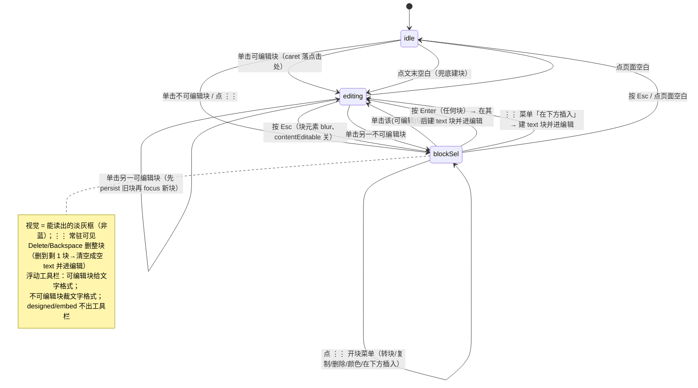

# feat: ui-demo 编辑区精修 —— 单击即编辑 + 删 gutter `+` + Enter 新建块

> **Target surface:** 只动 `ui-demo/`（React 原型），不碰真 Electron app（`src/editor`）。在常驻 worktree `wordspace-next-ui-demo` 上从 main 切短命分支 `feat/ui-demo-notion-editor-refine` 做。
>
> **Note:** 本 plan 已过一轮多角色文档评审（coherence / feasibility / design-lens / scope-guardian），下方 KTD / 单元已吸收其修正（光标落点与 `editingId` effect 冲突、Enter 监听归属、`deleteBlock` 删后态、`⋮⋮` 加「在下方插入」、blockSel 可见性等）。

---

## Summary

对已合进 main（PR #41）的 ui-demo Notion 编辑器做两处 Wendi 反馈的精修，并补上为「不破功能」必须的连带调整：

1. **删掉每块左侧 gutter 的 `+` 插入按钮**（连同 `BlockAddMenu` 及其 state），gutter 只留 `⋮⋮`；插块改走 **段末按 Enter 新建正文块** + `/` 斜杠菜单（选类型）+ `⋮⋮` 菜单的**「在下方插入」**（鼠标在文档中间/不可编辑块后插块的路径）。
2. **去掉单击块的蓝色选中框，改成 Notion「单击即编辑」**：单击可编辑块直接落光标编辑（取消「双击才编辑」），单击不可编辑块给**很淡的灰选中**；块级操作（删/移/转换/改色/插入下方）走 `⋮⋮` 菜单或 Esc 退到块级。
3. **建块兜底**（Colin 拍板加）：点文末空白 / 选中块按 Enter 都能新起一段，杜绝「删着删着打不出字」。

「分块制」只保留在数据/保真层（每块是离散元素、忠实 HTML 存盘、不写 `position`/尺寸 inline 样式）。本 plan **取代 origin 的 R1 / R3 / R9 / R10**（见下）。

---

## Problem Frame

main 上的 ui-demo 编辑器目前是「heyhtml 块即对象」手感：单击块 = 整块被选中并套**蓝框**（`.ws-block-selected`：2px 蓝 ring + 淡蓝底），**双击**才进文字编辑；左 gutter hover 出 `⋮⋮` 和 `+`。Wendi 体验后否掉了两点：① 单击就冒蓝框、像把块当对象抓起来，太「设计工具」不像写文档；② gutter 那个 `+` 多余。Colin 与我确认后定方向：**整体倒向 Notion**——单击即落光标写字，不框选；插块靠 Enter + `/` + `⋮⋮` 菜单，不靠常驻 `+`。

难点不在删按钮、改颜色，而在「单击即编辑」会连锁影响一串交互边界（点不可编辑块怎么办、删了 `+` 还怎么在文档中间插块、Enter 在不同块里语义、中文输入法 Enter 冲突、单击落点会不会被既有 `editingId` effect 顶掉、浮动工具栏会不会闪/污染 designed 块）。这些边界经 `ce-spec-flow-analyzer` 扫过、又经文档评审复核，已在下方 KTD / 单元里逐个定义或显式 defer。

**取代 origin 的需求**（origin 是同一编辑器的上游设计，本 plan 按 Wendi 后续反馈反转其中四条）：
- **R1**（原：单击元素 → 整块选中 + 淡高亮框）→ 改为：单击**可编辑**块 = 直接进文字编辑、无选中框；单击**不可编辑**块 = 淡灰块级选中。
- **R3**（原：双击进文字编辑）→ 改为：单击即编辑，取消双击这一步。
- **R9 的 `＋` 部分**（原：hover 块出现 `＋`）→ 删除 `+`；保留空行占位提示「输入正文，或按 / 插入」。
- **R10 的 `＋` 部分**（原：点 `＋` 弹插入菜单）→ 删除该入口；插块走 Enter（建正文块）+ `/`（选类型）+ `⋮⋮` 菜单的「在下方插入」（文档中间/不可编辑块后）。

origin 其余约束**保留不变**：faithful-save（不写定位/尺寸样式）、分块制做数据层、不做自由画布/缩放（R5）、不做 present、不做 comment、AI 仍是 stub。

---

## Requirements

本 plan 自有需求（PR# = plan-local，非 origin R 号）：

- **PR-1（删 `+`）** 移除每块 gutter 的 `+` 按钮与 `BlockAddMenu`；gutter 仅余 `⋮⋮`（拖拽重排 + 块操作菜单）。不残留 dead state / dead import。
- **PR-2（Enter 段末新建块）** 在**可编辑**块**末尾**按 Enter → 在其后新建空 `text` 块并把光标移到新块开头；Shift+Enter = 块内软换行（原生）；`list` 块内 Enter 放行给原生（新建 `<li>`）；光标在块**中间**按 Enter = 原生换行（**本期不分裂**）。
- **PR-3（去蓝框 + 单击即编辑）** 删 `.ws-block-selected` 的蓝色视觉；单击可编辑块 = 进编辑、光标落**点击位置**；取消「双击才编辑」。光标落点不能被既有 `editingId` effect 顶到块末（见 KTD-2）。
- **PR-4（不可编辑块淡灰选中）** 单击 `divider`/`image`/`embed`/`designed` 块 = 块级灰选中（可删/移/插下方/⋮⋮），不进编辑；灰框要**足够能读出「选中了」**（明显弱于原蓝框、但不能弱到像 hover）；blockSel 态下 `⋮⋮` **常驻可见**（不靠二次 hover），保证有可发现的抓手。**designed 块绝不被置为 `contentEditable`**（会污染 AI 生成的 inline-style HTML）。
- **PR-5（Esc 状态机）** 三态：编辑中 → Esc → 块级灰选中 → Esc → 取消选中。灰选中态下 Delete/Backspace 删整块、`⋮⋮` 开菜单、浮动工具栏浮在块上方。灰选中**可编辑**块再单击该块 → 进编辑。
- **PR-6（建块兜底）** ① 点文档最后一块下方的空白区 → 在文末新建 `text` 块并进编辑；② 灰选中某块时按 Enter → 在其后新建 `text` 块并进编辑；③ 删块防护：删到只剩一块时，把它清空成空 `text` 块并**进编辑**（光标就位），而非留死状态（在 Canvas 调用点判定，不改 store 契约，见 KTD-7）。
- **PR-7（IME 安全）** 中文/日文输入法组词中（`event.isComposing` 或 `keyCode === 229`）的 Enter **不触发**新建块，交还原生「确认候选词」。
- **PR-8（浮动工具栏不闪 / 不污染）** 单击落光标（collapsed selection）时工具栏正确隐藏、不闪现；工具栏「块选中」分支只在灰选中态出现；对不可编辑块**裁掉文字格式按钮**（B/I/U/S/代码/颜色/链接），只留块级动作；对 `designed`/`embed` 块**整条工具栏不出**（其操作只走 `⋮⋮`）；`execOnBlock` 永不作用于 `designed`/`embed` 块。
- **PR-9（`⋮⋮` 加「在下方插入」）** `⋮⋮` 块操作菜单（现 `BlockActionMenu`：转块/复制/删除/颜色）新增**「在下方插入」**项 → 在该块后插入一个 `text` 块并进编辑。这是删 `+` 后、文档**中间**或**不可编辑块之后**唯一的鼠标插块路径（中间-Enter 分裂本期不做）。

**成功标准（验收门）**：`cd ui-demo && npx vite build` 通过（无类型/打包错误；项目无 `tsc` 门，沿用纯 vite build）+ Colin 在 localhost 按下方 Verification 场景目测通过 + faithful-save 不破（存盘 HTML 不含 `.ws-block-controls` 等 UI DOM、不含 `position`/尺寸 inline 样式）。ui-demo 无测试框架（`package.json` 仅 dev/build/preview），故验收为**手动可视场景 + build**，不引入自动化测试框架（避免给原型过度加码）。

---

## Key Technical Decisions

**KTD-1 不引入 mode 枚举，保留 `selectedId` + `editingId` 两态量，但语义收紧 + 原子设置。**
派生约定：`editing = editingId != null`；`block-selected(灰) = selectedId != null && editingId == null`；`idle = 两者皆 null`。`editBlock` 已在同一 handler 里同时 `setSelectedId + setEditingId`（同一 React 批次落、无中间帧），单击可编辑块直接走 `editBlock` 即可避免「selectedId 已置、editingId 未置」那一帧导致的工具栏闪现——**故不需要重构成显式状态机**（符合「改交互别顺手大重构」与全局偏好）。实现者若发现 guard 变复杂可再抽 `mode`，但默认不抽。

**KTD-2 光标落点用「意图 ref」分流，并改写既有 `editingId` effect（评审挖出的硬陷阱）。**
现状陷阱：`useEffect(() => { if (editingId) focusBlock(editingId) }, [editingId])`（Canvas.tsx:434-436）在每次 `editingId` 变化时跑 `focusBlock`，而 `focusBlock` 写死把 caret `collapse(false)` 落到块**末尾**。单击即编辑会 set `editingId` → 这个 effect 必触发 → **把光标顶到块末，盖掉「落点击位置」**，正是 PR-3 要避免的 bug。
**修法**：引入一个 `pendingCaret` ref（值域 `'point' | 'start' | 'end'`，单击设 `'point'` 并存下点击坐标 / Enter 与兜底建块设 `'start'` / `⋮⋮·Esc 进编辑设 `'end'`）。把 `editingId` effect 改成读 `pendingCaret` 决定落点：`'point'` → `document.caretRangeFromPoint(x,y)`（Chrome/Safari/Edge；不可用则回退到块末，**不强制 Firefox 支持**——demo 主用 Chrome，`caretPositionFromPoint` 仅在确需 Firefox 时再补）；`'start'` → 落块首；`'end'` → 沿用 `focusBlock`。所有落点操作仍走 `requestAnimationFrame` 后再动 selection（沿用现有节奏，避免和 `focused.current`/innerHTML 同步打架）。**U2 必须改这个 effect**，否则单击落点无效。

**KTD-3 Enter 处理放在「单一 document 级 keydown」里，按块类型判定（评审挖出的归属冲突）。**
不要把新建块 Enter 挂在块级 `onKeyDown`、把斜杠 Enter 留在 document 级——两条未协调的 Enter 监听会重复处理 / 顺序不定。**统一放进现有 document keydown effect**（Canvas.tsx:516 那个，已含 `if (slash) return` 守卫），「当前块」由 `editingId` + `blockEls` map 取，不需要块级上下文。Enter 分支判定顺序（任一不满足即放行原生）：① `e.isComposing || e.keyCode===229` → return（KTD-4，IME）；② slash 菜单开 → 交给斜杠分支；③ `e.shiftKey` → 原生软换行；④ 当前块是 `list` → 原生（让 `<ul>` 自建 `<li>`）；⑤ `isCaretAtBlockEnd` 为 false（光标在中间）→ 原生换行（本期不分裂，PR-2）；⑥ 满足「可编辑块 + 末尾 + 非 list + 非组词」→ `preventDefault` + `addBlock(text)` + caret 落新块开头；⑦ `selectedId && !editingId`（灰选中态）→ `preventDefault` + `addBlock(after selectedId,'text')` + 进编辑（PR-6②，此分支由 U4 落，U3 先把判定骨架和 `editing` 分支搭好并预留此位）。
「caret 在块末尾」用 **Range 比较**（caret 之后无任何非空白文本），不用 `textContent.length`（块内有 `<b>`/`<code>`/`<a>` 时长度判定会误判）。判定抽成 **`Canvas.tsx` 内的 module-scope 纯函数 `isCaretAtBlockEnd(el)`**（不新建 `src/lib/caret.ts`——目前单一消费者、又无测试框架，过早抽文件无收益）。`heading`/`quote`/`callout` 末尾 Enter → 新块类型写死 `text`。

**KTD-4 IME 组词 Enter 必须放行。** 见 KTD-3 第①步：单一 document keydown 的 Enter 分支第一行就判 `e.isComposing || e.keyCode===229` → return。这是面向 Wendi（中文）演示的硬约束。同时复核：现有斜杠菜单的 `/` 触发与菜单内 Enter（Canvas.tsx:516-538）也走这同一个 document keydown，IME 守卫一处生效、不会双触发。

**KTD-5 沿用 `execCommand`，不重写命令层。** 现有 bold/createLink/foreColor/`__code__`/delete/styleWithCSS 全保留。`execCommand` 虽 deprecated，团队本轮明确「知情接受、重写另议」。本 plan 范围限交互手势，不动命令层。

**KTD-6 faithful-save 走「流式保真」口径。** 存盘 `el.innerHTML` 必须干净：不含 `.ws-block-controls`（已 `contentEditable={false}` 包裹、本就不在可编辑元素 innerHTML 里，实现时复核）、不写任何 `position`/尺寸样式。⚠ 别被画布版 F01「写定位也算保真」的新口径带偏——那是真 app、与 ui-demo 反向（见 memory `f01-canvas-pivot`）。

**KTD-7 删块防护放调用点、不改 store 契约（评审：缩小数据层改动面）。** 不在 `store.deleteBlock` 里加「最后一块特判」（会改所有 caller 的契约、又无测试兜底）。改在 Canvas 的两个删除调用点（document keydown 的 Delete/Backspace 分支、`BlockActionMenu` 的 onDelete）前判：若 `doc.blocks.length === 1` → 不调 `deleteBlock` 而是 `updateBlockHtml(空)` + `setBlockType(text)` + `editBlock`（光标就位）；否则正常 `deleteBlock` + `deselect`。`store` 保持不变。

---

## High-Level Technical Design

新交互状态机（取代旧的「单击=蓝框选中 / 双击=编辑」）：

caret 落点三分流（KTD-2，由 `pendingCaret` ref 驱动同一个 `editingId` effect）：单击→点击位置；Enter/兜底建块/插入下方→新块开头；⋮⋮·Esc 进编辑→末尾。

---

## Implementation Units

### U1. 删 gutter `+`、清理 BlockAddMenu、`⋮⋮` 菜单加「在下方插入」

**Goal:** 移除 `+` 插入入口及其全部连带 state / 组件 / 样式；gutter 只留 `⋮⋮`；给 `⋮⋮` 的 `BlockActionMenu` 加「在下方插入」项，补回文档中间的鼠标插块路径。
**Requirements:** PR-1, PR-9。
**Dependencies:** 无（可独立先合）。
**Files:**
- `ui-demo/src/components/Canvas.tsx`（删 `Plus` import、`.ws-block-add` span、`BlockAddMenu` import/render、`addMenuFor` state、`onToggleAdd`/`onPickAdd`/`handleAdd`、`BlockRow` 的 `addOpen`/`onToggleAdd`/`onPickAdd` props；给 `BlockActionMenu` 的 onInsertBelow 接 `addBlock(after id,'text')`+`editBlock`）
- 删除 `ui-demo/src/components/canvas/BlockAddMenu.tsx`
- `ui-demo/src/components/canvas/BlockActionMenu.tsx`（新增「在下方插入」菜单项 + `onInsertBelow` prop）
- `ui-demo/src/components/Canvas.css`（删 `.ws-block-add` 及其 hover 样式；`.ws-block-grip`/`.ws-block-controls` 保留）
**Approach:** 纯删除 + 一处菜单新增。`handleAdd` 的「插入后文本类进编辑、divider/image 进灰选中」语义迁移到 U4 兜底与本单元的 onInsertBelow（统一为 text→editBlock）。grip 的 draggable/onClick 不动。
**Patterns to follow:** 现有 `BlockActionMenu` 的菜单项结构、`handleAdd`。
**Test scenarios（手动）:** ① hover 任一块 → 左侧只出现 `⋮⋮`、无 `+`。② 点 `⋮⋮` → 菜单含「在下方插入」，点它在该块下方新起正文段并进编辑。③ 在两段之间、或一条分隔线后用 `⋮⋮`「在下方插入」能插段。④ `npx vite build` 干净、无 `BlockAddMenu`/`addMenuFor` unused 报错。⑤ `⋮⋮` 拖拽重排仍正常。
**Verification:** gutter 无 `+`；`⋮⋮` 菜单能在任意（含不可编辑）块后插段；build 干净；拖拽不回归。

### U2. 单击即编辑（去蓝改灰、光标落点）+ 不可编辑块灰选中 + 工具栏裁剪 + designed 保护

**Goal:** 把「单击=蓝框选中、双击=编辑」改为「单击可编辑块=落光标编辑、单击不可编辑块=能读出的淡灰选中」，去蓝，光标落点击处且不被 effect 顶掉，保护 designed 块，按块可编辑性裁剪工具栏。
**Requirements:** PR-3, PR-4, PR-8。
**Dependencies:** 无（与 U1 可并；同改 Canvas.tsx/css，建议顺序合避免冲突）。
**Files:**
- `ui-demo/src/components/Canvas.tsx`（`BlockRow.onClick` 按 `isEditable` 分流：可编辑→`editBlock`+设 `pendingCaret='point'`+存坐标；不可编辑→`selectBlock`。移除 `onDoubleClick`→edit。**改写 `useEffect([editingId])`：读 `pendingCaret` 决定落点**，见 KTD-2，新增 `pendingCaret` ref 与 caret-at-point helper。`execOnBlock`/`applyCmd` 对 `designed`/`embed` 直接 return。给 `FormatToolbar` 传「目标块可编辑性 / 是否 designed」以裁剪/隐藏）
- `ui-demo/src/components/Canvas.css`（`.ws-block-selected:not(.ws-block-editing)` 蓝 ring+淡蓝底 → **能读出的淡灰**：如 `box-shadow 0 0 0 1.5px rgba(0,0,0,0.18)` + 极淡灰底，目标是「明显是选中、但弱于原蓝」；blockSel 态下 `.ws-block-controls` 常驻可见，不靠 hover）
- `ui-demo/src/components/canvas/FormatToolbar.tsx`（按传入的可编辑性：不可编辑块隐藏 B/I/U/S/代码/颜色/链接，只留块级动作；`designed`/`embed` 块直接不渲染工具栏）
**Approach:** caret-at-point 用 `document.caretRangeFromPoint(clientX,clientY)`（能力检测，缺失回退块末）；落点统一经 `editingId` effect + `pendingCaret` + `rAF`（KTD-2）。**多块切换**：从 A 编辑中单击 B，A 的 onBlur→`handleBlur`→persist 先于 B focus；复核 `setNode` 的 `!focused.current` 守卫不会用旧 html 盖掉 A。designed：`isEditable` 已 false，确保任何路径都不 `setAttribute('contenteditable','true')`。blockSel 的 `⋮⋮` 常驻：blockSel 时给块加一个 class 让 controls `opacity:1`。
**Patterns to follow:** 现有 `editBlock`（同设 selected+editing）、`focusBlock`（focus+createRange+collapse+addRange 的 rAF 写法）、`isEditable`、`EDITABLE`。
**Test scenarios（手动）:**
- Covers AE1 取代项：单击正文段落 → **立即出现文字光标可打字**，无蓝框、无灰框。
- 单击一句话中间某字 → 光标落在**点击的那个位置**（不是段末）；再次确认不会被顶到末尾。
- 单击分隔线 / 图片 / AI designed 块 → 出现**能看出来的淡灰框** + `⋮⋮` 常驻，不进编辑；按 Delete 能删它。
- 选中 designed 块 → **不弹工具栏**；选中 divider 等不可编辑块 → 工具栏**无**加粗/颜色等文字按钮。
- AI designed 块用任何方式都**不变可编辑**、其 inline-style HTML 不被改写。
- 从一段编辑中直接单击另一段 → 前一段已输入内容不丢（已 persist）、光标进入新段点击处。
**Verification:** 蓝框消失；可编辑块单击即写、光标落点准且不被顶尾；不可编辑块淡灰可读、可删、`⋮⋮` 常驻；designed 块永不可编辑、不被工具栏污染。

### U3. Enter 段末新建块（单一 document keydown）+ Esc 三态 + list/IME/中间-Enter

**Goal:** 在单一 document keydown 里实现 Notion 段末 Enter 建块、Shift+Enter 软换行、list 放行、IME 安全、中间 Enter 走原生；并把 Esc 调成「编辑→灰选中→取消」三态；灰选中可编辑块再单击进编辑。
**Requirements:** PR-2, PR-5, PR-7, PR-8（不闪部分）。
**Dependencies:** U2（依赖单击即编辑后的 editing 态语义与 `pendingCaret`）。
**Files:**
- `ui-demo/src/components/Canvas.tsx`（在**现有 document keydown effect**（~line 516）里加 Enter 分支，顺序见 KTD-3；新增 module-scope 纯函数 `isCaretAtBlockEnd(el)`；调整 Esc handler：`editingId` → 退灰选中（`setEditingId(null)` 保留 `selectedId`、块 blur）、否则 `selectedId` → `deselect`；blockSel 可编辑块再单击 → 若已是 `selectedId` 且可编辑则 `editBlock`（在 U2 的 onClick 分流里落，本单元确保不被 `selectBlock` 的 `cur===id?cur:null` 挡住升级））
**Approach:** 见 KTD-3 的七步判定（IME→slash→Shift→list→中间→末尾建块→灰选中建块骨架）。Enter 建块走 `addBlock(text)` + `pendingCaret='start'`。Esc 两段切换。**不**新建 `src/lib/caret.ts`，`isCaretAtBlockEnd` 就近放 Canvas（KTD-3）。第⑦步「灰选中 Enter 建块」的判定位在本单元搭好、实际 `addBlock` 行为在 U4 接（PR-6②），避免 U3/U4 对同一分支的归属含糊。
**Patterns to follow:** 现有 document keydown effect（Esc/Delete/Backspace、`if (slash) return`、斜杠菜单 keydown 的 `isComposing` 风格——若现状无则在此补）。
**Test scenarios（手动）:**
- 正文段**末尾** Enter → 下面新空段、光标在新段开头。
- 正文段**中间** Enter → 同段内换行（不分裂）。
- Shift+Enter → 段内软换行。
- **列表**块里 Enter → 新建列表项（不跳出去建正文）。
- 标题块末尾 Enter → 新段是**正文**。
- 中文输入法打字、敲 Enter **确认候选词** → 文字正常落、**不**新建段落。
- 编辑中 Esc → 退到该块**淡灰选中**（可 Delete）；再 Esc → 取消选中。
- 灰选中一个可编辑段，单击它 → 进编辑。
**Verification:** Enter 按块类型行为正确；中文可正常输入；Esc 三态可达；灰选中可编辑块单击能进编辑。

### U4. 建块兜底（文末续写 + 灰选中 Enter）+ 删块防护（调用点）

**Goal:** 删 `+` 后保证任何情况下都能新建块：点文末空白续写、灰选中块 Enter 在其后插段、删到剩一块时不进死状态。
**Requirements:** PR-6。
**Dependencies:** U2（灰选中态）、U3（Enter 七步骨架、`pendingCaret='start'`）。
**Files:**
- `ui-demo/src/components/Canvas.tsx`（`ws-canvas-scroll.onClick`：区分「点末块底边以下空白」→ `addBlock(末尾,'text')`+`editBlock` vs「点真空白」→ `deselect`；接上 U3 第⑦步：`selectedId && !editingId && !slash` 的 Enter → `addBlock(after selectedId,'text')`+`editBlock`；两个删除调用点（Delete/Backspace 分支、`BlockActionMenu.onDelete`）按 KTD-7 加「剩一块则清空成空 text 并进编辑」的调用点判定）
- **不改** `ui-demo/src/mock/store.ts`（KTD-7：删块防护放调用点，不动 store 契约）
**Approach:** 文末捕获优先用「在 `.ws-blocks` 末尾渲染一个 `flex:1` 透明捕获区接 onClick」（比纯坐标判定稳，且该捕获区不进存盘、不破 faithful-save）；坐标判定为备选。灰选中 Enter 接 U3 document keydown 第⑦步。删块防护：调用点先判 `doc.blocks.length===1`。
**Patterns to follow:** 现有 `handleAdd`（addBlock 后文本类 editBlock）、`addBlock`/`deleteBlock`/`updateBlockHtml`/`setBlockType` 签名。
**Test scenarios（手动）:**
- 文末是**分隔线**，点其**下方**空白 → 新起正文段、光标就位、可打字。
- 灰选中一条分隔线按 Enter → 在它**下面**新建正文段并进编辑。
- 把块逐个删到只剩一个再删它 → 文档**不空白死**，留一个空正文段**且光标就位**可继续写。
- 点文档**中部**两块之间的真空白 → 仅取消选中，不误建块。
**Verification:** 任何状态（含全不可编辑块 / 删到底）下都有路新建可编辑块且光标就位；点真空白仅取消选中。

---

## Scope Boundaries

**本期明确不做（Colin 拍板 defer，写成已知缺口）：**
- **块中间 Enter 分裂段落**（split）：本期中间 Enter = 原生换行。文档中间插块改由 `⋮⋮`「在下方插入」（PR-9）覆盖鼠标路径。
- **空段开头 Backspace 合并/删上一块**：本期不做；删块走 `⋮⋮` 菜单 / 灰选中按 Delete。
- **list 内「连续空 `<li>` 退出列表转正文」**：不做，list 内 Enter 一律原生。

**沿用 origin 的非目标（不变）：**
- 画布式自由定位 / 拽角缩放 / 间距读数手柄（元素留文档流，origin R5 / AE5）。
- present / 演示 / 阅读模式；comment 评论；真 AI（仍 stub「开发中」）；真导出后端（demo mock）。
- 只动 ui-demo（React 原型），不写真 app（`src/editor`）。

**Deferred to Follow-Up Work（本仓后续，非本 PR）：**
- 给 ui-demo 引 vitest 并把 `isCaretAtBlockEnd` 等纯逻辑配单测——本期不引（无测试框架）。
- 用 `/ce-compound` 沉淀本仓第一条「React + contentEditable 受控/光标」教训（见 Risks R-A）。
- Esc→块级灰选中是键盘隐式手势，无视觉引导；本期靠 Colin 当面给 Wendi 演示带一句，正式产品再考虑状态栏微提示。

---

## Risks & Dependencies

- **R-A（光标跳动 / React 受控冲突，最高风险）。** `Canvas.tsx:100-126` 的 `focused.current` + 「未聚焦才同步 `innerHTML`」是防「每次 store 更新 re-render 时无条件写 innerHTML → 打字时 DOM 被重置、光标跳开头」的守卫。本仓**无** React+contentEditable 沉淀（learnings 扫描确认），这套写法 undocumented。新增的三种 caret 落点（point/start/end，经 `pendingCaret` + `rAF`）、改写 `editingId` effect、切块 persist 全是时序敏感。**缓解**：落点统一走 `pendingCaret` ref + `rAF`（KTD-2）；切块靠 onBlur persist 先于 focus；改完逐条手测光标位置（「代理断言≠真验证」重灾区，必须真点真打字，尤其中文）。
- **R-B（`editingId` effect 顶掉单击落点）。** 见 KTD-2，已列为 U2 必改项 + 测试场景。
- **R-C（Enter 监听归属 / 双触发）。** 见 KTD-3/KTD-4，统一进单一 document keydown。
- **R-D（list Enter 劫持 / IME 劫持）。** 见 KTD-3 第④步、KTD-4。
- **R-E（designed 块被污染）。** execOnBlock / contentEditable / 工具栏任何路径都把 `designed`/`embed` 挡外（U2）。
- **R-F（工具栏闪现）。** 单击落 collapsed caret 时 `computeRect` 两分支都不命中（①要非 collapsed、②要 `!editingId`）；KTD-1 原子设置避免中间帧。手测「单击不冒工具栏」。
- **依赖**：store 现有 `addBlock`/`deleteBlock`/`setBlockType`/`duplicateBlock`/`reorderBlocks`/`updateBlockHtml`（本 plan **不改 store**，KTD-7）。
- **合并面**：U2/U3/U4 都改 `Canvas.tsx` 邻近区域（onClick / document keydown / state）。按单元顺序逐个 commit（Colin 强调「做完一小块就 commit」）；同分支顺序做、避免并行改同文件。

---

## System-Wide Impact

仅限 ui-demo 编辑区组件（`Canvas.tsx`/`Canvas.css`/`canvas/BlockActionMenu.tsx`/`canvas/FormatToolbar.tsx`，删 `canvas/BlockAddMenu.tsx`；**不改 store**）。不影响 Wendi 的 Arc 侧栏、TopActions、DocMenu。CI 对 ui-demo-only 改动跳过 Electron test/e2e（commit `7892772`），PR 轻、可频繁合。落地：worktree `wordspace-next-ui-demo` 从 main 切 `feat/ui-demo-notion-editor-refine`，**每个 U 单元独立 commit**，做完合 main、删分支；合后 Vercel 预览自动更新给 Wendi（待 Colin 接通 Git，见 memory `ui-demo-dev-workflow`）。

---

## Open Questions（Deferred to Implementation）

- 文末「续写捕获区」：优先透明捕获块（稳、且不进存盘），坐标判定备选——实现时择定。
- 灰选中态的最终灰度/描边微调（在 U2 给的 `rgba(0,0,0,0.18)` 起点上调）：原则「明显是选中、弱于原蓝、不像 hover」；若 Colin/Wendi 想先看一眼再定，可在首版交付后微调（不阻塞实现）。
- `⋮⋮`「在下方插入」插入的默认块类型固定为 `text`（与 Enter 一致）；若将来要「插入时选类型」再说。

---

## Sources / Research

- **Origin 需求文档**：`docs/brainstorms/2026-06-17-ui-demo-editor-notion-ux-requirements.md`（本 plan 取代其 R1/R3/R9/R10，余者沿用）。
- **交互边界分析**（`ce-spec-flow-analyzer`）：单击不可编辑块、Enter 分块类型语义、list/IME 劫持、Esc 三态、建块真空洞、工具栏闪现、切块 persist 顺序——已逐条吸收。
- **文档评审**（coherence / feasibility / design-lens / scope-guardian，2026-06-17）：吸收了「`editingId` effect 顶掉单击落点」「Enter 监听归属冲突」「`deleteBlock` 删后态 + 改调用点而非 store」「`⋮⋮` 加在下方插入补中间插块洞」「blockSel 的 `⋮⋮` 常驻 + 灰要可读」「designed 块工具栏整条不出」「`isCaretAtBlockEnd` 不抽文件」「Firefox 不强制」等修正。
- **过往经验**（`ce-learnings-researcher`）：本仓 React+contentEditable 无沉淀（R-A）；faithful-save 流式口径 + 白名单序列化 + 未操作不变式（KTD-6）；execCommand 知情接受不重写（KTD-5）；ui-demo 短命分支 + 逐单元 commit + 轻验证。
- **当前实现**：`ui-demo/src/components/Canvas.tsx`（交互内核）、`canvas/FormatToolbar.tsx`、`canvas/BlockActionMenu.tsx`、`mock/store.ts`、`types.ts`。
