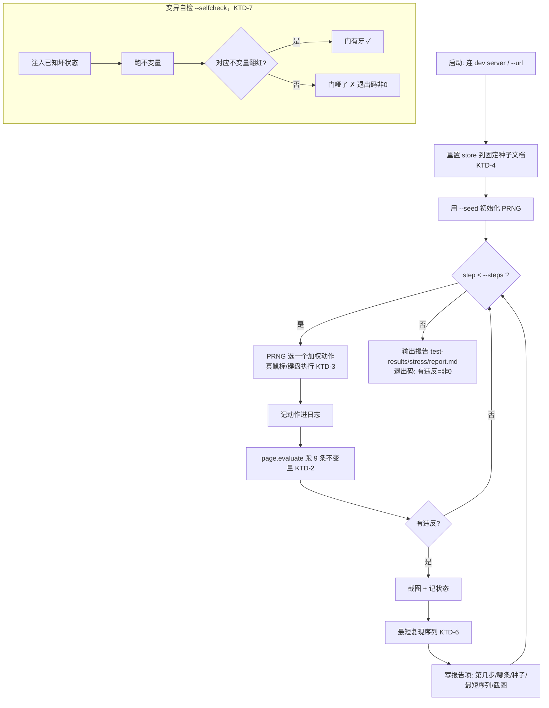

# feat: ui-demo 编辑器「不变量 + 猴子压测」自动找-bug harness (v1)

> **Target worktree:** `wordspace-next-ui-demo`（当前 main）。落地从 main 切短命分支 `feat/ui-demo-stress-harness`。所有路径 repo-relative，实现全部落在 `ui-demo/` 内。

---

## Summary

给 ui-demo 编辑器建一个**确定性、固定种子、纯代码（无 LLM）**的压测 harness：用 Playwright 真鼠标/键盘随机加权地狂操作编辑器，**每步动作后断言一组永真不变量**，任一违反就带**种子 + 最短复现序列**报出来。专抓"build 绿、手测漏、用户一上手就坏"的机械/交互 bug（卡死、editingId↔焦点 desync、faithful-save 破、对齐、崩）。带**变异自检**证明门有牙。按需 `npm run` 跑为主，CI 友好但不当硬门。persona AI 判官层是 v2，不在本 plan（见 origin Scope）。

---

## Problem Frame

见 origin `docs/brainstorms/2026-06-17-ui-demo-editor-stress-harness-requirements.md`。本 session 反复出现客观规则被破坏、却没被 build/单测/手测挡住的 bug：单击落点被 `editingId` effect 顶到块末、编辑态多余灰底、空块 Enter 刷一堆删不掉的空行、方向键不跨块、gutter 没对齐、React `editingId` 与 DOM 焦点 desync。这些是"对/错分明"的机械问题，适合用硬不变量自动抓。harness 把"我本 session 用 Playwright MCP 手动量不变量复现 bug"的过程正式化、自动化、可复现。

---

## Requirements（trace to origin）

- **R1 驱动真 ui-demo（web）+ 每次跑前重置固定种子文档**（避开 mock store 的 persist 脏状态）。(origin R1)
- **R2 随机加权动作驱动器**，覆盖编辑器现有交互；用 Playwright **真鼠标/键盘**（走真实命中测试，不用合成事件）。(origin R2)
- **R3 每步后断言 9 条不变量**（见下 KTD-2 / U3）。(origin R3 + 不变量清单)
- **R4 固定种子可复现 + 动作日志 + 违反时最短复现序列**。(origin R4)
- **R5 人话报告**（第几步 / 哪条不变量 / 状态 + 截图 / 复现种子），给 Colin/Wendi 看。(origin R5)
- **R6 变异自检**：故意打断一条不变量 → harness 必报红，否则警告"门哑了"。(origin R6)
- **R7 运行方式**：一条命令本地/agent 触发为主；CI-ready（退出码 + 报告）但起步不当硬合并门。(origin R7)
- **R8 不替代现有检查**：是 ui-demo 的机械交互不变量补充层。(origin R8)

---

## Key Technical Decisions

**KTD-1 纯 Playwright 驱动脚本，不套 `@playwright/test` 运行器。** fuzz 循环 + 每步断言 + 最短复现 + 变异自检是自定义编排，不天然是离散测试用例；纯脚本更贴（也对齐 parallel session 的 `scripts/acceptance-audit/capture.js`）。用 `playwright` 包 + Chromium，ESM `.mjs` 脚本（ui-demo 是 vite/ESM）。本 session 已实证这套对 ui-demo 可行。

**KTD-2 不变量靠 `page.evaluate` 读 DOM/computed-style 判，确定性、无 LLM。** 9 条初版（origin）：① 无未捕获 JS 错 / `console.error`（`page.on('console'|'pageerror')` 监听）；② 块数不莫名归零、删到底留空正文块；③ 无孤儿/重复 `data-block` id、type 合法；④ **`editingId`↔DOM 焦点同步**（`.ws-block-editing` 所在块 == `document.activeElement` 的 `data-block`——本 session 实测可行）；⑤ 光标永远在真实可编辑块里；⑥ 空块可删、不堆删不掉的空行；⑦ **faithful-save**：每块存盘 `innerHTML` 不含 `.ws-block-controls` 等 UI DOM、不含 `position`/`left`/`top`/`width:px` 等定位尺寸样式；⑧ gutter `⋮⋮` 与所属块首行对齐（computed 偏差≤阈值，复用本 session 的量法）；⑨ designed/embed 块永不 `contentEditable=true`。每条 = 一个返回 `{id, ok, detail}` 的纯函数，便于单独加/禁用。

**KTD-3 用 Playwright 真鼠标/键盘走真实命中测试，绝不用 `dispatchEvent` 合成事件。** 合成事件在容器元素上 `e.target` 是容器不是子节点（ul/li），会误判（parallel session + 本 session 都踩过）。点块用 `page.mouse.click(x,y)` 命中真实坐标；打字/方向键用 `page.keyboard`。

**KTD-4 每次跑前确定性重置 store 到固定种子文档。** mock store 的 persist 会跨 reload 留脏 doc（本 session 实测）。harness 启动时清掉 persist（`localStorage` 或 store 的 reset 入口）+ 载入一个固定的多类型块种子文档（含 heading/text/list/quote/callout/divider/image/designed，覆盖各分支），保证同种子 → 同初态 → 可复现。具体清除入口实现时定（见 Open Questions）。

**KTD-5 PRNG 由 CLI `--seed` 注入，全程只用它取随机。** 不用 `Math.random()`。同 `--seed` + 同 `--steps` → 完全相同的动作序列 → 可复现。动作日志记 `{seed, steps:[{action, args}]}`。

**KTD-6 违反时做"前缀重放式"最短复现（delta-debug 轻量版）。** 记下到违反的完整动作序列后，尝试删动作/二分前缀、用同种子初态重放，找仍能触发同一不变量违反的最短序列，写进报告。初版可先只给完整序列 + 种子，最短化作为该单元的增强（见 U4）。

**KTD-7 变异自检 = 独立模式，注入已知坏状态，断言对应不变量必翻红。** 例：`--selfcheck` 模式下用 `page.evaluate` 强行制造"两个块同 id"或"删光所有块"或"designed 块被设 contentEditable"，断言不变量 ③/②/⑨ 报红；任一该红不红 → 退出码非 0 + 报告"门哑了"。证明门有牙、不是哑门。

**KTD-8 假设 dev server 已在跑（localhost），harness 连它；不自己拉起 vite。** 与本 session 一致（dev server 常驻 5180）。也支持 `--url` 指向 Vercel 预览。launch Chromium headless 默认、`--headed` 可视调试。

---

## High-Level Technical Design

harness 主循环（每步：执行动作 → 断言全部不变量 → 违反则停下取证+最短化）：



---

## Output Structure

```
ui-demo/
  stress/
    run.mjs          # 入口: 解析 CLI、连 server、跑主循环 / selfcheck，出报告
    setup.mjs        # 连 server + KTD-4 重置 store 到固定种子文档
    rng.mjs          # 种子 PRNG（KTD-5）
    actions.mjs      # 加权动作集 + 真鼠标/键盘执行（KTD-3）
    invariants.mjs   # 9 条不变量（KTD-2），各返回 {id, ok, detail}
    minimize.mjs     # 最短复现序列（KTD-6）
    report.mjs       # 人话报告 + 截图（R5）
    selfcheck.mjs    # 变异自检（KTD-7）
    fixtures.mjs     # 本 session bug 的回归动作序列（U5）
    README.md        # 不变量清单 / 怎么跑 / 怎么加新不变量
  package.json       # + playwright devDep + scripts: stress / stress:selfcheck
```
（结构是范围声明，实现时可微调；各单元 Files 为准。）

---

## Implementation Units

### U1. 装 Playwright + harness 脚手架 + 固定种子重置

**Goal:** 给 ui-demo 装 Playwright（devDep），搭 `ui-demo/stress/` 骨架，实现"连 dev server + 重置 store 到固定种子文档"。
**Requirements:** R1, KTD-4, KTD-8。
**Dependencies:** 无。
**Files:** `ui-demo/package.json`（+ `playwright` devDep；+ scripts `stress`、`stress:selfcheck`）、`ui-demo/stress/setup.mjs`、`ui-demo/stress/run.mjs`（先只跑通"连 server→重置→截一张图"骨架）、`ui-demo/stress/README.md`（占位）。
**Approach:** `setup.mjs` 用 `playwright` 启 Chromium、`page.goto(--url ?? localhost:5180)`、清 persist（localStorage 或调 store reset；实现时定入口，见 Open Questions）、注入固定种子文档（含各类型块）。固定种子文档建议放一个常量 JSON / 调用 store 的 seed 入口。**装 Playwright 注意**：本仓容器有 `ELECTRON_SKIP_BINARY_DOWNLOAD` 类的下载坑（见 CLAUDE.md），Playwright 的 chromium 下载在宿主跑没问题、容器内可能要处理；本 harness 定位宿主/agent 跑，按宿主装。
**Patterns to follow:** 共享 worktree `scripts/acceptance-audit/capture.js`（纯 Playwright 驱动 + 取证的结构）；本 session 用 Playwright MCP 连 5180 的做法。
**Test scenarios（手动/自验）:** ① `npm run stress` 能连上 dev server、重置到固定种子文档（块数/类型确定）、截图存 `test-results/stress/`。② 重复跑两次，初态完全一致（persist 不串扰）。③ dev server 没起时报清楚的错。
**Verification:** 一条命令能确定性把编辑器带到固定初态并取证；重复可复现。

### U2. 种子 PRNG + 加权动作驱动器

**Goal:** 实现 `--seed` 驱动的加权随机动作序列，用真鼠标/键盘执行，记动作日志。
**Requirements:** R2, R4, KTD-3, KTD-5。
**Dependencies:** U1。
**Files:** `ui-demo/stress/rng.mjs`、`ui-demo/stress/actions.mjs`，接进 `ui-demo/stress/run.mjs`。
**Approach:** `rng.mjs` = 种子 PRNG（如 mulberry32），全程只用它。`actions.mjs` = 加权动作表：打字 / Enter / Shift+Enter / Backspace(块首 & 块中) / ↑↓←→ / 单击随机块(可编辑&不可编辑，`page.mouse.click` 命中真实坐标) / 斜杠插每类型 / `⋮⋮` 菜单各项(转块/复制/删除/颜色/在下方插入) / 拖拽重排 / 文末续写。每个动作执行后返回可序列化描述进日志 `{seed, steps:[...]}`. 权重可配（常量）。
**Patterns to follow:** `Canvas.tsx` 的交互入口（哪些块可编辑、`⋮⋮` 菜单项、斜杠项）确保动作打在真实可点目标上。
**Test scenarios（手动/自验）:** ① 同 `--seed --steps` 跑两次，动作日志逐条相同。② 动作真的改了文档（块数/内容随步数变化）。③ 单击不可编辑块、拖拽等不抛未捕获错（被 U3 不变量①兜，但这里先肉眼确认动作本身能执行）。④ 真鼠标点击命中的是子元素不是容器（KTD-3，避免命中假象）。
**Verification:** 给定种子产出确定的、真实执行的编辑序列，带可复现日志。

### U3. 9 条不变量断言（每步后跑）

**Goal:** 实现 origin 的 9 条不变量，每步动作后通过 `page.evaluate` 跑，违反返回结构化结果。
**Requirements:** R3, KTD-2。
**Dependencies:** U1（拿到页面）；与 U2 接（每步后调）。
**Files:** `ui-demo/stress/invariants.mjs`，接进 `run.mjs` 主循环。
**Approach:** 每条不变量 = 纯函数 `(page) => {id, ok, detail}`（多数体内是一段 `page.evaluate` 读 DOM/computed-style）。逐条对应 KTD-2 的 ①–⑨。重点几条的判法：④ `editingId↔焦点` = `.ws-block-editing [data-block]` 的 id === `document.activeElement` 的 `data-block`（本 session 实测）；⑦ faithful-save = 取每块持久化 `innerHTML`（从 store 或 contentEditable 元素读，实现时定）断言不含 `ws-block-controls`、不含 `position|left|top|width:\d+px` 等；⑧ gutter 对齐 = 复用本 session 的「⋮⋮ 中心 vs 块首行中心」computed 偏差 ≤ 阈值（如 ±3px）。console/pageerror 监听在 setup 挂、供 ①。
**Patterns to follow:** 本 session 我用 `page.evaluate` 量 editingId↔焦点、gutter 偏差、存盘 HTML 的具体写法（见会话记录），直接搬。
**Test scenarios（手动/自验）:** ① 干净初态下 9 条全 ok。② 人为制造各违反（如 evaluate 设两块同 id / 给块写 `style="left:10px"`），对应不变量翻红、其余不误报。③ 不变量本身不抛错（取不到元素时返回 ok 或明确 detail，不 crash 主循环）。④ 每条 detail 是人话（够写进报告）。
**Verification:** 9 条都能在真违反时报红、在干净态不误报，结果结构化可入报告。

### U4. 违反取证 + 报告 + 最短复现序列

**Goal:** 违反时截图+记状态、写人话报告；并把触发序列最短化成可复现的最小步骤。
**Requirements:** R4, R5, KTD-6。
**Dependencies:** U2, U3。
**Files:** `ui-demo/stress/report.mjs`、`ui-demo/stress/minimize.mjs`，接进 `run.mjs`。
**Approach:** 违反时：`page.screenshot` 存 `test-results/stress/<seed>-<step>.png`、记当时不变量 detail + 动作前缀。`minimize.mjs`：用同种子初态、二分/逐个删动作重放，找仍触发同一不变量 id 的最短序列。`report.mjs` 出 `test-results/stress/report.md`：每个 finding = 不变量 / 第几步 / 最短复现序列 / 种子 / 截图链接 / 人话说明；末尾汇总。有违反 → 进程退出码非 0（R7 CI-ready）。
**Approach 备注:** 初版可先输出"完整序列 + 种子"，最短化作为本单元的增强；若最短化时间预算紧，记一个 TODO 而非阻塞。
**Test scenarios（手动/自验）:** ① 注入一个必然违反（如禁用 Backspace 删块后猛敲空块），报告含可复现种子 + 序列 + 截图。② 拿报告里的种子+序列重放，能稳定重现同一违反。③ 最短化后的序列确实更短且仍触发。④ 无违反时报告写"全过"、退出码 0。
**Verification:** 任一违反都产出可复现（带种子+最短序列+截图）的人话报告项；退出码反映有无违反。

### U5. 变异自检 + 本 session bug 回归 fixtures

**Goal:** 实现 `--selfcheck`（注入已知坏状态、断言对应不变量必翻红）；并把本 session 这批 bug 写成回归动作序列。
**Requirements:** R6（变异自检）+ 成功标准（本 session bug 当回归基准）。
**Dependencies:** U3, U4。
**Files:** `ui-demo/stress/selfcheck.mjs`、`ui-demo/stress/fixtures.mjs`，接进 `run.mjs`（`--selfcheck` 分支）。
**Approach:** `selfcheck.mjs`：逐个注入坏状态（两块同 id→③、删光块→②、designed 块设 contentEditable→⑨、给块写定位 inline 样式→⑦），断言对应不变量翻红；任一该红不红 → 退出码非 0 + 报告"门哑了（某不变量失效）"。`fixtures.mjs`：把本 session 的 bug 复现序列写死（空块连 Enter 再 Backspace 删不掉 / 单击块中部光标应落点击处不顶尾 / 编辑态块背景应透明 / gutter 对齐 / 单击 designed 块不可编辑）——这些 bug **现已修**，所以 fixtures 在当前代码上应**全过**；它们的价值是回归网（未来谁改坏了会被对应不变量抓）。
**Approach 备注:** fixture 用确定的脚本化动作（非随机），断言跑完后 9 条不变量全 ok（证明修复仍在）。
**Test scenarios（手动/自验）:** ① `npm run stress:selfcheck` 在当前（正确）代码上：每个注入的坏状态都被对应不变量抓红 → 自检通过（退出码 0）。② 临时把某条不变量改成永远 ok（模拟哑门），自检该项失败、退出码非 0、报告点名。③ fixtures 在当前代码全过；手动把某修复改回坏（如还原"编辑态灰底"CSS），对应 fixture/不变量翻红。
**Verification:** 变异自检能证明每条不变量有牙；本 session bug 的回归 fixtures 在当前代码全绿、坏了能红。

### U6. CLI / 运行方式 / README（+ 可选 CI 咨询）

**Goal:** 收口 CLI（seed/steps/url/headed/selfcheck）、`npm run` 脚本、README（不变量清单 + 怎么跑 + 怎么加新不变量）；CI 留为可选咨询、不当硬门。
**Requirements:** R7, R8。
**Dependencies:** U1–U5。
**Files:** `ui-demo/stress/run.mjs`（CLI 收口）、`ui-demo/stress/README.md`、`ui-demo/package.json`（scripts）。
**Approach:** CLI：`--seed`（默认随机一个并打印，便于复现）、`--steps`、`--url`、`--headed`、`--selfcheck`、`--runs N`（跑多个 seed）。README 写：9 条不变量是什么、`npm run stress -- --seed 123 --steps 500`、变异自检怎么跑、怎么加一条不变量（加到 invariants.mjs + 在 selfcheck 配一个对应坏状态）。**CI**：本 plan 不加硬门；README 记一段"如何在 CI 跑成咨询报告（非阻塞）"，实际接 CI 留后续（origin R7：起步按需）。
**Test scenarios（手动/自验）:** ① 各 CLI flag 生效（--seed 复现、--headed 可视、--selfcheck 走自检分支）。② README 照着跑能跑通。③ 不打印任何"假绿"——有违反时退出码非 0、报告如实。
**Verification:** 一条命令可跑（含复现/自检模式）；README 让 Colin/下个 agent 能独立跑 + 加不变量；无 CI 硬门。

---

## Scope Boundaries

**本 plan 不做：**
- **persona AI 判官层（v2）**：LLM/VLM 模拟真人判 make-sense + 对抗验证。整层 deferred（见 origin Scope）。
- **自动修复**：只出报告，人决定修不修。
- **非编辑区**（侧栏 / 文件管理 / TopActions）——只压编辑器。
- **真 Electron App**：parallel session 的 `scripts/acceptance-audit/` 管；本 harness 借哲学不共享代码。

**Deferred to Follow-Up Work：**
- 把 harness 接进 CI 当咨询报告（非阻塞）——起步按需手动跑，稳定后再说。
- 最短复现的更强 delta-debug（若 U4 初版只给完整序列）。
- v2 persona 判官层（单独 brainstorm/plan）。

---

## Risks & Dependencies

- **R-A（依赖）Playwright chromium 下载**：本仓容器防火墙有下载坑（CLAUDE.md 记过 Electron 二进制下不来）。本 harness 定位**宿主/agent 跑**，按宿主装 Playwright；不强求容器内可跑。
- **R-B store 重置入口未知**：KTD-4 依赖一个确定性"清 persist + 载种子文档"的入口。`mock/store.ts` 是否有 reset/seed 入口、persist 存哪（localStorage key）需实现时确认；没有就加一个测试用 reset 入口或直接清 localStorage + reload。列为 Open Question。
- **R-C 不变量①（无 JS 错）需早挂监听**：`page.on('pageerror'|'console')` 必须在 `goto` 前挂，否则漏早期错。
- **R-D 真鼠标命中坐标受滚动/布局影响**：点块要先 `scrollIntoView` 或用元素 bounding box 实时取坐标，别用陈旧坐标（本 session 踩过焦点/坐标时序）。
- **R-E contentEditable 时序**：editingId↔焦点同步有 rAF 延迟；不变量检查在动作后要等一个 microtask/rAF 再读（否则读到中间帧误报）。实现时在每步后加一个小 settle（`await page.waitForTimeout(0)` 或等 rAF）。
- **依赖**：dev server 在跑（或 `--url` 指 Vercel 预览）；被测代码 = `ui-demo/src/components/Canvas.tsx` 等（harness 只读不改）。

---

## Open Questions（Deferred to Implementation）

- store 的确定性重置入口：清 `localStorage`（哪个 key）+ reload，还是给 `mock/store.ts` 加一个测试用 `resetToSeed()`？实现时看 store 现状定。
- 固定种子文档放哪：harness 内常量 JSON，还是复用 store 的 seed？
- gutter 对齐阈值（±3px?）、各动作权重、默认 `--steps`——实现时调，先给保守默认。
- faithful-save 不变量取"存盘 HTML"的来源：从 store 读各块 html，还是从 contentEditable `innerHTML` 读？

---

## Sources / Research

- **Origin**：`docs/brainstorms/2026-06-17-ui-demo-editor-stress-harness-requirements.md`（R1-R8 + 9 不变量 + 决策全在此）。
- **借鉴（不共享代码）**：共享 worktree `scripts/acceptance-audit/`（capture.js/scenarios.js/README）+ `docs/plans/2026-06-17-003-acceptance-audit-tool-plan.md` + `docs/brainstorms/2026-06-17-agent-acceptance-audit-requirements.md`——drive/取证/变异自检/报告 的结构与哲学。
- **被测代码**：`ui-demo/src/components/Canvas.tsx`（交互内核）、`ui-demo/src/components/canvas/*`、`ui-demo/src/mock/store.ts`、`ui-demo/src/types.ts`。
- **本 session 实证**：用 Playwright MCP 连 localhost:5180 量 editingId↔焦点、gutter 偏差、存盘 HTML、跨块方向键、Backspace 删空块——证明不变量都可用 `page.evaluate` 确定性判，且真鼠标/键盘可驱动。
