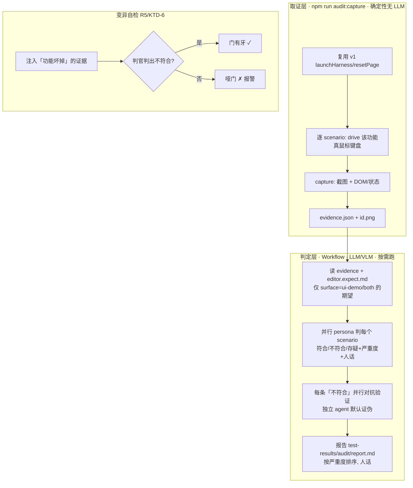

# feat: ui-demo 编辑器 persona AI 判官层 acceptance-audit (v2 · MVP)

> **Target worktree:** `wordspace-next-ui-demo`（当前 main）。落地从 main 切短命分支 `feat/ui-demo-audit-v2`。实现落在 `ui-demo/audit/`（与 v1 的 `ui-demo/stress/` 并列）。
>
> v1（确定性「不变量+猴子压测」层，已上 main）抓**机械/交互 bug**；v2 是**第二层 persona AI 判官**，抓**主观 UX gap**——「功能对用户 make 不 make sense」。两层互补（见 origin）。

---

## Summary

给 ui-demo 编辑器加 persona AI 判官层（照 App 版 `scripts/acceptance-audit/` 适配）：**脚本化逐功能驱动** → 截图 + DOM 取证 → persona agent 按**人写期望**判 make-sense → 对抗验证压误报 → 变异自检防哑门 → 人话报告。期望用**产品层、人写、跨 surface 共享、由 ui-demo 主导 seed** 的 `specs/acceptance/editor.expect.md`（ui-demo 与真 app 共一份产品期望；契约从 ui-demo 流向 app）。v2 **MVP 先覆盖几个高价值功能**跑通整条链、证明有效，再逐步加。**只报告、人决定修不修**（不自动修）。

---

## Problem Frame

v1 抓「客观规则破坏」（卡死/desync/对齐），但抓不到「不报错、DOM 合法、但用户一上手就懵」的 UX gap——典型如 App 版踩到的「插入『图片』给个写死灰占位、没途径换真图」。这种没有硬规则能表达，必须**从真人视角判**。v2 = 可重复、agent 驱动、按人写期望判 make-sense 的验收审计，把这类问题在 Colin/Wendi 之前抓出来。

照 App 版 `acceptance-audit`（drive→capture→persona judge→adversarial verify→mutation self-check→report）适配到 ui-demo：surface 从 Electron 换成 React web（Playwright 直打 localhost/Vercel，复用 v1 的 launch/reset，比 Electron 省事）。

---

## Requirements

- **R1 脚本化逐功能驱动 + 取证。** 每个 MVP 功能一段脚本：`drive(page)`（真鼠标/键盘做该功能）+ capture（截图 + 关键 DOM/状态）。复用 v1 `ui-demo/stress/setup.mjs` 的 launch/resetPage。
- **R2 期望 = 共享产品层 `specs/acceptance/editor.expect.md`。** 人写、可证伪、CODEOWNERS 锁（裁判≠运动员，判官不许改弱）。每条期望标注适用 surface（`ui-demo` / `app` / `both`），v2 只判标了 `ui-demo`/`both` 的。
- **R3 persona 判定。** persona agent（资深生产力工具用户 + 挑剔 UX 设计师）拿「截图 + DOM + 该功能期望」判 **符合/不符合/存疑** + 严重度 + 复现 + 人话。截图给 VLM 看（make-sense 离不开视觉）。
- **R4 对抗验证。** 每条「不符合」派独立 agent 尝试**证伪**，默认存疑→不入册，压误报。
- **R5 变异自检。** 故意弄坏一个被覆盖的功能（如让「插入图片」啥也不产出），判官**必须判它不符合**；判不出 = 哑门 = 报警。
- **R6 人话报告。** 功能 / 期望 / 实际 / 符合度 / 严重度 / 截图，按严重度排序，给非工程的 Wendi 也能看。
- **R7 取证可独立确定性跑（无 LLM）。** `npm run audit:capture` 只 drive+截图+DOM、不判（CI 友好）；判官层（LLM）另起、按需跑。
- **R8 不替代 v1 / 现有检查；不自动修。** 是「期望级」补充层，只出报告。

---

## Key Technical Decisions

**KTD-1 取证（确定性）/ 判定（LLM）两段分离，照 App 版。** `npm run audit:capture`（纯 Playwright，drive 每个 scenario + 存截图/DOM 到 `test-results/audit/{evidence.json,<id>.png}`，可 CI、可复现）；判定层是一个 **Workflow**（读 evidence + 期望 → persona 判 + 对抗验证 + 变异自检 + 报告），按需跑、贵（~10-25 万 token）。

**KTD-2 复用 v1 基础设施，不重写 drive/launch。** `ui-demo/audit/` 复用 `ui-demo/stress/setup.mjs` 的 `launchHarness`/`resetPage`（每 scenario 干净复位，避 persist 脏状态）。scenarios 用 v1 同款真鼠标/键盘 + waitForSelector + 双 rAF settle（别合成事件）。

**KTD-3 期望文件 ui-demo 主导、产品层共享、按 surface 标注。** 用 repo 级 `specs/acceptance/editor.expect.md`（产品层期望，ui-demo 与真 app 共一份）。**这份契约由 ui-demo 主导 seed**（2026-06-18 与 Colin 定：ui-demo 的概念/设计领先于真 app，契约从 ui-demo 流向 app，不是反过来）——v2 直接在 main 上 seed 出人写、CODEOWNERS 锁的 canonical 文件，每条期望加 `surface: ui-demo|app|both` 标注；v2 只判适用 ui-demo 的。App 版 `scripts/acceptance-audit/` 后续**消费同一份**（由 Colin 给 parallel session 发协调 dispatch，见 R-A）。

**KTD-4 判定层用 Workflow 编排。** pipeline：`capture（串行取证，已由 npm run 产出 evidence）→ 每个 scenario 并行 persona 判 → 每条「不符合」并行派对抗验证 → 汇总报告`。persona 判用能读图的模型（VLM）；对抗验证独立 agent、prompt 设成「默认证伪、不确定即驳回」。

**KTD-5 MVP 功能集（先覆盖、跑通整链）。** 取几个高价值、易出 make-sense 问题的：① 插入各块类型（每种插完「能编辑/有明确用途」）② 转块（转完内容/语义对）③ AI 入口（Ask AI / `/ai` → 「开发中」提示、不改文档）④ 导出入口（`···` 菜单导出 → demo mock 行为合理）⑤ 单击即编辑手感（点了能写、光标落点击处）。具体清单实现时按 expect.md 已有条目对齐。

**KTD-6 变异自检注入「功能坏掉」而非「状态坏掉」。** 与 v1 不同：v1 注入坏 DOM 状态测不变量；v2 要测**判官能否判出功能失效**——如 monkeypatch 让「插入图片」scenario 后页面无变化，判官应判「不符合（插了没反应）」。注入点在 capture 层（产出一份「坏证据」喂判官）。

---

## High-Level Technical Design

---

## Implementation Units

### U1. audit 脚手架 + 复用 v1 setup + MVP scenarios + `audit:capture`

**Goal:** 搭 `ui-demo/audit/`，复用 v1 的 launch/reset，写 MVP 功能的 scenario（drive+capture），`npm run audit:capture` 确定性产出证据包。
**Requirements:** R1, R7, KTD-1, KTD-2, KTD-5。
**Dependencies:** v1 的 `ui-demo/stress/setup.mjs`（已在 main）。
**Files:** `ui-demo/audit/scenarios.mjs`（MVP 各功能 `{id, label, surface, async drive(page), async capture(page)}`）、`ui-demo/audit/capture.mjs`（跑所有 scenario：resetPage→drive→截图+DOM→写 evidence）、`ui-demo/package.json`（script `audit:capture`）。
**Approach:** 每 scenario 前 `resetPage` 干净复位。drive 用真鼠标/键盘（借 v1 `actions.mjs` 的命中/等待写法）。capture 存 `test-results/audit/<id>.png` + DOM 快照（块结构/可编辑性/可见控件）进 `evidence.json`。无 LLM、可复现、可 CI。
**Patterns to follow:** App 版 `scripts/acceptance-audit/{capture.js,scenarios.js}`（结构照搬，surface 换 web）；v1 `ui-demo/stress/{setup,actions}.mjs`。
**Test scenarios（手动/自验）:** ① `npm run audit:capture` 跑通、每个 MVP scenario 出截图 + evidence 条目。② 重复跑证据稳定（resetPage 生效）。③ drive 真打到目标（如「插入图片」后 evidence 里确有 image 块）。
**Verification:** 一条命令确定性产出 MVP 各功能的截图+DOM 证据包。

### U2. 共享期望文件接入（surface 标注）

**Goal:** ui-demo 在 main 上 seed 出 canonical `specs/acceptance/editor.expect.md`（产品层、人写、CODEOWNERS 锁），按 `surface` 标注筛出 ui-demo 适用项，scenario↔期望映射。
**Requirements:** R2, KTD-3。
**Dependencies:** U1。（不再依赖 parallel session——expect.md 由本单元主导 seed，见 R-A。）
**Files:** `specs/acceptance/editor.expect.md`（本单元在 main 上新建 / seed 出 MVP 功能的 canonical 产品期望，含 `surface:` 标注；ui-demo 主导、app 后续消费）、`ui-demo/audit/expectations.mjs`（解析 expect.md、按 surface + scenario id 取适用期望）、`.github/CODEOWNERS`（锁 expect.md，确保实现 AI 不改弱——人写冻结，实现 AI 只读）。
**Approach:** 期望条目格式：`id`（对应 scenario）+ `surface`（ui-demo/app/both）+ 可证伪的「用户该能……」+ severity。v2 判定只喂 surface∈{ui-demo,both} 的。**裁判≠运动员**：expect.md 人写冻结，本 plan 的实现单元只读不改其判定内容。
**Patterns to follow:** App 版 `specs/acceptance/editor.expect.md` + 仓里 `.va.json` + CODEOWNERS 的「人写锁定」约定。
**Test scenarios（手动/自验）:** ① 解析 expect.md 能按 scenario id + surface 正确取出适用期望。② surface=app 的期望不喂给 ui-demo 判定。③ expect.md 缺某 scenario 期望时，判定标「无硬期望、走 AI 推断」而非崩。
**Verification:** v2 拿到的每个 scenario 都带「适用 ui-demo 的人写期望」（或明确标无）。

### U3. 判定层 Workflow：persona 判 + 对抗验证 + 报告

**Goal:** 一个 Workflow 读 evidence + 期望，persona 判每个 scenario make-sense，对每条「不符合」对抗验证，出人话报告。
**Requirements:** R3, R4, R6, KTD-4。
**Dependencies:** U1（evidence）、U2（期望）。
**Files:** `ui-demo/audit/judge.workflow.md`（或 `.claude/workflows/ui-demo-audit.js`，按本仓 Workflow 约定）— 定义 pipeline：读 evidence → 并行 persona 判（VLM 读截图 + DOM + 期望 → 符合/不符合/存疑 + 严重度 + 复现 + 人话）→ 每条不符合并行对抗验证（独立 agent 默认证伪）→ 汇总 `test-results/audit/report.md`。
**Approach:** persona = 「资深生产力工具用户 + 挑剔 UX 设计师」，prompt 喂截图（VLM）+ DOM 摘要 + 该 scenario 的人写期望，要求按期望判、给可证伪结论。对抗验证 agent 独立、prompt「尽力证伪这条不符合，不确定就驳回」，多数驳回则降级为存疑。报告按严重度排序、人话、含截图引用。
**Patterns to follow:** App 版 `.claude/workflows/acceptance-audit.js` 的 judge+verify 编排；Workflow 工具的 parallel/pipeline + 对抗验证 quality pattern。
**Test scenarios（手动/自验）:** ① 对一个**已知有问题**的功能（如故意留个 make-sense gap），判官判「不符合」+ 人话说清。② 对正常功能判「符合」。③ 对抗验证能把一条勉强的「不符合」驳回成存疑。④ 报告 Wendi 能读懂。
**Verification:** Workflow 跑完出一份人话、按严重度排序、误报受控（经对抗验证）的 findings 报告。

### U4. 变异自检 + 报告收口

**Goal:** 变异自检——注入「功能坏掉」的证据，判官必须判不符合；否则报「哑门」。
**Requirements:** R5, KTD-6。
**Dependencies:** U1, U3。
**Files:** `ui-demo/audit/capture.mjs`（加 `--mutate <scenarioId>` 模式：对指定功能注入「坏掉」——如 drive 后强行还原页面/清空效果，产出坏证据）、判定 Workflow 加变异自检校验段。
**Approach:** 选 1-2 个 MVP 功能做变异（如「插入图片」mutate 成「插完页面无变化」、「Ask AI」mutate 成「点了直接改文档」），跑判定，断言判官对这些判「不符合」。判不出 → 报告标「判官对该功能哑了」。证明判官有牙（沿用 v1/CLAUDE.md 变异自检哲学，但测的是「判官能否判出功能失效」而非「不变量能否抓状态」）。
**Test scenarios（手动/自验）:** ① mutate「插入图片」→ 判官判不符合。② mutate「Ask AI 改了文档」→ 判官判不符合（违反「点了不改文档」期望）。③ 不 mutate 时判官判符合（不误报哑门）。
**Verification:** 变异自检能证明判官对被覆盖功能有牙。

### U5. 命令 / README / 与 parallel session 协调记录

**Goal:** 收口运行入口（capture 命令 + judge Workflow 怎么触发）、README、把「共享 expect.md 协调」写清。
**Requirements:** R6, R8。
**Dependencies:** U1-U4。
**Files:** `ui-demo/audit/README.md`（怎么 capture、怎么跑判定 Workflow、怎么加新功能审计、期望怎么写、与 App 版分工）、`ui-demo/package.json`（scripts）。
**Approach:** README 写清两段（capture 确定性 / judge 按需贵）、MVP 覆盖了哪些功能、加新功能审计的三步（scenarios 加一条 + expect.md 写期望 + 跑）。定位：里程碑/发版前按需跑、不进必过 CI（probabilistic 判定不卡红绿）；只报告不自动修。
**Test scenarios（手动/自验）:** ① 照 README 能独立跑 capture + judge。② 加一个新功能审计的流程清楚。
**Verification:** 文档让 Colin/下个 agent 能独立跑 v2 + 加新功能；协调点写明。

---

## Scope Boundaries

**v2 MVP 不做：**
- 全功能覆盖（先 MVP 几个高价值功能；逐步加）。
- 自动修复（只报告）。
- 进必过 CI 硬门（probabilistic 判定做咨询；只有 capture 层确定性、可 CI）。
- 非编辑区（侧栏/文件管理）。
- 真 Electron app（App 版 `scripts/acceptance-audit/` 管；v2 只管 ui-demo）。

**Deferred to Follow-Up Work：**
- MVP 之后逐步扩到全功能期望覆盖。
- 把 capture 层接 CI 当咨询报告。

---

## Risks & Dependencies

- **R-A（已决：ui-demo 主导契约）共享 `specs/acceptance/editor.expect.md`**：2026-06-18 与 Colin 定——这份产品层契约**由 ui-demo 主导 seed**（理由：ui-demo 的概念/设计领先于真 app，契约该从 ui-demo 流向 app，而非 ui-demo 去继承 app 那份）。**做法**：v2 的 U2 直接在 main 上 seed 出 canonical（含 `surface` 标注、CODEOWNERS 锁、人写冻结），**不再等 parallel session**；App 版 `scripts/acceptance-audit/` 改成**消费同一份**。**待办（Colin，非本 plan 实现项）**：给 parallel session 发 dispatch，说明 expect.md 由 ui-demo 主导、app audit 向这份契约看齐，避免两边各写一份分叉。此协调**不阻塞 v2 落地**（v2 自己 seed 即可推进）。
- **R-B LLM 判定不确定/有成本**：persona 判是 probabilistic。靠 R4 对抗验证压误报、R7 capture 确定性兜底、报告制（不卡红绿）。一次判定 ~10-25 万 token，里程碑跑、非高频。
- **R-C 合成事件命中假象 / capture 时序**：drive 用真鼠标键盘 + waitForSelector + 双 rAF settle（复用 v1 教训，别合成事件）。
- **R-D 与 parallel session 重复造轮子**：v2 借 App 版结构、复用 v1 setup，不重写；expect.md 共享。分工：App 版管 Electron、v2 管 ui-demo。

---

## Open Questions（Deferred to Implementation）

- 判定/对抗验证用哪档模型（VLM 看图 vs 文本 agent 看 DOM 的分工）。
- ~~expect.md 落 main 的方式（等 parallel session / v2 seed）~~ **已决（2026-06-18）：ui-demo 主导、U2 直接在 main seed canonical，见 R-A / KTD-3。** 剩协调项（通知 parallel session 改成消费）由 Colin 发 dispatch，不阻塞 v2。
- MVP 功能最终清单（按 expect.md 已有条目对齐）。
- 判定 Workflow 放 `.claude/workflows/` 还是 `ui-demo/audit/` 内、怎么触发（命令 vs Workflow 工具）。

---

## Sources / Research

- **Origin**：`docs/brainstorms/2026-06-17-ui-demo-editor-stress-harness-requirements.md`（v2 = deferred 第二层，本 plan 实现它的 MVP）。
- **模板（借结构/哲学，适配 ui-demo）**：App 版 `scripts/acceptance-audit/`（capture.js/scenarios.js/README）+ `specs/acceptance/editor.expect.md` + `.claude/workflows/acceptance-audit.js` + `docs/brainstorms/2026-06-17-agent-acceptance-audit-requirements.md` + `docs/plans/2026-06-17-003-acceptance-audit-tool-plan.md`（在共享 worktree）。
- **复用基础设施**：v1 `ui-demo/stress/{setup,actions}.mjs`（launch/reset/真鼠标键盘/settle，已在 main）。
- **被测代码**：`ui-demo/src/components/Canvas.tsx` 等。
