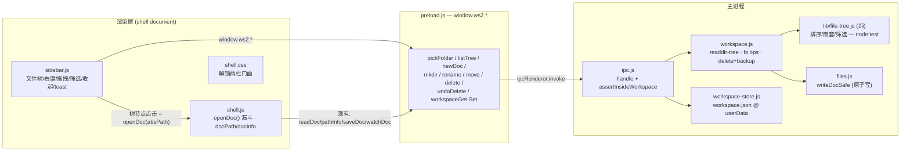

# feat: 本地文件侧栏 / 文件夹工作区落进 Wordspace app

把 ui-demo 已经打磨好的「本地文件侧栏」落进真实的 Electron app（`src/**`）：指向一个本地文件夹当工作区、以文件树浏览、对真实硬盘文件做开/新建/改名/移动/删除/建子文件夹。UI/UX 以 ui-demo 当前该区域为参考标准。

---

## Summary

app 现在一次只能打开一个本地 `.html` 文件（弹窗选），有「最近打开」列表，但没有工作区 / 文件树概念。本计划新增「打开文件夹 → 左侧文件树 → 点开编辑 + 真实文件操作」这一整套，对齐 ui-demo 的 `ArcSidebar` 交互与外观。

关键事实（来自代码研究）：app 的 `shell.css` 里**早就预留了两栏门面**（左文件栏 + 右编辑区），还带一个 `.sidebar-lock` 占位和「单栏铺满」的折叠——所以这个功能本质是**解锁并接上现有门面 + 补齐主进程的真实文件能力**,不是从零搭。`openDoc(absPath)` 已是单一漏斗（脏检查 / 校验 / 载入 iframe / watch / recents 全在里面），树节点点击就是 `() => openDoc(node.absPath)`，接入成本极低。

严格只做本地：ui-demo 里的 Wordspace 云盘 / 团队空间 / 空间切换器那一支**不带进来**。

---

## Problem Frame

- **现状**：`src/renderer/shell.js` 的 `pickAndOpen()` → `window.ws2.pickFile()`（`openFile` 对话框，仅 `.html/.htm`）→ `openDoc(path)`。一次一个文件；左栏是 CSS 门面 + `.sidebar-lock`，被「单栏铺满」收掉。
- **目标**：让 app 能「指向一个文件夹过日子」——左栏文件树常驻，点开任意 `.html` 进编辑器，并能在硬盘上真建/改名/移动/删除/建子文件夹。
- **参考**：`ui-demo/src/components/ArcSidebar.tsx`（连接文件夹那一支）+ `ui-demo/src/mock/store.ts`（文件操作语义）+ `ui-demo/src/lib/tree.ts`（`buildFileTree`：文件夹优先 + 拼音/数字序）。ui-demo 是 in-memory mock；app 要换成真实 `fs`。
- **canonical spec**：`specs/F06-local-file-management.md`（done-bar：指向一个有 `.html` + 子文件夹的文件夹 → 列出来 → 点开 → 新建一篇 → 硬盘真出现 → 改名 → 硬盘也跟着改）。

---

## Requirements

追溯到 F06 spec 与已确认的范围决定。

| ID | 需求 | 来源 |
|----|------|------|
| R1 | 选一个本地文件夹当工作区（系统目录选择器） | F06「选文件夹当工作区」 |
| R2 | 左侧栏把文件夹内容渲染成嵌套文件树（文件夹 + 文件） | F06「文件树」 |
| R3 | 点 `.html` 文件 → 在现有编辑器打开（复用 `openDoc`） | F06「点开」 |
| R4 | 新建文档（带模板选择台）落进指定文件夹 → 硬盘真出现 `.html` | F06「新建」+ 用户决定③（模板带进来） |
| R5 | 新建子文件夹 → 硬盘真建目录 | F06「建子文件夹」 |
| R6 | 文件 / 文件夹改名 → 硬盘真改名 | F06「改名」 |
| R7 | 拖拽移动文件到别的文件夹 → 真实 `fs.rename` | F06「移动」 |
| R8 | 删除文件 / 文件夹,带「撤销」(app 内临时备份恢复) + 可叠加丢系统废纸篓 | F06「删除」+ 用户决定② |
| R9 | 所有操作都是真实硬盘操作、断网可用 | F06「硬盘真建/改/移动」 |
| R10 | **保留**现有单文件打开 + 最近打开,与文件夹工作区并存 | 用户决定① |
| R11 | 记住上次的工作区文件夹,重启后自动恢复 | 编辑器级体感（对齐 ui-demo 持久化） |
| R12 | 该区域的交互/外观尽量对齐 ui-demo（筛选、文件夹优先排序、右键菜单、hover「+」、收起态、删除撤销 toast 等） | 用户约束（ui-demo 为参考标准） |

**非功能 / 安全红线**（贯穿所有单元，非单独需求）：
- **路径越权防护**：每个文件操作必须 resolve 到工作区根目录之下（`path.resolve(root, rel)` + `startsWith(root + sep)`），不能 `../` 逃逸。`assertHtmlPath`（`src/main/ipc.js`）只放行 `.html`,**不能复用**给目录/树操作。
- **保真红线**：文件操作只在「字节」层（`fs.rename` / `fs.rm` / `fs.mkdir` / `writeDocSafe`）。**绝不**把移动/改名的文件过一遍编辑器序列化器(`src/editor/serialize.js`),否则可能泄漏 WS2 marker 或规整用户 HTML。
- **CSP**：shell 文档 CSP 无 `unsafe-inline`,侧栏样式一律进 `src/renderer/shell.css`(外链),不用 inline `<style>` / `style="..."`；图标用 inline `<svg>`(允许)。

---

## Key Technical Decisions

**KTD1 — 分层：纯逻辑 / 主进程 fs / 渲染层 UI 三段分开。**
- 文件树构造（扁平 dirent → 排序嵌套树、文件夹优先、locale-numeric 排序、按类型筛选）是纯逻辑 → `src/lib/file-tree.js`（无 `require('electron')`），`node:test` 直接单测。镜像 `ui-demo/src/lib/tree.ts buildFileTree`。
- 真实 fs（递归 readdir、mkdir、rename、delete+backup、create-from-template）→ 新建 `src/main/workspace.js`，`fs/promises`，store 路径作参数传入（照 `src/main/recents.js`,可注 tmpdir 单测）。
- 渲染层 UI（侧栏 DOM、树渲染、右键菜单、拖拽、筛选、收起态、toast）→ 新建 `src/renderer/sidebar.js`（另加一个 `<script>` 到 `index.html`,与 `shell.js` 共享全局作用域,直接调 `openDoc`）+ 样式进 `shell.css`。

**KTD2 — IPC 三步走，新建一套工作区专用守卫。**
新通道全部 `ipcMain.handle`（请求-响应）走 `src/main/ipc.js` → `preload.js` 加一行 `window.ws2.*` 薄包装 → `sidebar.js` 调用。**不复用** `assertHtmlPath`；写 `assertInsideWorkspace(root, p)`,内容读写仍保持 `.html` 限制。把渲染层传来的根目录当不可信输入,每次操作在 main 里重新 confine。

**KTD3 — 删除撤销 = 主进程临时备份 + 可选废纸篓（用户决定②）。**
`delete-path` 在 unlink 前把文件字节(或整棵子树)拷到 `userData` 下的临时备份目录,返回一个 backup token；同时(可选)`shell.trashItem` 丢系统废纸篓。`undo-delete(token)` 从备份还原。**不复用** `src/main/history.js`(那是 per-save 版本归档,不是 per-delete)。备份 token 在 toast 生命周期(约 6.5s)+ 一个兜底 TTL 后清理。

**KTD4 — 单文件打开 + 文件夹工作区并存（用户决定①）。**
`openDoc(absPath)` 漏斗不动。新增的「打开文件夹」只负责渲染树 + 让树节点调 `openDoc`。现有 `pickFile` / 最近打开 / `open-file`(Finder 双击) 全部照常。工作区根 + 当前打开文件是两个正交状态。

**KTD5 — watcher 协调：自操作抑制 + 当前文件被改/删时重指向。**
app 的 `src/main/doc-watcher.js` 是单实例、盯当前文件的父目录。本计划**不引入**整树实时 watcher（避免与 doc-watcher 打架、避免范围膨胀）——文件树在「自己的操作后」直接局部刷新(乐观更新),不靠 fs.watch。但当 rename/move/delete 命中**当前打开的文件**时,必须:① 关闭或重指向 doc-watcher;② 更新 `shell.js` 的 `docPath`/`docInfo`(改名/移动)或清空回首页(删除),否则保存会写到失效路径。

**KTD6 — 非 `.html` 文件:树里显示、灰一点,打开走系统默认程序。**
真实文件夹里有 docx/pdf/png 等。对齐 ui-demo「foreign 文件」的视觉(显示但弱化),但 app 没有 mock 的 hand-off 面板——点非 `.html` 文件 → `shell.openPath`(系统默认程序打开)。只有 `.html/.htm` 走 `openDoc` 进编辑器。

**KTD7 — 模板 = app 内置 HTML 种子（用户决定③，AI 不做）。**
app 当前无模板系统。定义一小撮内置模板(几份 HTML 种子,放 `src/lib/doc-templates.js` 纯数据)。新建弹窗 = 「空文档」(排第一、一键直达) + 内置模板卡,**无 AI**(AI 属云/范围外)。新建 = 把模板 HTML 经 `files.writeDocSafe` 直接落盘到目标文件夹(字节层,不过序列化器)。

**KTD8 — 工作区根持久化 = `workspace.json` under userData。**
照 `src/main/recents.js` 模式写一个 `src/main/workspace-store.js`(或并进 recents),存最后的工作区根 + (可选)展开状态。重启时校验该目录仍存在再恢复。渲染层不自己持久化(sandboxed)。

---

## High-Level Technical Design

数据流：渲染层 shell/sidebar ↔ preload(`window.ws2`) ↔ 主进程(ipc → workspace/file-tree/files)。树节点点击复用现有 `openDoc` 漏斗。



边界状态机（删除当前打开的文件 / 改名当前打开的文件 → 必须同步 `docPath`/watcher，见 KTD5）作为 U6 的核心边界用例处理，不单独画。

---

## Output Structure

新增文件（其余为修改）：

```
src/
  lib/
    file-tree.js          (新) 纯文件树构造 + 路径守卫 helper
    doc-templates.js      (新) 内置模板 HTML 种子
  main/
    workspace.js          (新) 真实 fs 操作 + readdir-tree + delete+backup
    workspace-store.js    (新) workspace.json 持久化 (照 recents.js)
  renderer/
    sidebar.js            (新) 侧栏 UI / 树 / 右键 / 拖拽 / 筛选 / toast
test/
  file-tree.test.js       (新)
  workspace.test.js       (新)
  workspace-store.test.js (新)
e2e/
  workspace.spec.js       (新) F06 done-bar 强断言 e2e
```

修改：`src/main/ipc.js`、`src/renderer/preload.js`、`src/renderer/index.html`、`src/renderer/shell.css`、`src/renderer/shell.js`(暴露 `openDoc` + 当前文件被改/删的同步)、`e2e/app.spec.js`(若需新 test 钩子)。

---

## Implementation Units

### U1. 纯文件树构造 + 路径守卫（lib）

**Goal**：把扁平 dirent 列表 → 排序嵌套树（文件夹优先 + locale-numeric 序，对齐 ui-demo），并提供工作区根约束的路径守卫 helper。纯逻辑,零 Electron 依赖。

**Requirements**：R2、R12；安全红线（路径越权）。

**Dependencies**：无。

**Files**：
- 创建 `src/lib/file-tree.js`
- 创建 `test/file-tree.test.js`

**Approach**：
- `buildFileTree(entries, opts)`：入参是 `{relPath, isDir, kind}` 列表（main 走完磁盘后喂进来）；输出嵌套节点（folders-first、`localeCompare('zh-Hans-CN', {numeric:true})`）。镜像 `ui-demo/src/lib/tree.ts` 的 `buildFileTree` 与 `sortFileNodes`,含空目录节点（用户显式建的空文件夹也要显示——对齐 ui-demo「文件夹是一等公民」）。
- `kindOf(name)`：`.html/.htm` → `'html'`;其余按扩展名归类（image/pdf/word/...）用于图标 + 是否可在编辑器打开。
- `assertInsideWorkspace(root, target)`：`path.resolve` 后断言在 root 之下,否则抛错。`cleanLeafName(raw)`：剥 `/ \\`、trim(防止改名注入目录,对齐 ui-demo `cleanName`)。

**Patterns to follow**：`src/lib/path-url.js`（纯 Node、无 electron）；`ui-demo/src/lib/tree.ts`（树形与排序语义）。

**Test scenarios**（`test/file-tree.test.js`，node:test + assert）：
- 扁平 `a.html, 数据/转化.html, 素材/封面.png` → 嵌套树，文件夹（数据、素材）排在根级文件前，各级内部 folders-first。
- 排序：`说明.html, 落地页.html, 提案.html` → 按拼音 `落 说 提`（`localeCompare` numeric）。
- 空目录（dirs 列表里有但无文件）→ 仍生成可见文件夹节点。
- `kindOf`：`x.HTML`→html、`x.pdf`→pdf、`x.PNG`→image、`x`(无扩展)→other。
- `assertInsideWorkspace('/w', '/w/a/b.html')` 通过；`'/w/../etc/passwd'`、`'/etc/passwd'`、`'/w/../w2/x'` 抛错。
- `cleanLeafName('a/b')`→`'ab'`、`'  x  '`→`'x'`、`'/'`→`''`。
- Covers F06 / done-bar（列出 .html + 子文件夹的结构正确性）。

**Verification**：`npm test` 全绿；树形与排序跟 ui-demo 对照一致；越权路径被拒。

---

### U2. 主进程工作区模块：真实 fs 操作 + readdir-tree + 删除备份（main）

**Goal**：提供工作区的真实文件能力：递归读目录成树、新建文档（模板）、建子文件夹、改名、移动、删除（含临时备份 + 可选废纸篓）、撤销删除。

**Requirements**：R1–R9；安全红线。

**Dependencies**：U1。

**Files**：
- 创建 `src/main/workspace.js`
- 创建 `test/workspace.test.js`
- （新建文档用到）创建 `src/lib/doc-templates.js`（在 U7 充实内容,这里先建空白模板常量即可）

**Approach**：
- `readTree(root)`：递归 `fs.readdir(..., {withFileTypes:true})`,跳过隐藏文件/`node_modules` 类噪音(可配),组装 `{relPath,isDir,kind}` 列表喂 `buildFileTree`。返回树 + 根的展示名。
- `newDoc(root, dirRel, baseName, html)`：算唯一文件名(`<base>.html`、`<base> 2.html`...,对齐 ui-demo `uniqueFileInDir`),`assertInsideWorkspace`,`files.writeDocSafe(abs, html)`(原子写、拒空)。返回新文件 relPath。
- `makeDir(root, dirRel, name)`：唯一目录名 + `fs.mkdir(recursive)`。
- `renamePath(root, relPath, newLeaf)`：`cleanLeafName`,同目录唯一化,`fs.rename`。文件保留扩展名。
- `movePath(root, relPath, destDirRel)`：目标目录内唯一化叶名,`fs.rename`(跨目录即移动)。
- `deletePath(root, relPath)`：先把目标(文件或整棵子树)拷到 `userData/.ws2-trash/<token>/`(保留相对结构),记 token;可选 `shell.trashItem(abs)`;再 `fs.rm(abs, {recursive})`。返回 `{token}`。
- `undoDelete(root, token)`：从备份目录还原回原 relPath(若原位被占,唯一化),清备份。
- 所有写操作前 `assertInsideWorkspace`。

**Patterns to follow**：`src/main/files.js`（`writeDocSafe` 原子 tmp+rename、拒空）；`src/main/recents.js`（纯模块、store/root 作参数,tmpdir 可测）；ui-demo `store.ts` 的 `uniqueFileInDir`/`moveFile`/`deleteFileWithUndo` 语义。

**Test scenarios**（`test/workspace.test.js`,tmpdir mkdtemp）：
- `readTree`：seed `a.html`、`d/b.html`、`d/c.png` → 树含 `d`(folder)、`a.html`,`d` 下 `b.html`+`c.png`。
- `newDoc(root,'',  '无标题', '<html>..')` 两次 → 磁盘出现 `无标题.html` 与 `无标题 2.html`(`fs.stat` 验存在)。
- `newDoc(root,'d','x',html)` → `d/x.html` 真存在。
- `makeDir(root,'','素材')` → 目录存在；重复 → `素材 2`。
- `renamePath` 文件 → 旧名不在、新名在、扩展名保留；改名到已存在兄弟名 → 自动 ` 2`;含 `/` 的输入被剥成同目录改名(不逃逸)。
- `movePath(root,'a.html','d')` → `a.html` 不在根、`d/a.html` 在。
- `deletePath` 文件 → `fs.stat` 抛(已删) + 返回 token;`undoDelete(token)` → 文件回来、内容一致。
- `deletePath` 文件夹(含文件) → 整棵没;`undoDelete` → 整棵回来。
- 越权：`newDoc(root,'../evil',...)` / `renamePath` 到 `../` → 抛错,磁盘无副作用。
- Covers F06 done-bar（新建→硬盘出现、改名→硬盘改名）。

**Verification**：`npm test` 全绿；所有断言对真实 tmpdir 文件系统生效；越权零副作用。

---

### U3. IPC + preload 接线 + 测试钩子（main/preload）

**Goal**：把 U2 能力经现有三步 IPC 模式暴露给渲染层,并加 e2e 绕过原生文件夹选择器的测试钩子。

**Requirements**：R1–R8、R11。

**Dependencies**：U2。

**Files**：
- 修改 `src/main/ipc.js`
- 修改 `src/renderer/preload.js`
- 创建 `src/main/workspace-store.js` + `test/workspace-store.test.js`

**Approach**：
- `ipc.js` 新增 handlers：`pick-folder`(`dialog.showOpenDialog({properties:['openDirectory']})`,带 `WS2_FOLDER_IN` env 钩子绕过对话框,照 `WS2_PDF_OUT` 先例)、`ws-read-tree`、`ws-new-doc`、`ws-make-dir`、`ws-rename`、`ws-move`、`ws-delete`、`ws-undo-delete`、`ws-get-root`/`ws-set-root`。每个委托给 `workspace.js`/`workspace-store.js`,边界做 `assertInsideWorkspace`。
- `preload.js`：`window.ws2` 上加对应薄包装(纯 `ipcRenderer.invoke`,零逻辑、零 project require)。
- `workspace-store.js`：照 `recents.js`,`get(storeFile)`/`set(storeFile, root)`,容错损坏/缺失 JSON 返回默认。`ipc.js` 用 `path.join(app.getPath('userData'),'workspace.json')` 供给。

**Patterns to follow**：`src/main/ipc.js` 现有 `pick-file`/`read-doc`/`recents-*` handler；`src/renderer/preload.js` 现有 `ws2` 桥；`WS2_PDF_OUT` 测试钩子先例;`src/main/recents.js`。

**Test scenarios**：
- `test/workspace-store.test.js`：`set` 后 `get` 回读一致;缺失文件 → 默认(null);损坏 JSON → 默认不抛。
- IPC 层本身的集成放进 U8 的 e2e(直接 `window.ws2.*`)。本单元的 handler 逻辑很薄,主要靠 U2/U8 覆盖。
- Test expectation：handler 薄包装无独立行为分支,核心逻辑在 U2(已测)与 U8 e2e;workspace-store 有独立单测。

**Verification**：`npm test` 含 workspace-store 全绿；手动 `window.ws2.pickFolder()` 在 dev 能开目录对话框;`WS2_FOLDER_IN` 在 e2e 能注入路径。

---

### U4. 解锁两栏门面 + 侧栏挂载（renderer 结构）

**Goal**：把 `shell.css` 里早就预留的左文件栏门面解锁,DOM 挂上 `<aside>` 侧栏容器,布局让编辑区自动让出左列。先出「连接文件夹」入口 + 空树占位,树渲染在 U5。

**Requirements**：R1、R10、R12。

**Dependencies**：U3。

**Files**：
- 修改 `src/renderer/index.html`（加 `<aside id="sidebar">`,加 `<script src="sidebar.js">`,撤掉「单栏铺满」注释/标记）
- 修改 `src/renderer/shell.css`（解锁 `.sidebar-lock` / 「单栏铺满」折叠,补侧栏布局,复用已移植的 ui-demo tokens）
- 修改 `src/renderer/shell.js`（暴露 `openDoc` 给同作用域的 `sidebar.js`;加「打开文件夹」按钮接 `window.ws2.pickFolder`)
- 创建 `src/renderer/sidebar.js`（先放骨架：连接入口 + 容器 + 收起切换）

**Approach**：
- `index.html`：`<aside id="sidebar">` 作 `<body>` 首子（`body` 已是 `display:flex`,`#main` 是 `flex:1 min-width:0`,aside 取固定宽即占左列）。撤掉 `index.html:11` 的「左侧文件管理栏暂不做 → 单栏铺满」与 `.sidebar-lock`。
- `shell.css`：把门面相关注释里的「只抄样式不抄功能」改成真功能；侧栏宽度/背景/边框对齐 ui-demo `.arc-sidebar`(274px、`--c-bg-sunken` 等)。所有样式在外链 `shell.css`,不 inline。
- `shell.js`：`openDoc` 当前是模块级函数,`sidebar.js` 作为另一个 `<script>` 共享全局即可调用;若作用域不通,显式挂 `window.__openDoc`(内部)。加「打开文件夹」按钮 → `window.ws2.pickFolder()` → 存根 + 触发树渲染(U5)。
- 启动时读 `window.ws2.wsGetRoot()`,有则自动渲染该工作区(R11)。

**Patterns to follow**：`src/renderer/shell.js` 现有按钮接线（`open-btn.onclick`）;`ui-demo` `ArcSidebar` 的整体外观；CSP 约束（U 内所有样式进 `shell.css`）。

**Test scenarios**：
- Test expectation：纯结构/样式 + 一个按钮接线,行为验证并入 U5/U8 e2e（点「打开文件夹」→ 树出现）。本单元不引入独立逻辑分支。
- 视觉对照（人工 / host）：侧栏宽度、配色、与 ui-demo 该区域一致;编辑区正确让出左列、不挤压。

**Verification**：dev 启动后左栏可见、不再是 lock 门面;点「打开文件夹」弹系统目录选择器;编辑区布局正常。

---

### U5. 文件树渲染 + 点开 + 筛选 + 排序（renderer）

**Goal**：把工作区渲染成文件树（文件夹优先 + 排序、图标、展开/折叠、当前文件高亮）,点 `.html` 调 `openDoc`、点非 `.html` 走系统默认程序,顶部内联筛选框。

**Requirements**：R2、R3、R12、KTD6。

**Dependencies**：U4。

**Files**：
- 修改 `src/renderer/sidebar.js`
- 修改 `src/renderer/shell.css`（树行/图标/筛选框样式）

**Approach**：
- 拉 `window.ws2.wsReadTree(root)` → 递归渲染树（DOM,用 class 不用 inline style）。文件夹行带 caret 展开/折叠（状态存内存,可选持久化）、`FolderClosed` 图标;文件行按 `kind` 上色图标。镜像 ui-demo `FileBranch`/`FileIcon`。
- 点击：`.html` → `openDoc(absPath)`（漏斗自带脏检查/载入/watch/recents）;非 `.html` → `window.ws2.openExternal(absPath)`(新增 `shell.openPath` 包装,或并进现有 IPC)。当前打开文件在树里高亮（对照 `docPath`）。
- 筛选框（对齐 ui-demo）：输入 → 过滤树(名字含子串)、命中时自动展开;空 → 「没有匹配的文件」。这是真·搜文件,跟顶部其它输入无关。
- 排序由 `lib/file-tree.js`（U1）保证,渲染只读。

**Patterns to follow**：`ui-demo/src/components/ArcSidebar.tsx` 的 `FileBranch`/`SpaceLibrary`/筛选/`FileIcon`;`shell.js` 的 `openDoc` 调用。

**Test scenarios**（行为以 U8 e2e 真验为主；本单元渲染逻辑可抽纯函数处单测）：
- e2e（U8 内）：seed 文件夹 → 树列出全部文件/子文件夹、文件夹在前;点 `.html` → 编辑器载入该文件(`#doc-frame` 内容断言)。
- 筛选：输入 `html` → 只剩 `.html`、自动展开;清空 → 复原。
- 非 `.html` 点击 → 不进编辑器（调 `openExternal`,e2e 用 spy/钩子断言被调用、当前 docPath 不变）。
- Covers F06 done-bar（列出 + 点开）。

**Verification**：树与 ui-demo 视觉/排序一致;点 `.html` 开进编辑器;筛选可用;非 html 不误进编辑器。

---

### U6. 整理操作：右键菜单 / hover「+」/ 内联改名 / 拖拽移动 / 删除撤销（renderer + 边界同步）

**Goal**：补齐「整理」半边并接上 U2/U3 的真实 fs：文件夹右键(新建文档/子文件夹/改名/删除)、hover「+」、文件右键(打开/改名/删除)、内联改名、拖拽移动、删除带「撤销」toast。处理「操作命中当前打开文件」的边界同步。

**Requirements**：R4–R8、R12、KTD3、KTD5。

**Dependencies**：U5、U7（新建文档要弹模板台,U7 提供;若 U7 未完可先接「新建空白」临时路径,U7 再替换）。

**Files**：
- 修改 `src/renderer/sidebar.js`
- 修改 `src/renderer/shell.js`（当前打开文件被改名/移动 → 更新 `docPath`/`docInfo`/重指向 watcher;被删除 → 关 watcher、回首页空态）
- 修改 `src/renderer/shell.css`（右键菜单、hover+、drop 高亮、toast、空文件夹提示）

**Approach**：
- 右键菜单（对齐 ui-demo `ContextMenu`）：文件夹 = 新建文档(→ U7 弹窗,带目标目录)/新建子文件夹/重命名/删除;文件 = 打开/重命名/删除。folder-head 改 `div role=button` 容纳 hover「+」(对齐 ui-demo)。
- 内联改名：input + Enter 提交 / Esc 取消 → `window.ws2.wsRename(...)`,成功后局部刷新树。
- 拖拽移动：文件行 `draggable`,文件夹/根作 drop 目标,drop → `window.ws2.wsMove(...)`;drop 高亮 + relatedTarget 守卫(对齐 ui-demo 防闪烁)。
- 删除撤销：`window.ws2.wsDelete(...)` 返回 token → 弹「已删除「X」· 撤销」toast(对齐 ui-demo,沿用 app 现有 toast/flash 机制或新建轻量 toast),点撤销 → `window.ws2.wsUndoDelete(token)`。
- **边界同步(KTD5)**：每个 rename/move/delete 后,若 relPath == 当前 `docPath` 的相对路径:rename/move → 更新 `docPath`/`docInfo`(重新 `pathInfo`)+ `watchDoc(new)`;delete → `unwatchDoc()` + 清 `docPath` + 显示首页空态(避免保存写到失效路径)。
- 每个改树的操作后乐观局部刷新(或重拉 `wsReadTree`)。

**Patterns to follow**：`ui-demo/src/components/ArcSidebar.tsx`（`FileBranch` 右键/拖拽/改名/`clearDrop` 防残留/folder hover+）；`shell.js` 现有 `docPath`/`watchDoc`/`reloadDoc` 状态管理。

**Test scenarios**（U8 e2e 真验 fs + 边界）：
- 右键文件夹「新建子文件夹」→ 磁盘真出现目录、树显示。
- 文件改名 → 磁盘改名 + 树更新;改当前打开文件的名 → `docPath` 跟着变、保存仍写对路径。
- 拖 `a.html` 到 `素材` → 磁盘 `素材/a.html`、根没了。
- 删除文件 → 磁盘没 + toast 出现;点撤销 → 磁盘回来 + 树恢复。
- 删除**当前打开**的文件 → 编辑区回空态、watcher 关、不报错;撤销 → 文件回来(可重新打开)。
- 改非法名(含 `/`) → 被剥成同目录改名,不逃逸。
- Covers F06 done-bar（新建/改名/移动/删除全链路真实落盘）。

**Verification**：每个操作 `fs` 层真生效;当前文件被改/删时无失效路径写入/无崩溃;撤销可还原;视觉对齐 ui-demo。

---

### U7. 新建文档模板选择台（renderer + 内置模板）

**Goal**：「新建文档」弹出模板选择台——「空文档」排第一一键直达,后面是内置模板卡(无 AI),顶部显示落点「在 <文件夹>」。选中 → 经 U3 在目标文件夹落盘并打开。

**Requirements**：R4、R12、KTD7。

**Dependencies**：U3、U5。

**Files**：
- 创建/充实 `src/lib/doc-templates.js`（几份内置模板:空文档 + 会议纪要 / 项目方案 / 周计划 等,纯 HTML 种子,对齐 ui-demo seedTemplates 的本地子集）
- 修改 `src/renderer/sidebar.js`（弹窗 UI + 调 `window.ws2.wsNewDoc(root, dirRel, baseName, html)`）
- 修改 `src/renderer/shell.css`（弹窗 + 卡片样式,对齐 ui-demo `CreateModal` 的 `cm-grid`/`cm-card`）

**Approach**：
- 模板数据：`doc-templates.js` 导出 `[{id,name,desc,accent,html}]`;「空文档」是特殊第一项(最小骨架 HTML)。内容对齐 ui-demo 现有公司模板的本地可用子集(会议纪要/项目方案/周计划;格式模板 A4 等先不带,与 ui-demo 当前精简后一致)。
- 弹窗(对齐 ui-demo `CreateModal`):2 列卡片网格,空文档(蓝、第一)+ 模板卡(各自 accent 顶边),**无 AI**。顶部副标题「在 <空间名> / <目标文件夹>」。
- 选中 → `window.ws2.wsNewDoc(...)` 落盘 → `openDoc(newAbsPath)` 进编辑器。
- 入口统一(对齐 ui-demo):文档区/文件夹右键「新建文档」/folder hover「+」都开这个弹窗并带目标目录。

**Patterns to follow**：`ui-demo/src/components/CreateModal.tsx`（卡片台 + 空文档优先 + 落点副标题）；`ui-demo/src/mock/seed.ts seedTemplates`（模板内容,取本地子集）；`src/main/files.js writeDocSafe`（落盘）。

**Test scenarios**：
- 单测 `doc-templates.js`(若有纯函数,如取模板/空文档骨架)：每个模板 html 非空、是合法 HTML 片段、空文档项存在。
- e2e(U8)：文件夹右键「新建文档」→ 弹窗显示「在 …/<folder>」+ 空文档与模板卡;点空文档 → 目标文件夹出现新 `.html` 并打开;点某模板 → 新文件内容含该模板结构。
- Covers F06「新建」。

**Verification**：弹窗与 ui-demo 一致(空文档优先、无 AI);新建落进正确文件夹并打开;模板内容正确。

---

### U8. e2e 强断言门 + 收尾（快捷键 / 收起态 / 持久化）

**Goal**：写一道对真实文件系统强断言的 CI/xvfb e2e(F06 done-bar 即规格);补 Cmd+\ 收起侧栏、收起态、工作区根持久化等收尾。

**Requirements**：R9、R11、R12;e2e 门(教训#9)。

**Dependencies**：U1–U7。

**Files**：
- 创建 `e2e/workspace.spec.js`
- 修改 `e2e/app.spec.js`（若需共享 fixture/钩子）
- 修改 `src/renderer/sidebar.js` + `src/renderer/shell.css`（收起态 + 快捷键 + 持久化收尾）

**Approach**：
- e2e(`WS2_USERDATA` 隔离 + tmpdir seed,`WS2_FOLDER_IN` 注入工作区根,直接 `page.evaluate(()=>window.ws2.*())` + `app.evaluate` 驱动):seed 一个有 `.html` + 子文件夹的目录 → 指向它 → **断言树列出**(DOM)→ **点开**(`#doc-frame` 内容)→ 新建/改名/移动/删除 → 每步用 Node `fs.stat`/`readdir` **断言磁盘真变**(强断言,非 DOM-class)。删除撤销 → 断言文件回来。删当前打开文件 → 断言编辑区回空态、无崩溃。
- 收尾:Cmd+\ 收起/展开侧栏(app 全局,对齐 ui-demo;app 已在 `wireEditor` 绑了 Cmd+Z/S/B/I/U,编辑器格式快捷键已有,本项只加侧栏切换);收起态(先做简单:收起=只剩展开按钮即可,Arc 式图标轨/气泡可作 follow-up,见下);`wsSetRoot` 持久化 + 重启恢复(R11)。

**Execution note**：先写失败的 e2e（F06 done-bar 契约）再补实现细节——这道门是本功能的权威验收。

**Patterns to follow**：`e2e/app.spec.js`（launch harness、`WS2_USERDATA`、`window.ws2` 直驱、PDF 测试的 IPC-直调先例）;`WS2_PDF_OUT` → `WS2_FOLDER_IN` 测试钩子;教训#9 强断言。

**Test scenarios**（即本单元产出的 e2e 本身）：
- 指向 seed 文件夹 → 树列出全部 `.html` + 子文件夹（DOM 断言）。
- 点 `.html` → 编辑器载入（frame 内容断言）。
- 新建文档(模板) → `fs.stat` 新文件存在。
- 改名 → 旧不在、新在(`fs`)。
- 移动 → `fs` 在新目录。
- 删除 → `fs` 没;撤销 → `fs` 回来。
- 删当前打开文件 → 编辑区空态、app 不崩。
- Covers F06 done-bar（全部验收线）。

**Verification**：`npm run test:e2e` 在本地/CI(xvfb)全绿,且断言都打在真实 `fs` 效果上;`npm test` 单测全绿;CI `changes`→`test`+`e2e` 触发（非 ui-demo-only）。

---

## Scope Boundaries

**In scope**：本地文件夹工作区 + 文件树 + 真实增删改移 + 模板新建 + 删除撤销 + 筛选/排序 + 持久化 + e2e 强断言门 + Cmd+\。对齐 ui-demo 该区域的本地子集。

**Out of scope（云/团队,本轮明确不做）**：
- Wordspace 云盘 / 团队空间 / 空间切换器（cloud + 团队共享/我的私有）。
- 实时协作、Agent、发布/可见性、AI 生成/重排。
- 多人共享、云端同步（F06 自身也把这些划为「第二阶段」）。

**与 ui-demo 对不上 / 不照搬（需 Colin 知晓）**：
1. **「新建本地空间自动灌示例文件」不移植**——那是 ui-demo 没有真实文件系统时的替身。真 app 直接调系统目录选择器开一个真文件夹。
2. **空间切换器降级**——ui-demo 有「云 + 多个连接文件夹」的切换器。app 本轮只有「一个当前工作区文件夹」(可通过「打开文件夹」/最近文件夹切换),不做带云的多空间切换 UI。
3. **非 `.html` 文件的打开**——ui-demo 用 mock hand-off 面板;app 改为 `shell.openPath`(系统默认程序)。
4. **删除撤销机制不同**——ui-demo 内存恢复;app 用主进程临时备份 +（可选）系统废纸篓。

### Deferred to Follow-Up Work
- **收起态的 Arc 式图标轨 + hover 气泡预览**：U8 先做「收起=展开按钮」的最简版;ui-demo 那个徽标+文件夹图标缩略+气泡预览作为后续打磨。
- **整树实时 fs.watch**（外部改动自动刷新文件列表）：本轮靠「自操作后局部刷新」,不引入整树 watcher（避免与 doc-watcher 冲突 + 范围膨胀）。
- **rename/move 后 history 重新 keyed**：`history.js` 按绝对路径 hash,改名/移动会让旧版本归档孤立——本轮不处理。
- **展开/折叠状态持久化**：本轮可选;不做也不影响验收。

---

## Risks & Dependencies

| 风险 | 影响 | 缓解 |
|------|------|------|
| 路径越权(`../` 逃逸 / 篡改 `workspace.json`) | 任意读写删,安全事故 | KTD2 `assertInsideWorkspace` 每次操作 main 内重 confine;持久化根重启先校验存在;把渲染层传入当不可信 |
| 文件操作误过序列化器 → 泄漏 WS2 marker / 规整用户 HTML | 保真红线破 | KTD1 文件操作全在字节层;新建走 `writeDocSafe(模板html)` 不过编辑器;e2e 仍跑现有 `存盘保真`/fidelity 断言 |
| doc-watcher 与文件操作打架 / 当前文件被改删后写失效路径 | 误触发 reload、保存丢失、崩溃 | KTD5 不引整树 watcher;每次操作命中当前文件时同步 `docPath`/重指向或关 watcher |
| 原生目录选择器在 e2e 点不动 | e2e 无法自动化 | `WS2_FOLDER_IN` 测试钩子(照 `WS2_PDF_OUT` 先例)注入路径 |
| CSP 吞掉 inline 样式 → 侧栏视觉破而 class 断言假绿 | 上线视觉坏 | 教训#7:样式全进 `shell.css` 外链;e2e/host 做真视觉核对,不只断 class |
| `ci.yml`/`playwright.config.js` 属 CODEOWNERS 锁 | 改了要 code-owner review | 尽量不动;若需新 env 钩子走 main.js 而非改 CI 配置 |

**前置依赖**：U1→U2→U3 是后端链;U4→U5→U6/U7 是前端链(依赖 U3);U8 收口依赖全部。前后端链可并行起步(U1/U2 与 U4 门面解锁互不阻塞),在 U5(树渲染要 U3 的 `wsReadTree`)处汇合。

---

## Sources & Research

- **Spec**：`specs/F06-local-file-management.md`（done-bar = e2e 强断言规格）。
- **UI 参考**：`ui-demo/src/components/ArcSidebar.tsx`、`ui-demo/src/mock/store.ts`、`ui-demo/src/lib/tree.ts`、`ui-demo/src/components/CreateModal.tsx`。
- **app 架构**：`src/renderer/{index.html,preload.js,shell.js,shell.css}`、`src/main/{main.js,ipc.js,files.js,recents.js,doc-watcher.js,history.js}`、`src/lib/path-url.js`、`src/editor/serialize.js`。
- **契约要点**：bridge 是 `window.ws2.*`（非 `window.api`,文档过时）；`openDoc(absPath)` 单一漏斗；`assertHtmlPath` 仅 `.html`（不可复用给目录操作）；`writeDocSafe` 原子写拒空；`recents.js` = 小状态持久化模板；shell CSP 无 `unsafe-inline`；e2e 用 `WS2_USERDATA` 隔离 + `window.ws2` 直驱 + `WS2_PDF_OUT` 钩子先例。
- **教训**（CLAUDE.md S1/S3/S4 + 研究）：渲染层无 `require`、纯逻辑解 Electron 耦合方便 node:test、e2e 真门放 CI+xvfb 且强断言(非 DOM-class)、CSP inline 陷阱。
- 注：文档(CLAUDE.md/AGENTS.md)有过时处——`window.api`/`sandbox:false`/vitest/部分 VA 门文件已不在树上;以代码现状为准。
