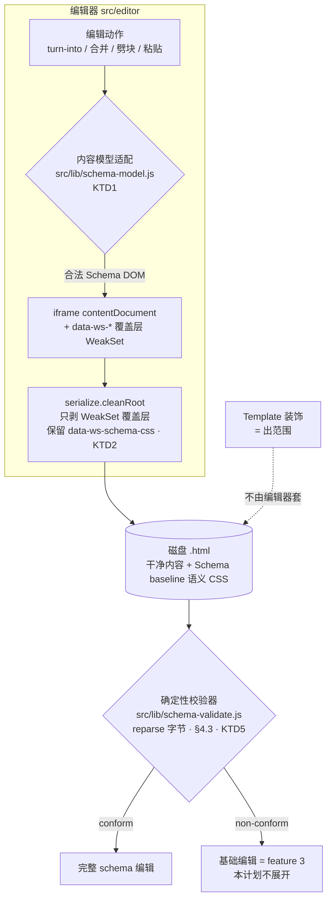

# Schema #1 闭合编辑器地基

**Target：** Wordspace 真 app（`src/`，vanilla JS / Electron）。纯逻辑（内容模型适配、校验器）放 `src/lib`（jsdom 可单测、框架无关好移植）。**不碰 ui-demo**（那是单独轻量轨）。

## Summary

把现有块编辑器改造成**对 Schema #1 闭合**：所有改结构的编辑动作经一个内容模型适配纯函数，保证"合法 Schema 进 → 合法 Schema 出"，从构造上消灭结构 bug。配套：① schema 标记命名空间化 + 覆盖层 WeakSet 追踪（修存盘删用户内容的 F1）+ 删掉编辑器强套的 Notion canvas 排版（落实"编辑器不套装饰、显示按原生"）② Schema baseline 最小语义 CSS 入盘（callout/to-do/table 块原生渲染正确）③ 确定性校验器 v1（合规判定唯一权威）④ 现有块的 ship-blocker 小修（A1/A2/A3/B1/B2/C1/C2/D3）+ H4 接线。**新块 Toggle/Table、Media、富粘贴、校验器接入打开流程的"不符合→基础编辑"分流，均留后续 plan。**

## Problem Frame

现有块编辑器（`src/editor/blockedit.js`）在野生 HTML 上 bug 不断，根因 = **没有被强制执行的结构规则**：编辑任意 DOM、出事后才打补丁。`define-schema-1` workflow 的对抗阶段在活代码里挖出一批可复现真 bug（见 origin `docs/schema-1-draft-v0.md` §7），按根因聚成三类：

1. **内容模型盲**（A1 列表转引用留孤儿 `<li>` / B1·B2 跨块删·并列表缺 leaf 守卫 / S1-S3）→ 产真·非法 HTML 落盘。
2. **身份/存盘靠裸标记**（F1 `cleanRoot` 按属性名删整节点会删用户内容 / A2 块菜单往块写 `style` / C2 `docHasAuthorStyles` 误判 / S9 固定 id 碰撞）。
3. **退化结构无人判**（S5-S10 / 空块二义）——合法 HTML 但 schema 语义未定，编辑守卫挡不住（从导入/粘贴进来）。

本计划**贯彻 origin §0 决策冻结**（Schema/Template 模型 + 6 决策，权威）：Schema = 编辑方式 + 结构 + 格式约束 + 最小语义 CSS；Template = 装饰；**显示永远按 `.html` 原生、编辑器不套装饰**；符合 schema → 完整编辑，不符合 → 基础编辑（feature 3，本计划不展开）。

---

## Key Technical Decisions

- **KTD1 — 闭合靠单一内容模型适配纯函数。** 所有改结构的动作（turn-into / 合并 / 劈块 / 粘贴净化）都过同一个纯函数（`src/lib/schema-model.js`），它把任意输入 coerce 到最近的合法 Schema 形态。守卫不靠"小心写"，靠"非法进不去"。jsdom 可单测，是闭合保证的单一真相源。（堵 origin §7 根因 1：A1/B1/B2/S1-S3。）
- **KTD2 — schema 标记/CSS 命名空间化 `data-ws-schema-*`；编辑器覆盖层走 WeakSet 追踪，不靠属性名。** `serialize.cleanRoot` 只删**本会话登记进 WeakSet** 的覆盖层节点，永不 `querySelectorAll('[data-ws2-ui]')` 按名删（修 F1：用户带该属性的内容不再被删光）。schema 自带的语义 CSS 打 `data-ws-schema-css`、serialize 保留。（堵根因 2：F1/S4/S9/C2。）
- **KTD3 — 编辑器不套装饰样式（删 `docHasAuthorStyles` + `data-ws2-canvas` 那套）。** origin §0：漂亮 = Template，不是编辑器硬套；显示按 `.html` 原生。删后 C2（误判）自然消失，且不再有"裸文档被套四不像"风险。
- **KTD4 — Schema baseline = 最小语义 CSS + 格式底线，入盘随文件走。** 让块原生渲染正确所需的最小 CSS（to-do 勾选框 / callout 提示框 / table 边框对齐）+ 页边距/宽度底线，统一经 `data-ws-schema-css` 入盘。这是"Schema 自带样式"，区别于 Template 的装饰。（修 C1：callout 存盘后不再是无样式纯文本。）
- **KTD5 — 确定性校验器 = 合规权威，marker 只作提示。** 纯函数、对**磁盘字节 reparse 出的 DOM** 判、§4.3 三铁律（绝不因 meta 自称就跳过校验 / 不信视觉只信属性 / 不跑活 DOM）。本计划建它 + 单测 + 作 e2e 闭合断言工具；**接入打开流程做分流 = feature 3**。
- **KTD6 — 颜色/高亮 = 固定 class 调色板 + `data-ws-schema-css`；高亮用 `<mark>`；块上不写 `style`。** origin 决策 1。块级颜色不再 `el.style.x=`（修 A2）。
- **KTD7 — 纯逻辑（适配函数 / 校验器）放 `src/lib`、框架无关。** 与 app 的 `src/lib/*.js`（CommonJS 双导出 + jsdom 单测）一致；将来 ui-demo 或别处可复用。

---

## High-Level Technical Design

闭合的关键是把**所有改结构的写操作**收束到一个适配函数；存盘只剥本会话覆盖层；校验器对磁盘字节独立裁定。

不变式（适配函数 + 校验器共同守）：**I1** 顶层块扁平不互嵌；**I2** `ul/ol` 直接子只 `<li>`；**I3** 叶子块只装 phrasing（callout/quote 例外：多段 `
`，但不嵌列表/块——origin 决策 4）；**I4** id 全局唯一；**I5** 干净存盘无编辑器标记；**I6** 表格矩形无合并格。

---

## Requirements

**结构闭合 + 存盘**

- R1. 编辑器对 Schema #1 闭合：所有改结构的动作产出合法 Schema 文档（合法进 → 合法出）。
- R2. 存盘保真：serialize 只剥本会话覆盖层（WeakSet），**绝不按属性名删用户节点**（修 F1）。
- R3. 闭合可被验证：提供 e2e 工具，断言"编辑器任意操作后的产物经校验器仍 conform"。

**Schema / Template 模型（origin §0）**

- R4. 编辑器不主动套装饰样式（删 `docHasAuthorStyles`/canvas）；显示按 `.html` 原生。
- R5. Schema baseline：每个符合文件自带最小语义 CSS（to-do/callout/table 原生渲染正确）+ 页边距/宽度底线，全部 `data-ws-schema-css` 随文件走（修 C1/C2）。

**校验器**

- R6. 确定性校验器（纯函数、reparse 磁盘字节、§4.3 三铁律）判文件是否符合 Schema #1，输出 conform + 违规清单；合规判定唯一权威，marker 仅提示。

**现有块闭合（决策落地 + 小修）**

- R7. 颜色/高亮：固定调色板 = class + `data-ws-schema-css`；高亮 = `<mark>`；块上不写 `style`（修 A2，决策 1）。
- R8. callout / quote 内 = 多段文字（多个 `
` + 行内 + ` `）、不嵌列表/块；表格单元格 = phrasing-only（决策 4）。
- R9. H4 作 heading 可编（接 classify + slash）；h5/h6 = 不符合 Schema（由 R6 校验器判，不 normalize）。
- R10. 内容正确性小修：turn-into todo→list 清 `data-checked`（A3）；Tab 子列表取直接父类型（D3）。

---

## Implementation Units

> 执行姿态：`src/lib` 的纯逻辑（U2 适配函数、U4 校验器）**test-first**（jsdom 单测）；编辑器接线/视觉单元靠真 Electron e2e 兜底（本仓「教训要实证」、「代理断言≠视觉验证」）。每个单元落地即 commit（并行 session 凭 git log 追进度）。

### U1. schema 标记命名空间化 + 覆盖层 WeakSet 追踪 + 删 canvas 套样式

**Goal**：建立 `data-ws-schema-*` 命名空间 + 覆盖层 WeakSet 追踪机制；`cleanRoot` 改为只剥本会话覆盖层（修 F1）；删掉编辑器强套 Notion canvas 排版（落实 R4，消 C2）。这是地基单元，解锁后续语义 CSS 入盘。
**Requirements**：R2, R4
**Dependencies**：无（先做）
**Files**：`src/editor/serialize.js`、`src/editor/blockedit.js`、`test/serialize.test.js`、`test/fidelity-roundtrip.test.js`
**Approach**：① `blockedit.js` 的 `mk()`（覆盖层工厂）把建出的节点登记进一个模块级 `WeakSet`；`cleanRoot` 删覆盖层改为遍历 + `weakset.has(node)` 判定，**移除 `querySelectorAll('[data-ws2-ui]')` 整删**。② 属性剥除只剥本会话加的白名单（`data-ws2-ce/-editing/-selected` 等交互态）。③ 移除 `docHasAuthorStyles`、`data-ws2-canvas` 应用、`EDITOR_CSS` 里 `[data-ws2-canvas]>...` 那段排版（装饰归 Template）。④ 退役名（`data-ws2-block/-container/-eid`）删除。
**Patterns**：现有 `serialize.js` `WS2_MARKERS`/`cleanRoot`、`blockedit.js:192 mk()`、`:340 ensureTodoStyle`（语义 CSS 入盘范式）。
**Test scenarios**：
- F1 修复：文档含用户自带 `data-ws2-ui` 属性的元素 → 存盘后该元素**及其内容仍在**（旧实现会删光）。
- 覆盖层仍被剥：编辑态注入的手柄/菜单/气泡（WeakSet 登记）存盘后不入磁盘。
- 保真往返：开 → 不编辑 → 存，结构等价、无编辑器标记泄漏。
- R4：裸文档（无自带 style）开 → 存，**不被注入 canvas 排版样式**、不带 `data-ws2-canvas`。
- 用户自带 `data-ws2-*` 属性（非覆盖层）原样保留（保真红线）。
**Verification**：`node --test test/serialize.test.js test/fidelity-roundtrip.test.js` 绿 + e2e 开含 `data-ws2-ui` 的文档存盘内容不丢。

### U2. 内容模型适配纯函数（`src/lib/schema-model.js`）

**Goal**：一个纯函数模块，把"块 + 目标操作"映射到合法 Schema 形态——merge/split/turn-into/paste 的单一收口（KTD1）。堵 A1/B1/B2/S1-S3 的根因。
**Requirements**：R1
**Dependencies**：无（可与 U1 并行）
**Files**：`src/lib/schema-model.js`(新)、`test/schema-model.test.js`(新)
**Approach**：定义三类内容模型（A 短语叶子 / B 列表 / C 结构）。导出纯函数：`isLeafTextBlock(el)`（**递归**确认无块级子，修 S1 透明 `<a>` 包块级）、`flattenLiToPhrasing(li)`（B→A 拍平、子列表先 flatten，修 A1）、`wrapPhrasingAsLi(node)`（A→B）、`canMerge(a,b)`（leaf+同模型守卫，修 B1/B2）、`coerceToSchema(fragment)`（粘贴净化用，default-deny）。无副作用、传 DOM 节点进出，jsdom 可单测。
**Execution note**：test-first。
**Patterns**：`src/lib/file-tree.js`/`tabs.js`（CommonJS 双导出纯逻辑 + jsdom 单测）；origin §6 安全变换表 + §7 收口。
**Test scenarios**：
- Covers A1：`<ul><li>x</li><li>y</li></ul>` 经 flatten → 合法 phrasing（`x y` 或两段），**无孤儿 `<li>`**；含嵌套子列表先拍平。
- Covers B1/B2：透明包裹块 `div.lead>p` 判 `isLeafTextBlock=false` → `canMerge` 拒绝（防 `

`）。
- Covers S1：`<a><h2>..</h2></a>`（链接包块级）→ `isLeafTextBlock` 递归判 false。
- A→A / A→B / B→B turn-into 全组合产物合法；越类（list→quote）经 flatten 合法。
- 幂等：合法输入进 = 出（不无故改动）。
**Verification**：`node --test test/schema-model.test.js` 全绿，穷举三类内容模型互转 + 去重不变式断言。

### U3. 把改结构的编辑操作接到适配函数

**Goal**：blockedit.js 的 turn-into（三入口）、Backspace 合并、`deleteSelection` 跨块合并都过 U2 的适配函数 → 在调用点修掉 A1/B1/B2。
**Requirements**：R1, R3
**Dependencies**：U2
**Files**：`src/editor/blockedit.js`、`e2e/app.spec.js`、`e2e/schema-closure.spec.js`(新)
**Approach**：`turnInto`/`retag` 转出列表前调 `flattenLiToPhrasing`（覆盖 fmtbar 转为菜单、块菜单转引用、空列表斜杠三入口）；Backspace 并入列表（`:891`）、`deleteSelection` 合并分支（`:474`）加 `isLeafTextBlock` 守卫（U2）。
**Test scenarios**（e2e，真 Electron）：
- Covers A1：列表 → 「转为引用/正文/标题」经**三个 UI 入口**，产物均为合法 `<blockquote>`/`
`/`<h*>`，DOM 无 `<li>`、存盘合法。
- Covers B1：拖选跨 `div.lead` 包裹块删除 → 不出现嵌套 `
`。
- Covers B2：包裹块块首 Backspace 并入列表 → 不出现 `<li>
`。
- 闭合断言（R3）：上述每步后，产物经 U4 校验器仍 conform（用 U4 的断言工具）。
**Verification**：`e2e/app.spec.js` 不回归 + `e2e/schema-closure.spec.js` 绿。

### U4. 确定性校验器 v1（`src/lib/schema-validate.js`）

**Goal**：合规判定唯一权威（KTD5）。纯函数、对 reparse 字节判、§4.3 三铁律。本计划建它 + 单测 + 作 e2e 闭合断言工具；接入打开流程分流 = feature 3。
**Requirements**：R3, R6
**Dependencies**：无（与 U2 并行）；被 U3 e2e 复用
**Files**：`src/lib/schema-validate.js`(新)、`test/schema-validate.test.js`(新)
**Approach**：遍历 DOM 核对 origin §2 块表（允许标签/属性/嵌套/行内）+ S5-S10 退化结构规则；输出 `{conform:boolean, violations:[{rule, node-path, msg}]}`。**对照退役的 `va-eval.js` 思路**（纯逻辑、单一来源）。三铁律：① 绝不因 `<meta wordspace-schema>` 自称就放行；② 状态只认属性（`data-checked`）不认 `::before` 视觉；③ 判磁盘 reparse DOM、不判活 DOM。
**Execution note**：test-first。
**Patterns**：origin §4.3、退役 `scripts/host-verify.js`/`va-eval` 的纯判定思路（注意 va-eval 已删、只借思路）。
**Test scenarios**：
- 合规文档（U1 后编辑器产出的）→ conform。
- 每类违规命中：嵌套 `
`、`ul` 直挂裸文本、空结构、h5/h6（R9）、表格 colspan/合并、外来 `<script>`/`on*`。
- 铁律①：伪造 `<meta wordspace-schema=1>` + 内嵌 `<script>` → **仍判 non-conform**（不被 meta 骗）。
- 铁律②：预置恶意 `#ws-todo-style` 让 `::before` 显示对勾但 `data-checked="false"` → 勾选态以 `data-checked` 为准。
- 缺 marker 的合法手写文档 → 仍 conform（marker 非必需）。
**Verification**：`node --test test/schema-validate.test.js` 全绿，覆盖 conform/各违规/三铁律。

### U5. Schema baseline 语义 CSS（callout/C1 + 格式底线 + 统一入盘）

**Goal**：每个符合文件自带让块原生渲染正确的最小语义 CSS（to-do/callout/table）+ 页边距/宽度底线，全部经 `data-ws-schema-css` 入盘（R5）。修 C1（callout 无入盘 CSS）。
**Requirements**：R5, R8
**Dependencies**：U1（`data-ws-schema-css` 机制）
**Files**：`src/editor/blockedit.js`、`test/serialize.test.js`、`e2e/fidelity.spec.js`
**Approach**：加 `ensureCalloutStyle`（照 `ensureTodoStyle` 范式，注 `<style id=ws-callout-style data-ws-schema-css>`）；统一 schema baseline 样式表（margins/max-width 底线 + 块语义）；去重用**属性查询**（`head.querySelector('style[data-ws-schema-css=callout]')`）不靠固定 id（修 S9）。callout/quote 升级支持多段 `
`（决策 4）。
**Test scenarios**：
- Covers C1：含 callout 的文档存盘 → 重开 / 普通浏览器双击，callout **是提示框（有背景/边框）**、非无样式纯文本。
- 语义 CSS 不被剥（`data-ws-schema-css` 保留）、不重复注入（S9：作者已有同 id 不被骗）。
- 裸文档存盘带 margin/width 底线（不贴边、不超宽），但**不带装饰排版**（R4 不回归）。
- callout/quote 内多段 `
` 存盘保真。
**Verification**：`node --test test/serialize.test.js` 绿 + `e2e/fidelity.spec.js`（callout computed-style 真渲染为框）。

### U6. 颜色/高亮决策落地 + 内容正确性小修（A2/A3/D3）

**Goal**：决策 1 的颜色模型（固定 class 调色板 + `data-ws-schema-css`、高亮 `<mark>`、块不写 style，修 A2）+ A3/D3 小修。
**Requirements**：R7, R10
**Dependencies**：U1（color class 走 `data-ws-schema-css`）
**Files**：`src/editor/blockedit.js`、`src/editor/format.js`、`test/format.test.js`、`e2e/app.spec.js`
**Approach**：块菜单颜色行（`:624`）改写 `ws-color-*` class 不 `el.style.color=`（A2）；行内色/高亮同样 class 化、高亮产 `<mark>`；turn-into todo→list 摘 class 时 `querySelectorAll('li[data-checked]').removeAttribute`（A3）；Tab 子列表 tag/class 取 `li.parentElement` 非"顶层 list"（D3）。
**Test scenarios**：
- Covers A2：块菜单给标题/列表上色 → 产 `class="ws-color-*"`、**不出现 `style="color:"`**；存盘色在（class + 入盘 CSS）。
- 高亮 → `<mark>`（无 CSS 也黄底）。
- Covers A3：todo 转普通列表 → li 上无 `data-checked` 残留。
- Covers D3：在 to-do 列表里 Tab 缩进 → 子列表继承 `ws-todo`（取直接父），不串成顶层类型。
- E1 实证：多项列表上跑 B/I/U/S 后 `ul > :not(li)` 为空、每 li 仍 ul 直接子（真 Electron e2e 变异探针）。
**Verification**：`node --test test/format.test.js` 绿 + e2e 取色/高亮/缩进门绿。

### U7. H4 接线

**Goal**：H4 被认作 heading 可深编（接 `classify` + 斜杠菜单）；h5/h6 留给校验器判不符合（R9）。
**Requirements**：R9
**Dependencies**：无（可并行）
**Files**：`src/editor/blockedit.js`、`test/blockedit.test.js`、`e2e/app.spec.js`
**Approach**：`classify`（`:35`）加 `H4→heading`；斜杠菜单 `SLASH_ITEMS` 加 Heading 4（**核对下标/快捷键不撞**）；turn-into 支持 h4。h5/h6 不接（= 不符合，U4 判）。
**Test scenarios**：
- H4 单击即编辑、作 heading 块；斜杠 `/标题4` 插入 H4；turn-into 转 H4 保留文字。
- h5/h6 文档：经 U4 校验器判 non-conform（不在本单元处理交互）。
**Verification**：`node --test test/blockedit.test.js` 绿（classify 含 H4）+ e2e H4 编辑/插入门绿。

---

## Scope Boundaries

### Deferred to Follow-Up Work（后续各自 plan）

- **Toggle 块**（原生 `
` + 持久 `open` + 编辑器接管开合 + Enter/Tab/Backspace 专路 + e2e）。
- **Table 块**（`ws-table` 文法、禁合并格、单元格 phrasing-only、增删行列、cell 内 Enter/Tab、e2e）。
- **Media Tier 1**：Image（base64 + 降采样护栏）、Code（`<pre><code>` + 编辑时高亮预渲染）。
- **富粘贴**（`sanitizeToBlocks` default-deny；当前仅纯文本地板）。
- **把校验器接入打开流程**做"符合→完整 / 不符合→基础编辑"分流 = **feature 3**（本计划只建校验器 U4，不接打开流程）。

### Outside this product's identity（非目标）

- **ui-demo 原型**（React，单独轻量轨）。
- **装饰样式 / Template / 漂亮 Notion 排版** —— 按 origin §0 = Template，不由编辑器套、不在 Schema。

---

## Risks & Dependencies

- **R1 闭合的经验性环节必须 e2e 实证（origin §7 E 档）**：`execCommand` 跨 `<li>` 的行为、`
`/contenteditable 交互等无自动断言的点，靠真 Electron e2e 变异探针兜（U6 已含 E1；Toggle 留后续）。CI 的 `e2e` 是 main required check。
- **R2 删 canvas 排版是行为可见改动**：现有"裸文档看起来像 Notion"的观感会变成"原生朴素"——这是 origin §0 拍板的预期行为，非回归；e2e 断言改为"不注入 canvas"而非"有 canvas"。
- **R3 U1 是地基、阻塞 U5/U6**：WeakSet 重构 + 命名空间若没先稳，语义 CSS 入盘 / 颜色 class 会建在旧机制上。**排期：U1 先行**；U2/U4 纯逻辑可并行。
- **依赖**：jsdom（现有单测已用）；Electron 42 + Playwright `_electron`（现有 e2e 栈）。无新外部依赖。

---

## Sources / Research

- **Origin（权威 spec）**：`docs/schema-1-draft-v0.md` —— §0 决策冻结（覆盖一切冲突）、§2 块表、§3 行内、§4 骨架+marker、§6 编辑行为安全变换表、§7 已知 bug（A/F/C/S/D/E 分级 + 收口）、末尾执行切片。本计划单元 = 把 §7 三类根因收口 + 执行切片前段落地。
- **架构地基**：`docs/brainstorms/2026-06-30-schema-foundation-requirements.md`（校验器脊梁、合规分流）。
- **代码锚点**：`src/editor/blockedit.js`（`WS2BlockEdit`：classify `:35` / mk `:192` / turnInto `:386` / deleteSelection `:474` / 块菜单色 `:624` / ensureTodoStyle `:340`）、`src/editor/serialize.js`（`WS2_MARKERS`/`cleanRoot`）、`src/editor/format.js`（`isTextEditable`/`retagElement`/`safeHref`）。
- **测试栈**：`test/*.test.js`（`node --test` + jsdom）；`e2e/*.spec.js`（Playwright `_electron`，`--no-sandbox`，frameLocator 穿 iframe）；CI `.github/workflows/ci.yml` 的 `e2e` job 为 main required check。
- **强断言/变异探针范式**：CLAUDE.md S4（「想得出'约束全废但断言还过'就是弱门」）+ `e2e/fidelity.spec.js`（computed-style 真渲染 + 哨兵文档）。
