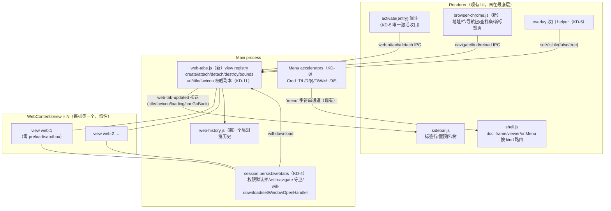
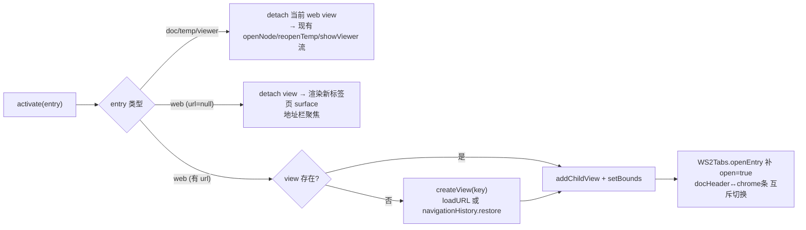
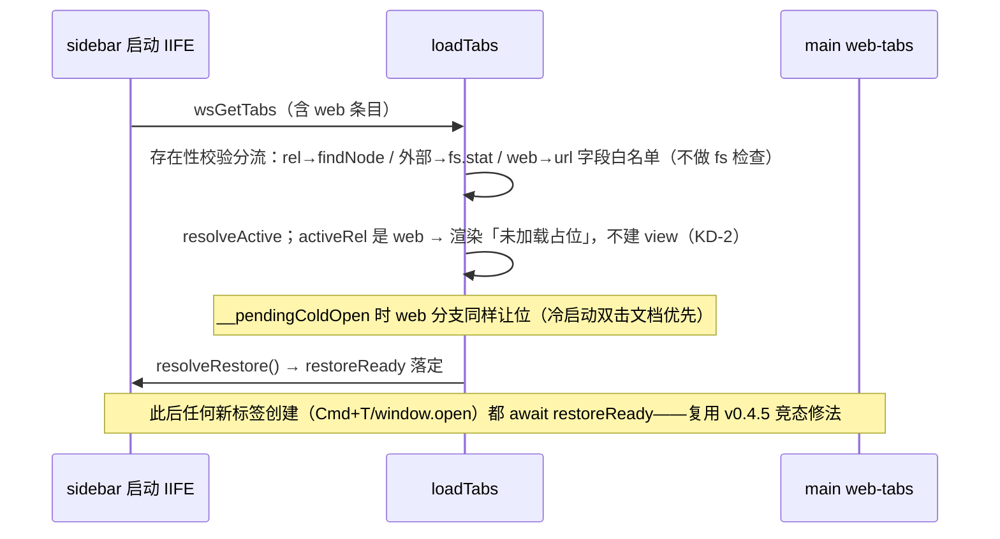

# 结合 Chromium 浏览器 · 实现计划

## 问题框架

Wordspace 已是一个「侧栏 + 标签页」的 Arc 风格本地文档编辑器，但标签只能装本地文档。
这个 feature 让标签页也能装**真网页**：Cmd+T 开新标签 → 地址栏输网址/搜索词 → 上网，
带真实浏览器基础功能（前进后退/刷新/favicon/加载态/页内查找/下载/历史/缩放/崩溃恢复），
书签 = 置顶的网页标签（与文档置顶同一交互），整体样式与交互像 Arc——
**又有区别，但又是一整套**：同一个侧栏标签系统、同一套持久化、同一套快捷键体系。

技术上的根本矛盾：现有文档渲染是 renderer 里的 sandbox iframe（`allow-same-origin`、无脚本、
CSP `default-src 'self' file:` 无任何 http 来源），**开不了任意网站**。网页必须走 Electron 的
`WebContentsView`——主进程管理的原生视图，画在整个 renderer DOM **之上**。这带来三个必须
正面解决的架构问题：①原生视图盖住所有 DOM 浮层（命令面板/弹窗/toast/右键菜单）；
②标签激活路径散布 8 处，view 的 attach/detach 必须收口；③持久化/恢复链会把网页标签当文件
做 fs 校验然后静默丢光。

**与产品愿景的关系**（doc review 补,待 Colin/Wendi 复核口径）：本 feature 是
`docs/product-vision.md` §4「作为浏览器」这一形态主张的第一次落地,也事实上给 §9 的开放问题
（真浏览器内核 vs 应用外壳）一个阶段性答案。注意一个有意的偏离:愿景说网页与本地文档
「用的是同一套机制」,本计划是**双机制并存**（文档 sandbox iframe + 网页 WebContentsView）——
这是务实的 v1 楔子而非终态承诺,统一机制的取舍留待目验后正式拍板。此口径同步进 U9 的设计文档。

## 需求追溯（Colin 2026-07-05 原话 + 三项拍板）

- R1 标签页里直接输地址栏上网；**Cmd+T 开新标签页再输地址（传统浏览器习惯，拍板②）**。
- R2 真实浏览器功能**全做（拍板①）**：前进/后退/刷新、页面标题+favicon+加载态进标签行、
  页内查找（Cmd+F）、下载、浏览历史、缩放、window.open→新标签、崩溃/加载失败恢复页。
- R3 **书签 = 置顶的网页标签（拍板③）**：钉住网页标签即书签，与文档置顶同一交互、同一个置顶区。
- R4 样式与交互像 Arc：侧栏标签行（favicon/spinner/音频标记）、新标签页、错误页、整体打磨。
- R5 与 Wordspace 是一整套软件：网页标签与文档标签同一标签系统/持久化/重启恢复/拖拽分区，
  doc↔web 切换无缝，PDF 导出（Cmd+E）对网页也能用（printToPDF）。
- R6 安全硬隔离：网页内容与本地文档编辑环境完全分离（独立 session、零 preload、默认拒权限、
  封死 file:// 访问），renderer CSP 一字不松。
- R7 独立 branch + worktree 试验（`feat/browser-tabs` / `wordspace-next-browser`），
  做好给 Colin 目验，**不合 main**。
- R8 交互逻辑完整可靠（Colin 点名「交互逻辑也很重要」）：激活收口、快捷键路由矩阵、
  浮层遮挡处理、恢复链竞态——流分析 25 条 gap 全部有归属。

---

## 关键决策（KD）

- **KD-1｜渲染载体 = WebContentsView，别的路都死**。iframe：CSP 无 http 来源 + sandbox 无脚本，
  开不了网站（且松 CSP 是本仓红线）。`<webview>`：官方明文不稳定不推荐。`BrowserView`：
  Electron 30 起废弃（本仓 electron@42.4.0 的 d.ts 全程 `@deprecated`）。`BrowserWindow` 本身
  继承 `BaseWindow`，`win.contentView.addChildView(view)` 直接可用——**不需要**迁移 BaseWindow。
  老教程 API 对照（`setAutoResize` 没了要手动 resize→setBounds；`goBack` 废弃改
  `navigationHistory.*`；`crashed` 事件改 `render-process-gone`）已核实，照 42 的 API 写。

- **KD-2｜tab 状态与 view 分离：view 是可丢弃的渲染面，tab 是持久的状态记录**（Min 架构结论）。
  view 惰性创建（首次激活才建）、切换用 attach/detach（`removeChildView`/`addChildView`，
  同 view 别重复 set 会闪烁）、关标签/崩溃/工作区切换时销毁。**重启恢复只恢复 tab 状态不建
  view**——包括 activeRel 是网页标签时也恢复成「未加载占位」（favicon+标题，点击才首次加载），
  不冷启动就发网络请求（流分析 #5）。webContents **永远不会自动销毁**（官方明示会内存泄漏），
  关闭路径必须显式 `webContents.close()`。

- **KD-3｜标签身份 = `web:` 前缀塞 `abs`（照抄 `temp:` 先例的**完整形状**：
  `'web:'+(++seq)+':'+Date.now().toString(36)`），URL 是 entry 上的可变状态字段**。
  ⚠ 不能用裸 `web:<seq>`——web 条目要持久化,每次启动 seq 从 1 重数会与恢复条目撞 keyOf,
  openEntry 撞键即把新标签合并进旧条目（doc review 抓的;genTempId 带时间戳正是为免撞,
  temp 不持久化所以从没暴露过这一点）。U2 测试加「恢复条目与新建条目 key 不冲突」。
  导航不改身份；同 URL 开两个标签合法**不去重**（浏览器同款，流分析 #22——spec
  明写防止实现时自作聪明加合并）。新增 entry 字段：`url`（当前 URL，null = 新标签页）、
  `title`。与 `temp:` 的关键区别：**web 条目要持久化**
  （temp 被 persistTabs 过滤）——但**未置顶且 url=null 的空白新标签页落盘时过滤**,只保留
  激活中那一条,否则空白条目跨重启机械累积、侵蚀 Arc 观感;`workspace-store.sanitize`/
  `validEntry` 加 web 字段白名单（url 非 string 且非 null → 丢该条）；`reconcileTree` 跳过
  web 条目（无 inode）。

- **KD-4｜安全模型：所有网页标签共享独立 `session.fromPartition('persist:webtabs')`，
  与 default session（编辑器 UI/preload/文档）硬分离**。view 的 webPreferences：**零 preload**、
  `sandbox:true`、`contextIsolation:true`、`nodeIntegration:false`、`safeDialogs:true`。
  权限**默认拒绝**（Electron 不设 handler 默认全放行——必须同时设 `setPermissionRequestHandler`
  + `setPermissionCheckHandler` + `setDisplayMediaRequestHandler` 拒屏幕共享）；v1 白名单只放
  `fullscreen`/`pointerLock`/`clipboard-sanitized-write`，其余（摄像头/麦克风/定位/通知）一律拒，
  自绘权限询问条留 follow-up。**设备类权限单独一套机制,同样封死**（doc review 抓的:
  WebUSB/WebHID/WebSerial/WebBluetooth 不走 permission handler）：
  `session.setDevicePermissionHandler(() => false)` + `select-usb-device`/`select-hid-device`/
  `select-serial-port`/`select-bluetooth-device` 事件一律 `preventDefault` 不选设备。
  **file:// 双向封死——三层,缺一不可**（doc review 抓的:只挂 will-navigate 有两个绕过口）：
  ① **所有 `loadURL` 调用点统一过 url-input 校验**（地址栏/书签/历史命中/window.open 新标签/
  恢复重载——`will-navigate` 对 `loadURL` 发起的导航根本不触发,恶意页 `window.open('file:///…')`
  会干净绕过）;② 每个 view 挂 `will-navigate` **+ `will-redirect` + `will-frame-navigate`**
  只放行 http/https（服务端 redirect 和 iframe 子帧导航不走 will-navigate）;③ favicon 的
  `net.fetch` 同样只放行 http/https（恶意页声明 `<link rel=icon href="file:///…">` 会让特权
  主进程读任意本地文件——Electron net 模块支持 file:）。外部协议（mailto:/自定义）v1 直接拒绝
  （不 shell.openExternal——本 app 有本地文件权限，比纯浏览器更不能松）。证书错误用默认安全行为
  （不注册 handler → 走 did-fail-load 错误页，**无「继续访问」例外 UI**）；HTTP basic auth v1
  不弹登录框（不注册 login handler，失败页说明）——这两条是**决策不是遗漏**（流分析 #19）。
  web 标签的 webContents **零 IPC 暴露**（v0.4.2 信任模型：`open-external-abs` 等特权 IPC 的
  前提是「来源=用户亲选」，web 内容碰不得）。主进程所有 webContents 事件监听**按 sender 过滤**
  （bug sweep MP-5 教训：`did-start-loading` 被 iframe 导航误触发废掉驻留唤醒——现在多 N 个
  webContents，不过滤必出串扰）。**不可信字符串渲染铁律**：来自网页的 title/url/favicon 进
  renderer 的每个渲染点（标签行/chrome 条/Cmd+P 历史/新标签页最近浏览）只走
  `textContent`/`createElement`,绝不 innerHTML 拼接——这是新的信任边界,写成规则而非依赖惯例。

- **KD-5｜激活收口：sidebar.js 建唯一 `activate(entry)` 漏斗**（流分析 blocker #1）。现有激活
  路径散布 8 处（openTabRow / loadTabs 自动恢复 / finishClose 回落 / doDelete 回落 /
  onTreeChanged 回落 / closeOrRemove 前置切换 / adoptSavedTemp / openDoc→onOpen），**本计划
  自己还新增 3 条创建型激活路径**（doc review 抓的第 9-11 条:Cmd+T 新标签 / window.open 开
  前台标签 / Cmd+P 历史命中开标签）——共 11 条全部改走漏斗；由漏斗排他执行「detach 网页 view /
  attach 网页 view / 渲染文档面」。**硬规则:主进程永不直接 attach view,`web-show` IPC 是唯一
  attach 入口**——window.open 走「main 推事件 → renderer 建 entry → activate 漏斗 → web-show
  回 main」单向环,否则绕开漏斗正好复现 resolveActive 不认/双 view 同 attach 的历史 bug 模式。
  web 激活分支显式调 `WS2Tabs.openEntry` 补 `open=true`（否则 `resolveActive` 不认、Cmd+W
  回落序错乱，#13）。配变异自检 e2e（漏一条路径必翻红）,三条创建型路径列入自检覆盖面。

- **KD-6｜浮层遮挡：中央 overlay 收口 + `setVisible(false)` 简单版**。overlay 打开/关闭统一走
  一个 helper（引用计数），web view 激活期间任一 DOM 浮层（模板台/SaveModal/CloseConfirm/
  AI 接入/Cmd+P 面板）打开 → view `setVisible(false)`，全关 → 恢复。接受一瞬白底（Min 的
  capturePage 截图占位是 follow-up 打磨）。右键菜单 `sb-ctx` 例外：clamp 在侧栏宽度内更便宜，
  不 hide。**toast 单独处理**（流分析 #10）：web 激活时 toast host 锚到侧栏区域（view 永远
  不盖侧栏）——否则「下载完成」和「删除撤销」两个功能静默失效;**侧栏收起（is-collapsed 宽度 0）
  且 web 激活时侧栏区域不存在,toast 改锚到 chrome 条**（doc review 抓的:Cmd+\ 收起浏览是
  一键可达的常见姿势,U8 的 toast 位置断言加收起态一条）。

- **KD-7｜doc↔web 切换：文档留在 iframe 里被 view 盖住，不卸载不弹脏守卫**（流分析 #6）。
  切走 = 零成本、autosave 照跑、切回秒回。代价：`docPath`/`dirty` 活着而 activeRel 指网页 →
  **`onMenu` 全部命令按 `(activeKind × viewState)` 路由,viewState ∈ {live, placeholder,
  newtab}**（doc review 抓的:重启后激活标签默认就是无 view 的占位态,只按 activeKind 二元
  路由会把 export-pdf/find 指向不存在的 webContents）：live 态 save 无操作、export-pdf 走
  `printToPDF`（printBackground:true）、**undo/redo 转发 `view.webContents.undo()/redo()`**
  （⚠ 不能 no-op——菜单 accelerator 优先于网页,no-op 等于杀死所有网页文本框里的 Cmd+Z）、
  find-file 变页内查找（见 KD-8）；placeholder 态 reload=触发首次加载、export-pdf/find 禁用
  （chrome 条按钮 disabled 同步）；newtab 态全部 no-op。
  顶部 doc header（面包屑/Save/⋯菜单）与浏览器 chrome 条**互斥交换**，按钮 disabled 状态
  与 (activeKind × viewState) 绑定收口（#11）。

- **KD-8｜快捷键全部走应用 Menu accelerator，不靠 renderer DOM keydown**。实测事实：view
  聚焦时 renderer 的 document/window keydown **全死**，只有 Menu accelerator 照常触发（网页
  也抢不走）。迁移清单：Cmd+\（侧栏收起）、Cmd+=/−/0（缩放）提为 Menu item 按 kind 分流
  （**注意副作用**：加了 Menu accelerator 后 doc iframe 里的 handleZoomKey 永远收不到键，
  doc 缩放必须同步改走 menu 分发，否则双实现漂移，#7）。新增：Cmd+L 聚焦地址栏、Cmd+R 刷新
  （doc 态 no-op，**绝不接 reloadDoc**）、Cmd+[/] 后退/前进（doc 态 no-op；已 grep 无冲突）。
  Cmd+F 三态：web 激活 → 页内查找条；否则 → 现有侧栏筛选。**焦点夺回**：view 聚焦时 renderer
  的 `input.focus()` 静默失败——开地址栏/查找条/Cmd+P 前必须先 `win.webContents.focus()`
  把焦点拉回主 frame（#8）。Esc 语义在 find bar（keepSelection 关闭）与地址栏（还原 URL）
  用 view 的 `before-input-event` + chrome 条自身 keydown 处理。

- **KD-9｜Cmd+T = 统一新标签页，化解与「新建临时文档」的撞车**。现 Cmd+T 开临时文档模板台。
  新语义：Cmd+T 开一个 **url=null 的 web entry**（有标签行、标题「新标签页」、Cmd+W 关它自己、
  重启恢复为空标签页——流分析 blocker #3 要求它必须是 entry，否则 Cmd+W 会误关背后的旧标签），
  渲染成 DOM 新标签页 surface：顶部聚焦好的地址栏 + 下方「新建文档」快捷入口（直通现有模板台）。
  既是传统浏览器习惯（拍板②），又不丢新建文档入口，还正好是「web 和文档一整套」的门面。
  输入提交 → 同一 entry 原地变真网页标签（首次建 view）。

- **KD-10｜书签 = 置顶网页标签，记「最后 URL」**（流分析 #12）：置顶后继续浏览，书签跟着走
  （与文档置顶语义一致、Arc 同款）；「回到钉住时页面」连同 pinnedUrl 快照字段整体 deferred
  （doc review 砍的:v1 无消费者的字段别预建管道,纯新增字段晚加成本低）。置顶区 ×
  （removeEntry）= 删书签整条；Cmd+W（closeEntry）= 关标签、view 销毁、书签留在置顶区——
  tooltip 文案区分两者。点击未打开的置顶书签 → 漏斗建 view 加载 `url`（KD-5 的 openEntry 补
  open=true）。**beforeunload 要接**（doc review 抓的:R2「全做」的基础数据保护——用户在网页
  表单打了半篇长文 Cmd+W 不能静默蒸发）：用户单点关闭（Cmd+W/×）走
  `webContents.close({waitForBeforeUnload:true})` + `will-prevent-unload` 弹确认框;
  切工作区 destroyAll 与 Cmd+Q 路径 v1 明确**不**遵守 beforeunload（列入待拍板 #7）。

- **KD-11｜URL/title/favicon 的权威副本在主进程 views registry，renderer 只做 UI 镜像**
  （流分析 #14）。现有 persistTabs 是 renderer fire-and-forget，退出时最后一写必丢（已知坑）；
  web 的导航状态本来就产生在主进程，别走「主→renderer→wsSetTabs 回主」三跳。`before-quit`
  同步合并落盘——**注意 workspace-store 现在全是 fs/promises 异步写,要新增一个
  `fs.writeFileSync` 版合并写 API（如 mergeTabsSync）仅供 before-quit 用**（doc review 抓的:
  异步写不保证退出前落地,复用现有 setTabs 会把要修的坑原样复刻且平时测不出）;另一半防线:
  主进程 `ws-set-tabs` handler 对 web 条目一律用 registry 的 url/title 覆写 renderer 送来的
  镜像值再落盘（registry 无条件赢,封死迟到 IPC 覆盖权威值的窄竞态窗）。favicon：主进程用
  webtabs session 的 `net.fetch` 拉图转 data:URL 存 entry（**只放行 http/https,见 KD-4 ③**;
  CSP `img-src` 无 https:，renderer 直接 `` 会被拦——data: 已放行，**CSP 不动**）；
  按 URL 去重（Electron 42 前 setBounds 会触发多余 favicon 事件）;拉取失败/超时/无 favicon →
  entry.favicon=null,标签行回落到 KIND_PATH 的通用 web 图标（这是高频态不是边缘:本地测试页/
  IP 地址站都没有 favicon）。

- **KD-12｜地址栏输入判定：真验证不是「有没有点」**（Min urlParser 移植 + ui-demo browser.ts
  参考）。决策链：带 scheme → 原样（file:/自定义 scheme 拒绝）；无 scheme → 域名真验证
  （IPv4/IPv6/localhost/**IANA 根区完整 TLD 列表结尾**——约 1.5k 条静态文本内置,不引依赖;
  ⚠ 不能用手挑「常见集」:`.bar`/.pizza 这类都是真 gTLD,精简集会把长尾真域名吞成搜索,
  doc review 抓的）→ 补 `https://`；含空格或验证不过 → 搜索引擎。**默认搜索引擎 = Bing**
  （中国大陆可访问；Google 在主要目标用户环境不可用），v1 不做配置 UI——此默认值列入待 Colin
  拍板清单。显示态 prettyURL（去 scheme/www/尾斜杠,**http 与 https 显示无差别、v1 不做锁标记,
  这是记录在案的决策**），编辑态还原完整 URL；focus 全选；**编辑中冻结地址栏刷新**
  （后台 redirect 不吃掉输入，#21）。

- **KD-13｜macOS 隐藏驻留 × 网页标签：hide 时全体 `setAudioMuted(true)`，show 恢复**（幽灵
  声音，流分析 #16）。比 pause 干净不碰页面状态。re-show 后重发一次 view bounds（隐藏期间
  显示器/缩放可能变化）。Cmd+Q 时有下载在飞 → 仿现有脏文档守卫弹「下载未完成，仍要退出？」
  （#17）。

- **KD-14｜崩溃/加载失败恢复自成一套，绝不碰现有全局 handler**（流分析 #18）。现有
  `render-process-gone` handler 会 `win.reload()` 重载整个 renderer——view 崩溃误入 = 全 app
  重载。每 view 单挂：前台 → chrome 条错误页 + 重试钮（销毁旧 view 重建，崩掉的进程不可复用）；
  后台 → 标签行错误角标不抢焦点。`did-fail-load` 过滤 `-3 ERR_ABORTED`（用户中断不是错误，
  经典新手 bug）+ 只认 `isMainFrame`。按 `details.reason` 过滤 `clean-exit`/`killed`（自己的
  休眠销毁不算崩溃）。

- **KD-15｜window.open v1 = deny + 按 disposition 开前台/后台新标签**。代价明说：OAuth 弹窗
  登录（Google/GitHub 依赖 window.opener 回传）会坏——Min 式「popup 收养成标签」
  （`WebContentsView({webContents})` 领养）留 follow-up，spec 记录不假装没有。

- **KD-16｜浏览历史 = 主进程 `web-history.js` 全局 JSON store**（`did-navigate` **+
  `did-navigate-in-page`（isMainFrame 过滤）** + title 喂——只挂 did-navigate 会漏掉
  YouTube/GitHub 这类 SPA 的 pushState 站内跳转,主流站点历史大面积落空,doc review 抓的;
  上限 2000 条 LRU），**命名避开现有 `history.js`**（那是文档保存版本归档，流分析 #24），
  Cmd+P 面板加「浏览历史」次级区（搜索命中 → 开新网页标签）。每标签的前进/后退历史用
  Electron 原生 `navigationHistory.getAllEntries()/restore({entries,index})` 持久化恢复
  （42 已内建，含滚动位置 pageState——白拿的）。

- **KD-17｜工作区语义**：网页标签随文档标签一样入 `tabsByRoot[root]` 桶（v1 网页标签
  workspace-gated，与现 Cmd+T 行为一致）；**切工作区先 `destroyAll` 全部 view**（不销毁就
  内存泄漏+音频继续播，流分析 #15），「切回旧工作区保留活 view」是过度设计不做。无工作区的
  浏览（Arc 式独立使用）列 deferred。

---

## 高层技术设计

### 组件架构

### 激活漏斗状态路由（KD-5/KD-7）

### 重启恢复序列（KD-2 + 冷启动竞态防线）

---

## 范围边界

**做**：R1–R8 全部;错误页/崩溃恢复/下载守卫/幽灵音频这些「不做就是坏产品」的边角。

**不做（v1 明确排除）**：浏览器扩展、多窗口/标签拖出成窗、隐私窗口、OAuth popup 收养
（KD-15,记入 follow-up）、自绘权限询问条（v1 直接拒）、adblock、标签自动归档（Arc today
语义）、Little Arc 浮窗、搜索引擎配置 UI、无工作区浏览、「继续访问」证书例外、
capturePage 截图占位(KD-6 简单版先行)、标签休眠策略(architecture 已支持,策略后配)。

### Deferred to Follow-Up Work
- OAuth popup 收养成标签(Min 式 `WebContentsView({webContents})` 领养)——第三方登录需要时做。
- **网页存为本地 HTML 文档 / 剪藏进工作区**(savePage → 工作区文件,走 Schema 校验分流)——
  浏览器能力与文档平台之间最显眼的战略衔接点(愿景「都是 HTML」主张的最短兑现路径),
  v1 不做、方向留待 Colin/Wendi 定。
- 权限询问条(摄像头/麦克风/定位 per-origin prompt + 记忆)。
- overlay 截图占位(Min capturePage 模式,消除 setVisible 的一瞬白底)。
- 「回到钉住时页面」(书签 pin 时刻 URL 快照,连同 pinnedUrl 字段一起后置)。
- 无工作区浏览、标签休眠(后台超 N 分钟销毁重建)、清除浏览数据 UI(`clearStorageData` +
  **清空/删除浏览历史条目**——URL 查询串常带 token/PII,删除能力与 cookie 清理同档,一起入 ⋯ 菜单)。
- ui-demo 侧的同步演示(demo 领先产品惯例,这次反过来了——真 app 先行)。

---

## 实现单元

### U1. 风险前置 spike：WebContentsView 共存实证（go/no-go 门）

**Goal**:两小时级 spike 实证四件「猜不准的经验事实」,任何一件不成立就停下重估(仿 PDF.js plan 范式)。
**Requirements**:R1 可行性根基。
**Dependencies**:无。
**Files**:`scripts/browser-spike.js`(临时手动 harness,验完留作参考或删)。
**Approach**:在真 BrowserWindow 上 addChildView 一个百度/example.com view,逐项验:
①bounds 跟随(侧栏拖宽/Cmd+\ 收起 width:0/窗口 resize)——顺带实证「侧栏拖宽时 mousemove
越过 view 区域是否断流」(U7 resize 方案取决于此);②`setVisible(false)` 开销与白底观感
+ removeChildView 有无残影(electron#44652 未确认修复,实测);③focus steal(electron#42578:
loadURL 完成抢焦点?`focusOnNavigation:false` 是否可用)+ `win.webContents.focus()` 能否夺回
DOM 焦点;④标签行 DnD 拖拽 ghost 是否浮在 view 之上(macOS NSDraggingSession,猜不准);
⑤**安全实证**:侧栏行 dragstart 设置的 dataTransfer(含工作区相对路径)拖到 view 上的网页
drop handler 里能不能被页面读到——能读到就要在拖拽越过 view bounds 时 scrub/阻断
(信任边界泄漏,不只是视觉问题)。
**Test scenarios**:Test expectation: none——spike 本身就是测试,产出=五项结论写进本 plan 的
执行注记(每项:现象/结论/对后续单元的影响)。
**Verification**:五项都有实证结论;若 ①②,或 ③ 的「`win.webContents.focus()` 夺回」失败
→ 停,与 Colin 重估方案(夺回是 KD-8 整个 DOM 输入模型的命根:夺不回则地址栏/查找条/Cmd+P
在 web 激活期间全废,与 ①② 同级致命)。

### U2. 纯逻辑层：URL 判定模块 + tabs.js 第三身份延展

**Goal**:所有能脱离 Electron 的逻辑先做纯模块配单测(CLAUDE.md S1 铁律)。
**Requirements**:R1(地址栏判定)、R3/R5(标签模型)。
**Dependencies**:无(可与 U1 并行)。
**Files**:新建 `src/lib/url-input.js` + `test/url-input.test.js`;改 `src/lib/tabs.js` +
`test/tabs.test.js`;改 `src/main/workspace-store.js` + `test/workspace-store.test.js`;
改 `src/lib/file-tree.js`(kindOf 不认 web——确认不误伤)。
**Approach**:`url-input.js` 按 KD-12(参考 Min urlParser + `ui-demo/src/mock/browser.ts`;
public suffix list 精简内置常见 TLD 集,不引依赖);双模导出(module.exports + window.WS2UrlInput,
照 tabs.js)。`tabs.js`:`WEB_PREFIX='web:'`、`isWebEntry`,openEntry/closeEntry/pinEntry/
dropEntry/resolveActive/reconcileTree 对 web 条目的行为定义(reconcile 跳过;其余同普通条目)。
`workspace-store.js`:sanitize 白名单加 url/title 字段(url 非 string 且非 null → 丢条)。
**Patterns to follow**:`temp:` 前缀先例(sidebar.js TEMP_PREFIX);双模导出 IIFE;
纯函数进出、store 路径参数化。
**Execution note**:v0.4.3 状态机延展审计的 5-high checklist 当测试清单重跑:validEntry 放行/
`*TabsUnder` 守卫/去重统一 keyOf/loadTabs 分流/set-tabs root 校验——**本仓三次延展三次抓出真 bug,
这批单测就是对抗审计的预答卷**。
**Test scenarios**:
- url-input:`baidu.com`→https 补全;`foo.notatld`(未分配 TLD)→搜索(⚠ 别拿 `.bar` 当假 TLD
  测——它是 2014 年就入 IANA 根区的真 gTLD);`shop.pizza`(长尾真 gTLD)→URL;`localhost:3000`/
  `192.168.1.1`/`[::1]`→URL;含空格→搜索;`file:///etc/passwd`→**拒绝**;`javascript:`→拒绝;
  带 scheme 原样;空串→null;prettyURL 去 scheme/www/尾斜杠幂等。
- tabs:web entry open/close/pin/unpin/drop 跨区;closeEntry 置顶 web 条目 → open=false 书签留存;
  removeEntry 删整条;resolveActive 认补过 open 的 web 条目;同 URL 两条目共存不合并;
  reconcileTree 不动 web 条目;displayOrder 混排 doc+web 稳定。
- workspace-store:web 条目过 sanitize 存/读回;url 字段损坏(数字/缺失)→ 丢该条不炸;
  legacy 数据(无 web 字段)读回不炸。
**Verification**:`npm test` 全绿;新增用例 ≥25 条,url-input 与 tabs 延展各占一半。

### U3. 主进程 view 管理器 + 安全 session

**Goal**:`web-tabs.js` = view 生命周期 + 事件权威 + 安全边界,一个模块管完。
**Requirements**:R2、R6、KD-2/4/11/13/14/15。
**Dependencies**:U1(实证结论定 attach/detach 细节)、U2(身份约定)。
**Files**:新建 `src/main/web-tabs.js`;改 `src/main/main.js`(before-quit 合并落盘/hide 静音/
resize 转发/Cmd+Q 下载守卫);改 `src/main/ipc.js`(注册 web-* IPC);改
`src/main/workspace-store.js`(新增 fs.writeFileSync 版 mergeTabsSync,仅 before-quit 用,
见 KD-11);改 `src/renderer/preload.js`(webTabs.* invoke 包装 + onWebTabUpdated 订阅);
新建 `test/web-tabs-logic.test.js`(能抽纯的部分:权限白名单表/scheme 守卫判定/事件去重/
下载文件名清洗)。
**Approach**:registry `Map<key,{view,url,title,favicon,loading,audible}>`。API(IPC 面,全部
只接受 renderer 主 frame——sender 过滤,MP-5 教训):`web-open(key,url)`/`web-show(key,bounds)`/
`web-hide(key)`/`web-close(key)`/`web-destroy-all`/`web-navigate(key,input)`(过 url-input)/
`web-back/forward/reload/stop`/`web-find(key,text,opts)`/`web-set-bounds`/`web-set-visible`/
`web-pdf(key)`。session 配置照 KD-4 一次配齐(权限双 handler+display-media 拒+will-download+
setWindowOpenHandler 按 KD-15+外部协议拒)。事件转发:节流合并成单一 `web-tab-updated` 推送。
导航历史:close 前 `navigationHistory.getAllEntries()` 存 entry,恢复用 `restore({entries,index})`。
下载:默认存 `~/Downloads`(无对话框,v1 决策——列入待拍板),`WS2_DL_DIR` seam 供 e2e;
**setSavePath 前文件名清洗**(doc review 抓的:`path.basename` 剥路径分隔符和 `..`——恶意
`Content-Disposition: filename="../../.ssh/authorized_keys"` 是真攻击面;再校验解析后绝对路径
仍在下载目录内)+ **同名自动去重命名**(存在则追加 " (n)",对齐 Chrome——setSavePath 会跳过
Chromium 自带去重,不补就静默覆盖旧文件);`item.on('updated')` 推进度(receivedBytes/
totalBytes)、完成/失败推 `web-download-done`——进行中反馈的 UI 消费在 U6。
**Patterns to follow**:ipc.js 的 kebab-case 命名/assertXxx 守卫风格;每个原生对话框配
`WS2_*` seam 且 `!app.isPackaged` gate(house rule);pdf-export.js 的隐藏 webContents 先例。
**Test scenarios**:
- 纯逻辑部分单测:scheme 守卫(http/https 过,file:/ftp:/自定义拒);权限表(白名单 3 项 allow
  其余 deny);favicon URL 去重;`-3 ERR_ABORTED`/`clean-exit` 过滤判定。
- 集成场景留给 U8 e2e:真 view 创建/销毁/attach 顺序、下载落盘、window.open→新标签事件。
**Verification**:单测绿;`npm start` 手动冒烟:主进程能凭 IPC 开一个真网页 view 且
`webContents.close()` 后进程数回落(活动监视器/`app.getAppMetrics()` 确认无泄漏)。

### U4. 激活漏斗 + 标签行 web 渲染 + 恢复链

**Goal**:sidebar.js 收口激活、web 标签行进侧栏、持久化/恢复分流——状态机侧全部落地。
**Requirements**:R3、R5、R8、KD-3/5/10、流分析 #1-#5/#13。
**Dependencies**:U2、U3。
**Files**:改 `src/renderer/sidebar.js`(大头)、`src/renderer/shell.css`(标签行 web 态样式);
e2e 断言配套在 U8。
**Approach**:①建 `activate(entry)` 漏斗,8 处激活路径全部改道(openTabRow/loadTabs/finishClose/
doDelete/onTreeChanged/closeOrRemove/adoptSavedTemp/openDoc→onOpen);②tabRow web 分支:
favicon(data:URL)/加载 spinner 替位/音频小喇叭/错误角标,**不挂 ↗**,tooltip=title+prettyURL;
KIND_PATH 加 web 图标;③loadTabs 存在性校验按身份三分流(rel/abs/web),web 条目不做 fs 检查;
activeRel 是 web → 未加载占位(KD-2);`__pendingColdOpen` 抑制 web 自动激活;persistTabs
保留 web 条目(仍滤 temp);④closeActiveTab 的 Cmd+W 分层加 web 层(新标签页 entry 关自己,
#3);⑤置顶区语义照 KD-10(记最后 URL/×删条/Cmd+W 留书签+tooltip 区分)。
**Patterns to follow**:现有 renderZones/tabRow/openTabEntry 结构;restoreReady/
__pendingColdOpen 竞态修法(v0.4.5);fire-and-forget persist + 主进程权威(KD-11)。
**Execution note**:改动前先给 8 条激活路径逐条写「改道前行为」注记(characterization),
改后对照——这是本仓「回落激活是最容易漏的流」的直接应对。
**Test scenarios**(unit 可测部分;集成走 U8):
- displayOrder/resolveActive 在 doc+web 混排下的回落序;关掉激活 web 标签回落到相邻 doc 标签;
  关掉唯一标签回空态。
- 恢复分流:tabsByRoot 含 {doc,外部,web,损坏 web} 四类 → 恢复后 doc/外部照旧、web 留存为
  占位、损坏条目丢弃。
**Verification**:手动全流程:开 3 个网页标签+2 个文档标签,混合切换/置顶/拖拽/关闭/重启恢复,
无一处白屏或错位;活动监视器确认关闭的标签进程消失。

### U5. 浏览器 chrome UI:新标签页 + 地址栏条 + 菜单路由

**Goal**:用户看得见摸得着的浏览器界面层,Arc 观感。
**Requirements**:R1、R4、R5、KD-7/8/9/12。
**Dependencies**:U3、U4。
**Files**:新建 `src/renderer/browser-chrome.js` + `src/renderer/browser-chrome.css`
(classic script,照 sidebar.js 加载方式进 index.html);改 `src/renderer/index.html`(chrome 条
+新标签页容器 DOM);改 `src/renderer/shell.js`(onMenu 按 activeKind 路由/docHeader 互斥/
zoom 迁移);改 `src/main/main.js`(菜单加速器:Cmd+L/R/[/]、Cmd+\ 提升、zoom 三键提升、
Cmd+T 改语义、Cmd+F 三态)。
**Approach**:①chrome 条(view 上方横条,永不被 view 盖):后退/前进(canGoBack 灰态)/刷新/停止、
地址栏(focus 全选/Esc 还原/编辑冻结刷新/prettyURL 显示态)、页内查找条(内嵌右侧,零命中显示
「0/0」不做错误样式,对齐 Chrome);②新标签页 surface:居中地址栏(自动聚焦)+「新建文档」入口
(直通模板台)+ 最近浏览几条(来自 web-history;**历史为空时整块隐藏**,首跑/新工作区必现);
③onMenu (activeKind × viewState) 路由表(KD-7 全清单);④焦点夺回节奏:任何要聚焦 DOM 的命令先
`win.webContents.focus()`(主进程侧做,IPC 往返省掉);⑤docHeader↔chrome 条互斥 + Save/⋯钮
disabled 收口;⑥**页内右键菜单**(doc review 抓的枚举漏洞:Electron 不挂 context-menu handler
右键零反应,目验第一分钟就撞)——最小集:复制/粘贴/复制链接地址/在新标签页打开链接(走 KD-5
漏斗)/图片另存为(走 will-download 链路)。
**Patterns to follow**:`.top-actions`/`--top-actions-reserve` 的既有 chrome 布局 token;
CSP-safe DOM 构建(createElement,无 setAttribute('style'));Arc 观感对齐现有 shell.css 变量。
**Test scenarios**:
- url-input 已在 U2 盖;这里补 DOM 行为单测(jsdom):地址栏 Esc 还原/编辑冻结(模拟
  web-tab-updated 到来时 input 有焦点 → 值不变)。
- 菜单路由表纯逻辑抽出可测:`(activeKind, viewState, cmd) → action` 映射全枚举断言
  (web/live+save→noop、web/live+export-pdf→web-pdf、web/live+undo→view-undo、
  web/placeholder+reload→首次加载、web/placeholder+export-pdf→disabled、
  web/newtab+*→noop、doc+reload→noop、web/live+find→findbar…)。
**Verification**:键盘矩阵手动过一遍(焦点在 view/地址栏/查找条/侧栏筛选/doc iframe 五态 ×
Cmd+T/W/L/R/F/P/S/E/Z/Shift+Z/\/zoom)——逐格记录实测结果进 PR 描述。

### U10. 中期目验 checkpoint:核心闭环先给 Colin 定方向

**Goal**:重投入(U6-U8 打磨+全新 e2e 基建)之前,先拿到「像不像 Arc/是不是一整套」的产品方向
信号(doc review 建议:U5 完成时核心体验已可演示,中期目验成本近零;若方向要转,U6-U8 是沉没投入)。
**Requirements**:R4、R7。
**Dependencies**:U5。
**Files**:无(演示 + 反馈记录进 draft PR)。
**Approach**:Colin 跑核心闭环脚本:Cmd+T → 上网 → 置顶成书签 → doc↔web 混切 → 重启恢复。
确认方向(继续/调整交互/转向)后再放行 U6-U8;反馈就地吸收进后续单元。宿主演示前
`pkill -9 -f node_modules/electron`(单实例锁教训)。
**Test scenarios**:Test expectation: none——流程 checkpoint。
**Verification**:Colin 给出「方向成立」或具体调整意见,记录进 draft PR。

### U6. 真实功能三件套:页内查找 + 下载 + 浏览历史

**Goal**:R2 的「都做完」兑现。
**Requirements**:R2、KD-16。
**Dependencies**:U3、U5、U10(中期目验放行)。
**Files**:新建 `src/main/web-history.js` + `test/web-history.test.js`;改
`src/renderer/browser-chrome.js`(查找条交互/下载反馈);改 `src/renderer/sidebar.js`
(Cmd+P 面板加浏览历史区);改 `src/main/web-tabs.js`(found-in-page 转发)。
**Approach**:查找:`findInPage` 首次 findNext:true 后续 false(API 命名反直觉,已核实),
`found-in-page` 只信 finalUpdate 的 matches 画「3/17」(零命中画「0/0」),Esc=keepSelection、
Enter=下一个、Shift+Enter=上一个;下载:**开始即在 toast 区常驻一条带进度的条目**(消费 U3 的
updated 推送,显示文件名+百分比/字节——三个评审 persona 独立命中「进行中零反馈」:用户等 30 秒
没动静会再点一次产生重复下载),完成后原地变「在 Finder 显示」(shell.showItemInFolder,
走既有信任模型——路径来源是我们自己写的下载,不是 web 内容),不做完整下载管理页;
历史:JSON store LRU 2000,`did-navigate`+`did-navigate-in-page` 主 frame 才记,
Cmd+P 输入命中 title/url 时列「浏览历史」区,回车开新 web 标签(走 KD-5 漏斗)。
**Patterns to follow**:recents.js 的 store 风格(load 失败回 []);Cmd+P 面板现有渲染结构。
**Test scenarios**:
- web-history 单测:追加/去重(同 URL 更新时间戳不重复)/LRU 截断/损坏文件回空/搜索命中排序。
- 查找条状态机单测(纯逻辑抽出):输入→首查/回车→next/Shift+回车→prev/Esc→清;matches 只在
  finalUpdate 更新。
**Verification**:真站(如 wikipedia)页内查找命中数与 Chrome 对照一致;下载一个文件落
~/Downloads 且 toast 可见可点;重启后 Cmd+P 能搜到昨天的页面。

### U7. 打磨与边界:错误页/崩溃恢复/驻留静音/退出守卫/resize 罩

**Goal**:流分析 should-resolve 尾巴清零,Arc 级质感。
**Requirements**:R2、R4、KD-13/14、流分析 #16-#21。
**Dependencies**:U3-U5、U10(中期目验放行)。
**Files**:改 `src/main/web-tabs.js`、`src/main/main.js`、`src/renderer/browser-chrome.js`、
`src/renderer/sidebar.js`。
**Approach**:①错误页:did-fail-load(过滤 -3/子 frame)→ chrome 内错误 surface(错误码人话+
重试);render-process-gone → 前台错误页+销毁重建,后台角标(KD-14);②hide 驻留静音+re-show
补 bounds(KD-13);③Cmd+Q 下载守卫(#17);④侧栏 resize:沿用现有 document 级 mousedown 捕获
+ 宽度变化 rAF 补发 setBounds(#20)——⚠ 原「铺全屏透明 DOM 罩」方案作废(doc review 抓的
自相矛盾:DOM 画不到 view 之上,罩按定义无效);若 U1 ① 实测拖拽越过 view 后事件断流,
兜底 = 拖拽期间对活跃 view setVisible(false);⑤加载 spinner/音频喇叭/pretty tooltip 打磨;
⑥`sb-ctx` clamp 侧栏内(#9)。
**Test scenarios**:
- 错误分类纯逻辑单测:(errorCode,isMainFrame,reason)→(show-error|ignore|badge) 全表。
- 集成场景 U8:崩溃恢复 e2e(`view.webContents.forcefullyCrashRenderer()` 可确定性触发)。
**Verification**:手动:播放 YouTube → Cmd+W 关窗(驻留)→ 无声;Dock 唤回 → 声音恢复、
布局不错位;杀掉某 view 进程 → 错误页可重试。

### U8. e2e 真门 + 变异自检

**Goal**:集成层的门,盖住单测永远碰不到的 native view/IPC/几何。
**Requirements**:R8;CLAUDE.md S3/S4(vitest 绿≠app 能用;代理断言≠视觉验证;无 test.skip 假绿)。
**Dependencies**:U3-U7、U10。
**Files**:新建 `e2e/browser-tabs.spec.js`、`e2e/browser-overlay.spec.js`;可能改
`.github/workflows/ci.yml`(如需给 e2e job 开本地回环端口——**不访问真网**)。
**Approach**:测试用本地 http 服务器 fixture(node:http 起在随机端口,页面自足:标题/favicon/
链接/window.open/下载响应头/大文本供查找)——e2e 永不依赖外网(CI 容器网络白名单+稳定性)。
新增测试基建:`app.evaluate` 拿 `win.contentView.children` 数量/bounds,
`view.webContents.executeJavaScript` 断言页面内状态——这是本仓第一套非 BrowserWindow
webContents 断言,做成 helper 供后续复用。
**Test scenarios**:
- 开页闭环:Cmd+T→地址栏输本地 URL→标签行出现 title+favicon→`executeJavaScript` 确认页面活。
- **几何强断言(S4)**:web 激活时 view bounds 与侧栏 boundingBox **x/y 双轴不重叠**;侧栏收起
  (Cmd+\)→ bounds 跟进;开 Cmd+P 面板 → `view.getVisible()===false`,关掉 → true。
  **变异自检**:注释掉 overlay 收口调用(WS2_MUT seam 或直接 evaluate 改标志)→ 此门必翻红。
- 切换排他:doc↔web↔viewer 轮换 10 次 → 永远最多一个 view attach(children 计数)+ iframe/
  viewer 可见性正确——盖 KD-5 漏斗;finishClose 回落到 web 标签同样走漏斗(关掉 doc 激活标签,
  相邻是 web)。
- 恢复:开 2 web(1 置顶)+1 doc → 重启(同 WS2_USERDATA)→ web 条目在、占位不发请求
  (本地 server 请求计数=0)、点击才加载;`WS2_SLOW_TREE_MS` 下冷启动双击 .html → 文档赢、
  web 不抢(竞态确定性复现,v0.4.5 范式)。
- Cmd+W 分层:web 标签→关标签;新标签页→关自己;书签标签 Cmd+W → 置顶区还在;真空态→驻留
  (mac)/退出(CI Linux)——沿用 window-close-and-reveal 的平台分流真断言。
- window.open(本地页内 target=_blank)→ 新标签出现且 URL 正确、**走漏斗**(children 计数仍 ≤1);
  `window.open('file:///…')` → 被拒、不建标签(KD-4 ① 的门);下载(Content-Disposition 响应)
  → WS2_DL_DIR 落盘 + 同名二连下不覆盖(出现 " (1)" 文件)+ toast 出现在侧栏区(boundingBox
  在侧栏内);**侧栏收起态**下载 → toast 锚到 chrome 条(boundingBox 断言,盖 KD-6 收起分支)。
- 崩溃:`forcefullyCrashRenderer()` → 错误 surface 出现 → 重试 → 页面恢复;主 renderer
  **没有**重载(设标志验证,盖 KD-14)。
- html/md 文档全回归:现有 e2e 套件全绿(证明 web 层零侵入)。
**Verification**:宿主 `npx playwright test` 全绿 + CI xvfb 全绿;变异自检两处(overlay 收口/
激活漏斗)注入坏版本各翻红一次的记录进 PR。

### U9. 收尾:worktree/分支纪律 + 文档 + Colin 目验包

**Goal**:R7 交付形态。
**Requirements**:R7、R4。
**Dependencies**:U1-U8、U10。
**Files**:`docs/design/2026-07-05-browser-tabs.md`(架构决策沉淀,KD 全表+快捷键矩阵实测记录+
「与愿景关系」段);memory progress 更新。
**Approach**:分支自始至终在 `feat/browser-tabs`(worktree `../wordspace-next-browser`,
base=origin/main),**不合 main**;PR 开 draft 汇总(KD 决策表+键盘矩阵实测+已知边界+待拍板项);
目验包三部分:①功能动作脚本:上网/书签/查找/下载/历史/崩溃恢复/驻留音频/与文档混用十个动作;
②**Arc 对照判据**(doc review 补,回应 R4「像 Arc」不能只靠印象分):3-5 个观感项与真 Arc 并排
对照打分——标签行密度与 hover 态/加载 spinner 与 favicon 过渡/新标签页第一屏/doc↔web 切换
是否无缝/chrome 条与现有 UI 风格一致性,结论记入 draft PR;③**已知边界预告**(撞到时当决策评
而不是当 bug 报):需先开工作区才能上网、书签按工作区分桶不跨空间(待拍板 #6)、切工作区中断
网页播放、缩放是 Chromium per-origin 语义(同域标签同步缩放且跨重启记忆,Chrome 同款)、
OAuth 弹窗登录已知会坏(KD-15)。宿主演示前 `pkill -9 -f node_modules/electron`(单实例锁教训)。
**Test scenarios**:Test expectation: none——文档与交付物单元。
**Verification**:Colin 能照目验清单跑完全程;draft PR 描述含全部待拍板项与 Arc 对照打分。

---

## 待 Colin 拍板（不挡开工,实现期按默认值走）

1. **默认搜索引擎 = Bing**(大陆可访问;DuckDuckGo/Google 备选)——KD-12。
2. **下载不弹对话框直接存 ~/Downloads**(Chrome 默认习惯;弹框版一行可换)——U3。
3. **书签记「最后浏览 URL」**(Arc 同款;「回到钉住时页面」已入 deferred)——KD-10。
4. **外部协议(mailto:/zoom: 等)v1 一律拒绝**(Min 式确认框留 follow-up)——KD-4。
5. **证书错误无「继续访问」**(显示错误页;要例外 UI 再加)——KD-4。
6. **书签/网页标签按工作区分桶**(Arc per-space 同款;Chrome 式全局是另一档)——KD-17,
   这条比 1/2 更影响使用感受:换工作区书签就不见,目验时重点感受。
7. **beforeunload 只在用户单点关闭时遵守**(Cmd+Q/切工作区不弹「离开此页?」;Chrome 在退出时
   也会弹,我们 v1 不弹)——KD-10。
8. **「新建临时文档」失去 Cmd+T 直达后,是否给 Cmd+N 作专属直达键**(新标签页里的入口解决
   可发现性,不解决高频动作效率;Cmd+N 现未占用)——KD-9。

## 风险

- **Electron 未确认修复的两个上游 issue**(#44652 removeChildView 残影/#42578 loadURL 抢焦点):
  U1 spike 首日实证,有问题走 setVisible 替代 attach/detach 或 focusOnNavigation 缓解——
  这正是 U1 放最前的原因。
- **内存**:每标签一个 Chromium 渲染进程(50-200MB),十几个标签可接受、上百不行;v1 靠
  「关=销毁+惰性恢复」兜底,休眠策略 deferred(架构已支持)。
- **状态机延展是本仓三次被审计打脸的高危区**:U2 预答卷+合并前跑对抗审计 workflow(惯例)。
- **e2e 不访问外网**:全部本地 http fixture;真站观感靠 U5/U7 的宿主手动矩阵盖(记录进 PR)。
- **`Cmd+T` 语义变更**是既有习惯变化(原:模板台):新标签页上保留「新建文档」入口缓冲;
  Colin 目验时重点确认这一条。

## Sources & Research

- 仓库研究:tabs 双标记模型/8 处激活路径/浮层 z 表/快捷键占用表/WS2_* seam 惯例(agent 报告)。
- 教训库:v0.4.3 状态机延展 5-high checklist、v0.4.5 冷启动竞态修法+确定性 seam、S3/S4 测试门
  强度、MP-5 事件串扰、VC-4「别松 CSP」。
- Electron 42.4.0:本仓 node_modules d.ts 逐行核实 + 官方 docs(WebContentsView/View/
  navigationHistory/session/DownloadItem/security checklist);上游 issue #44652/#42578/#42061。
- 社区:Min 浏览器源码(viewManager/webviews/urlParser——tab↔view 分离/placeholder/omnibox
  参考答案)、electron-browser-shell、Stack Browser 构建记(portal 方案=反面教材)、
  Doyensec 权限默认放行分析、Arc 交互拆解(Blake Crosley/LuMakes)。
- 流分析:25 条 gap 清单(8 blocker 全部映射进 KD/U;#22 不去重、#24 命名避让、#25 快捷键
  gate 亦已吸收)。
- ui-demo 先例:`ui-demo/src/mock/browser.ts`(URL 归一化/分类参考,交互规格以本 plan 为准)。
