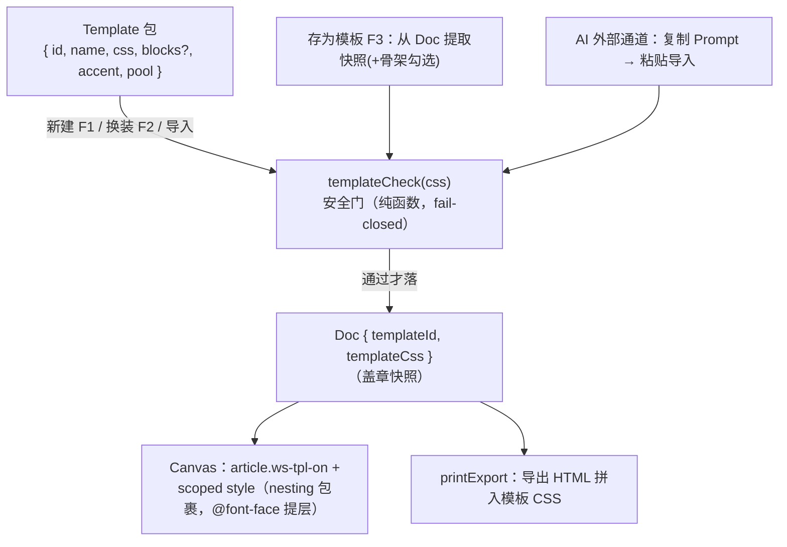

# feat: 用户自定义模板 ui-demo 原型

**工作位置**：ui-demo 常驻 worktree（`/Users/ctlandu/Documents/GitHub/wordspace-next-ui-demo`，现落后 origin/main 150 commit，**先 `git pull`**），从 main 切短命分支 `feat/ui-demo-template-v1`。只动 `ui-demo/**` 与 `docs/features/`，不碰真 app `src/**`。

## Summary

按 origin 需求文档（Q1–Q5 已全拍，KD6 ui-demo-first）在 ui-demo 落第一站：模板 = 受管制 CSS 包 + 可选骨架，支持从模板新建、给既有文档一键换装（悬停/键盘预览、toast 撤销）、存为模板、`/templates` 管理页（改名/删除撤销/导入导出/编辑 CSS）、demo 级但真实执行的 CSS 安全门、AI 生成走「复制 Prompt + 粘贴导入」外部通道。产出给 Wendi 目验定稿；真 app 移植的硬活（校验器白名单、生产级安全门、撤销栈、语义 CSS 降权）全部记账到 feature spec 欠账区、本计划不做。

---

## Problem Frame

origin 文档已论证：合规文档今天没有任何装饰通道（作者 style 即非合规），模板 = 给装饰开一条带安检的通道。ui-demo 现状（研究核实）：**没有** `/templates` 页；现有 `Template` 类型是纯骨架 + 装饰色（`accent`），「CSS 包」是新维度；Canvas 是共享 DOM 不是 iframe——模板 CSS 必须强制作用域；用户调色是真·行内样式——「手调保留」在 demo 里由层叠免费保障（真 app 才需要语义 CSS 降权那套）。

---

## Requirements

- R1. ui-demo 的模板是声明式数据包（`css` + 可选 `blocks` 骨架 + 元数据）；应用 = 把 CSS 快照盖章到 Doc 上，渲染只作用于文档区、不漏到 app chrome。（origin R1/R3/KD2）
- R2. demo 级 CSS 安全门真实执行且 fail-closed：禁外链 `url()`（放行 `data:font/*`、`data:image/*` 拒 svg）、禁 `@import`/`expression()`/`-moz-binding`/`behavior:`、禁 `position:fixed/sticky/absolute`、禁 `!important`、视觉完整性最简版（拒作用于正文的 `display:none`/`visibility:hidden`；`content` 注入/同色检测需真 CSS 解析，随生产级门、记 spec 欠账）、体积预算（软提示/硬拒绝）；违规整份拒绝并给人话原因。（origin R2/KD7）
- R3. 新建文档可从模板起：骨架 + 样式一起落。（origin R4）
- R4. 既有合规文档一键换装/卸装：只动模板字段，块内容与行内手调分毫不动；操作带 toast 撤销。（origin R5/R6）
- R5. 非合规文档（`rawHtml` 且 `checkSchema` 不过）**与 `.md` 文档（`format === 'markdown'`——头部样式无法持久化，Q3 已拍挪后）**换装入口禁用并分别说明原因。（origin R7）
- R6. 存为模板（命名 + 含骨架勾选 + 重名确认不静默覆盖）；`/templates` 管理页：分组列表、预览、重命名、删除（toast 撤销）、导出/导入 JSON（导入过门）、编辑 CSS（过门后保存）、空态引导。（origin R8/R9/R10）
- R7. AI 生成模板走外部通道：复制创作 Prompt + 粘贴导入框（导入过门）。（origin R13）
- R8. 内置「标书」黄金模板：内嵌 `data:font` 小字体 + `data:image` logo + 封面观感，必须通过安全门——表达力验收的 demo 化。（origin R15/AE8）
- R9. 模板与导出/分页兼容：分页打印导出（`printPagedDoc`）携带模板 CSS 且容器类命中（屏显 = 导出）；分页文档换模板后分页点正确重排。demo 的导出范围收窄到分页打印——非分页导出在 ui-demo 现状是 toast mock（`store.exportDoc` 无真实产物），事实记 spec 欠账。（origin KD2 自包含精神；评审核实 printPagedDoc 的 iframe body 是裸块、无容器）
- R10. 同 PR 建 `docs/features/user-template.md` feature spec：ui-demo 侧锚点 + 真 app 欠账全列。（仓库对齐制度铁律）

---

## Key Technical Decisions

- **Doc 上盖章两字段：`templateId?` + `templateCss?`（快照语义）。** 文档携带 CSS 拷贝而不是引用——模板事后被改不影响已盖章文档，重新应用才更新。对齐真 app「入盘自包含」契约与 origin 的版本语义；加在 `pageFormat?` 旁（研究指认的自然位置）。改 seed 形状须 bump `SEED_VERSION`（store.ts 惯例，代价是 demo 库重置）。
- **作用域 = 原生 CSS nesting 包裹。** 注入形如 `.ws-doc.ws-tpl-on { <模板 CSS> }` 的 `` 挂在 article 前（研究确认无 iframe）；**previewCss 放 `ui.ts`（useUI）字段、Canvas 订阅**——App 里 Canvas 无 props、画廊弹层在另一子树，store 是唯一干净通道，U3 只写该字段不改接口；pageFormat 与模板 CSS 是正交维度（版式 class + 主题样式并存）。
- **Test scenarios:** 带模板的 doc 渲染出主题（背景/标题字体变化可断言 computed style）；app chrome 元素（侧栏/工具条）computed style 不受模板影响（防泄漏断言）；行内标红的 span 换模板后仍红（**Covers AE3**）；`printPagedDoc` 构造的 HTML 含模板 CSS 且 `.ws-doc.ws-tpl-on` 容器类命中（**Covers R9**）；分页文档换模板（改字号）后 `paginateBlocks` 重新执行、页数变化合理（手动 + `scripts/verify-paged-v4.mjs` 回归不破）。
- **Verification:** 上述断言进 `scripts/test-template-gate.mjs` 或独立 smoke 脚本（Playwright 驱动，仿 `test-page.mjs` 形状）；build 过。

### U3. 换装流（DocMenu 入口 + 画廊弹层 + 预览 + 撤销）

- **Goal:** 既有文档的一键换装体验成立——这是 origin Q2 拍进 v1 的差异化点。
- **Requirements:** R4, R5。
- **Dependencies:** U1, U2。
- **Files:** `ui-demo/src/components/canvas/DocMenu.tsx`（「应用模板…/更换模板…」+「移除模板」+ 非合规禁用态）、`ui-demo/src/components/TemplateGalleryModal.tsx`（新）+ 配套 css、`ui-demo/src/mock/ui.ts`（弹层开关，进 `anyOverlayOpen`）、`ui-demo/src/mock/store.ts`（`applyTemplate(docId, templateId|null)`：快照旧值 → 盖章 → toast 带撤销）。
- **Approach:** 画廊做**贴边侧挂面板**（右侧滑入；借 `.ws-modal` 的壳样式但不用「居中 + 全屏暗幕」布局，预览期间暗幕不上或近透明）——预览的卖点是真实内容实时套，`.ws-modal-overlay` 的 32% 居中暗幕会把正被换装的文档盖住/压暗，文档主列必须在预览时完整可见（评审实测抓出）。分组只有**官方 / 我的**两组（`Template.origin` 驱动；「团队」组随 Q3 挪后、v1 不出现占位），U4 的 CreateModal 同款分组。卡片 hover **与键盘聚焦（Tab/方向键）** 都触发 previewCss（origin 拍的键盘等价）；离开/Esc 清预览；确认落章。禁用判定 = `App.tsx` MainDocs 现有那行（`doc.rawHtml && !checkSchema(...).conform`）**或 `doc.format === 'markdown'`**——两种禁用文案分开写（非合规 vs「.md 暂不支持模板」）。
- **Test scenarios:** apply → toast 撤销 → templateId/templateCss 恢复原值（**Covers AE1 换装干净**：blocks 引用不变）；hover 预览后不点确认 → 关弹层后文档无变化；键盘聚焦触发与 hover 等价的预览；非合规文档菜单项 disabled 且原因**键盘可达**（禁用行旁常驻小字或 `aria-describedby`，不只 title）（**Covers AE4 同型**）；`.md` 文档菜单项 disabled（专属文案）；「移除模板」→ 回素颜。
- **Verification:** smoke 脚本覆盖 apply/undo/preview 三链路；目验动效符合「纸方墨圆」（动效一等公民）。

### U4. 新建流（CreateModal 升级）

- **Goal:** 从模板新建时骨架 + 样式一起落，模板卡片能看出「有样式」。
- **Requirements:** R3。
- **Dependencies:** U1, U2。
- **Files:** `ui-demo/src/components/CreateModal.tsx`（卡片加样式预览标识/迷你色样）、`ui-demo/src/mock/store.ts`（`createFromTemplate` 盖章 `templateId/templateCss`）。
- **Test scenarios:** 从「标书」新建 → 文档带主题 + 骨架块（**Covers AE5**）；从空白新建 → 素颜无模板字段；从纯骨架模板（无 css）新建 → 有骨架无主题。
- **Verification:** smoke 断言 + 目验。

### U5. 存为模板 + `/templates` 管理页

- **Goal:** 模板库的完整生命周期：产生（存为/导入）、维护（改名/编辑/删除）、流通（导出）。
- **Requirements:** R6。
- **Dependencies:** U1（门）；U3（DocMenu 挂「存为模板…」入口）。
- **Files:** `ui-demo/src/App.tsx`（`/templates` 路由——研究确认是新建）、`ui-demo/src/components/ArcSidebar.tsx`（`arc-foot` util 数组加入口）、`ui-demo/src/components/TemplatesPage.tsx`（新）+ css、`ui-demo/src/components/SaveTemplateModal.tsx`（新：命名 + 含骨架勾选 + 重名确认）、`ui-demo/src/mock/store.ts`（模板 CRUD：rename/delete 带 toast 撤销/import/export/updateCss）。
- **Approach:** 删除撤销照抄 `deleteFileWithUndo` 形状；导入导出照抄 `BookmarksPage.tsx:28-52`（Blob 下载 + hidden input 上传 + 分档 toast）；编辑 CSS = textarea → `templateCheck` → 通过才保存、violations 人话展示；空态给三条引导（存为模板/导入/看官方模板）。
- **Test scenarios:** 存为（含骨架/不含骨架）→ 画廊出现且可新建复现观感；重名 → 确认提示不静默覆盖；删除 → toast 撤销恢复；导出 → 导入 roundtrip 等值（**Covers AE6 文件导入半边**——共享文件夹半边随 origin R11 挪后）；导入违规 CSS → 整份拒 + 人话原因（**Covers AE2**）；「存为模板」对非合规/`.md` 文档同样禁用（无模板段可提取）；编辑 CSS 引入 `!important` → 保存被拒；空态文案出现于零用户模板时。
- **Verification:** smoke 覆盖 roundtrip 与拒绝路径；目验管理页吃 tokens.css 变量（不硬编码色值）。

### U6. AI 生成入口 + feature spec + 验收收尾

- **Goal:** AI 外部通道闭环 + 制度账 + 给 Wendi 的验收物。
- **Requirements:** R7, R10。
- **Dependencies:** U1, U5。
- **Files:** `ui-demo/src/lib/template-prompt.md`（新：外部 AI 创作模板的规则 Prompt——把 R2 门规则写成 AI 可执行约束，形状仿 `schema-prompt.md`）、`ui-demo/src/components/TemplatesPage.tsx`（「AI 生成」区：复制 Prompt 按钮 + 粘贴导入框→门→预览→保存，交互仿 `Agents.tsx` 的 copied 态）、`docs/features/user-template.md`（新 spec：行为契约 + ui-demo 锚点 + **真 app 欠账全列**——校验器 `data-ws-template` 白名单、生产级 CSS 安全门（真解析）、撤销栈扩展、语义 CSS 降权 + 块颜色通道、大文档预览降级、printExport 对应、公司库/公共池/.md/字体子集化 per origin KD6/KD7）。
- **Approach:** prompt 单拷贝入 ui-demo（暂无三份拷贝问题；若将来入 skills 分发再加防漂移锁——spec 里记一句）。
- **Test scenarios:** 复制按钮进剪贴板 + copied 态；粘贴一段合规 CSS+JSON → 门过 → 库里出现；粘贴违规产物 → 拒 + 原因。
- **Verification:** spec 过一遍 origin 的 R/AE 清单确认欠账无漏项；Vercel 预览链路可走通（合 main 后自动部署）；给 Wendi 一份 5 分钟验收路径（新建标书 → 换装 → 手调标红再换装验保留 → 存为模板 → 删除撤销 → 导出导入）。

---

## Scope Boundaries

**Deferred to Follow-Up Work（真 app 移植，等 Wendi 定稿后按 /align-feature 走）**

- 校验器 `validateHead` 放行 `<style data-ws-template>` + 生产级 CSS 安全门（真 CSS 解析，防转义绕过）+ 变异自检。
- 撤销栈扩展到 head（或独立「恢复上一模板」机制）；语义 CSS 降权 + 块级颜色手调通道迁移（origin Dependencies 三件套）。
- printExport/PDF 真 app 对应；大文档/分页的预览降级策略。
- 公司库（共享文件夹）、公共池（静态索引）、`.md` 模板通道、字体子集化——origin KD6/KD7 已拍挪后。
- **Origin 需求/验收例映射交代**（评审要求显式）：origin R11（公司库）/R12（公共池）随 Q3 挪后；**origin R14（Agent 可编程取用）与 AE7** 属真 app 形态——「模板包 = 磁盘可读文件」在 ui-demo 的 localStorage 库里无法演示，随移植落地；AE6 的文件导入半边由 U5 覆盖、共享文件夹半边随 R11 挪后。体积预算的真 app 原值（软 5MB/硬 20MB）与 demo 缩放值（256KB/1MB）的差异记 spec 欠账。

**非目标**

- 不碰真 app `src/**`；不做可视化主题编辑器（origin 已 defer）；不做应用内对话 AI（外部通道先行）。

---

## Risks & Dependencies

- **PR #182 / #194 合并顺序**：origin 文档已随 #194 进 main；#182（Schema 研究，被 origin 引用）auto-merge 挂着——不阻塞本计划。
- **SEED_VERSION bump 会重置 demo 本地数据**——demo 惯例可接受，PR 描述里提一句免得 Wendi 困惑。
- **CSS nesting 兼容性**：Vite/现代 Chromium 环境无虞（demo 只跑现代浏览器 + Vercel）；真 app Electron Chromium 同样支持，移植无障碍。
- **分页 × 模板的重排**是本计划唯一的集成未知数（理论上测量链自动跟，U2 实测；`verify-paged-v4.mjs` 回归兜底）。

---

## Sources / Research

- origin：`docs/brainstorms/2026-07-14-user-defined-template-requirements.md`（R1–R15/AE1–AE8/KD1–KD7，七路评审收口，Q1–Q5 已拍）。
- 仓内研究（2026-07-14，按 origin/main HEAD=3924018 核实）：`ui-demo/src/types.ts`（Doc/Template 形状）、`ui-demo/src/mock/store.ts`（zustand persist / SEED_VERSION / `deleteFileWithUndo` / `createFromTemplate`）、`ui-demo/src/components/Canvas.tsx`（直接 DOM、`ws-fmt-*` class 先例）、`ui-demo/src/lib/schemaCheck.ts`（门形状范本 + `author-style` 禁令）、`ui-demo/src/components/BookmarksPage.tsx`（导入导出范本）、`ui-demo/src/components/Agents.tsx`（复制 Prompt 范本）、`ui-demo/src/lib/printExport.ts`（导出不带模板 CSS 的坑）、`ui-demo/src/styles/tokens.css`（纸方墨圆 token）。
- ui-demo-only PR 的 CI 现实：required checks 会 skip——验证靠门脚本 + build + Vercel 目验。
