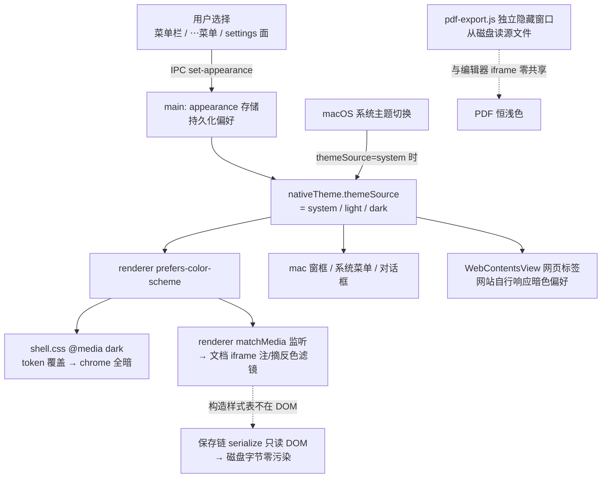

# feat: 浅色/深色/跟随系统三态外观模式（ui-demo + 真 app）

## Summary

给 Wordspace 做三态外观模式（浅色 / 深色 / 跟随系统，默认跟随系统），ui-demo 和真 app 两边都做。深色覆盖整个界面：编辑器 chrome 走「纸方墨圆」暗色 token 变体；文档内容区用**视图级智能反色滤镜**变暗——只影响屏显、永远不写入文件；PDF 导出维持浅色纸面。真 app 以 Electron `nativeTheme.themeSource` 为唯一枢纽实现「跟随系统」（窗框 / 系统菜单 / 对话框 / 网页标签一并跟随）。

> 代码锚点：本 plan 所有文件行号以 `origin/main` tip `8f9c3c3`（2026-07-14）为准。实现分支必须从最新 main 切出——main 当前多 session 并行合入非常活跃。

---

## Problem Frame

Wendi 提的原话是「wordspace 浅色深色模式跟随系统」。当前两边都是纯浅色，仓库里零主题基建（全仓 grep `nativeTheme` / `prefers-color-scheme` 零命中；唯一 `color-scheme: light` 在 `src/renderer/shell.css:13`，当初 VC-16 刻意锁死防系统暗色反色原生控件）。

两个产品拍板（Colin，2026-07-14）：

1. **纸面口径 = 全暗含文档（视图级滤镜）**。在「只暗 chrome 纸保持白（Word 式）」「全暗含文档（Notion 式）」「仅 Schema 文档暗」三选项中选了全暗。这是对 Schema §0 冻结决策（`docs/schema-1-draft-v0.md:15-27`「显示 = 永远按 .html 原生渲染（所见即所得）；编辑器不主动套装饰样式」）的**显式偏离**：暗色屏显 ≠ 浏览器直开 / PDF 导出的样子。偏离的边界收窄为：滤镜是纯视图态、绝不入盘，PDF 导出与磁盘字节永远维持文档原生（浅色）形态。Wendi 需在真机看过效果后追认观感（见 R12）。
2. **入口 = 菜单栏 + 右上⋯菜单双入口，默认「跟随系统」**。

---

## Requirements

**模式与跟随**

- R1. 三态外观模式：浅色 / 深色 / 跟随系统；默认「跟随系统」；选择跨重启持久化。
- R2. 「跟随系统」下，OS 主题切换时 app 全界面实时跟随（无需重启/刷新）；显式选浅色或深色时无视系统。
- R3. 真 app 的系统级表面（mac 窗框、系统菜单、原生对话框）与 app 界面同步明暗。

**深色覆盖面**

- R4. 编辑器 chrome（侧栏 / 标签栏 / 顶栏 / 工具条 / 菜单 / 浮层 / 降级条 / 起始页 / 更新面板等一切宿主层 UI）在深色下全量走暗色 token，无漏网的刺眼亮块。
- R5. 文档内容区（合规块编辑 / 非合规基础编辑 / .md srcdoc 三条渲染路径）在深色下由视图级智能反色滤镜变暗：普通浅色文档变暗、图片/视频等媒体不反色、本身就是深色设计的文档不做二次反转。
- R6. 浏览器网页标签不强制反色：只把深色偏好透传给网站（`prefers-color-scheme`），支持深色的网站自动变暗，不支持的保持原样。

**保真与导出（不可破的红线）**

- R7. 滤镜只存在于显示层：深色模式下做任何编辑并保存，磁盘字节与浅色模式下做同样编辑**完全一致**（零污染）。
- R8. PDF 导出永远输出文档原生（浅色）形态，与外观模式无关。

**入口与两侧对齐**

- R9. 真 app 入口：菜单栏三态单选 + 右上⋯菜单入口 +（顺手）现有 settings 面（`open-settings`）加外观区，三处状态一致。
- R10. ui-demo 同样三态 + 跟随系统 + 持久化（localStorage），入口放现有 Settings 页。
- R11. `docs/features/appearance.md` 对齐 spec 与实现同 PR 落地（行为契约 / 文件映射 / 有意分歧 / 对齐锚点四段），PDF 恒浅色、preview 态 iframe 媒体反色局限等记入「有意分歧」。
- R12. 暗色 palette 是设计基调变更：`docs/style.md` 色 token 表同 PR 补暗色定义；最终观感由 Colin/Wendi 真机验收拍板（工程不自决）。

---

## Key Technical Decisions

- **跟随系统的唯一枢纽 = 主进程 `nativeTheme.themeSource`**。持久化偏好在 main 启动时和每次切换时写入 `themeSource`（`'system' | 'light' | 'dark'`）。理由：这一个 API 同时驱动 ①所有 renderer 的 `prefers-color-scheme` 媒询（含被显式覆盖的两态）②mac 窗框/系统菜单/对话框 ③WebContentsView 里网站的 `prefers-color-scheme`（R6 免费达成）。renderer 侧 chrome 变暗因此**零 JS**：纯 CSS 媒询。
- **chrome 暗色 = token 覆盖块，不动选择器**。真 app 在 `src/renderer/shell.css` 的 `:root` token 块（10-109 行）后加 `@media (prefers-color-scheme: dark) { :root { … } }` 覆盖同名变量；ui-demo 因无 themeSource 可用，用 `:root[data-theme="dark"]` 属性开关 + `matchMedia` 监听实现三态（挂 `document.documentElement`）。两边覆盖**同一组变量名**，palette 值保持一份（style.md 为正本）。
- **文档变暗 = iframe 内注 constructable stylesheet 智能反色，可摘除**。配方方向：`invert(1) hue-rotate(180deg)` 级滤镜（hue-rotate 使色相大体保持，蓝仍是蓝）+ 媒体元素（`img/video/canvas/svg image/背景图元素`）施加同款滤镜反反色 + 「文档本身已暗」启发式跳过。**滤镜选择器钉死 `html`（documentElement），不是 body**，两条硬理由：①编辑器活跃 UI（手柄/格式条/斜杠菜单/浮层，`blockedit.js:221-238`、`draghandle.js:11-36`）全部挂在 documentElement 下、是 body 的兄弟节点——挂 body 它们全逃出滤镜、以浅色白菜单浮在暗文档上；②Filter Effects 规范只豁免根元素：非根元素上 `filter≠none` 会为 fixed/absolute 后代创建包含块（本仓在 transform 入场动画上栽过同类劫持），挂 html 则 fixed 定位不被劫持。实现时别照 zoom/pagination 先例写到 body。**已暗启发式的完整定义**：沿 html→body 取有效画布色、半透明按 alpha 向白色默认底合成、**完全透明视为浅色（施滤镜）**——野生浅色文档大多不设 body 背景（`rgba(0,0,0,0)`），naive 采样会把它们误判成已暗而保持刺眼白；采样必须在文档样式真正生效后执行（srcdoc 路径在 `mirrorSrcdocStyles` 首次 sync 之后、媒询已按当前主题求值）。注入走 `adoptedStyleSheets`，与 `applyZoom`（shell.js:243）/ 分页 `pagination.js:121`（含 361 行摘除写法）同模式，三条渲染路径全覆盖。**不入盘由构造决定**：序列化只遍历 DOM 取 `outerHTML`（`src/editor/serialize.js`），adoptedStyleSheets 不在 DOM——`blockedit.js:9`、`shell.js:239` 注释均已明文声明该性质。精确滤镜参数（invert 强度、媒体选择器集合、启发式阈值）是执行期 spike 校准项（U3），plan 不预写。
- **弃用备选：Chromium `WebContentsForceDark`**。它是 app 级全局旗标：会连宿主 chrome 一起强制变暗（与我们自己的暗色 token 双重叠加）、per-iframe 无法控制、且把「哪些文档变暗」的决定权交给 Blink 启发式而非我们的 Schema 语义。constructable stylesheet 方案可逐 iframe 控制、可摘除、可测试。
- **iframe 内注入的编辑器 chrome（`blockedit.js` EDITOR_CSS 等 JS 字符串里 ~130 处硬编码色）v1 不做 token 化改造**。它们随文档一起被反色滤镜处理，`invert+hue-rotate` 后灰阶翻转、色相大体保留，观感可接受（spike 验证）。逐色 token 化 5 个 JS 字符串文件是大工程、收益低，明确不做（见 Scope Boundaries）。
- **持久化**：真 app 抄 `src/main/browser-store.js` 的 mkCell 模式（防抖 500ms + tmp+rename 原子写 + 退出 flushSync）建 appearance 存储——独立小 JSON 还是并进现有 settings 存储由实现时定，两个先例都在（`browser-settings.json` vs `workspace-store.js` raw 顶层键）。ui-demo 存独立 localStorage 小键（先例：`ArcSidebar.tsx` 的 `ws-arc-width`）。
- **两处刻意的旧决定要翻案**：①`shell.css:13` `color-scheme: light`（VC-16）改为随主题输出 `light`/`dark`，否则暗色下原生控件（滚动条/表单）仍是亮的；②`src/main/web-tabs.js:135` `view.setBackgroundColor('#ffffff')`（防首绘闪文档）改为按当前有效主题给底色，**且要订阅 `nativeTheme` 的 `'updated'` 事件对 registry 中所有存活 view 重新 setBackgroundColor**——view 是长命的，只在创建时取值的话「先开标签、后切主题」这条常见路径上闪错色原样复活。
- **PDF 恒浅色（R8）的保障有两层，不只磁盘隔离**：`nativeTheme.themeSource` 是进程级的，导出隐藏窗口的 `prefers-color-scheme` 同样会翻暗——自带 `@media (prefers-color-scheme: dark)` 的野生文档可能把暗色排版印进 PDF。修法（二轮评审对着真代码钉死的时序，别走样）：`src/main/pdf-export.js` 在 loadURL 后、**两条导出分支之前**统一 `debugger.attach` 并 `Emulation.setEmulatedMedia`，`printToPDF` 完成后才 detach。两个坑：①现状分页/自分页分支（pdf-export.js:40-50）在 attach 之前就 printToPDF 并 return——自分页+自适暗的公函类文档在这条分支上零保障；②现状非分页分支量高后 finally 立即 detach（:64）早于 printToPDF（:75），CDP Emulation 随 detach 复位；③量高用的 `media:'print'` 与 `features:[{name:'prefers-color-scheme',value:'light'}]` 必须并进**同一次** setEmulatedMedia 调用——该命令整体替换 emulation 状态，分两次调用会互相清掉。U7 用自适暗 fixture 验证。

---

## High-Level Technical Design

主题信号流（真 app）：

各表面在深色下的行为：

| 表面 | 深色行为 | 机制 |
|---|---|---|
| 编辑器 chrome（侧栏/标签/工具条/浮层/起始页） | 暗色 token | `@media (prefers-color-scheme: dark)` 覆盖 `:root` 变量 |
| 文档纸面（file:// 直载 / .md srcdoc / reload 三路） | 智能反色（媒体除外、已暗文档跳过） | iframe 内 constructable stylesheet，可摘除 |
| 编辑器注入 iframe 的 UI（手柄/格式条/斜杠菜单） | 随文档滤镜一起反色 | 不单独处理（KTD） |
| 浏览器网页标签 | 透传偏好，不强制反色 | nativeTheme → 网站自己的 `prefers-color-scheme` |
| mac 窗框/系统菜单/对话框 | 跟随 | nativeTheme 原生行为 |
| PDF 导出 | 恒浅色（文档原生） | 独立窗口从磁盘读，滤镜不可达 |
| ui-demo（Canvas 直渲染 + BasicEditor iframe） | chrome 暗 token + 文档容器滤镜 | `:root[data-theme]` + matchMedia |

---

## Scope Boundaries

**明确不做（v1）**

- 不做 iframe 内编辑器 CSS 字符串（EDITOR_CSS / toolbar / insert / draghandle / slashmenu 等 ~130 处硬编码色）的 token 化改造——靠反色滤镜整体处理。
- 不反色 PDF 查看器（`src/renderer/pdf-viewer.js`）内容和浏览器 mock 页面（ui-demo `MockSites.css`）——PDF 与网页同属「别人的内容」口径。
- 不做按文档级的滤镜开关（「这一篇不要暗」），不做定时切换/日落跟随。
- 不做导出暗色 PDF 选项。

**Deferred to Follow-Up Work**

- 若 spike 发现个别野生文档反色翻车且启发式救不了：追加按文档禁用滤镜的逃生口（进 feature spec 欠账，不阻塞 v1）。
- Schema baseline（`blockedit.js` BASELINE_CSS）的原生暗色变体（真·深色排版而非反色）——需要 Schema 侧设计决策，独立 feature。

---

## Implementation Units

按「ui-demo 先定稿、再移植真 app」制度排序（`docs/features/README.md`）。U1-U3 是 ui-demo 侧定稿，U4-U7 真 app 移植与加固，U8 收尾对齐。**发布口径：真 app 侧 U4-U7 合同一个 PR 落 main**——`@media (prefers-color-scheme: dark)` 一进 main 就对暗色系统用户生效（无法「装上不启用」），若拆 PR 会出现「暗 chrome + 刺眼白文档 + 无退出开关」的中间态，而本仓从 main 高频发版。U 间依赖只约束实现顺序，不代表逐单元发布。

### U1. 暗色 palette 初稿 + token 地基（ui-demo）

- **Goal**：产出「纸方墨圆」暗色变体的第一版 token 值，落进 ui-demo，作为两侧共用的 palette 正本。
- **Requirements**：R12（partial：初稿）、R4 的 ui-demo 半边地基。
- **Dependencies**：无。
- **Files**：`ui-demo/src/styles/tokens.css`（加 `:root[data-theme="dark"]` 覆盖块）、`docs/style.md`（色 token 表补暗色列，标注「初稿待 Wendi 拍板」）。
- **Approach**：暗色语义映射方向——纸（暖白 stone 灰阶）反转为暖黑 stone 深灰（不用冷黑，遵守 style.md §1 暖墨基底铁律）；墨色控件反转为亮墨；`--c-accent` 墨青蓝在暗底上提亮一档保证对比度；投影在暗色下改用更重的透明度而非发光（§0-4 禁 glow）。逐变量给出暗色值，变量名与亮色一一对应、不增不删。**另交付一份文本×背景配对清单**（每个文本/语义 token → 允许出现的背景 token + 等级 正文/次要/大字；placeholder 级明确豁免或单列阈值），与暗色列同走 R12 验收——它是 U7 对比度门的遍历依据。
- **Patterns to follow**：`ui-demo/src/styles/tokens.css` 现有分组注释结构；`docs/style.md` §6「改基调 = 改本文件 + tokens.css 同 PR」。
- **Test scenarios**：Test expectation: none — 纯 token 定义，观感验收在 U2 挂上开关后人工看。
- **Verification**：tokens.css 暗色块变量集合与亮色块完全同名同序（可脚本 diff 变量名清单）；初稿即对文本/语义色跑一遍对比度自检（正文 ≥4.5:1、大字 ≥3:1,正式门在 U7）；style.md 表格渲染正常。

### U2. ui-demo 三态切换机制 + 入口

- **Goal**：ui-demo 可用的三态外观模式，含跟随系统与持久化。
- **Requirements**：R1、R2、R10。
- **Dependencies**：U1。
- **Files**：`ui-demo/src/App.tsx`（或独立 `ui-demo/src/appearance.ts` 小模块：读 localStorage → 算有效主题 → 挂 `data-theme` 到 `document.documentElement` → `matchMedia('(prefers-color-scheme: dark)')` 监听）、`ui-demo/src/components/Settings.tsx`（三态选择器，抄第 61 行 engine `<select>` 模式）。
- **Approach**：有效主题 = `pref === 'system' ? matchMedia结果 : pref`；只挂/摘 `data-theme="dark"`（浅色不挂属性 = 默认态）。localStorage 键 `ws-appearance`，值 `system|light|dark`，缺省视为 `system`。切换加一层符合 style.md §4 的短过渡（如 token 过渡 120-160ms），并尊重 `prefers-reduced-motion`。
- **Patterns to follow**：`ArcSidebar.tsx:797/815` localStorage 小键读写；Settings.tsx 现有布局。
- **Test scenarios**（vitest，逻辑抽纯函数）：
  - 有效主题计算：`(pref, systemDark) → effective` 六种组合全断言（system+暗→dark、system+亮→light、显式 light+系统暗→light、显式 dark+系统亮→dark、非法存值→按 system、空→system）。
  - localStorage 往返：写 `dark` 重读得 `dark`；清空后回落 `system`。
- **Verification**：Settings 里切三态,chrome 立即变色；选跟随系统后切 macOS 外观,页面实时跟随；刷新页面记忆保持。

### U3. ui-demo 文档区反色滤镜（含滤镜配方 spike）

- **Goal**：深色下 ui-demo 的文档内容区变暗；产出经样张校准的**滤镜配方**（一段 CSS + 启发式规则），供 U6 真 app 复用。
- **Requirements**：R5（ui-demo 半边）、R12（partial：拿这批样张给 Colin/Wendi 看观感）。
- **Dependencies**：U2。
- **Files**：`ui-demo/src/components/Canvas.css` 或新 `ui-demo/src/styles/doc-dark.css`（Canvas 容器滤镜）、`ui-demo/src/components/BasicEditor.tsx`（编辑态 iframe 注 constructable stylesheet；预览态 iframe 无 same-origin,退化为对 iframe 元素整体施滤镜）、样张即现有 mock 文档（`nonConformSamples.ts` 39 处硬编码色、`seed.ts`、`pagedSamples.ts` 正好是现成的野生样本库）。
- **Approach**：spike 校准三件事——①根滤镜参数（`invert(1) hue-rotate(180deg)` 起步,试软化变体）②媒体反反色选择器集合（img/video/canvas/svg image/内联背景图元素）③「已暗文档」启发式阈值（按 KTD 的完整定义:沿 html→body 合成有效画布色,全透明=浅色）。**执行约束**:施滤镜的容器子树内不得有 `position:fixed` 浮层——非根元素 filter 会为 fixed 后代创建包含块,ui-demo 的 `AiSoonModal`（`.ws-aisoon-backdrop`,Canvas.css:492）未 portal、实测在 Canvas 子树内,要先 portal 到 body（沿用 `WebContextMenu.tsx:54` 先例）。配方以注释完备的 CSS 块形式沉淀,U6 直接搬,但注释里必须写明两条移植警示:①ui-demo 是容器滤镜、真 app 是根滤镜（有包含块豁免）,几何行为不同;②真 app 里 themeSource 会把 `prefers-color-scheme` 翻进文档 iframe,自带暗色媒询的文档会先自行变暗——这个输入类在 ui-demo spike 环境不存在（BasicEditor iframe 媒询跟 OS 不跟 data-theme）,配方移植时须在真 app 重校启发式对自适暗文档的判定。
- **Patterns to follow**：BasicEditor.tsx 现有 iframe wire 流程（`wire()` 里注 revealAll 样式的位置）。
- **Test scenarios**：
  - Covers AE2. 浅色样张 + 深色模式 → 文档容器计算样式含反色滤镜,内部 img 元素带反反色滤镜。
  - Covers AE3. 自带深色背景的样张 + 深色模式 → 不施滤镜（启发式命中）。
  - 无背景声明的浅色样张（body 计算背景 `rgba(0,0,0,0)`）+ 深色模式 → 施滤镜（透明=浅色,启发式不误判）。
  - 切回浅色 → 滤镜完全摘除（计算样式无 filter）。
  - 深色下注入编辑 UI 的交互态观感检查:格式条按钮 hover、斜杠菜单选中项、focus 圈在反色后语义色相仍可读、不与 chrome 的墨青蓝语汇冲突（人工过,记录截图）。
- **Verification**：三类样张（普通浅色文档 / 带图片文档 / 深色设计文档）人工过一遍观感；Colin/Wendi 在 Vercel 预览上确认方向。

### U4. 真 app chrome 暗色 token

- **Goal**：真 app 宿主层 UI 全量支持暗色。
- **Requirements**：R4、R12（palette 与 U1 同值）。
- **Dependencies**：U1（palette 定稿）。
- **Files**：`src/renderer/shell.css`（`:root` 后加 `@media (prefers-color-scheme: dark)` 覆盖块;第 13 行 `color-scheme` 随主题;收编 token 块外硬编码色（实测 24 处,以 grep 为准——滚动条 rgba 147-148（另 282/312 两处）、`.sb-kind-*` 文件图标色 326-332 等））、`src/renderer/sidebar.js`（JS 内 8 处硬编码色改读 CSS 变量或 token 类）、`src/renderer/pdf-viewer.js`（1 处）、`src/renderer/basic-edit.css`（1 处）、`src/main/web-tabs.js`（135 行首绘底色按主题）。
- **Approach**：palette 从 U1 的 tokens.css 暗色块逐值同步（两文件同名变量,值以 style.md 为正本）;`browser.css`/`update-ui.css` 已零硬编码,token 一换全站生效。**收编的 24 处硬编码色的暗色值同样补进 docs/style.md 色 token 表、走 R12 那轮验收**——不算工程可自行拍板的范围。chrome 主题切换复用与 ui-demo 同款的短过渡（token 过渡 120-160ms）并尊重 `prefers-reduced-motion`（style.md §4）。web-tabs 底色：创建 view 时按 `nativeTheme.shouldUseDarkColors` 取值 + 订阅 `'updated'` 事件刷新全部存活 view（见 KTD）。
- **Patterns to follow**：shell.css 现有 token 注释分组;硬编码收编=定义新变量放 token 块再引用,不改视觉值。
- **Test scenarios**：
  - 深色下宿主关键表面（侧栏、标签栏、顶栏、起始页）`getComputedStyle().backgroundColor` 相对亮度 < 0.2,且严格小于亮色态同表面亮度;亮色态亮度 > 0.8（抄 `e2e/align.spec.js:371`、`e2e/app.spec.js:390-402` 的取色断言模式,亮度函数自写）。
  - 浅色态回归：现有全套 e2e 在浅色默认态下全绿（token 收编不改浅色视觉值）。
- **Verification**：本单元只加 CSS 层,真机翻一遍主要界面无漏网亮块;含浮层（菜单/弹窗/toast/更新面板）。

### U5. 真 app 三态 plumbing（存储 + nativeTheme + 双入口）

- **Goal**：真 app 可切三态、跟随系统、跨重启记忆,菜单栏与⋯菜单双入口。
- **Requirements**：R1、R2、R3、R6、R9。
- **Dependencies**：U4。
- **Files**：新 `src/main/appearance-store.js`（或并入现有 settings 存储,执行期定）、`src/main/main.js`（启动读偏好设 `nativeTheme.themeSource`;`buildMenu()` 111-148 行加「外观」三态 radio 分组,`sendMenu` 模式）、`src/main/ipc.js`（`set-appearance` / `get-appearance` handler）、`src/renderer/index.html`（111-140 行 ⋯菜单加外观项）、`src/renderer/shell.js`（⋯菜单分发链 1008 行起 + 菜单命令分发 1289 行起）、`src/renderer/browser.js`（273/983 行已接 `open-settings` 的 settings 面加外观区）、`src/main/preload.js`（暴露 appearance IPC）。
- **Approach**：主进程为唯一真相源:偏好持久化 + `themeSource` 赋值都在 main;renderer 只发 IPC 和展示当前态。菜单 radio 勾选态在切换后重建菜单或用 `checked` 更新。**⋯菜单入口 = 子菜单三选一**（展开列出 浅色/深色/跟随系统 + 当前态勾选,与菜单栏 radio 同一心智模型;Colin 2026-07-14 拍板,不做单项循环切换）。settings 面外观区是拍板双入口之外的 **scope 追加**（Colin 2026-07-14 追认:留下,补 e2e）。三入口状态必须一致（都从 main 查）。
- **Patterns to follow**：`src/main/browser-store.js` mkCell 防抖+原子写;菜单条目 `{ label, click: () => sendMenu(...) }` 模式;`browser-ipc.js:130-131` settings IPC 对。
- **Test scenarios**：
  - 存储单测:偏好往返（写 dark 读 dark）、缺省 system、非法值回落 system;偏好→themeSource 三态映射各断言一遍。
  - Covers AE1. e2e:`app.evaluate` 设 `nativeTheme.themeSource='dark'` → 宿主 chrome 亮度断言变暗（复用 U4 亮度门函数）;切回 'light' 变亮。
  - Covers AE6. e2e:**机制级断言**——经菜单 IPC 选浅色后,`app.evaluate` 断言 `nativeTheme.themeSource === 'light'`（而非 'system'）。⚠ 别写「切到 light 后验证 chrome 仍亮」的视觉断言:CI runner 系统本就是浅色,那是恒真的假门（S4 要杀的形态）。
  - R6 冒烟 e2e:打开一个自带 `@media (prefers-color-scheme: dark)` 样式的本地测试页为网页标签（**经本地 http server 服务**,先例 `e2e/browser.spec.js:23` 的 `http.createServer`+127.0.0.1 随机端口——file:// 在 web 标签被 §11.3 三处导航守卫封死,直接开本地文件会撞墙）,切深色 → 断言该页媒询解析为 dark（样式生效）,且不存在任何强制反色滤镜。
  - e2e:三入口同步——settings 面切外观后,断言菜单栏 radio 勾选态与 ⋯菜单显示一致（都从 main 查同一真相源）。
  - e2e:切深色 → 重启 app（e2e 有重启先例）→ 仍深色（持久化）。
- **Verification**：菜单栏、⋯菜单、settings 面三处切换互相同步;mac 窗框/系统菜单跟随变暗。

### U6. 真 app 文档 iframe 反色滤镜

- **Goal**：深色下三条文档渲染路径的内容区都被 U3 配方变暗,可摘除、零入盘。
- **Requirements**：R5、R7。
- **Dependencies**：U3（配方）、U5（有效主题信号）。
- **Files**：新 `src/renderer/doc-theme.js`（或并入 shell.js:滤镜注入/摘除模块,持 constructable sheet 引用）、`src/renderer/shell.js`（挂载点与 `applyZoom`（243 行）同点位,覆盖 `loadFromFile` onload / `loadFromHtml` srcdoc / reload 三路;renderer `matchMedia` 变化时对当前 iframe 注/摘）。
- **Approach**：有效主题为暗 → 对 `frame.contentDocument` push 滤镜 sheet（选择器钉死 `html`,媒体反反色,已暗启发式按 KTD 完整定义）;为亮 → 摘除（splice 引用,抄 `pagination.js:361` 摘除写法）。**防白闪走「导航期遮罩」,注入与采样统一定在 onload**（与 applyZoom 同点位——采样在此可靠:srcdoc 在 mirrorSrcdocStyles 首次 sync 后、file:// 在 onload,外链 CSS 已保证加载完）:深色模式下从发起载入到滤镜注入/启发式判定完成前,让 `#doc-frame` 保持不可见或盖一层 chrome 底色遮罩（沿用既有 `frame.hidden` 机制）,判完一次性揭开——深色/浅色文档都零闪,且可确定性测试。⚠ 别试图「抢在首帧前注入」:load 前无可靠钩子（`mirrorSrcdocStyles` 本身就跑在 onload 里,不是抢首帧先例）,且首帧前采不了样,两要求互斥,二轮评审已证伪。遮罩期间显示 chrome 底色;大文档（onload 秒级）遮罩观感（留白/骨架）随 U3 spike 给 Colin/Wendi 看。**realm 铁律**:CSSStyleSheet 必须取自 iframe realm（`linkview.js:47` 注释,跨 realm 会被 adoptedStyleSheets 拒收）。防重注:sheet 引用判存在,抄 `find.js:96` 守卫。文档滤镜切换保持硬切（不做 filter 过渡——渐变反色的中间态观感更差,是既定决策而非留白;chrome 层的短过渡在 U4）。
- **Patterns to follow**：`shell.js:243 applyZoom`（注入点位与生命周期）、`shell.js:674 mirrorSrcdocStyles`（srcdoc 路径的时序）、`pagination.js:121/361`（注入+摘除对）。
- **Test scenarios**：
  - Covers AE2. e2e:深色 + 打开浅色野生 HTML（带 img fixture）→ iframe 的 `html` 计算样式含 invert 滤镜、img 计算样式含反反色滤镜。
  - Covers AE3. e2e:深色 + 打开深色设计 fixture → 无滤镜。
  - e2e:深色 + 打开自带 `@media (prefers-color-scheme: dark)` 的自适暗 fixture → 文档自行变暗后启发式不做二次反转。
  - e2e:UI 在滤镜子树内的**机制级包含性验证**——iframe `documentElement` 的 computed `filter` 含 invert,且格式条元素的 `ownerDocument.documentElement` 就是这个已滤镜的根（closest 链没被挪出去）。⚠ 别断言「UI 面计算样式背景为暗」:CSS filter 是绘制期后处理、不改任何 computed style,那条断言物理上永远红;视觉暗不暗留截图采样/真机 verification。
  - e2e:切回浅色 → iframe 无滤镜残留。
  - 三路覆盖:file:// 直载、.md（srcdoc）、reload 后滤镜态正确。
  - 防闪门:深色下载入含图片的浅色文档,揭开时滤镜已就位——载入全程截图采样不得出现未反色白帧（遮罩机制的强断言;别写「注入时点早于内容渲染」这种测不到真时序的形态）。
- **Verification**：真机开几篇真实文档（含 Wendi 那份公函/行程表样张）翻看观感。

### U7. 验收门：零污染 + PDF 恒浅 + 变异自检

- **Goal**：把三条红线（R7 零入盘、R8 PDF 恒浅、暗色门有牙）铸成 CI 门。
- **Requirements**：R7、R8。
- **Dependencies**：U5、U6。
- **Files**：`e2e/appearance.spec.js`（新,本 feature 的 e2e 全放这）、必要的 fixture HTML、`src/main/pdf-export.js`（导出路径强制 `prefers-color-scheme: light`,见 KTD）。
- **Approach**：零污染门=同一篇文档、同一组编辑操作,分别在浅色态和深色态下执行并保存,断言两次磁盘字节完全一致（口径抄分页 feature 的「数据零污染」验证思路,见 `docs/team-memory.md` 2026-07-10 条）。PDF 门=深色态导出 PDF,断言首页背景采样为浅色（或与浅色态导出的同文档 PDF 页数+MediaBox 一致且背景非暗——具体断言强度执行期定,但必须是 computed/像素级而非「导出成功」弱门）。变异自检=把暗色 token 覆盖块整体注释掉 → 亮度门必须翻红;把滤镜注入调用删掉 → AE2 门必须翻红（先 commit 再变异,CLAUDE.md 两铁律）。
- **Execution note**：动了 `shell.js` + `ipc.js` 共享核心,推 PR 前本地 `npm run test:e2e:dot` 全量跑一次（CLAUDE.md 测试纪律的例外条款,躲不掉）。
- **Test scenarios**：
  - Covers AE4. 零污染字节门（上述）。
  - Covers AE5. PDF 恒浅门（上述）;fixture 集合必须含**自适暗**（`@media (prefers-color-scheme: dark)`）与**自分页+自适暗**（带 `@page`/强制分页符,专打分页导出分支）各一篇,深色态导出后背景采样仍为浅色。实施前先用自适暗 fixture 跑一次**不加任何修复的裸导出基线**——Chromium 可能已在打印管线原生强制 light,若属实要把真实机制记进 feature spec,防止门因错误的原因变绿。
  - 对比度门:遍历 U1 交付的**文本×背景配对清单**跑相对亮度对比度计算（复用亮度门函数）,正文文本 ≥4.5:1、次要/大字文本 ≥3:1,不达标即暗色 palette 未过验收——真机观感拍板（R12）之外的可复现底线。⚠ 不做全叉积:token 表是平铺清单,哪个文本坐哪个背景没有机器可读来源,全叉积必误伤（`--c-text-3` placeholder 级亮色态本就 ~2.5:1）,自选配对则门强度任意。
  - 亮度门与滤镜门的变异自检各一轮（翻红 + 还原翻绿才算数）。
- **Verification**：CI `test` + `e2e` 双绿;变异记录在 PR 描述里。

### U8. feature spec + 设计文档收尾

- **Goal**：对齐制度闭环:spec 落地、style.md 定稿、有意分歧归档。
- **Requirements**：R11、R12（终稿）。
- **Dependencies**：U1-U7 全部。
- **Files**：新 `docs/features/appearance.md`（四段模板:行为契约=三态语义/各表面明暗行为表/切换时序;文件映射;有意分歧=PDF 恒浅、ui-demo 预览态 iframe 媒体反色局限、真 app 用 nativeTheme 而 ui-demo 用 matchMedia、工具栏色板 swatch 显示真色而写入文档后被反转显示（全暗拍板的固有 WYSIWYG 代价）;对齐锚点）、`docs/style.md`（暗色列去掉「初稿」标注,记录 Wendi 拍板结论）。
- **Approach**：按 `docs/features/README.md` 模板,写行为不写实现。
- **Test scenarios**：Test expectation: none — 纯文档。
- **Verification**：spec 四段齐全;「不在有意分歧清单里的行为差异都算漂移」自查一遍。

---

## Acceptance Examples

- AE1. **Given** 外观=跟随系统,**When** macOS 从浅色切到深色,**Then** app 窗框、chrome、文档区全部实时变暗,无需重启。
- AE2. **Given** 深色模式,**When** 打开一篇普通浅色野生 HTML（含图片）,**Then** 文档区变暗且图片保持原色不反相。
- AE3. **Given** 深色模式,**When** 打开一篇本身深色设计的文档,**Then** 不做二次反转（不变亮）。
- AE4. **Given** 深色模式,**When** 编辑文档并保存,**Then** 磁盘字节与浅色模式下做同样编辑完全一致。
- AE5. **Given** 深色模式,**When** 导出 PDF,**Then** 输出为文档原生浅色形态。
- AE6. **Given** 显式选择浅色,**When** 系统切到深色,**Then** app 保持浅色。

---

## Risks & Dependencies

- **palette 观感返工**（概率高、影响中）：暗色值是设计判断,Wendi 看真机后大概率要调。缓解:U1/U3 先在 ui-demo 出效果拿 Vercel 预览给两位过目,palette 收敛后再动真 app（U4 依赖 U1 定稿）;token 架构保证调值只改两个文件。
- **野生文档反色边角**（概率中、影响中）：背景图上的文字、CSS blend mode、半透明层等场景反色可能翻车。缓解:U3 spike 用 mock 样本库先扫雷;启发式跳过已暗文档;真翻车的场景进 feature spec 欠账走 deferred 逃生口,不阻塞 v1。
- **「跟随系统」的 e2e 可测性**（概率低）：真 OS 主题切换不可在 CI 模拟,但 `nativeTheme.themeSource` 本身就是被测枢纽,`app.evaluate` 直接驱动即可覆盖信号链全程;真·OS 联动留一条宿主手工验证记录。
- **共享核心回归**：动 shell.js/ipc.js,按测试纪律例外条款推 PR 前全量本地 e2e（写进 U7 execution note）。
- **并行 session 冲突**：main 极活跃,shell.css `:root` 块是高频改动区。缓解:实现分支勤 rebase;BEHIND 时 `gh pr update-branch`。

---

## Sources / Research

- 代码触点盘点与行号锚定 `origin/main 8f9c3c3`:token 块 `src/renderer/shell.css:10-109`;注样式先例 `shell.js:243`(zoom)/`shell.js:674`(srcdoc 镜像)/`blockedit.js:155-166`/`find.js:96`/`linkview.js:47`(realm 铁律)/`pagination.js:121,361`(注+摘);序列化不含 adoptedStyleSheets 的明文注释 `blockedit.js:9`、`shell.js:239`;持久化先例 `src/main/browser-store.js`、`workspace-store.js`;菜单 `src/main/main.js:111-148`;⋯菜单 `index.html:111-140`;PDF 导出隔离 `src/main/pdf-export.js:20-28`;e2e 取色断言先例 `e2e/align.spec.js:371`、`e2e/fidelity.spec.js:93-105`、`e2e/app.spec.js:390-402`。
- 制度与教训:CSP 拦 iframe inline style→constructable stylesheet(Cmd+F 移植实测,auto-memory find-in-doc);S4 强断言=computed-style 亮度而非查 class;S3 教训「preload require 项目模块+sandbox:false」已过时,现 app 默认沙箱走 IPC;`docs/style.md` §1/§4/§6(暖墨基底/动效/改基调同 PR);`docs/schema-1-draft-v0.md:15-27`(§0 冻结决策原文);`docs/features/README.md`(spec 模板与铁律);CLAUDE.md 测试纪律(定向跑/dot/变异两铁律/共享核心全量例外)。
- 产品拍板:Colin 2026-07-14 选「全暗含文档(视图级滤镜)」与「菜单栏+⋯菜单双入口,默认跟随系统」;暗色 palette 终审权在 Wendi(R12)。
