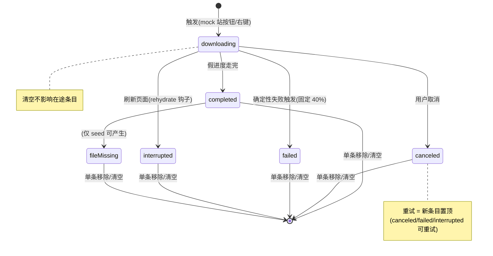

# feat: ui-demo 浏览器下载功能原型(标准档)

## Summary

在 ui-demo 实现浏览器下载的完整 mock 原型:假进度引擎 + 持久化下载记录、侧栏工具栏进度入口 + popover 下载列表、mock 站内嵌自然触发点(普通/大文件/固定失败)、右键「存储图片 / 链接另存为」、完成 toast。同一 PR 内还清 spec 正本的「下载已砍」6 处账。给 Wendi/Colin 定稿形态用;真 app 移植是之后单独的 plan。

## Problem Frame

Wendi 要求浏览器支持下载(origin 文档有完整调研)。下载在 2026-07-09 被拍板砍除,本 feature 是**有边界地推翻该拍板**——恢复基础体验,不做当初担心的臃肿部分(续传/下载页/Safe Browsing)。按 ui-demo-first 制度先做原型定稿。

**mock 边界(与真 app 的刻意差异,U6 里进 spec §13)**:无真文件落盘——「下载文件夹」「在访达中显示」是演示语义(toast 告知);进度是假定时器;真外部 iframe 里的下载拦不到(sandbox 无 allow-downloads),mock 下载只在 mock 站生效。

---

## Key Technical Decisions

- **列表形态 = popover**(锚在侧栏工具栏图标,Chrome 式),不做 `/downloads` 整页路由:整页形态历史页已示范,popover 才是要 Wendi 判断的新体验。popover 盖到网页区时 iframe 会吞 click——**必须用 veil 层关闭**(照 HistoryPage 清除菜单先例),不能靠 document 级 click-outside。(Colin 确认 2026-07-17)
- **失败/取消/已中断给「重试」**:语义 = 新条目置顶重下(再走一遍 uniquify,可能拿到 (1) 后缀,Chrome 同款),不是原条目原地复位。(Colin 确认)
- **侧栏收起(沉浸模式)兜底 = toast**:开始/完成/失败各一条(toast 渲染独立于侧栏);不加收起态角标——沉浸模式收起轨已删,无处可挂。(Colin 确认)
- **推翻砍除令的 spec 还账与实现同 PR**:`docs/browser-feature-spec.md` 6 处砍痕(L30 范围声明 / L358 右键图片节「无下载项」/ L640 will-download cancel / L719 §11 安全不变式第 5 条 / §12 砍除表 / §15 决策日志)全部改写,否则任何审计都判违规漂移(推翻先例写法照「07-17 收藏管理入口改常显——推翻 07-13」)。
- **假进度驱动器放 zustand store 模块级,绝不放组件里**:关掉来源标签/切到文档标签,下载必须继续走(组件卸载杀定时器是 React 最易犯的错)。刷新页面(= mock 的「退出 app」)由 persist rehydrate 钩子把所有 `downloading` 改成 `interrupted`——R4 因此在原型里真实可演示。
- **uniquify 对「diskNames 隐藏集合」查重,清空记录不清它**:否则清空后再下同名文件会退回原名 = 语义上覆盖了「还在磁盘上」的文件(R2+R9 叠加坑)。
- **进行中不用 progress-tone toast**(它永不自动消失,进度归工具栏入口管);完成用 success toast + action「显示」打开 popover(照 exportDoc 先例)。
- **纯逻辑抽 `ui-demo/src/lib/downloads.ts`**(uniquify / 文件名中段截断 / 聚合进度 / 状态机迁移),照 webCtxMenu.ts 对齐真 app 纯逻辑模块的先例,移植时整体搬。
- **i18n**:新文案全部进 `browser` 命名空间双语字典(zh 为源,en 同步);seed 中文数据用 `i18n-exempt` 包裹;PR 前跑 `npm run i18n:scan` 三门 + **对改动文件定向 tsc**(防 `t` 被局部变量遮蔽——HistoryPage 血教训,三门抓不到)。

## High-Level Technical Design

条目状态机(store 与 UI 都按此实现,不许有图外迁移):

逐状态操作集(popover 条目行):

| 状态 | 操作 |
|---|---|
| 进行中(%) | 取消 |
| 完成 | 在访达中显示(演示 toast)、单条移除 |
| 失败 / 已取消 / 已中断 | 重试、单条移除 |
| 文件已被删除(置灰) | 单条移除 |

---

## Requirements

origin 的 R1–R15 全量继承;本 plan 按 mock 语义映射,新增原型特有三条:

- P1. 零态:下载图标**常显**(对齐历史图标),零记录时点开显示空态文案(照 HistoryPage 双零态先例)。
- P2. 多并发:入口进度环显示聚合百分比(Σ已收/Σ总量)+ 活动计数;有任一在途则不复位。
- P3. mock 触发点让 Wendi 无引导即可体验全部流:普通下载(~6s)、大文件(~30s,撑取消/并发/刷新演示窗)、固定失败(40% 处)、右键存图、seed 2 条(1 完成 + 1 文件已删除)。

---

## Implementation Units

### U1. 下载数据层:store + 纯逻辑 lib

- **Goal:** 下载记录的状态机、持久化、假进度引擎、seed。
- **Requirements:** origin R1–R4, R9;P2, P3(seed 部分)。
- **Dependencies:** 无。
- **Files:** `ui-demo/src/mock/downloads.ts`(新)、`ui-demo/src/lib/downloads.ts`(新)、`ui-demo/src/mock/store.ts`(仅挂 `__wsDownloads` 测试 seam,照 `store.ts:1475` 先例)。
- **Approach:** 照抄 `ui-demo/src/mock/history.ts` 的 zustand persist 形状(key `wordspace-downloads`,CAP 100);entry = `{id, filename, sourceUrl, sizeBytes, receivedBytes, state, startedAt}`。假进度引擎:store action `startDownload(spec)` 启动模块级定时器按 sizeBytes 推进(大文件 ~30s、普通 ~6s、失败触发器在 40% 转 failed);`persist.onRehydrateStorage` 把一切 `downloading` → `interrupted`。uniquify / 中段截断 / 聚合进度放 lib 纯函数;`diskNames` 集合独立持久、`clearRecords()` 只清终态条目且不动 diskNames。seed:1 条 completed + 1 条 fileMissing(中文名,`i18n-exempt` 包裹)。
- **Patterns to follow:** `ui-demo/src/mock/history.ts`(全文件);`ui-demo/src/mock/store.ts:1365-1411`(async action + 进度推进)。
- **Test scenarios**(进 U6 烟测 + 本单元可先以 seam 直测):
  - 触发普通下载 → 进度单调递增 → 终态 completed,记录持久化(重读 localStorage 在)。
  - Covers AE1. 同名二连下 → 第二条开始那刻就叫 `xxx (1)`;清空记录后再下同名 → 仍避开 diskNames,不回退原名。
  - 取消在途 → canceled;固定失败触发器 → 恰在 ~40% 转 failed。
  - Covers AE2. 在途中 reload 页面 → rehydrate 后条目 = interrupted,无僵尸进度。
  - 清空:终态条目消失、在途保留;diskNames 不变。
  - CAP:第 101 条挤掉最老终态条目。
- **Verification:** seam 直测 + U6 烟测全绿;i18n 三门过。

### U2. 工具栏入口 + 进度环 + popover 列表

- **Goal:** 用户可见的下载 UI 主体。
- **Requirements:** origin R5–R7 一半(通知在 U5)、R6;P1, P2。
- **Dependencies:** U1。
- **Files:** `ui-demo/src/components/DownloadsPopover.tsx`(新)、`DownloadsPopover.css`(新)、`ui-demo/src/components/ArcSidebar.tsx`(工具栏加按钮,照 :1163 历史按钮)、`ui-demo/src/mock/ui.ts`(popover 开合态,不持久)。
- **Approach:** 按钮 = `arc-ico` 范式 + lucide `Download` 图标;有在途时叠 SVG 进度环(`--c-accent` 细线,聚合百分比)+ 活动计数徽标。popover:纸方(`--r-md`/`--shadow-pop`/1px `--c-border`),墨圆控件 `--r-pill`;veil 层关闭;条目行 = 图标 + 中段截断文件名(title 全名)+ 状态行 + 逐状态操作(见 HTD 表);顶部「清空」;超高内滚。**进度更新只改行内数字/环,不整卡重建**(updater 狂闪血教训)。空态文案 + demo 引导一句。入场动效 `--dur-slow`+`--ease-enter`。
- **Patterns to follow:** `HistoryPage.tsx`(列表/清空/单条删/双零态)、`WebContextMenu.css` / `hist-clear-menu`(浮层配方)、`primitives.tsx` Spinner。
- **Test scenarios:**
  - 零记录:图标在(无环无徽标),点开见空态文案。
  - 两个并发在途:环 = 聚合百分比,徽标 = 2;先完成一条,环不复位。
  - Covers F1/AE3. 完成条目点「在访达中显示」→ 演示 toast,绝无自动打开语义。
  - 逐状态操作集与 HTD 表逐格一致(进行中无「移除”、失败无「访达」)。
  - 长文件名中段截断,扩展名与 (n) 后缀两端保留;title 属性 = 全名。
  - popover 开着时点网页区(真 iframe)→ veil 关闭生效。
  - 强断言按 computed style / boundingBox,不查 class(仓规)。
- **Verification:** U6 烟测覆盖以上;暗色模式下 token 自动适配(手查一屏)。

### U3. mock 站触发点

- **Goal:** Wendi 无引导即可体验全部下载流。
- **Requirements:** P3;origin F1/F3 的可演示性。
- **Dependencies:** U1。
- **Files:** `ui-demo/src/components/MockSites.tsx`。
- **Approach:** FlowDesk hero 加「下载 macOS 版(14.2 MB)」(~6s)+「下载 Windows 版」(固定 40% 失败,演示 F3)+「离线安装包(680 MB)」(~30s 大文件);Tenth Global 加「产品白皮书 PDF(2.1 MB)」(~3s)。按钮点击直接调 U1 的 `startDownload`。MockSites.tsx 在 i18n 扫描白名单内,站内文案可中文直写。
- **Test scenarios:** 每个触发器点击 → 对应条目出现且参数(名字/大小/时长档)正确;Windows 版恰在 ~40% failed。
- **Verification:** U6 烟测。

### U4. 右键「存储图片 / 链接另存为」

- **Goal:** 右键入口走同一下载管线。
- **Requirements:** origin R8。
- **Dependencies:** U1。
- **Files:** `ui-demo/src/lib/webCtxMenu.ts`(链接节加「链接另存为」:33-39 区、图片节加「存储图片」:41-45 区,**删除 :43「下载已砍」注释**)、`ui-demo/src/components/WebView.tsx`(`run()` 接新 id → `startDownload`)。
- **Approach:** 沿用 `isHttp` 门(危险 scheme 整节屏蔽已有);文件名从 URL path 派生(如 hero.jpg),无 path 回落 host + 扩展名。⚠ 此文件是真 app `src/lib/web-context-menu.js` 的双胞胎——改动写法保持两侧同构可移植(移植账记 U6)。
- **Test scenarios:** mock 图片右键 → 存储图片 → 条目出现走完;链接右键另存 → 同;`javascript:` 等危险 scheme 上两项不出现(既有门回归)。
- **Verification:** U6 烟测。

### U5. 通知 + i18n

- **Goal:** 完成/失败/中断的 toast 反馈;全部文案双语。
- **Requirements:** origin R7, R14;KTD 侧栏收起兜底。
- **Dependencies:** U1, U2。
- **Files:** `ui-demo/src/mock/downloads.ts`(状态迁移处发 toast)、`ui-demo/src/i18n/zh/browser.ts`、`ui-demo/src/i18n/en/browser.ts`。
- **Approach:** 开始 = 短 neutral toast(侧栏收起时唯一可见反馈);完成 = success + action「显示」(打开 popover);失败/中断 = danger/neutral 短 toast。进行中**不用** progress-tone(见 KTD)。文案全 `t()`;组件用 `useT()`、store 用 imperative `t`。
- **Test scenarios:** 完成 toast 的「显示」按钮真打开 popover;侧栏收起态下开始→完成全程有 toast 可感知;`npm run i18n:scan` 三门绿;对改动文件定向 `tsc --noEmit`(防 t 遮蔽)。
- **Verification:** 三门 + tsc + 烟测。

### U6. spec 正本还账 + 烟测门

- **Goal:** 决策反转落账;整条 feature 有牙的门。
- **Requirements:** origin R13, R15;KTD spec 还账。
- **Dependencies:** U1–U5。
- **Files:** `docs/browser-feature-spec.md`(6 处砍痕改写 + §13 刻意差异表加「mock 下载 vs 真下载」行 + §15 决策日志加推翻记录)、`docs/features/browser.md`(锚点/欠账:真 app 移植待做 + 双胞胎菜单同构义务)、`ui-demo/scripts/test-downloads.mjs`(新烟测)。
- **Approach:** spec 改写口径:安全不变式第 5 条从「无下载」改「下载受控」(不自动打开/文件名清洗/锁定下载目录——真 app 语义,ui-demo 注明 mock);§12 砍除表该条标注「2026-07-17 Colin 拍板恢复(标准档),见 §15」。烟测照 `ui-demo/scripts/test-immersive.mjs` 范式:chromium 打 dev server、`locale:'zh-CN'`、清 localStorage、等 `__wsStore/__wsDownloads` seam、强断言;覆盖 U1–U5 场景 + **变异自检**(文档化两个探针:①打掉 rehydrate 钩子 → 刷新用例翻红;②打掉 diskNames 查重 → 清空后同名用例翻红;先 commit 再变异)。
- **Test scenarios:** 即 U1–U5 所列全集,一个脚本串完(触发→并发→取消→失败→刷新中断→重试→清空语义→右键→toast→零态)。
- **Verification:** 烟测全绿 + 变异翻红还原翻绿;spec 6 处 grep 无「下载已砍」残留(留 §12/§15 的历史记录行除外)。

---

## Scope Boundaries

- 不做:`/downloads` 整页路由、断点续传、暂停/恢复、Safe Browsing、下载位置设置、真文件落盘(mock 边界)。
- 真 app 移植(will-download 真接、Finder reveal、e2e 产物 .gitignore、navSeq 契约验证、原生菜单双胞胎同步)= 下一个 plan,不在本 PR。
- 「清除浏览数据」管理入口:origin 已明确本次不做。

## Risks & Dependencies

- 无 PR 分支 Vercel 预览(2026-07-15 起)——Colin 验收走本地 dev server;合 main 后 Wendi 看公开 live。
- 浏览器区并行 PR 多(spec 正本是级联 DIRTY 高发文件)——本 PR 改 spec 6 处,merge 前 rebase 留意。
- src 有 4 个 pre-existing tsc 错——定向 tsc 只对本 PR 改动文件,别全量。

## Sources / Research

- origin: `docs/brainstorms/2026-07-17-browser-downloads-requirements.md`(R/F/AE 全量)。
- 结构侦察:工具栏 `ArcSidebar.tsx:1150-1165`;标签模型 `mock/store.ts:125-148`;URL 机器 `mock/browser.ts`;toast `types.ts:206-213`+`ToastHost.tsx`;i18n 门 `ui-demo/package.json:17` 三脚本。
- 教训:进度面板禁整卡重建(team-memory 2026-07-16 updater③);t 遮蔽只有 tsc 兜(auto-memory i18n);veil 层关闭(HistoryPage 先例);「下载已砍」6 处位置(spec L30/L358/L640/L719/§12/§15)。
