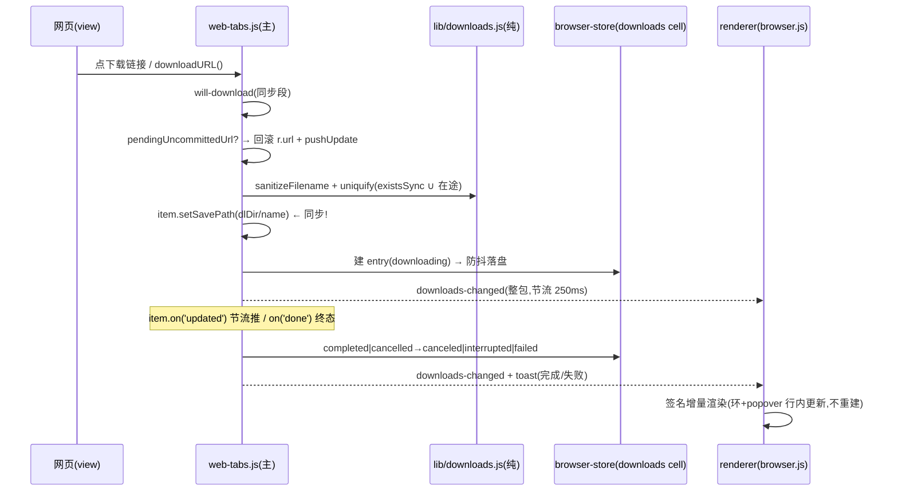

# feat: 真 app 浏览器下载——will-download 真接 + 下载管理(标准档移植)

## Summary

把 ui-demo 已定稿的下载 UI/UX(Colin 2026-07-17 验收)移植进真 app,并补齐真后端:`will-download` 从「一律 cancel」换成真接 `DownloadItem`,真落盘系统「下载」文件夹,下载记录持久化(browser-store 第四 cell),工具栏进度环 + popover 列表,右键「存储图片 / 链接另存为」,访达 reveal。**交互契约以 `docs/browser-feature-spec.md` §4.11 为正本**(ui-demo PR 已把它写好),本 plan 不复述契约、只讲怎么落。

## Problem Frame

ui-demo 原型(PR #272,`docs/plans/2026-07-17-002-feat-ui-demo-browser-downloads-plan.md`)定了形态;真 app 的差异是**后端是真的**:真文件系统(重名/半截文件/磁盘满)、真 DownloadItem 事件流(高频 updated)、WebContentsView 覆盖层约束(DOM 盖不住原生 view)、导航契约(下载导航永不提交)。侦察发现一个移植后才出现的真雷:**地址栏直接敲下载 URL → `navigate()` 乐观写了未提交 url 并被持久化 → 每次重启会话恢复都静默重下一遍**(现状只是重弹 toast,移植后变成真落盘)——本 plan 把回滚机制作为一等需求(U3/R7)。

**执行环境须知**:全仓 CJS 无打包器;单测 `node --test test/*.test.js`;e2e Playwright `_electron`(workers:1,`WS2_LANG=zh` 默认);CI required = `test`(node:test + i18n 三门)+ `e2e`。**侦察行号会漂**(main 高频合入),本 plan 全部给「文件 + 函数/锚点 + 行号(2026-07-17 时点)」,执行时以函数名 re-grep 为准。

---

## Key Technical Decisions

- **popover 锁在侧栏宽度内,不注册 OVERLAY_SEL**(拍板,与 ui-demo 的刻意差异)。原生 view 只占 `#main`(`viewBounds()` browser.js:110-120),popover 照 `.sb-omni-sug` 先例(browser.css:59-72,absolute 锁侧栏宽、z-120)钉在侧栏内 → 永远不被 view 盖、不需要摘 view + 快照垫底(避免冻结帧闪烁)。**关闭途径**:侧栏内 veil + Esc + 入口按钮 toggle + **window blur**(点网页区 = 原生 view 抢焦点 → renderer window 触发 blur → 关 popover;DOM veil 盖不住 WebContentsView,这是真 app 里唯一无损的「点外面关」)。此差异随 U6 记入 spec §13。
- **未提交 url 回滚**(修「重启静默重下」雷):`navigate()`(web-tabs.js:334-343)和 `loadUrlDirect`(:347-352)乐观写 `r.url` 时记 `r.pendingUncommittedUrl`;`onNav`(真提交,:200)清除;`will-download` 触发时若 pending 未清 → `r.url` 回滚到上一个已提交 url + `pushUpdate` + 清 pending。链接点击触发的下载不写 r.url,天然无此问题。
- **下载记录 = browser-store 第四 cell**(`browser-downloads.json`),照 history cell 模式(`browser-store.js` init :32-43 / cell 写策略 500ms 防抖 + 原子 rename / `flushSync` before-quit / subscribe-notify 防抖推送)。**load-sanitize 时把 `downloading` 条目翻成 `interrupted`**——这就是 ui-demo「刷新=中断」语义的真 app 等价物(app 退出中断下载,下次启动记录如实呈现)。CAP 100 只挤终态。
- **命名管线在 will-download 内同步完成**:`item.getFilename()` → `sanitizeFilename`(剥路径分隔符/控制字符/RTL override,R10)→ uniquify(查重集 = **真磁盘 `fs.existsSync` ∪ 在途名**;真 app 磁盘本身就是「清空记录不清磁盘账」的账本,不需要 ui-demo 的 diskNames 影子集合)→ `item.setSavePath(join(dlDir, name))`。⚠ `setSavePath` 必须在 will-download 处理器内**同步**调用(任何 await 之后 Electron 已走默认路径/弹框)。
- **进度推送:主进程算好整包 + 节流,renderer 按签名增量渲染**(照 updater 血教训:`main.js:334` download-progress 整包推 + `update-ui.js` `modelSig` :56-93 原地更新不重建不抢焦点)。`DownloadItem` 的 `updated` 事件很密:节流 ~250ms 或状态迁移即推,通道 `downloads-changed` 广播(照 `bookmarks-changed` browser-ipc.js:25)。
- **单一下载入口**:右键「存储图片/链接另存为」在 `executeCtxAction` 里重校验 `policy.isAllowedNavUrl` 后走 `wc.downloadURL(url)`——自然汇入 will-download 管线,不开第二条路。
- **下载目录**:`app.getPath('downloads')` + home 兜底(照 web-tabs.js:412 / browser-ipc.js:79 的 try-catch 先例);测试 seam `WS2_DL_DIR`(`!app.isPackaged && process.env.WS2_DL_DIR`,照 `WS2_PDF_OUT`/`WS2_BM_OUT` 模式)→ e2e 全程写 tmpdir,仓内零落盘。
- **fileMissing 懒检测**:真 app 能自然产生「文件已被删除」——开 popover 时对终态条目批量 `fs.existsSync`(主进程,一次 IPC),缺失标 fileMissing;「在访达中显示」点击时再校验一次,缺失转态 + toast。不做 watcher(过度)。
- **安全红线**(spec §11.5「下载受控」):只 `shell.showItemInFolder`(先例 ipc.js:576),**绝不 `shell.openPath`**;不自动打开任何下载物;保存路径锁定 dlDir 内(sanitize 兜路径穿越)。
- **重试语义与 ui-demo 一致**:新条目置顶,`downloadURL(sourceUrl)` 重走全管线(重名自然拿 (n))。
- **不动的东西**(navSeq 契约,侦察题 9 结论):`classifyLoadFailure`(web-tabs-policy.js:35-39,-3→ignore)、navSeq 只在真提交自增、renderer 恢复臂(browser.js:343-362)——真下载后下载导航照样 -3 不提交,这条链**零改动**,既有回归门(browser.spec.js:350-373)继续有效。

## High-Level Technical Design

条目状态机与 ui-demo 完全一致(见 spec §4.11);真 app 侧新增的迁移仅一条:load-sanitize 时 `downloading → interrupted`。

---

## Requirements

origin R1–R15 全量继承 + spec §4.11 契约为准;真 app 侧特有:

- P1. `will-download` 不再 cancel;`dialog.noDownload` 文案与 toast 逻辑删除(i18n key 同步清理,zh/en 两侧)。
- P2. 真落盘:文件完整写入 dlDir,重名 uniquify 对真磁盘查重;取消/失败不留半截文件(DownloadItem cancel 后 Electron 自清 .crdownload,e2e 断言目录内无残留)。
- P3. 记录跨重启:browser-downloads.json;启动 load 时 downloading→interrupted。
- P4. **地址栏敲下载 URL:不改变标签持久化 url,重启不复下**(pendingUncommittedUrl 回滚)。
- P5. 进度推送节流(≤~4Hz + 状态迁移即推),popover/进度环增量渲染,高频期间不抢焦点不闪。
- P6. 收起态(沉浸)兜底 = toast(开始/完成/失败),经 `toastOverWeb` + `webToastInset`(browser.js:180-193)保证网页态可见。
- P7. e2e 全程 `WS2_DL_DIR` 指 tmpdir,仓内与 runner 家目录零落盘。
- P8. i18n:新文案入 `browser`/`misc` 命名空间(zh+en,`src/i18n/{zh,en}/`),主进程用 `require('../lib/i18n').t`、renderer 用 `window.wsT`,index.html 新按钮用 `data-i18n-title`(scan 门查裸 CJK 属性);三门在 CI 已有牙。

---

## Implementation Units

### U1. 纯逻辑 lib(CJS 双胞胎)+ 单测

- **Goal:** ui-demo `lib/downloads.ts` 的语义移植 + 真 app 特有的文件名清洗。
- **Requirements:** origin R2, R10;P2。
- **Dependencies:** 无。
- **Files:** `src/lib/downloads.js`(新)、`test/downloads.test.js`(新)。
- **Approach:** 双导出惯例(`module.exports` + 浏览器 IIFE 不需要——本模块只在主进程用,纯 `module.exports` 即可,照 `src/lib/web-history.js` 先例)。函数:`sanitizeFilename`(剥 `/ \ ..` 段、控制字符、RTL/LTR override(U+202A-202E, U+2066-2069)、首尾点空格,空名回落 'download')、`uniquify(name, takenFn)`(takenFn 由调用方提供:existsSync∪在途;剥既有 ` (n)` 后缀再重编)、`aggregateProgress(entries, batchIds)`、`stateActions(state)`(逐状态操作集,renderer 与测试共用单一来源)、`formatBytes`。语义参照 ui-demo `ui-demo/src/lib/downloads.ts` 逐函数对照,**不改行为只换语言**;新增的 sanitizeFilename 是真 app 独有。
- **Patterns to follow:** `src/lib/web-history.js`(模块形状)、`test/browser-store.test.js`(测试形状)。
- **Test scenarios:**
  - sanitize:`../../etc/passwd` → `etcpasswd` 或含义等价的安全名(不含路径段);`a‮gnp.exe` 剥 override;控制字符剥除;空/全非法 → 'download'。
  - uniquify:重名 → ` (1)`;`report (1).pdf` 再重 → `report (2).pdf`(剥后缀重编,ui-demo 同义);takenFn 组合(磁盘有+在途有)。
  - aggregateProgress:批次口径(ui-demo 同义:完成留在批内,cancel/fail 退出)。
  - stateActions 与 spec §4.11 表逐格一致。
- **Verification:** `node --test test/downloads.test.js` 全绿;与 ui-demo lib 的行为对照在测试注释里逐条标注来源。

### U2. browser-store 第四 cell:下载记录持久化

- **Goal:** `browser-downloads.json` 落盘/恢复/推送。
- **Requirements:** P3;origin R9。
- **Dependencies:** U1(sanitize 复用于 load 校验)。
- **Files:** `src/main/browser-store.js`、`test/browser-store.test.js`(扩)。
- **Approach:** 照 history cell(init :32-43 建 cell、:121-127 存取函数):`getDownloads()/setDownloads(entries)`,load-sanitize = 形状校验(id/filename/state 枚举/数值字段)+ **`downloading`→`interrupted` 翻转** + CAP 100 裁剪(挤最老终态,在途保留)。entry 形状与 ui-demo 一致 + `savePath`(绝对路径,reveal 用)。500ms 防抖写盘、before-quit `flushSync` 免费获得(cell 机制自带)。
- **Test scenarios:**
  - 存→读 roundtrip 字段无损;坏形状条目静默剔除。
  - load 时 downloading 条目翻 interrupted(P3 核心,ui-demo AE2 等价)。
  - CAP:101 条挤最老终态,不挤在途。
- **Verification:** node:test 扩展用例全绿;`flushSync` 路径由既有 before-quit 测试覆盖(确认没被本改动破坏)。

### U3. 主进程下载引擎 + IPC 通道

- **Goal:** will-download 真接、命名管线、事件流→store→节流推送、未提交 url 回滚、动作函数与通道。
- **Requirements:** P1, P2, P4, P5;origin R1-R4, R7。
- **Dependencies:** U1, U2。
- **Files:** `src/main/web-tabs.js`(will-download 段 :49-53 重写 + navigate/loadUrlDirect/onNav 三处 pending 标记 + 导出 dl 动作函数)、`src/main/browser-ipc.js`(新通道)、`src/renderer/preload.js`(ws2 dl 段)、`src/i18n/{zh,en}/browser.js`(toast/dialog 文案;删 `dialog.noDownload`)。
- **Approach:**
  - will-download(同步段):回滚 pendingUncommittedUrl(见 KTD)→ dlDir 解析(`WS2_DL_DIR` seam → `app.getPath('downloads')` → home)→ U1 命名管线 → `item.setSavePath` → store 建条目 → 开始 toast(`sendToRenderer('web-toast', …)` 既有通道)。
  - item.on('updated'):写 receivedBytes 进内存态,**节流 250ms** 推 `downloads-changed`(整包 = store 条目 + 在途内存态合成的展示模型;store 本体不必每 tick 落盘——只在状态迁移时 setDownloads,进度值属于易失态,重启本来就翻 interrupted)。
  - item.on('done', (e, state)):'completed'→completed + 完成 toast;'cancelled'→canceled;'interrupted'→interrupted + toast。失败细分:interrupted 事件里 `item.getState()`/错误码可用性有限——**按 done(interrupted) 一律记 interrupted、cancel() 主动调用记 canceled、无法区分网络失败时并入 interrupted**(诚实口径:真 app 没有 mock 的确定性 failed,spec §13 里 mock『下载失败』态映射说明写清;popover 的 failed 行样式保留给未来)。若实测 done 回调能区分 'interrupted' 带 canResume=false 等信号再细分——**执行时实证,别凭 d.ts 猜**(仓训:Electron API 先实证)。
  - 动作导出:`dlCancel(id)`(找在途 item.cancel())、`dlRetry(id)`(store 取 sourceUrl → 任一活 view 的 `wc.downloadURL`?——**不对**:downloadURL 挂在 webContents 上,但下载与页面无关;用 `sess.downloadURL(url)`(Electron session 级 API,42.x 可用性执行时实证;不可用则回落「取激活 web 标签的 wc」+ 无 web 标签时禁用重试按钮))、`dlClear()`(只清终态)、`dlRemove(id)`、`dlReveal(id)`(existsSync → showItemInFolder;缺失→转 fileMissing + 推送)。
  - 通道(browser-ipc.js 照收藏组 :139-149 形状):`dl-list`(启动补拉)/`dl-cancel`/`dl-retry`/`dl-clear`/`dl-remove`/`dl-reveal` + `onDownloadsChanged`。web-tabs.js 零 ipcMain(分工惯例)。
- **Execution note:** Electron API 逐个实证(`sess.downloadURL` 可用性、done 状态枚举、setSavePath 时序)——先写 10 行 spike 脚本真跑,再定实现;别信注释与 d.ts(findInPage/quitAndInstall 前科)。
- **Test scenarios**(主要在 U6 e2e;本单元自证):
  - Covers P4. navigate 到 /dl 地址 → r.url 回滚 + pendingUncommittedUrl 清除(可加 node:test?——不可,要真 Electron;归 U6)。
  - 节流:updated 密集触发时 downloads-changed ≤4Hz(U6 里数事件)。
- **Verification:** `npm test` 全绿(i18n 三门含新 key parity);spike 实证记录写进 PR 描述。

### U4. renderer:工具栏入口 + 进度环 + popover

- **Goal:** ui-demo 定稿 UI 的真 app 复刻。
- **Requirements:** origin R5-R7;P5, P6;spec §4.11 全契约。
- **Dependencies:** U3。
- **Files:** `src/renderer/index.html`(工具栏按钮,插 `#nav-history` 旁,`data-i18n-title`)、`src/renderer/browser.js`(popover 渲染/开合/增量更新/入口环)、`src/renderer/browser.css`(样式,对照 ui-demo `DownloadsPopover.css` 的 token 语义换算到真 app 的 CSS 变量体系)。
- **Approach:** 按钮照 `#nav-history`(index.html:33-35 + browser.js:445 handler);进度环 = 按钮上叠 SVG(照 ui-demo)+ hidden/percent 切换照 `renderPill`(update-ui.js:29-40)写法。popover:**锁侧栏宽**(KTD,照 `.sb-omni-sug` 定位先例)、增量渲染按 `modelSig` 思路(结构签名同→只改文本/宽度)、逐状态操作行用 U1 `stateActions`(经 preload 暴露或复制表——**用 sendSync boot 或 dl-list 载荷带上,别在 renderer 重写一份**)、零态文案、长名中段截断(CSS + title 全名)、清空按钮。关闭 = 侧栏内 veil + Esc + toggle + `window.addEventListener('blur')`。fileMissing 懒检测:开 popover 时 `dl-list` 顺带让主进程 stat 终态条目。
- **Patterns to follow:** `update-ui.js`(增量渲染/签名)、`browser.css` omni-sug(定位)、ui-demo `DownloadsPopover.tsx`(结构与文案语义,1:1 对照)。
- **Test scenarios**(U6 e2e 执行):零态;并发聚合环+徽标;完成不回退(批次口径);逐状态操作集逐格;blur 关闭(点网页区);Esc 关闭;长名截断;暗色(真 app 主题体系)下 token 自适配。
- **Verification:** e2e + 宿主手查一屏(亮/暗)。

### U5. 右键菜单双胞胎 + 通知

- **Goal:** 「存储图片 / 链接另存为」原生菜单落地;toast 三连。
- **Requirements:** origin R8;P6。
- **Dependencies:** U3。
- **Files:** `src/lib/web-context-menu.js`(link 节 :44-49 加 save-link、image 节 http(s) 分支 :54-56 加 save-image;**删两处过期注释**:文件头 :6「砍除项别加回来」与 :57「无下载项」)、`src/main/web-tabs.js`(`executeCtxAction` :452-475 加两 case:重校验 `policy.isAllowedNavUrl` → `wc.downloadURL(url)`)、`test/web-context-menu.test.js`(**:44, :47, :117 三处断言从「不存在」翻转为「存在」**)。
- **Approach:** 与 ui-demo builder 同构(id 同名 save-image/save-link,标签文案 `misc.*` 双语)。toast:开始(neutral)/完成(带「显示」动作?——真 app toast 体系 `__wsToast` 支持 action(sidebar.js:2321 先例);完成 toast 动作 = 打开 popover;若接线成本高,降级为纯文案 toast + 用户点工具栏,**执行时按成本定,允许降级**,spec §13 注明)/失败(danger)。网页态经 `toastOverWeb` + `webToastInset`。
- **Test scenarios:** 单测三处翻转 + 六分节顺序回归;e2e:mock 页图片右键存图真落盘;`javascript:` 链接两项不出现(既有门回归)。
- **Verification:** `node --test test/web-context-menu.test.js` + U6 e2e。

### U6. e2e 门 + spec/账本收尾

- **Goal:** 真下载的权威门;spec 映射与欠账清账。
- **Requirements:** P2, P4, P7;origin R15。
- **Dependencies:** U1-U5。
- **Files:** `e2e/web-downloads.spec.js`(新)、`e2e/browser.spec.js`(两处改写:**:551-570「下载一律 cancel」整条删除**——语义已由新 spec 文件接管;**:350-373 P1 恢复门保留**,launch env 加 `WS2_DL_DIR` tmpdir)、`docs/browser-feature-spec.md`(§13 补三行:veil→blur 关闭差异 / mock failed 态映射 / 完成 toast 动作降级若发生;§14 验收清单勾真 app 项)、`docs/features/browser.md`(欠账①-⑥清账)、`.github` 无需动(三门已在 CI)。
- **Approach:** 新 spec 用既有 harness(`startServer` 的 `/dl` 路由 :45-47 已备;launch env 加 `WS2_DL_DIR`):
  1. 真下载 happy path:导航后点 `/dl` 链接 → 等 completed → **读 tmpdir 文件真实字节断言内容**(强断言,不查 UI 文本);
  2. 重名:连下两次 → `evil.bin` + `evil (1).bin` 两文件都在;
  3. 取消:大响应(server 路由慢发)→ cancel → 状态 canceled + tmpdir 无残留(含 .crdownload);
  4. Covers P4(**风险点回归门**):地址栏 navigate 到 /dl → toast/记录出现但标签 url 未变 → 重启(二次 launch 同 userdata)→ **不产生新下载记录**;
  5. 重启中断:在途中关 app → 重启 → 条目 interrupted;
  6. popover:开合(含 Esc/点网页区 blur 关)、逐状态操作、清空只清终态;
  7. 进度环:有在途时出现且 stroke 真着色(computed);
  8. 收起态 toast:侧栏收起下开始下载 → toast 可见(boundingBox 在视口内)。
  - **变异自检两探针**(先 commit 再变异,文档化在 spec 文件头):① 打掉 uniquify 调用(直接用原名)→ 用例 2 翻红;② 打掉 pendingUncommittedUrl 回滚 → 用例 4 翻红。变异翻红 + 还原翻绿才算门有牙。
- **Test scenarios:** 即上列 1-8。
- **Verification:** 定向 `npx playwright test e2e/web-downloads.spec.js e2e/browser.spec.js` 绿;**动了 web-tabs.js/browser.js 共享核心 → 推 PR 前本地 `npm run test:e2e:dot` 全量兜底一次**(CLAUDE.md 纪律);变异双向记录进 PR。

---

## Scope Boundaries

- 不做(维持拍板):断点续传/暂停恢复、独立下载页、Safe Browsing、下载位置设置、危险扩展名提示。
- mock 的确定性 `failed` 态在真 app 并入 `interrupted`(见 U3 诚实口径),UI 保留 failed 样式给未来。
- 「清除浏览数据」不做(origin 定案)。
- updater 的下载体系零接触(独立管线,只抄思路)。

## Risks & Dependencies

- **Electron API 假设必须 spike 实证**(U3 Execution note):`sess.downloadURL` 可用性、`done` 状态枚举、`setSavePath` 同步时序。仓训:findInPage/quitAndInstall 都栽过「信文档不实证」。
- **行号漂移**:main 高频合入(侦察当日 HEAD 已挪三次)。所有行号按函数名锚点 re-grep;动 web-tabs.js/browser.js 前先 `/sync-main`。
- **merge-train**:本 feature 改 spec 正本 + browser.js + web-tabs.js,全是并行热点;PR BEHIND 用 `gh pr update-branch`,DIRTY 手解(ArcSidebar 注释级冲突先例)。
- e2e 慢发路由(用例 3)注意别写成时序脆断言——用状态等待不用固定 sleep。
- 完成 toast 的 action 接线若复杂,允许降级(U5 已写),别为它拖整条线。

## Sources / Research

- 交互契约正本:`docs/browser-feature-spec.md` §4.11(:491-527)、§11.5(:760-762)、§13(:808)、§14(:844-850);欠账清单 `docs/features/browser.md:130-138`。
- ui-demo 定稿实现(1:1 对照物):`ui-demo/src/lib/downloads.ts`、`ui-demo/src/mock/downloads.ts`、`ui-demo/src/components/DownloadsPopover.tsx`、`ui-demo/scripts/test-downloads.mjs`(55 项烟测的场景集 = e2e 场景来源)。
- 架构侦察(2026-07-17,行号时点见正文):will-download 现状 web-tabs.js:49-53;store cell 模式 browser-store.js:32-43/:121-127;OVERLAY_SEL 机制 browser.js:250-289(**本 plan 拍板不用它**);omni-sug 定位 browser.css:59-72;原生菜单 web-tabs.js:437-475;preload 收藏组 :139-149;showItemInFolder 先例 ipc.js:576;dlDir 兜底 web-tabs.js:412;updater 增量渲染 update-ui.js:29-93;navSeq 契约 web-tabs-policy.js:35-39 + browser.js:343-362;e2e harness browser.spec.js:22-70(`/dl` :45-47)。
- 血教训汇编(全部已折进 KTD/单元):进度面板禁整卡重建;Electron API 先实证;e2e 产物走 seam 零落盘(#160 release-smoke 前科);变异先 commit;墙钟断言别贴边;双胞胎菜单同构。
