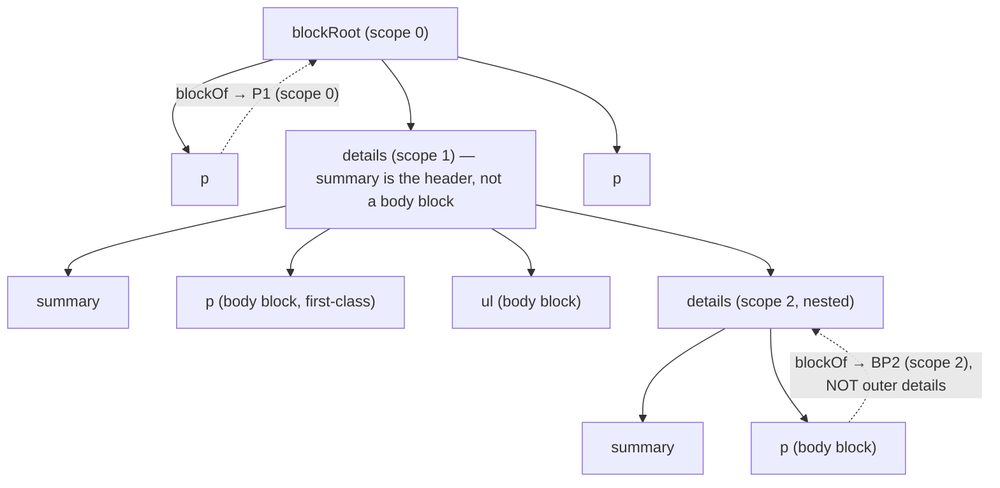
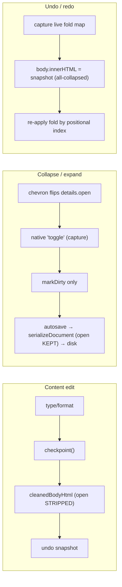

# feat: Toggle List Block (Schema #1) — authoring in both editors

## Summary

Build authoring for a Notion-style collapsible **toggle** block in the Schema #1 block editor. The disk contract already ships (`validateDetails` accepts native `
/
` with `open`); this plan adds the **editor** support that is missing on both sides: create/edit/collapse a toggle, and — in the real app — make the toggle body a true nested container whose child blocks are first-class. ui-demo is prototyped first as a UX shell; the real app carries the full feature (nested reachability, undo decoupling, pagination recursion, PDF force-expand).

---

## Problem Frame

A `
` document is already conform and opens natively, but in the block editor it classifies as `'other'` → a gray, locked, non-editable block. You cannot slash-insert one, edit its summary, place a caret in its body, or expand/collapse it, and the keyboard boundary paths are unwired (a stray Enter/Backspace can split a broken `
` or delete its `
` → non-conform bytes on the ~1.2s autosave). Both `src/editor/blockedit.js` (real app) and `ui-demo/src/components/Canvas.tsx` lack any toggle authoring. The cost concentrates in one place: every editor primitive assumes a **flat block model** (`blockOf`/`topBlocks` resolve any node up to a direct child of the single `blockRoot`), so a Notion toggle body — the one place Schema #1 permits block nesting — is a net-new structural capability.

See origin for full requirements, decisions, and cross-feature analysis (`docs/brainstorms/2026-07-20-toggle-list-block-requirements.md`).

---

## Key Technical Decisions

- KTD1. **Editor-only scope; native `
` on disk.** The validator (`validateDetails`), head-CSS whitelist, and AI-authoring guide already ship on main — no schema/registry/validator change. Collapse state persists as the native `open` attribute (origin KD1, KD2).

- KTD2. **Real-app reachability = scoped block-root, not transparent recursion.** Add pure helpers `scopeRootOf(node)` (nearest ancestor that is `blockRoot` OR a `
`), `blocksInScope(scopeRoot)` (element children minus `[data-ws2-ui]` overlays minus `
`), `summaryOf(details)`. The invariant "block = direct child of the one `blockRoot`" becomes "block = direct child of ITS scope-root, excluding summary." Every cross-block primitive re-expresses against the current block's scope, keeping the same mental model as the shipped multi-root `keyOf=rootId:rel`. **This is regression-neutral ONLY for docs with no `
`** (scope collapses to `blockRoot`, `blocksInScope(blockRoot) === topBlocks()`, `blockOf` terminates identically). It is **NOT** neutral for docs that already contain a `
` — those open in the block editor **today** as locked `'other'` blocks — so redefining `blockOf` changes their behavior: a body-node's `blockOf` now resolves to the inner body block instead of resolving up to the outer `
`. U6 must therefore reconcile **every existing cross-block caller** that assumes `blockOf(x) ∈ global topBlocks()` (`deleteSelection`, `execText`, `dropFileLink`, and all `topBlocks().indexOf(...)` merge/nav sites), not just add new paths — see U6/U7. Rejected: global `blockOf`/`topBlocks` recursion (unbounded blast radius, breaks global-index assumptions). (origin KD3, R4; verified via adversarial pass — the "localized" framing was too optimistic)

- KTD3. **ui-demo prototype = UX shell only; true nesting is real-app-exclusive (intentional divergence).** ui-demo has no CI, so an ambitious nested-block refactor there would be regression-verified only by hand. The prototype ships summary editing + collapse + chevron + native-activation interception with the body as a single raw-HTML `contentEditable` region (mirroring the existing CODE raw-edit block). True first-class nested body blocks are built and proven in the real app with CI+xvfb e2e. This is a documented `有意分歧` in `docs/features/toggle.md`, following the `editor-select-all.md` precedent. (chosen by Colin over full-nesting-in-React)

- KTD4. **Undo decoupled from collapse via a snapshot-layer strip + re-apply.** `cleanedBodyHtml` (`src/editor/serialize.js`) feeds ONLY the undo snapshot and dirty-compare (`src/editor/undo.js`); `serializeDocument` (disk save) also routes through `cleanRoot` but must keep `open`. So strip `open` from `
` inside a fold-stripping variant used by `cleanedBodyHtml` only — never in shared `cleanRoot`. Re-apply the live fold map after the innerHTML rewrite inside `undo.js` `undo()/redo()` (covers the basic editor too, which shares the `UndoManager`), keyed by positional index among `
` in document order. `open` still hits disk on save. Documented v1 limitation: fold may drift under a structural undo that adds/removes/reorders a toggle (content never lost; next interaction re-saves shown state). (origin KD5, R9; answers the undo×collapse entanglement)

- KTD5. **Collapse marks dirty but is not an undo step.** Wire the native `toggle` event in **capture phase** (`toggle` does not bubble; delegated on `doc` so it survives innerHTML rewrites and covers nested/late-added toggles) → `markDirty()` only, never `undoMgr.checkpoint()`. Collapse persists via autosave; it never consumes an undo slot. (origin KD4, R8)

- KTD6. **Pagination recursion is a one-selector change; PDF force-expand mutates a detached clone.** `collectCutAtoms` already deep-queries descendants, so an expanded toggle's body blocks are already collected as cut atoms — `paginateBlocks`/`computeInnerSplits` need **no change**. Add `details` to the atom selector (so a nested toggle is a clean whole-unit break candidate) and skip `details:not([open])` descendants. For export, add `root.querySelectorAll('details').forEach(d => d.setAttribute('open',''))` on the detached clone inside `buildWordspacePrintHtml` (unconditional, no restore — the export render window runs `javascript:false`, so force-expand must be baked into the HTML, and mutating the clone leaves the live DOM/disk untouched). (origin KD6, R12, R13)

- KTD7. **Baked, persisted chevron CSS.** R10 requires the file to render correctly with zero JS in any browser, so the toggle style must be baked to disk, not editor-only. Add `ensureToggleStyle()` shaped byte-for-byte like `ensureTodoStyle`/`ensureCalloutStyle`, injecting `<style data-ws-schema-css="toggle">` (validator head whitelist accepts it by attribute presence) with the **dual marker-kill recipe** (`summary{list-style:none}` AND `summary::-webkit-details-marker{display:none}`) plus the rotating chevron (纸方墨圆) on `details[open]>summary::before`. Register in `ensureBlockStyle` + `refreshSemanticStyles` so md/AI/hand-authored toggles get it on attach. (origin KD7, R10)

- KTD8. **Verification posture.** Pure logic (the `open`-strip split, `classify(details)→'toggle'`, turn-into round-trips) → `node:test` (`node --test test/*.test.js`, jsdom — the real app has no vitest). Visual/interaction correctness → real Playwright e2e in CI+xvfb with **strong computed-style/geometry assertions** (collapsed body `offsetHeight==0`, chevron `getComputedStyle` transform, inner block carries `data-ws2-selected` on itself, disk-byte reparse conform — never class-contains, per the S4 假绿 lesson). **Every new gate carries a mutation self-check** (commit first, then break the fold-strip / re-apply / summary-guard / force-expand, assert red, restore green; length-varied fixtures per MR-10). Work off `origin/main` in a dedicated worktree; this feature touches shared core (`serialize.js`, `blockedit.js` `blockOf`, `shell.js`) so run the full `npm run test:e2e:dot` locally before each real-app PR.

---

## High-Level Technical Design

**Scoped block-root model (real app).** Today every block is a direct child of the single `blockRoot`. After KTD2 a `
` body becomes a self-similar scope. `blockOf`/`blocksInScope`/all cross-block ops resolve against the nearest enclosing scope, so operations naturally stop at scope boundaries instead of leaking across them.

**Undo × collapse decoupling (KTD4/KTD5).** Three independent paths keep collapse out of undo while persisting it to disk:

Key consequence: a bare collapse yields a snapshot byte-identical to `_applied` → no phantom undo step; undoing a content edit restores text but re-applies the fold the user last left; `open` still round-trips to disk.

---

## Requirements

Carried verbatim from origin (`R1`–`R17`). This plan does not restate them; the traceability table maps each origin requirement to the unit that satisfies it. Origin Acceptance Examples `AE1`–`AE5` are enforced by the test scenarios flagged `Covers AE<N>` in the units.

| Origin R | Concern | Unit(s) |
|---|---|---|
| R1, R2 | Create / turn-into | U1, U2 (ui-demo), U4, U9 (real app) |
| R3 | Summary authoring + activation interception | U2, U5 |
| R4 | Nested body = first-class blocks | U6 (real app); ui-demo raw-body divergence U2 |
| R5 | Keyboard boundary contract | U7 |
| R6 | Drag into/out/within body | U8 |
| R7, R8 | Collapse persists + marks dirty | U2, U5 |
| R9 | Undo decoupled from collapse | U10 |
| R10 | Baked CSS + zero-JS portability | U2, U4 |
| R11 | Find reveals text in collapsed toggles | U12 |
| R12, R13 | Pagination recursion + PDF force-expand | U3 (ui-demo), U11 (real app) |
| R14 | Always-conform serialization | U4, U6, U7, U13 (asserted throughout) |
| R15 | Select-all atomicity | U6 (delete guard preserved) |
| R16 | Links/images in body | U6 (reachable once scoped); see Scope Boundaries |
| R17 | `docs/features/toggle.md` spec, same PR | U4 (created), updated per real-app unit |

---

## Implementation Units

Two tracks: **Phase 1** (ui-demo prototype, UX sign-off) then **Phases 2–4** (real app, the full feature). Real-app units land off `origin/main` in a dedicated worktree; `docs/features/toggle.md` is created in U4 and updated by each subsequent real-app unit that changes UI (alignment 铁律). U10, U11, and U12 are independent of the reachability core (U6/U7) and may proceed in parallel once U4/U5 land.

> **Line numbers are stale — locate by symbol.** Every `blockedit.js` line reference below comes from a design pass and drifts on `origin/main` (e.g. `blockOf` is ~:274 not ~:242, `deleteSelection` ~:746 not ~:583, `splitBlock` ~:792 not ~:629; but `newBlock` ~:505, `turnInto` ~:633, `ensureBlockStyle` ~:468 are right). The implementer must re-locate every anchor by **symbol** on `origin/main`, never trust the number.

> **U6 and U7 ship together (one PR).** Scope-aware `blockOf` without the full boundary contract leaves a broken window: any toggle authored between them regresses (see U6/U7). Gate the scope-aware branch of `blockOf` behind actual `
` presence in the doc, and land U6+U7 as a single reviewable change.

### U1. ui-demo — toggle block scaffold

**Goal:** A `/toggle` slash item inserts a seeded, selectable `
` block in ui-demo (no body editing yet).
**Requirements:** R1. **Dependencies:** none (branch off `origin/main` in the standing `wordspace-next-ui-demo` worktree).
**Files:** `ui-demo/src/types.ts`, `ui-demo/src/mock/store.ts`, `ui-demo/src/components/Canvas.tsx`, `ui-demo/src/i18n/zh/editor.ts`, `ui-demo/src/i18n/en/editor.ts`.
**Approach:** Add `'toggle'` to the `BlockType` union (`types.ts` ~:36) — this forces a compile error in `newBlock`'s `Record<BlockType, Partial<Block>>` until the entry is added (free tsc gate). Add `DEFAULT_TOGGLE_HTML()` (a function, like `defaultTableHtml`, so seed strings go through `t()`) beside `DEFAULT_CODE_HTML` and a `toggle: { html: DEFAULT_TOGGLE_HTML() }` entry in `newBlock` (`store.ts` ~:367). Append `{ key:'toggle', label:'editor.toggle', kw:'toggle zhedie collapse details expand shouqi', type:'toggle' }` to `SLASH_ITEMS` (`Canvas.tsx` ~:56). Route `applySlash` into the table/code branch: `editBlock(addBlock(doc.id, slash.blockId, 'toggle'))` (~:1261). Add `toggle` to `isRawEditBlock` (~:53). Add `editor.toggle`, `editor.newToggleSummary`, `editor.newToggleBody` to BOTH `zh/editor.ts` and `en/editor.ts`.
**Patterns to follow:** the CODE and TABLE raw-edit additions end-to-end.
**Test scenarios:**
- tsc gate: adding `'toggle'` to `BlockType` without the `newBlock` entry fails `tsc` (self-check the compile gate fires).
- i18n gate: `cd ui-demo && npm run i18n:scan` green (scan finds no hardcoded CJK; parity confirms the 3 keys in zh+en; usage confirms `t('editor.toggle*')` resolve). Run by hand — no CI covers ui-demo-only PRs.
- Smoke: slash `/toggle` inserts a `

…

…

` block that is selectable.
**Verification:** slash menu shows the toggle item (localized); inserting yields a seeded details block; `i18n:scan` and `tsc` pass.

### U2. ui-demo — ToggleBlockView (the UX shell)

**Goal:** Editable summary, raw-HTML body region, working collapse with a custom chevron, native-activation interception — the artifact Wendi reviews on the Vercel preview.
**Requirements:** R1, R2, R3, R4 (ui-demo raw-body divergence per KTD3), R7, R8, R10. **Dependencies:** U1.
**Files:** `ui-demo/src/components/Canvas.tsx` (new `ToggleBlockView`, `BlockRow` branch), `ui-demo/src/components/Canvas.css`, `ui-demo/src/mock/store.ts` (`setBlockOpen` action).
**Approach:** New `ToggleBlockView` modeled on `ImageBlockView` (`Canvas.tsx` ~:192): a `
` region whose `onMouseDown`/`onClick`/`onKeyDown` all `stopPropagation` (mirror the figcaption region ~:242) so Enter/Backspace never reach doc-level handlers, `onBlur` persists via `updateBlockHtml`+`checkpoint`; and a single raw-HTML `contentEditable` body region (CODE-block shape ~:512) with its own `stopPropagation`. Collapse: the chevron/summary-disclosure click calls a new `setBlockOpen(docId, blockId, open)` store action that sets `block.open` + touches `updatedAt` (marks dirty) but does NOT `checkpoint` (KTD5). Render `
`. Add `block.type==='toggle'` branch in `BlockRow` (~:453). Native-activation interception: `preventDefault` the summary click/Space/Enter that would fold, so typing ≠ toggling. `Canvas.css`: `.ws-blk-toggle` grip offset + `.ws-toggle summary` dual marker-kill + rotating chevron + body indent.
**Patterns to follow:** `ImageBlockView` (sub-component + per-region keydown), CODE raw body region, `.ws-image`/`.ws-code` CSS.
**Execution note:** in-session-only collapse persistence (ui-demo docs are not in the store `partialize`) — the disk-persistence contract is validated in the real app, not the mock.
**Test scenarios:**
- Summary editing: typing in the summary does NOT insert/delete a doc-level block (per-region `stopPropagation`); text round-trips through `updateBlockHtml`.
- Collapse: clicking the chevron flips `open`, hides the body (assert body region not visible), marks dirty, and is not an undo checkpoint (store `_past` length unchanged by a bare collapse).
- Activation interception: clicking summary text places a caret (no collapse); Space inserts a space; Enter does not fold.
- Chevron (computed-style): `getComputedStyle(summary)` shows the native marker hidden and the custom chevron present + rotated on open.
- i18n: `npm run i18n:scan` green after adding any new strings.
**Verification:** deploy to the Vercel preview; Wendi can insert a toggle, edit the summary, type body content, and collapse/expand smoothly with the branded chevron. Sign-off gates Phase 2.

### U3. ui-demo — turn-into + paged/PDF parity

**Goal:** text↔toggle turn-into, and keep the demo's paged view + PDF export from dropping toggle content.
**Requirements:** R2, R12, R13 (ui-demo mirror). **Dependencies:** U2.
**Files:** `ui-demo/src/mock/store.ts` (`setBlockType`), `ui-demo/src/components/Canvas.tsx` (`turnInto` ~:2456, `collectCutAtoms` ~:588), `ui-demo/src/lib/printExport.ts`.
**Approach:** `setBlockType` toggle handling: text→toggle seeds the summary from the block's existing html + empty body; toggle→text unwraps (like `unwrapListHtml`). `collectCutAtoms`: add `details` to the descendant selector + skip `details:not([open])` descendants (mirror the real-app change). `printExport.ts` `blockToHtml`: always emit `
` when serializing a toggle block into the print document (the ui-demo analog of the clone force-expand).
**Patterns to follow:** existing `unwrapListHtml`, `collectCutAtoms`, `blockToHtml`.
**Test scenarios:**
- turn-into: text→toggle wraps content as summary (no loss); toggle→text unwraps.
- paged mirror (`scripts/verify-paged-v4.mjs` or a smoke script, run by hand): an expanded toggle taller than a page splits at a body-block boundary; a collapsed toggle contributes one summary line.
- force-expand: `blockToHtml` for a collapsed toggle emits `
`.
**Verification:** manual paged-view + print check in the ui-demo shows toggle content present in both states; `i18n:scan` green.

### U4. real app — toggle scaffold, baked CSS, slash, spec

**Goal:** A `/toggle` slash item inserts a conform, baked-styled toggle in the real block editor; `docs/features/toggle.md` created.
**Requirements:** R1, R10, R14, R17. **Dependencies:** Wendi sign-off on U1–U3 (soft; no code dep). Branch off `origin/main` in a dedicated worktree.
**Files:** `src/editor/blockedit.js`, `src/i18n/zh/editor.js`, `src/i18n/en/editor.js`, `docs/features/toggle.md` (new), `test/toggle-scaffold.test.js` (new).
**Approach:** `classify` (~:51): add `if (t==='DETAILS') return 'toggle';` after the FIGURE case; `isEditableEl` stays false for the container. `SLASH_ITEMS` (~:27): append `{ key:'toggle', labelKey:'blockToggle', tag:'details' }` (keep index-0='text'; menus resolve via `itemByKey`). `newBlock` (~:505): add an `item.tag==='details'` branch seeding `

` (beside callout/quote). `ensureToggleStyle` + `TOGGLE_CSS` (beside `TODO_CSS`/`CALLOUT_CSS` ~:213): byte-shape of `ensureTodoStyle`, baking `<style data-ws-schema-css="toggle">` with the dual marker-kill recipe + chevron; register in `ensureBlockStyle` (~:468) and add the pair `['toggle', TOGGLE_CSS, 'ws-toggle-style', 'details']` to `refreshSemanticStyles` (~:451); add the chevron to `EDITOR_CSS` inside the `i18n-exempt` comment block. Add `editor.blockToggle` (+ `turnToToggle`) to BOTH real-app `zh/editor.js` and `en/editor.js`. Create `docs/features/toggle.md` with the four sections (行为契约 / 文件映射 / 有意分歧 [ui-demo raw body] / 对齐锚点) and the cross-feature notes (paged/PDF/undo).
**Patterns to follow:** `ensureTodoStyle`/`ensureCalloutStyle` end-to-end; TODO/CALLOUT SLASH_ITEMS additions.
**Test scenarios:**
- `node:test`: `classify(details) === 'toggle'`; `ensureToggleStyle` injects exactly one `<style data-ws-schema-css="toggle">` (dedup) and marks dirty.
- e2e (`e2e/toggle.spec.js`, new): slash `/toggle` inserts a seeded `

`; `getComputedStyle(summary)` shows native marker hidden + chevron present (strong assertion, not class-contains).
- e2e conform round-trip (`Covers AE1, R14`): save → reparse → `registry.classify` conform → opens in block editor, not basic; no `data-ws2-*`/`contenteditable` leaked to disk.
- i18n: CI `npm run i18n:scan` + parity + usage green; mutation self-check — hardcode a CJK label bypassing `labelKey`/`T` → scan reddens.
**Verification:** a slash-inserted toggle is conform, renders with the branded chevron in-editor and in a raw browser (baked CSS), and `docs/features/toggle.md` exists.

### U5. real app — summary authoring + collapse plumbing

**Goal:** Editable summary with native-activation interception; chevron/`toggle` collapse marks dirty (not undo).
**Requirements:** R3, R7, R8. **Dependencies:** U4.
**Files:** `src/editor/blockedit.js` (`onKeyDown`/`onClick`, `attach`/`detach`, `applySlash`), `src/editor/format.js` (`BLOCK_TAGS`/`nearestBlock`).
**Approach:** Add `SUMMARY` to `format.js` `BLOCK_TAGS` (locate by symbol). This is consumed by `nearestBlock` → `wrapInlineStyle` / `selWithinOneBlock`, so it unblocks **highlight (`wrapMark`), inline-code (`wrapCode`), and font-size/color (`wrapInlineStyle`)** inside the summary and makes cross-summary selection rejection accurate. It does **not** enable bold/italic/underline/strike (those go through `execText`, which is gated by `blockOf(summaryText)→
` + `isEditableEl(details)===false` → no-op until the U6 scoped refactor) and does **not** affect link (`execCommand('createLink')` applies either way). So B/I/U-in-summary acceptance belongs in U6, not here. `applySlash`/turn-into completions place the caret in the new summary: `enterEdit(nx.querySelector('summary'), {mode:'start'})` (summary-scoped analog of `enterCaptionEdit`). Capture-phase guard in `onClick`/`onKeyDown`: when editing a summary, `preventDefault` the click / Space / Enter that would fold the disclosure. Wire the native `toggle` event in `attach`: `doc.addEventListener('toggle', onToggle, true)` (CAPTURE — non-bubbling) → `markDirty()` only, never `checkpoint`; remove in `detach`. The chevron flips `details.open` so `toggle` fires.
**Patterns to follow:** `enterCaptionEdit`/`captionEl` (image sub-region editing); existing `attach`/`detach` listener block.
**Test scenarios:**
- Activation interception (`Covers R3`): click summary → caret, no collapse; Space → space; Enter → (handled by U7, here assert no fold).
- Collapse persists (`Covers R8, KD4`): expand/collapse fires `toggle` → `markDirty`/autosave writes the `open` state to disk; a bare collapse is NOT an undo checkpoint (`Cmd+Z` after a lone collapse does nothing). Mutation self-check: change the listener from capture to bubble → the dirty assertion reddens (proves capture is load-bearing).
- Inline format in summary: **highlight / inline-code / font-size** applied inside the summary take effect (these route through `selWithinOneBlock`/`wrapInlineStyle`). Mutation self-check: revert `SUMMARY` from `BLOCK_TAGS` → this reddens. (Do NOT assert bold-in-summary here — it's blocked until U6 and would be a dumb gate for this fix.)
**Verification:** summary is a real editable line; highlight/inline-code/font-size work in it; collapsing autosaves and never appears in undo history.

### U6. real app — scoped block-root reachability refactor (core)

**Goal:** Toggle body blocks become first-class: caret, selection, slash-insert, block menu, all scope-correct — AND every existing cross-block op stays conform on docs that already contain a `
`. The central lift. **Ships with U7 in one PR** (scope-aware `blockOf` without U7's boundary contract is a broken window).
**Requirements:** R4, R14, R15, R16. **Dependencies:** U4, U5. **Co-lands with:** U7.
**Files:** `src/editor/blockedit.js` — new helpers `scopeRootOf`/`blocksInScope`/`summaryOf`; `blockOf`, `topBlocks`, `classify`/`isEditableEl`, `onClick`/`selectBlock`/grip, `removeBlock`/tail-append, `deleteSelection`, `splitBlock`, **`execText`** (inline B/I/U/highlight/code), **`dropFileLink`**, and the `onKeyDown` cross-block merge/nav sites (Backspace-merge, Delete-merge, Arrow L/R + U/D, grey-select, selected-block Enter). Locate all by symbol.
**Approach:** Add the three scope helpers (KTD2), and **gate the scope-aware branch of `blockOf` behind actual `
` presence** so a no-toggle doc keeps the exact current code path (zero-risk for the 200+ existing e2e). `blockOf`: walk up until `parent === scopeRootOf(node)`; a `
` result is the scope header, not a body block. `topBlocks` stays `blocksInScope(blockRoot)` for top callers; cross-block code switches to `blocksInScope(scopeRootOf(editingEl))`. Then reconcile **every** caller that assumed `blockOf(x) ∈ global topBlocks()` — this is the load-bearing work, not an afterthought:
- `deleteSelection` (locate ~:746, NOT ~:583; the details protection is **emergent** from `isEditableEl(details)===false` → whole-block removal at ~:766–790, there is no discrete "summary guard" at ~:604–616 — that range is `enterCaptionEdit`): map body-block endpoints **up to their enclosing top-scope `
`** before computing the `i`/`j` indices and the middle-remove loop (which guards `m.parentElement===blockRoot`), so a cross-scope range still whole-deletes the `
` atomically (R15) instead of returning `false` on `i/j===-1`.
- `execText`: its `i<0||j<0` fallback currently runs a **bare `doc.execCommand` across the whole selection** → after scope-aware `blockOf`, a cross-summary/body selection would inject a native span spanning the boundary → non-conform bytes. Scope-relativize its `topBlocks()`/`blockOf()` use, or explicitly reject cross-scope selections (no-op) so it can never emit non-conform bytes.
- `dropFileLink`: scope-relativize its `topBlocks()` use.
- The `topBlocks().indexOf(...)` merge/nav sites — Backspace-merge, **Delete-merge (the corrupting one: `blocks[indexOf(editingEl)+1]` → `blocks[0]` when a body block isn't in global tops → merges the first top-level block into the body block)**, Arrow L/R, Arrow U/D, grey-select arrows, and the selected-block Enter (`insertAfter`) — all switch to `blocksInScope(scopeRootOf(editingEl))`. (Some overlap U7's new cases; do them here as the re-scope, add new boundary behavior in U7.)
- `removeBlock`: scope-aware counts, and enforce the **≥1-body UX floor** — deleting the sole body block retags it to an empty `
` rather than leaving a summary-only `
`. (Summary-only IS conform per `validateDetails` — it only requires exactly one first-child summary — but it is a UX dead-end that hides the toggle's own content; keep ≥1 body block. This is the canonical empty-body rule; U7/U8 honor it too.)
- `splitBlock` (locate ~:792): hard guard — never run on a `
` (prevents a second summary).
**Patterns to follow:** the shipped multi-root scope model (`keyOf=rootId:rel`); the emergent atomic-details removal in `deleteSelection`.
**Test scenarios:**
- Nested independence (`Covers AE5, R4`): insert a toggle, add a nested `
` and a nested toggle; select/edit/drag the inner block; assert `data-ws2-selected` lands on the inner block (not the whole `
`), inner text survives reparse, outer toggle stays one block; `blockOf(deep node)` returns the level-N body block. Mutation self-check: revert `blockOf` to flat `parent===blockRoot` → inner block unselectable → red.
- **Existing-`
`-doc regression guard** (the adversarial catch): on a doc that ALREADY contains a `
`, (a) drag-select from a top paragraph through the whole toggle + Backspace → the `
` is whole-deleted atomically, summary never cropped (`Covers R14, R15`); (b) cross-block Bold from a top paragraph into the toggle → bytes stay conform (no native span spanning summary/body). Both must pass on a doc authored BEFORE this feature.
- Delete-at-end-of-body no cross-scope merge: caret at end of a body block with a following top-level block, press Delete → NO merge across the scope boundary (asserts the `:1404`-class re-scope). Mutation self-check: revert that site to global `topBlocks()` → cross-scope corruption → red.
- Slash-insert inside a body: `/list` inside a body inserts a `ul` as a first-class body block.
- ≥1-body floor: delete the sole body block → an empty `
` remains (not a summary-only `
`); reparse conform.
**Verification:** a toggle body behaves like the top level; every existing cross-block op stays conform on pre-existing `
` docs; no path emits non-conform bytes.

### U7. real app — keyboard boundary contract

**Goal:** Every Enter/Backspace/Tab/arrow path across summary↔body↔outer is defined, honors the ≥1-body rule, and can never emit a malformed `
`.
**Requirements:** R5, R14. **Dependencies:** U6 (**co-lands with U6 in one PR**).
**Files:** `src/editor/blockedit.js` (`onKeyDown` boundary paths; the selected-block Enter handler that today does `insertAfter`).
**Canonical empty-body rule (applies here, U6, U8):** a toggle **always keeps ≥1 body block**. Summary-only `
` is technically conform but a UX dead-end, so the editor never produces one; any path that would empty the body retags the last body block to an empty `
` instead.
**Approach:** Enter — mid-body → `splitBlock` (parent-preserving `.after`, scope-correct for free); end of empty last body block → exit: remove that block iff `blocksInScope>1`, then `insertAfter(detailsEl, 
)` in the OUTER scope; at summary end → caret to first body block (never split the summary). Backspace — start of first body block → caret to `summaryOf(details)` end (no content change; if the body block is empty and not sole, delete it first, honoring ≥1-body); never merge into or delete the summary (guaranteed because `schema-model.js` `LEAF_TEXT_TAGS` excludes DETAILS/SUMMARY → `canMerge` false); **Backspace at start of an empty summary of an otherwise-empty toggle → unwrap toggle→text** (the escape hatch, reusing U9's `toggle→text`), so an empty toggle is never keyboard-undeletable. Tab — at start of a top block whose `previousElementSibling` is a `
` → `details.appendChild(block)` (list-indent still wins inside an `<li>`); Shift-Tab on a body block → `detailsEl.after(block)`, but **if it is the sole body block, apply the ≥1-body floor** (leave an empty `
` or refuse). Arrows — Down/Right at summary end → first body block start; Up/Left at first body block start → summary end; Down at last body block end → next outer block; arrow onto a collapsed `
` → grey-select it. **Reconcile the selected-block Enter handler** (today `insertAfter`): on a grey-selected collapsed toggle, Enter → focus its summary (not insert-after).
**Patterns to follow:** existing list Enter/Tab handling; `isCaretAtStart`/`isCaretAtRealEnd` predicates.
**Test scenarios:**
- Malformed-bytes guard (`Covers AE3, R5`): caret at start of first body block + Backspace → bytes still have exactly one summary first + validate conform; Enter at summary end → caret in first body block, still one summary; Enter at end of empty last body block → new sibling AFTER `
`. Mutation self-check: remove the `splitBlock` summary-guard → Enter in a summary creates a second summary → this e2e reddens.
- Empty-toggle escape: Backspace at start of an empty summary in an otherwise-empty toggle → toggle unwraps to a paragraph (no orphaned summary-only `
`, no dead-end).
- Tab/Shift-Tab (`Covers R5`): Tab nests a block into the preceding `
`; Shift-Tab outdents after `
`; Shift-Tab on the SOLE body block honors the ≥1-body floor; inside an `<li>`, Tab still list-indents. Assert scope membership after each.
- Arrow traversal: caret crosses summary↔body↔outer as specified; collapsed toggle grey-selects; Enter on a grey-selected collapsed toggle focuses its summary (not insert-after).
**Verification:** exhaustive boundary e2e stays green; a toggle never becomes summary-only; no path produces non-conform bytes on autosave.

### U8. real app — drag into/out/within toggle body

**Goal:** Drag-and-drop moves a block into a toggle body, out of it, and reorders within, with a self-nest guard.
**Requirements:** R6. **Dependencies:** U6.
**Files:** `src/editor/blockedit.js` (`onDragOver`/`onDrop`).
**Approach:** Make the drop target resolve to the correct (possibly nested) scope via `closest('details')||blockRoot`; insertion uses parent-preserving `.before`/`.after`/`appendChild`. Cycle guard: dragging a `
` onto a block inside its OWN body is rejected (no self-nest). **≥1-body floor:** dragging the SOLE body block out leaves an empty `
` (never a summary-only `
`).
**Patterns to follow:** existing `onDrop` reorder logic.
**Test scenarios:**
- Drag a top block onto a body block → moves INTO that body scope (parent = the `
`); drag a body block onto a top block → moves OUT; reorder within body. Assert final bytes conform.
- Self-nest guard: dragging a details onto a block within its own body is a no-op.
- Sole-body drag-out: dragging the only body block out leaves an empty `
` in the toggle; reparse conform.
**Verification:** blocks move across scopes correctly; no self-nesting; toggle never becomes summary-only; conform after every drop.

### U9. real app — turn-into text↔toggle

**Goal:** Bidirectional turn-into with zero content loss.
**Requirements:** R2. **Dependencies:** U6.
**Files:** `src/editor/blockedit.js` (`turnInto` ~:633), `test/toggle-turn-into.test.js` (new).
**Approach:** p→toggle: build `
`, move the paragraph's phrasing into a new `
`, append an empty `
` body; call `ensureToggleStyle`. toggle→text: lift body blocks to the outer scope (insert after the `
`), convert the summary into a `
`; never drop content. Wire labels into the block-menu `sub()` and `openTurnMenu`.
**Patterns to follow:** existing hr/list/leaf `turnInto` branches; `SM.flattenBlocksToLines`/`retagElement`.
**Test scenarios:**
- `node:test` byte-conservation: p→toggle preserves all phrasing in the summary; toggle→text preserves summary text + all body blocks; both pass `validateDetails`.
- e2e (`Covers R2`): turn a paragraph into a toggle (caret lands in summary); turn a toggle back to text (body blocks lifted to top level).
**Verification:** round-trip text↔toggle loses nothing and stays conform.

### U10. real app — undo decoupled from collapse

**Goal:** Undo/redo never disturb collapse state; `open` still saved. (KTD4/KTD5)
**Requirements:** R9. **Dependencies:** U5 (needs collapse). Independent of U6.
**Files:** `src/editor/serialize.js` (`cleanedBodyHtml` / new fold-stripping variant), `src/editor/undo.js` (`_cleanHtml`, `undo`, `redo`), `test/serialize-fold.test.js` (new).
**Approach:** Add a fold-stripping serializer variant = `cleanRoot(clone)` then `clone.querySelectorAll('details').forEach(d=>d.removeAttribute('open'))` then `.innerHTML`; point `undo.js` `_cleanHtml` at it (drives BOTH snapshot capture and the dirty-compare). Do NOT touch `cleanRoot`/`serializeDocument` — disk keeps `open` (R7). In `undo.js` `undo()`/`redo()` html branch: `const fold = captureFold()` from the live pre-rewrite DOM, then after `body.innerHTML = html`, `applyFold(fold)`. `captureFold` = `[...body.querySelectorAll('details')].map(d=>d.open)`; `applyFold` = write back by positional index. Keep this in `undo.js` (single chokepoint covering the block AND basic editor, which share `UndoManager`); verify ordering against `reset()` (which never touches `details.open`) at implementation time.
**Patterns to follow:** existing `cleanedBodyHtml`/`_cleanHtml` flow.
**Test scenarios:**
- Undo does not re-expand — teeth variant (`Covers AE2, R9`, load-bearing): toggle A **OPEN**, edit paragraph P→'bar', `Cmd+Z` → P reverts AND `A.open === true` (only `applyFold` restores open, since the snapshot strips it). NOTE the collapse→stays-collapsed variant alone is a dumb-gate trap (snapshot-stripped == collapsed == expected) — ship the OPEN variant as the real assertion.
- `node:test` open-split: `cleanedBodyHtml` output has NO `open`; `serializeDocument` output HAS `open`. Mutation self-check #1: revert the strip → the "collapse = no undo step" e2e reddens. Mutation self-check #2: no-op `applyFold` → the OPEN teeth variant reddens.
- Save round-trip: collapse A, autosave, read serialized bytes → A has no `open`, a still-open sibling B has `open` (strip is undo-only, disk persists).
- Documented drift: insert toggle C above A (checkpointed), collapse A, undo the insertion → assert the known positional drift so the limitation is pinned, not silently regressed.
**Verification:** collapsing while reading never gets undone; content undo leaves folds as-left; `open` persists to disk.

### U11. real app — pagination recursion + PDF force-expand

**Goal:** Expanded toggles paginate at body-block boundaries; collapsed toggle content is never dropped from PDF/print. (KTD6)
**Requirements:** R12, R13. **Dependencies:** U4. Independent of U6 (pagination reads DOM directly, not `blockOf`).
**Files:** `src/editor/pagination.js` (`collectCutAtoms`), `src/renderer/shell.js` (`buildWordspacePrintHtml`), `src/lib/schema-page.js` (`PAGED_PRINT_CSS`, optional), `test/schema-page.test.js`, `e2e/paged.spec.js`.
**Approach:** `collectCutAtoms`: add `details` to the `querySelectorAll('li, p, blockquote, figure, hr, h1..h4')` selector (kind `'el'`, `paddingTop` push) so a nested toggle is a clean whole-unit break candidate; skip only the **hidden descendants** of a collapsed nested toggle with `if (e.parentElement && e.parentElement.closest('details:not([open])')) return` — note `closest` includes the element itself, so a naive `e.closest('details:not([open])')` would wrongly exclude the collapsed toggle's own atom; check the parent so the collapsed toggle still contributes its summary-height atom. `paginateBlocks`/`computeInnerSplits` unchanged (the deep query already collects expanded-body atoms). `buildWordspacePrintHtml`: after the `[data-ws-pushed]` strip and before injecting `EDITOR_CSS`, add `root.querySelectorAll('details').forEach(d => d.setAttribute('open',''))` — unconditional, on the detached clone only (no restore; the export window runs `javascript:false`). Optionally append `summary{break-after:avoid}` to `PAGED_PRINT_CSS`. `src/main/pdf-export.js` needs no change (the force-expanded `open` is already in the HTML string it renders).
**Patterns to follow:** existing `collectCutAtoms` deep query; the `[data-ws-pushed]` strip in `buildWordspacePrintHtml`.
**Execution note:** the PDF visual fidelity of a page-tall expanded toggle is owned by Chromium native paged media — Colin runs the host `printToPDF` visual check (the container has no display).
**Test scenarios:**
- `node:test` (`test/schema-page.test.js`): `computeInnerSplits` with atom tops modeling a details body (e.g. `[0, 120, 900, 1600]`, blockH 1700, contentH 1000) → cut lands at top 900 (last body-block boundary ≤ page end), not mid-block.
- e2e expanded tall toggle (`Covers R12`): a toggle whose expanded body ≈1.5 pages → page count increases, a void/gutter appears at a paragraph boundary INSIDE the body (not mid-paragraph), every page height == one sheet.
- e2e collapsed: same doc collapsed → contributes ~one summary line; toggling open re-paginates live (ResizeObserver path).
- e2e PDF force-expand (`Covers AE4, R13`): export a paged doc with a collapsed toggle → parse the PDF text (existing `pdf-parse` harness) → the collapsed body text IS present. Mutation self-check: delete the `setAttribute('open','')` line → the test reddens (body text absent) → restore.
- e2e no-leak round-trip: author a toggle inner-cut on screen, save, reparse → zero `data-ws-pushed`/spacer in bytes; export wrote NO `open` to disk (clone-only mutation).
**Verification:** paged toggles split cleanly; exported PDFs contain all collapsed content; live doc/disk untouched by export.

### U12. real app — in-app find reveals text inside collapsed toggles

**Goal:** A find match inside a collapsed toggle auto-expands the toggle so the highlight is visible. (Fills the R11 gap the adversarial pass caught — no unit owned it.)
**Requirements:** R11. **Dependencies:** U4. Independent of the reachability core.
**Files:** `src/editor/find.js`, `src/lib/find-ranges.js`, `e2e/find.spec.js` (or the existing find e2e).
**Approach:** `find-ranges.js` already walks text nodes inside a collapsed `
` (`createTreeWalker(SHOW_TEXT)` sees the `display:none` body text), so matches are found but never revealed — `find.js` `scrollIntoView`/highlight targets a 0-height hidden node. Before scrolling/highlighting the active match, walk up its `
` ancestors and set `open` on any collapsed one (Chromium's own find-in-page does exactly this). Setting `open` fires the `toggle` event → `markDirty` (U5) — acceptable, matches the "reveal persists" model; or scope it as a transient reveal if churn is unwanted (decide at implementation).
**Patterns to follow:** existing `find.js` active-match scroll/highlight.
**Test scenarios:**
- Search for text that exists only inside a collapsed toggle → the toggle opens, the match highlight is visible (assert `details.open === true` and the highlight rect has non-zero height). Mutation self-check: remove the ancestor-expand → the highlight stays at a 0-height hidden node / `details.open` false → red.
**Verification:** find reveals matches anywhere, including deep inside nested collapsed toggles.

### U13. real app — clipboard across scope boundaries

**Goal:** Paste and cut behave correctly inside and across toggle scopes; no path emits non-conform bytes.
**Requirements:** R14 (conform), supports R4/R5. **Dependencies:** U6, U7.
**Files:** `src/editor/blockedit.js` (`onPaste`, and cut via `deleteSelection`).
**Approach:** `onPaste` reads `text/plain` (+images) and loops `splitBlock` for multi-line — a cross-block primitive that must respect scope: multi-line paste inside a body inserts body blocks (inherits U6's scoped `splitBlock`); paste while editing a summary must degrade to a space-join (relies on U6's `splitBlock` summary hard-guard — never split the summary into two). Cut (`Cmd+X`) spanning a scope boundary routes through `deleteSelection` (U6's cross-scope handling). Pasting copied `
` HTML flattens to text today (no `text/html` path) — document this v1 behavior (or handle it) so it is a known limitation, not a surprise.
**Patterns to follow:** existing `onPaste` multi-line `splitBlock` loop.
**Test scenarios:**
- Multi-line paste inside a body → multiple body blocks, scope-correct, conform.
- Paste multi-line while editing a summary → joined into the summary as phrasing (no second summary, no block children); reparse conform.
- Cut spanning a top block and a toggle → routes through the U6 cross-scope delete (atomic `
`), conform.
- Paste of copied `
` text → documented flatten-to-text behavior (assert it does not crash or emit non-conform bytes).
**Verification:** clipboard never produces a malformed `
` or non-conform bytes.

---

## Scope Boundaries

**Deferred for later** (from origin): `
` exclusive-accordion groups; cross-browser smooth-height open/close animation (Chromium-only — v1 ships instant collapse); a markdown creation shortcut.

**Intentional divergence** (KTD3): the ui-demo prototype does NOT ship true first-class nested body blocks — its body is a single raw-HTML region. True nesting is real-app-only, documented as a `有意分歧` in `docs/features/toggle.md` (precedent: `editor-select-all.md`). R16 image/link **insertion inside a toggle body** in the real app depends on routing body-scope inserts through the reachability model (U6); byte-level indexing/rewrite of links/images already in a body already works and is unaffected.

**Already shipped (not in scope):** the disk contract (`validateDetails`), head-CSS whitelist, and AI-authoring guide.

---

## Risks & Mitigation

- **Reachability refactor is the widest blast radius, and it regresses EXISTING `
` docs, not just new toggles** (they already open in the block editor as locked blocks). Redefining `blockOf` silently breaks `deleteSelection` (drag-select-delete through a details returns `false`), `execText` (cross-block bold falls to a bare `execCommand` → non-conform bytes), and every `topBlocks().indexOf(...)` merge/nav site (Delete-at-end-of-body merges the wrong block). Mitigation: gate the scope-aware `blockOf` branch behind actual `
` presence (no-toggle docs keep the exact current path); reconcile ALL named callers in U6 (`deleteSelection`, `execText`, `dropFileLink`, the merge/nav sites), not just add new paths; e2e specifically on a pre-existing `
` doc under drag-select-delete + cross-block bold; full `npm run test:e2e:dot` locally before the U6/U7 PR (shared core).
- **U6-before-U7 broken window.** Scope-aware `blockOf` without U7's boundary contract lets a toggle be authored into a broken state. Mitigation: U6 and U7 land as one PR.
- **Stale line numbers.** The plan's `blockedit.js` anchors drift ~100–160 lines on `origin/main` (`deleteSelection`, `splitBlock`, `blockOf` are off; others correct) — a straight copy could strand the implementer. Mitigation: locate every anchor by symbol; the plan says so at the top of Implementation Units.
- **Empty-body dead-end.** Summary-only `
` is conform but hides its own content. Mitigation: the canonical ≥1-body rule enforced uniformly across U6 (`removeBlock`), U7 (Backspace/Shift-Tab), U8 (drag-out), with an explicit empty-toggle→text escape.
- **Pagination adversarial re-verify did not complete** (the verifier agent errored). The pagination approach was verified once at design time (`collectCutAtoms` deep query, `buildWordspacePrintHtml` export path, `pdfExportMode` raw-only-for-basicEdit, `data-ws-pushed` strip) and the completeness critic independently touched U11 and found only the `closest`-self predicate bug (now fixed). Mitigation: the U11 implementer re-confirms the export path + no-leak by symbol before relying on it.
- **`serialize.js` divergence is silent and double-edged**: if the `open`-strip leaks to the disk path, collapse never persists; if it is missing from the undo basis, fold bakes into history. Mitigation: both-direction `node:test` (`cleanedBodyHtml` no `open` / `serializeDocument` has `open`) + the two undo mutation self-checks.
- **The literal "collapse→undo→still collapsed" scenario is a dumb-gate trap** (passes with re-apply fully broken). Mitigation: the OPEN teeth variant is the load-bearing assertion (U10).
- **`toggle` event is non-bubbling** — a bubble-phase listener silently never persists collapse. Mitigation: capture-phase delegation + the capture→bubble mutation self-check (U5).
- **Positional fold identity drifts under structural toggle undo** (accepted v1 limitation). Mitigation: documented + the drift e2e pins it (U10).
- **PDF force-expand runs on a separate `javascript:false` DOM** — collapsed content silently dropped if not baked into the HTML. Mitigation: clone `setAttribute('open')` + the PDF force-expand mutation self-check (U11).
- **Stale worktree / merge train**: the checked-out `docs/doc-linking-app-plan` worktree is behind `origin/main` (real-app `blockedit.js` and all of ui-demo); `serialize.js`/`shell.js`/`blockedit.js` are hot shared-core files with concurrent sessions. Mitigation: branch from `origin/main` in a dedicated worktree; `/sync-main` before, rebase before merge; read via `git show origin/main:<path>`.
- **ui-demo i18n gate is CI-blind** (no CI on ui-demo-only PRs; root scan targets the real app). Mitigation: run `cd ui-demo && npm run i18n:scan` by hand before each ui-demo PR.

---

## Dependencies / Assumptions

- Real-app validator + AI guide already on `origin/main` (verified): `TOP_BLOCKS` includes `DETAILS`, `validateDetails` enforces the shape, `open` whitelisted.
- Real-app test framework is `node:test` (jsdom), not vitest; the authoritative gate is Playwright e2e in CI+xvfb; `main` requires `test` + `e2e` and an up-to-date branch (`gh pr update-branch` when BEHIND).
- The paged/PDF path exists in the real app (`src/editor/pagination.js`, `src/renderer/shell.js buildWordspacePrintHtml`, `src/main/pdf-export.js`) and ui-demo (`ui-demo/src/lib/page.ts`, `printExport.ts`).
- `src/editor/blockedit.js` is the sole live real-app block editor; `src/editor/blocks.js`/`slashmenu.js` are dead and untouched.

---

## Sources / Research

Grounded by a 5-agent design pass over `origin/main` (nested-reachability, undo decoupling, pagination, block-add template, repo learnings). Key breadcrumbs:

- `src/editor/blockedit.js` — `classify`/`isEditableEl`, `SLASH_ITEMS`, `blockOf`/`topBlocks`, `newBlock`, `turnInto`, `ensureTodoStyle`/`ensureCalloutStyle`/`refreshSemanticStyles`, `deleteSelection` (atomic-details guard), `splitBlock`, `onKeyDown`, `attach`/`detach`.
- `src/editor/serialize.js` — `cleanedBodyHtml` (undo basis) vs `cleanRoot`/`serializeDocument` (disk); `WS2_MARKERS`.
- `src/editor/undo.js` — `_cleanHtml`/`undo`/`redo` (the KTD4 hooks).
- `src/editor/pagination.js` `collectCutAtoms`; `src/renderer/shell.js` `buildWordspacePrintHtml`/`runUndoRedo`; `src/main/pdf-export.js`; `src/lib/schema-page.js`.
- `src/editor/format.js` `BLOCK_TAGS`/`nearestBlock`; `src/lib/schema-model.js` `LEAF_TEXT_TAGS`; `src/lib/schema-validate.js` `validateDetails`.
- ui-demo (via `git show origin/main:`): `ui-demo/src/components/Canvas.tsx` (`ImageBlockView` template, `SLASH_ITEMS`, `applySlash`, `isRawEditBlock`, `collectCutAtoms`), `ui-demo/src/types.ts`, `ui-demo/src/mock/store.ts` (`newBlock`, `cloneDocs`, `setBlockType`), `ui-demo/src/lib/page.ts`, `ui-demo/src/lib/printExport.ts`, `ui-demo/src/i18n/{zh,en}/editor.ts`, `ui-demo/scripts/i18n-scan.mjs`.
- Cross-feature contracts: `docs/features/paged-doc.md`, `doc-images.md`, `doc-linking.md`, `editor-select-all.md`; prior design `docs/schema-1-draft-v0.md`, `docs/schema-1-ai-authoring.md`.
- Repo discipline: `CLAUDE.md` (e2e/mutation-self-check/merge-train), `docs/team-memory.md`.
