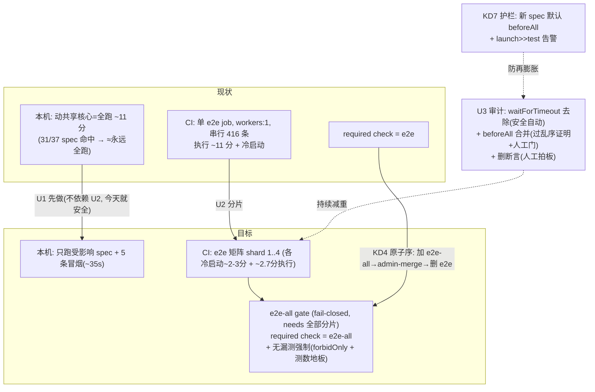

# refactor: e2e 测试策略优化（本机跑法收敛 + CI 分片并行 + 冗余/慢测审计）

> status: active · origin: Colin 2026-07-20 讨论（e2e「太长、触发太容易、每次本机跑很费时」）+ 本 session 实测 + 五人 doc-review 修订 · 基线 origin/main 9a5264d · 日期 2026-07-20
>
> ⚠ **本稿是 doc-review（五人格）后的修订版**。审查改动了原稿的核心排序、修了一个我自己的事实错误（browser.spec 不是 beforeAll）、堵了一个 gate 假绿洞。改了什么、为什么,见文末「审查修订记录」——Colin review 时先看那节。

---

## Summary

三管齐下把 e2e 从「每次本机全跑 ~11 分钟」的痛点里解出来,**权威门一点不削弱**。审查后的诚实排序:

- **U1 先做 · 本机跑法收敛**（独立、今天就能发、真正省 Colin 时间的一块）——退掉「动共享核心=本机全跑」的例外（实测 31/37 spec 都是共享核心消费者、例外≈永远全跑）。新规:本机只跑受影响 spec + **一个定死的冒烟子集**,全量交 CI。**这一块不依赖 U2**：CI 无论 11 分还是 2.7 分都同样挡合并,退本机全跑今天就安全。
- **U2 · CI 分片并行**——单 job/`workers:1` 串行的全量 e2e 切成 N=4 矩阵分片。**诚实的收益是「时间到绿」从 ~13 分降到 ~5 分**（不是 11→2.7:2.7 只是纯测试执行,每片还各付 ~2-3 分冷启动）。加一个**fail-closed 的聚合 `e2e-all` gate job** 稳住 required-check 名。U2 不是 U1 的「安全前提」,是**减少 merge-train 往返 + 让 U1 纪律真落地**的加速器。
- **U3 · 冗余/慢测审计**——**范围比原稿诚实收窄了**:真·安全提速只有「去掉多余 `waitForTimeout` 硬睡」+「把通过乱序证明的 spec 转 beforeAll」;大状态 spec（app/tabs/sidebar/browser 全是故意每测重启保隔离,**无 beforeAll 先例**）转合并有状态泄漏假绿风险,必须过乱序独立性证明 + 人工拍板,不算「自动安全项」。删/合并断言一律先出报告、逐条人工拍板。

**铁律贯穿全程**：CI 全量 e2e 仍是每个 PR 的权威 required check（绝不移发版前、绝不减 required check、绝不用 skip/删测/降阈换绿）;精简只按「冗余/太慢」不按「这块安全」（S4）;新增/收窄断言不许退回弱代理断言（查 class）。

---

## Problem Frame

Colin 反馈 e2e「太长、触发太容易、每次本机跑很费时、大部分测试不会每次都 fail」。经讨论厘清成本模型并实测。

**两笔账**（不可混）：CI 的 e2e 在 GitHub 服务器跑、每个 PR 自动触发、零 Colin 时间/零 token,是挡合并的权威门;本机 e2e 是开发时 agent 跑的,才花时间。真正的浪费是**本机反复全跑**。

**为什么感觉「每次都在跑」**：`CLAUDE.md:109` `开发时的测试纪律` 本已定「开发只跑受影响 spec,全套交 CI」,但有例外——「动共享核心（`sidebar.js`/`shell.js`/`shell.css` 等）推 PR 前本机全跑一次兜底」（`CLAUDE.md:128`）。**实测 37 个 spec 有 31 个是共享核心消费者**,例外≈「永远全跑」。最近所有活（i18n、侧栏排版、标签收编、窗框）全落侧栏/shell,例外每次命中。Colin 观察准确。

---

## 实测数据（本 session 在宿主真跑一遍，基线 9a5264d）

| 项 | 值 |
|---|---|
| 总规模 | **416 条测试 / 37 个 spec** |
| 串行纯执行时间 | **10.9 分钟**（`workers:1`）;CLAUDE.md 记的「231 条 ~6 分钟」**已过期**（suite 近翻倍）|
| 最重八个 spec | app 80s · tabs 59s · sidebar 56s · doc-links 54s · browser 54s · align 51s · multi-root 34s · images 32s（top-8 = 64% 执行时间）|
| 共享核心消费者 | **31/37**（6 个孤立:fidelity/find/images/paged/pdfjs-probe/update-quit）|
| 主耗时根源 | **绝大多数 spec 每条测试重启一次 Electron**（app ~61 次内联启动、tabs/sidebar 经 `beforeEach` 各 ~40+ 次、browser 35 次）|
| 真·单启动（beforeAll，可参照的样板）| **只有 images/paged/update-ui**——都是小的**孤立** spec（7/5/6 测），**不是**大状态 spec |

**分片平衡（贪心装箱模拟）**：N=2→5.5 分、N=3→3.6 分、N=4→2.7 分。**⚠ 这是时间最优装箱的理想值**;Playwright `--shard=i/N` 实际按 test **数/顺序**分、非按时长,真实最慢分片可能高于此——**以玩具 PR 实测为准**（见 U2）。**且这些都是纯执行时间,不含每片各自的冷启动**（npm ci + Electron 下载 + xvfb ≈ 2-3 分）。

---

## Key Technical Decisions

- **KD1 排序 = U1 → U2 → U3;U1 独立于 U2、今天就安全可发。**（审查修订:原稿说「U2 先做、U2 解锁 U1」是错的。）退本机全跑的**安全性**不依赖 CI 快慢——CI 是权威门,11 分还是 2.7 分都一样挡合并;差别只是「本机漏了跨文件回归时,等 CI 红的反馈快慢」,不是「安不安全」。U1 是真正省 Colin 时间的一块、零基建成本,先做。U2 之后做,把「反馈慢」这个 U1 的副作用（尤其 shared-core 改动多、BEHIND→update-branch→重跑→merge-train 的往返痛）压下去,也让 agent 敢真的停掉本机全跑（快 CI 是 U1 纪律能落地的心理前提）。
- **KD2 本机新规 = 只跑受影响 spec + 一个定死的冒烟子集**（Colin 拍板）。退掉「动共享核心=全跑」例外。**冒烟子集在本 plan 里定死**（不留「执行期定稿」）:`sidebar-typography`(2s) + `immersive`(11s) + `start-page`(6s) + `window-close-and-reveal`(8s) + `cold-start`(8s),合计 ~35s,覆盖侧栏栏标/收起窗框/起始页/关窗恢复/冷启动这些跨 spec 主干。动共享核心时=受影响 spec + 这五条冒烟。**诚实提醒**（审查）：shared-core 是最高频也最容易出跨文件回归的改动,本机不全跑就把「确定性的推前拦截」换成「概率性的 CI 事后拦截」;冒烟子集是薄保险、不是全覆盖,所以它要选得广、且 CI 全量门必须真快真挡（U2 的意义）。
- **KD3 CI 分片 N=4 + 矩阵**（Colin 拍板;数字诚实修正）。`npx playwright test --shard=i/4` × matrix `[1,2,3,4]`,每片独立 `ubuntu-22.04`（仍 `workers:1`,规避多 Electron 单机抢端口/单实例锁——browser.spec/web-downloads 起本地 http server,单机并发端口冲突,跨 runner 分片天然隔离）。**诚实的墙上收益 ≈13 分 → ≈5 分**（每片 ~2-3 分冷启动 + ~2.7 分执行）,不是 11→2.7。N=4 从当前基线定即可（U3 无法便宜地缩小大 spec,见 KD5,故不必等 U3 再定 N）。
- **KD4 required-check 迁移 = fail-closed 聚合 gate job + 原子迁移序**（Colin 拍板;审查加固两处）。
  - **gate 必须 fail-closed**（feasibility+adversarial 同抓的真假绿洞）:原设计「`app != 'true'` → 通过」会在 `changes` 探测 job **自己挂掉/被取消**时（output 为空,空≠'true')判「通过」,而分片被 skip、`e2e-all` 又 `always()` 运行 → **required check 绿了但一条 e2e 没跑**,正是 KD6 禁的假绿。改法:**只有 `needs.changes.result=='success' && app=='false'` 才走 docs-only 放行;其余一切（app=='true' / app 空 / changes 非 success）都要求 `needs.e2e.result=='success'`,否则退非零**。
  - **原子迁移序**（adversarial:正/反序都有坑)。把 `e2e` 改成矩阵后,名为 `e2e` 的 check 不再存在,而它还是 required → **携带 ci.yml 改动的那个 PR 自己会被永久卡住**（`e2e` 永不上报);且删 `e2e`→加 `e2e-all` 之间 main 有未保护空窗。正确序:① Colin 先**加** `e2e-all` 为 required（保留 `e2e`)+ 开 admin-merge;② admin-merge 那个 ci.yml PR（它的 `e2e` 不会上报,预期);③ `e2e-all` 在 main 上出现后 Colin **删** `e2e`。**记账:步骤②③之间 main 合并冻结;Colin 不在则回滚 = revert ci.yml**。plan/PR 附精确点击步骤 + 截图指引（agent 无 Administration 权限,S4 已记)。
- **KD5 审计力度 = 安全提速自动做 + 删/合并断言人工拍板**（Colin 拍板;范围经审查诚实收窄）。
  - **真·安全自动项（零断言损失、零隔离风险）**:去掉多余的 `waitForTimeout` 硬睡改 `expect.poll`/`waitForSelector`。
  - **beforeAll 合并 = 不是「机械安全项」,要过乱序证明 + 人工门**（adversarial 戳穿原稿事实错误:browser.spec **不是** beforeAll 样板,它每测重启、作者故意保隔离;真·beforeAll 只有 images/paged/update-ui 小孤立 spec)。大状态 spec（app/tabs/sidebar）转共享实例有**新的状态泄漏假绿类**（前一条测试建了根 R,后一条即使 add-root 退化成 no-op 也因 R 还在而假绿)。**门**:任何 beforeAll 合并 PR 必须证明乱序独立性=「乱序跑」与「每测隔离跑」结果一致（`--repeat-each` 或打乱 order 跑一遍),只合并通过此证明的;单点源码变异自检**证明不了**跨测污染,不能只靠它。
  - **删/合并断言**:一律先出审计报告、逐条 Colin 拍板。判定口径=断言级非 setup/文件级;弱代理断言（只查 class,如 `workspace.spec.js` 的 `toHaveClass(/is-collapsed/)`,CSS 全废也过——S4 原型)标「弱代理-待升级」升成强断言、不算冗余删除;真冗余=一处变异让候选+幸存双红且幸存≥候选强。变异铁律:先 commit 再变异;防 fixture 同长度巧合造哑门。
- **KD6 权威门不动 + 无漏测在 CI 强制**（贯穿铁律 + 审查新增强制)。CI 全量 e2e 留在每个 PR;不移发版前;不减 required check;不用 skip/删测/降阈换绿。**新增(adversarial)**:「416==sum 无漏测」不能只靠玩具 PR 人眼比对——在 CI 强制:`playwright.config.js` 设 `forbidOnly: !!process.env.CI`（挡误提交 `test.only`);`e2e-all`（或一个小 job)读合并的 blob 报告,**收集到的测试数 < 提交的地板值 或 任一分片跑了 0 测 → 红**。否则一个走神的 `test.only`/`describe.skip`/spec 改名/空分片都能让门绿着却测得更少。
- **KD7 防再膨胀护栏**（product-lens+adversarial;新增)。U3 一次性还债后,若无护栏 suite 会再膨胀（231→416 已发生一次),分片 N 被迫无限上调。加:CLAUDE.md 一条约定「新 spec 默认 beforeAll,除非确有 per-test 隔离理由(注明)」;可选一个轻量检查,当某 spec 的运行时启动数远超其测试数、又无隔离说明时**告警**（非硬门,提醒别再攒 40-launch 的 spec)。

---

## High-Level Technical Design

依赖：**U1 独立、先做**（不依赖 U2）;U2 独立于 U1（把反馈压快);U3 独立、持续减重;KD7 护栏随 U3 落。

---

## 实现单元

### U1. 本机跑法收敛（纪律定死冒烟子集）— 先做，独立于 U2

- **Goal**：改 CLAUDE.md 纪律,退「动共享核心=本机全跑」例外,改为「只跑受影响 spec + 定死的 5 条冒烟子集,全量交 CI」。
- **Dependencies**：无。**不依赖 U2**（KD1）。
- **Files**：`CLAUDE.md`（`开发时的测试纪律` 节,`:109`/`:128`）。
- **Approach**：改纪律文字（KD2）——退例外;明确冒烟子集就是 `sidebar-typography`+`immersive`+`start-page`+`window-close-and-reveal`+`cold-start`（~35s,定死写进纪律);明确「CI 全量仍是权威门、required check 挡每个 PR」不变（KD6);诚实写下 tradeoff（shared-core 是高频+高回归风险改动,本机不全跑=换成 CI 事后拦,靠冒烟子集+快 CI 兜)。
- **Patterns to follow**：`CLAUDE.md` 现有纪律节的写法（为什么+怎么 apply)。
- **Test scenarios**：`Test expectation: none` —— 纯文档改动,无行为。冒烟子集的实际耗时以本 session 实测为准（已量）。
- **Verification**：纪律口径清晰、与 KD6 不冲突、冒烟子集定死可复现。

### U2. CI e2e 分片并行 + fail-closed 聚合 gate（含无漏测强制）

- **Goal**：`e2e` 单 job → N=4 矩阵分片;加 fail-closed `e2e-all` gate 稳住 required-check 名;在 CI 强制无漏测。
- **Dependencies**：无（与 U1 可并行）。
- **Files**：`.github/workflows/ci.yml`;`playwright.config.js`（`forbidOnly` + blob reporter);可能新增一个测数地板文件或在 gate 里内联。
- **Approach**：
  - `e2e` job 加 `strategy.matrix.shard:[1,2,3,4]` + `fail-fast:false`,跑 `xvfb-run … npx playwright test --shard=${{matrix.shard}}/4 --reporter=blob`;保留 `needs:changes`/`if: app=='true'`/xvfb/`install-deps chromium`/`ubuntu-22.04`/不设 `ELECTRON_SKIP_BINARY_DOWNLOAD`。
  - **`e2e-all` fail-closed gate**（KD4）：`needs:[changes,e2e]`,`if: always()`;逻辑=① `changes.result=='success' && changes.outputs.app=='false'` → 通过（docs-only);② 否则要求 `e2e.result=='success'`,不满足退非零。**空 output / changes 失败 / cancelled 一律走②=必须 e2e 真绿**。
  - **无漏测强制**（KD6）：`playwright.config.js` 设 `forbidOnly: !!process.env.CI`;合并 blob（`npx playwright merge-reports`)后检查总收集测试数 ≥ 提交地板（如 410,留 flake/增删余量)且无分片跑 0 测,不满足红。
  - `push:branches:[main]` 也会分片跑（post-merge main 验证,无害;`e2e-all` 在 push 上无 required 消费者,红只体现为失败 run,同今天单 e2e job 行为)。
  - `test` job（node:test + i18n:scan）不动。
- **Patterns to follow**：现有 `ci.yml` 的 `changes` job（skip 语义 + `needs`/`if`）、`concurrency` 取消组;Playwright 官方 sharding + matrix + merge-reports 文档(执行期核对 `@playwright/test ^1.60` 的确切用法——尤其 `--shard` 是按 test 数分,平衡以玩具 PR 实测)。
- **Test scenarios**（CI 行为,靠真 PR 验)：
  - 碰非 ui-demo 的 PR → 4 分片全跑、`e2e-all` 绿、最慢分片墙上时间实测记录（校准 N=4 是否够);合并 blob 收集数==416。
  - 纯 ui-demo PR → 分片 skip、`e2e-all` 仍通过(可合)。
  - **假绿探针（关键)**：手动让 `changes` job 失败（或模拟 app 输出为空)→ `e2e-all` 必须**红**(不是绿);一条测试真红 → 对应分片红 → `e2e-all` 红 → PR 被挡;committed 一个 `test.only` → CI forbidOnly 红。这三条是 KD6 的牙,必须验。
  - `Test expectation`：CI 行为验收,真 PR 上核对。
- **Execution note**：**先在玩具 PR 上验证**分片总数==416、最慢分片真实墙上时间、三条假绿探针全红,**再**让 Colin 按 KD4 原子序改 branch protection。顺序与冻结窗、回滚(revert ci.yml)写进 PR 描述 + 截图指引。
- **Verification**：玩具 PR 上分片并跑、无漏测强制生效、三条假绿探针真红、docs-only 能合;Colin 按原子序改完保护规则后真 PR 走通。

### U3. 冗余/慢测审计（安全提速自动 + beforeAll 过乱序证明 + 删断言人工拍板）

- **Goal**：按实测耗时,把真·零风险提速做 PR;beforeAll 合并只对通过乱序证明的 spec 做;产出审计报告列疑似冗余/弱断言逐条交 Colin。
- **Dependencies**：无。基线用本 session 数据。
- **Files**：审计报告 `docs/e2e-audit-2026-07-20.md`;提速 PR 触及 `e2e/*.spec.js`（每个独立小 PR);KD7 护栏落 `CLAUDE.md` + 可选 `scripts/`。
- **Approach**（KD5 收窄后)：
  - **安全自动项**:去掉多余 `waitForTimeout` 硬睡→`expect.poll`/`waitForSelector`。零断言、零隔离改动。
  - **beforeAll 合并（不是机械安全项)**:**先明确可转子集**——真·beforeAll 先例只有 images/paged/update-ui（已是);大状态 spec（app 每测内联启动、tabs/sidebar 经 beforeEach、browser 故意保隔离)**默认不转**,除非逐 spec 证明乱序独立。每个此类 PR 的证据=乱序跑==隔离跑结果一致（不止单点变异自检)。feasibility 实测:tabs 有 10/44 是重启持久化测试、sidebar 41 条全改共享 seed 工作区——**这两个基本不可转**;app.spec 是相对干净候选但仍 59 条状态测试,要乱序证明。**别拿 61/45/41 的启动数当可省数——可转子集远小于此。**
  - **删/合并断言**:只出报告,逐条 Colin 拍板 + 变异证据(候选+幸存双红)。
  - **KD7 护栏**:CLAUDE.md 加「新 spec 默认 beforeAll,除非注明隔离理由」;可选 launch>>test 告警。
- **Patterns to follow**：`images/paged/update-ui.spec.js` 的真 beforeAll 单启动(孤立态样板);`immersive`/`sidebar-typography.spec.js` 的强 computed-style/elementFromPoint 断言(升级弱断言对标)。**不要**再引 browser.spec 当 beforeAll 样板(它是每测重启)。
- **Test scenarios**：
  - 每个提速 PR:该 spec 改前后全绿 + **乱序独立性证明**(beforeAll 合并类)/该簇一条变异自检(去 waitForTimeout 类)。
  - `Test expectation`：审计报告无测试;提速 PR 复用既有断言 + 乱序/变异证明。
- **Verification**：安全项 PR 降耗时且断言不减、乱序证明通过;审计报告每条带证据、删除项全经 Colin 拍板。

---

## Scope Boundaries

- **不移权威门到发版前**、**不减 required check**、**不用 skip/删测/降阈换绿**（KD6,S1-S4 铁律)。
- **不按「这块安全」删测试**——只按「冗余/太慢」（KD5,S4)。
- **不动 `test` job**（node:test + i18n:scan)与 ui-demo 侧（本仓 ui-demo 无 CI e2e)。
- **不在单机开多 worker**跑 e2e（本地 http server + 单实例锁风险;并行靠跨 runner 分片)。
- **不自动转大状态 spec 为 beforeAll**（无安全先例,状态泄漏假绿风险;要乱序证明+人工门)。

### Deferred to Follow-Up Work
- **`scripts/e2e-affected.mjs`（改动源文件→受影响 spec 自动映射)**：原稿列进 U1,审查判为 scope creep——映射表会随 suite 增长烂、要自己的维护和测试,而 KD2 的「人工按受影响选 + 冒烟子集」已满足目标。**降级为:仅当人工判断在实践中被证明不可靠时再建**。
- **本机多 worker 提速**：待 spec 全端口/userData 隔离干净后再评估;当前风险高、收益被 CI 分片覆盖。
- **N 随 suite 增长的自动再调**：KD7 只加告警;真做动态 N 是后续题。

---

## 已拍板（Colin 2026-07-20，AskUserQuestion）

1. **本机跑法**：只跑受影响 spec + 冒烟子集（本稿已把子集定死为 5 条 ~35s)。
2. **分片 N=4**（诚实墙上 ~13→~5 分,非 11→2.7;数字见 KD3)。
3. **required-check 迁移**：聚合 `e2e-all` gate(本稿加固为 fail-closed + 原子迁移序);Colin 一次性手改 branch protection。
4. **审计力度**：安全提速自动 + 删/合并断言人工拍板(本稿把 beforeAll 从「自动安全」收窄为「过乱序证明+人工门」)。

---

## 审查修订记录（五人格 doc-review，Colin review 先看这节）

- **[事实错误·我的]** 原稿称 browser.spec = 「31 测 1 启动 beforeAll 样板」,据此说 U3 合并有安全先例。**adversarial 核代码戳穿(confidence 100)**:browser.spec 的 beforeAll 只起 HTTP server、afterEach 关 app、每测 launch,是**每测重启、作者故意保隔离**。真·beforeAll 先例只有 images/paged/update-ui 小孤立 spec。→ U3 大改:beforeAll 合并从「自动安全项」降为「过乱序证明+人工门」,删掉 browser.spec 样板引用。
- **[gate 假绿洞·必修]** feasibility+adversarial 同抓:原 gate「app!='true'→通过」在 changes job 自己挂掉(output 空)时判绿、而 e2e 被 skip→required check 绿了没跑 e2e。→ 改 fail-closed(KD4)。
- **[迁移卡死·必修]** adversarial:改 CI 后 `e2e` check 消失→携带该改动的 PR 自己被永久卡;删/加之间有未保护空窗。→ 原子迁移序 + 冻结窗 + 回滚(KD4)。
- **[无漏测未强制·必修]** adversarial:416==sum 只是玩具 PR 人眼比,`test.only`/skip/空分片能让门绿着测更少(config 无 forbidOnly)。→ CI 强制 forbidOnly + 测数地板(KD6)。
- **[排序倒置]** product-lens:U1 才是真省 Colin 时间的一块、今天就安全独立可发;原稿把它挡在最贵的 U2 后、还用「省不到的 CI 分钟」当空窗理由。→ 排序改 U1 先;U2 从「安全前提」改成「加速反馈+让纪律落地」(KD1)。
- **[数字夸大]** adversarial:11→2.7 只是纯执行,含 4× 冷启动真墙上 ~13→~5;且 2.7 是贪心装箱理想值,Playwright --shard 按 test 数分、真实平衡以玩具 PR 为准。→ 数字诚实改(KD3、实测数据节)。
- **[冒烟子集没定死]** coherence+scope+product 三家:原稿留「候选/执行期定稿」与「已拍板固定子集」矛盾。→ 本稿定死 5 条。
- **[e2e-affected.mjs scope creep]** scope-guardian:映射表会烂、要自维护。→ 挪 Deferred。
- **[防再膨胀缺失]** product+adversarial:suite 已翻倍一次,无护栏会再膨胀、N 无限上调。→ 加 KD7。
- **[小笔误]** coherence:表头「六个」标 top-8、冒烟 1分钟 vs 90s。→ 已修(改「八个」补两条;子集定死 ~35s)。

---

## 验收（整体）

- U1:CLAUDE.md 纪律口径清晰、冒烟子集定死、不削弱 KD6。
- U2:玩具 PR 分片并跑、合并收集数==416、**三条假绿探针(changes 失败/真红测/test.only)全红**、docs-only 能合、最慢分片真实墙上时间达标;Colin 按原子序改完保护规则后真 PR 走通。
- U3:安全项 PR 降耗时且断言不减;beforeAll 合并 PR 过乱序独立性证明;审计报告删除项全经 Colin 拍板。
- 全程:CI 全量 e2e 仍是每 PR 权威 required check,一次没弱化;无漏测在 CI 被强制。
