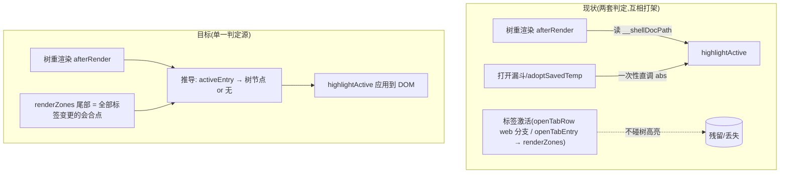

# fix: 文件树高亮跟随激活标签(always linked)

## Summary

真 app 文件树的「当前文件高亮」改成从**激活标签**推导(ui-demo 同款语义),取代现在直接读 shell 的 `docPath`。一次修掉两个同病根问题:①网页标签激活后树里旧文件高亮残留(Wendi 2026-07-20 反馈);②查看器(PDF/图片)标签激活期间树一重渲染高亮就丢。ui-demo 是参考基准,零改动。

---

## Problem Frame

Wendi 反馈(app 设为默认浏览器场景):正在读本地文件时从外部点网页链接跳进 app,标签区正确选中了新网页标签,**但文件树里还高亮着跳转前那个文件**。Jizhou 收口的产品契约:**右边渲染区显示什么,左边侧栏就定位什么("always linked")**,Wendi 确认 "yes always linked"。

复现已实证(2026-07-21,注入与 `open-url` 白名单后同一条 IPC,与真实外部链接路径零差别):

| | 文档打开时 | 网页标签激活后 |
|---|---|---|
| 真 app | 标签+树都定位该文件 ✓ | 标签区选中网页 ✓,树里旧文件仍高亮 ✗ |
| ui-demo | 一致 ✓ | 树自动无高亮,切回文档恢复 ✓ |

病根:两边的树行选中态用了不同的数据源。

- ui-demo(对):`ui-demo/src/components/ArcSidebar.tsx`(FileRow,~356 行)从 activeTab **纯推导**——`isActive = activeTab有fileName && rootId匹配 && path匹配`。网页标签没有 `fileName` → 全树自动无高亮,不需要任何"清理"动作。
- 真 app(错):`src/renderer/sidebar.js` 的 `highlightActive(abs)`(~1525 行),数据源是 `window.__shellDocPath()`(`src/renderer/shell.js` ~946 行的 `docPath`)。而 `docPath` 在网页态**设计上保留旧文档**(编辑器垫在网页 view 底下,shell.js ~948 注释原话:"web 态 docPath/viewerFile 仍指被盖住的底层文件")。网页标签激活路径(`src/renderer/browser.js` `activate()`,~201 行)从头到尾不碰树高亮 → 旧高亮残留;树每次重渲染(`afterRender`,sidebar.js ~670 行)还会把过期高亮重新刷上去。

同病根的镜像问题(本次调查坐实,一并修):查看器打开时 `docPath = null`(shell.js ~535 行,"清 docPath(非可编辑文件没有保存目标)"),打开漏斗只做了一次性 `highlightActive(abs)`(sidebar.js ~3139 行)——PDF/图片还显示着,树只要重渲染(watcher 事件/筛选)高亮就被 `afterRender` 用 null 冲掉。

---

## Requirements

行为契约(always linked):

- R1. 网页标签激活时,文件树中无任何 `.sb-file.is-active`(高亮清空)。外部链接(默认浏览器 `open-url`)、app 内开网页标签、点已有网页标签三条入口同效。
- R2. 从网页标签切回文档标签,该文档的树行高亮立刻恢复(不需要重新点树)。
- R3. 查看器文件(PDF/图片等非 html/md)标签激活期间,树行高亮保持;树重渲染(watcher 到货、筛选清空后重渲)不丢。
- R4. 无激活文件标签时(临时文档激活、全部标签关闭回起始页 `#home`)树无高亮。
- R5. 外部文件标签(↗,abs 身份)激活时:树中无对应行 → 无高亮(也不误亮别的行);其所在文件夹随后被添加为根、行已出现在树里(收编窗口)→ 该行应亮——不许因为 entry 是 abs 身份就硬判无高亮。

质量与落账:

- R6. 既有行为零回归:「点标签树定位」reveal 三态契约(见 `docs/features/workspace-file-tree.md`「标签点击与树定位」节)、shell `docPath` 垫底机制、既有 e2e(tabs/browser/app/default-browser)全绿。
- R7. R1-R3 有 e2e 真门,且过变异自检(把判定源改回 docPath、或删掉激活时机的高亮刷新,门必翻红)。
- R8. `docs/features/workspace-file-tree.md` 同 PR 记入高亮契约(仓库铁律:改真 app UI/交互,同 PR 更新 feature spec)。

---

## Key Technical Decisions

- 判定源统一为「激活标签 entry」,不再读 `__shellDocPath`:Colin 2026-07-21 拍板(两案里选的统一案);与 ui-demo 参考语义一致;顺带修掉查看器高亮丢失。`docPath` 本身及其垫底机制零改动——只是不再作为树高亮的数据源。`window.__shellDocPath` 作为**树高亮数据源**的消费只有 `afterRender` 一处(~670 行);另有 sidebar.js 三处**非高亮**消费——openPath(~1005,改名/移动的保存目标重定向,漏动会引发自动保存 ENOENT 风暴,见 SB-1 注释)、外部改名探测(~1088)、⌘W 关闭判定(~3178)——属 `docPath` 本职语义,本次一律不动,全局函数保留。shell.js 预计零改动。
- 推导映射(entry → 树节点):web entry(`WS2Tabs.isWebEntry`)与临时文档 entry 直接 → 无高亮;其余 entry **复用现成的 `findEntryNode`**(sidebar.js ~1588,rel 走 `findNode`、abs 走 `findNodeByAbs`,双域都盖)解析成树节点——查到节点就亮该行,查不到自然无高亮。**abs 身份的外部 entry 不许硬映射成"无高亮"**:「先开根外文件、再添加其文件夹」的收编流程里(正是 Wendi 2026-07-17 那个 bug 的操作流),树内容到货瞬间 abs entry 指向的行就在树里(loadLazyTop/loadDirChildren 都是先 render 后 mergeExternalDupes)——硬返 null 会在收编窗口引入「右边显示文档、左边不亮」的回归,现状(按 abs 查行)在这条流上反而是对的。行定位用找到节点自身的属性(`data-root`+`data-rel` 或 `data-abs` 选择器均可,值取自 node 对象),**禁止在 renderer 侧用 `rootOf(rootId).path` 字符串拼 abs**——rel 恒为 `/` 分隔而 Windows 的 node.abs 是反斜杠,拼出的串与行属性不等 → Windows 构建(app 已出 win 包)树高亮整体静默哑掉,而 CI(Linux)/宿主验证(mac)全抓不到。推导函数放 sidebar.js(tabState 的家)。
- 激活时机必须补一次高亮刷新,挂在 **`renderZones` 尾部**(标签区渲染函数):只改 `afterRender` 数据源的话,切标签时树根本不会重画,残留照旧。⚠ 刷新点**不能**选 `applyTabs`(~1605)——实测三条激活入口全绕过它:点网页标签走 openTabRow 的 web 分支(~2024-2027,内联 `tabState = openEntry(...); persistTabs(); renderZones()`),文档/查看器激活走 `openTabEntry`(~2718-2722,同样内联),omnibox/open-url 汇入同一 web 分支;applyTabs 只覆盖 pin/close/drag 类操作。`renderZones` 才是全部 tabState 变更路径(openTabRow web 分支/openTabEntry/applyTabs/mergeExternalDupes/updateWebEntry/reopenClosedTab 等)的唯一会合点。追加的刷新必须轻量:querySelector 改 class 级别,绝不做整树 render、不碰 `cacheStickyRows`(renderZones 是高频路径)。
- 一次性 `highlightActive(abs)` 调用点收敛:打开漏斗(sidebar.js ~3139 行)与 `adoptSavedTemp`(~1903 行)现有的直接调用,一律收敛到同一推导,**不留「确认结果一致后保留」的选项**——两套判定并存违背单一真相源,后续 session 改任一侧都会重新漂移;若某处收敛确有障碍,照 U1 的 shell.js 例外条款记录原因。3139 处"先高亮后 openTabEntry"的顺序敏感在收敛后应消失(以 renderZones 末次刷新为准)。
- 临时标签激活缺口同修:openTabRow 的 temp 分支(~2017-2019)只调 `__shellReopenTemp` 就 return,`activeRel` 从不更新——不修的话「文档 A 激活 → 点临时标签」时 activeRel 仍指 A,新推导会把 A 的行持续刷亮(违反 R4 且比现状更糟)。修法照 closeOrRemove 的现成校验模式(~1642-1647:reopenTemp 后用 `__shellActiveTemp` 确认真切过去了才动状态):temp 分支在重开成功后把 activeRel 更新到该 temp entry。这顺带让标签区 is-active 正确跟随临时标签(现状不跟,行为面小幅扩大,Colin 2026-07-21 已确认)。
- 测试姿势:先把 R1 的失败门立起来再动判定源(仓库先测后修惯例);sidebar.js 是共享核心,推 PR 前本地跑全量 `npm run test:e2e:dot`(CLAUDE.md 测试纪律的"动共享核心"例外条款)。

---

## High-Level Technical Design



推导语义(与 ui-demo `ArcSidebar.tsx` FileRow 对齐):

```
activeEntry = tabState.entries.find(keyOf(e) === tabState.activeRel)
无 activeEntry(起始页)            → 无高亮
isWebEntry(activeEntry)           → 无高亮
isTempEntry(activeEntry)          → 无高亮
其余(rel 或 abs 身份)            → findEntryNode(entry) 解析树节点
  查到节点                        → 亮该行(文档/查看器/收编窗口的 abs entry 同路)
  查不到(根外文件、lazy 根未加载层、失联根) → 无高亮
```

(以上为方向性示意,非实现规范;函数名/放置位置执行时定。)

---

## Implementation Units

### U1. sidebar.js 高亮判定源统一 + 激活时机接线

- **Goal:** 树高亮从激活标签推导,网页/临时/起始页态自动清空,查看器/文档态稳定保持。
- **Requirements:** R1-R6
- **Dependencies:** 无
- **Files:** `src/renderer/sidebar.js`(预计唯一改动文件;`src/renderer/shell.js` 预计零改动,若执行中发现必须动,记录原因)
- **Approach:** 新增推导函数(见 HTD 语义表,内部复用 `findEntryNode` ~1588);`afterRender`(~670 行)改接推导结果;`renderZones` 尾部追加轻量高亮刷新(**不是** applyTabs,理由见 KTD);收敛 ~3139 与 ~1903 两处一次性直调;openTabRow temp 分支(~2017-2019)补 activeRel 更新(照 ~1642-1647 校验模式)。`highlightActive` 的 DOM 操作部分(清旧 class、找行加 class)可原样复用。注意 `WS2Tabs`(`src/lib/tabs.js`)已有 `isWebEntry` 等判定,sidebar.js 内已有 `keyOf`(~1547 行)、`isTempEntry`(KD3 门 `adoptOpenFile`,~537 行,是"按标签类型分流"的现成先例)。
- **Execution note:** 先写 U2 的 R1 场景并确认其在修前翻红,再动判定源。
- **Test scenarios:** 由 U2 的 e2e 门承担(本单元无独立单测面——判定依赖 DOM 与 tabState,纯逻辑抽取不划算,e2e 直测更实)。
- **Verification:** U2 全部场景绿;本地全量 `npm run test:e2e:dot` 绿(共享核心铁律);既有 `e2e/tabs.spec.js` ~164 行的文档态树高亮断言保持绿。

### U2. e2e 门(残留清空/恢复/查看器保持/变异自检)

- **Goal:** R1-R3 有真断言,门有牙。
- **Requirements:** R1, R2, R3, R4, R5, R7
- **Dependencies:** U1(但先写 R1 场景立失败门,见 U1 execution note)
- **Files:** `e2e/tabs.spec.js`(树高亮×标签切换场景,沿用其 `WS2_FOLDER_IN` 工作区与 `tabRow` 辅助)、`e2e/default-browser.spec.js`(外部链接端到端场景,复用其本地 http server 与 `emitOpenUrl` 辅助——`app.emit('open-url', ...)` 是外部链接的字面路径,含 scheme 白名单)
- **Test scenarios:**
  - Covers R1/R2(default-browser.spec.js):开工作区文档(树行 `is-active`)→ `emitOpenUrl` → 断言网页标签 `is-active` 且 `.sb-file.is-active` 计数为 0 → 点回文档标签 → 断言该文档树行 `is-active` 恢复。修前此场景在"计数为 0"处必红(即失败门)。⚠ 该 spec 现有 `launch` 不带工作区——新场景要给启动补 `WS2_FOLDER_IN`(照 tabs.spec.js/update-ui.spec.js 惯例)。
  - Covers R1(tabs.spec.js):app 内路径开网页标签(omnibox / `openWeb`)后同断言——两条入口都要清。
  - Covers R2(tabs.spec.js):网页标签激活后用**键盘**切回文档(Ctrl+Tab 循环或 `__sbHooks.tabByIndex`)→ 断言树行 `is-active` 恢复。键盘切换是独立代码路径(reveal 语义都与点击不同,见 workspace-file-tree.md reveal 三态表),只测点击会漏掉它。
  - Covers R3(tabs.spec.js):开一个非 html 文件(如 .png,走查看器)→ 树行 `is-active` → 触发一次树重渲染 → 断言该行仍 `is-active`。修前此场景必红(镜像 bug 的门)。重渲染入口**优先用「筛选框输入再清空」**(确定性同步 render);「写新文件等 watcher」会撞自适应去抖(perf-scoped-tree-watch),等待不确定、易 flaky。
  - Covers R4(tabs.spec.js):关闭全部标签回起始页 → `.sb-file.is-active` 计数为 0。
  - Covers R4(tabs.spec.js):文档标签激活(树行亮)→ 点临时文档标签 → 断言 `.sb-file.is-active` 计数为 0(靠 U1 的 temp 分支 activeRel 修复;不修此场景必红——旧文档行残留)。
  - Covers R5(tabs.spec.js):打开工作区外文件成外部 ↗ 标签(沿用既有外部标签测试的建法)→ 树 `.sb-file.is-active` 计数为 0;**随后添加该文件所在文件夹为根 → 收编后断言该文件的树行 `is-active`**(收编窗口契约,防"abs 一律无高亮"的错误实现)。
  - 变异自检(执行时手动,不入 CI):①把推导改回读 `__shellDocPath` → R1 场景必红;②删掉 renderZones 尾部刷新 → R2 场景必红。铁律:先 commit 再变异;还原后全绿才算门有牙。
- **Verification:** 新增场景全绿 + 修前红/修后绿的对照留在 PR 描述里;全量 e2e 绿。

### U3. feature spec 落账

- **Goal:** 契约进 `docs/features/workspace-file-tree.md`,后续 session 不再漂移。
- **Requirements:** R8
- **Dependencies:** U1、U2 定稿
- **Files:** `docs/features/workspace-file-tree.md`
- **Approach:** 在「行为契约」区新增小节(建议挨着"标签点击与树定位(reveal 三态)"):树高亮 = 激活标签的投影("always linked",Wendi/Jizhou 2026-07-20 拍板),枚举五种标签类型的高亮语义(文档/查看器/网页/临时/外部 ↗ 含收编窗口);**写明已知例外**——lazy 根未加载层/失联根的激活文件在树中无行 → 无高亮(「树里有行才亮得上」,与现状一致,写进契约防后续 session 当 bug 报);注明判定源在 sidebar.js、ui-demo 为参考基准(其 FileRow 推导即同款语义,ui-demo 零改动、非漂移);文件映射与对齐锚点表补行。
- **Test scenarios:** Test expectation: none — 纯文档单元。
- **Verification:** spec 与实现同 PR;`docs/features/README.md` 模板要求的段落齐全。

---

## Scope Boundaries

- ui-demo 零改动——它是参考基准,树选中已是推导式。
- reveal 三态契约(点标签树展开/滚动/关标签不跳,workspace-file-tree.md 既有节)不动:那是"树怎么定位滚动",本 plan 只管"哪行高亮"。
- shell.js `docPath` 语义与垫底机制不动;`__shellOpenFileAbs` 的收编消费者(KD3 门)不动。
- CHANGELOG 不在本 PR 写——用户可见修复由发版 session 按 `docs/releasing.md` 规范统一收账(近期惯例)。
- 不新增"网页标签联动收藏/历史区高亮"之类的新联动——本 plan 只收敛既有高亮的判定源。

### Deferred to Follow-Up Work

- 起始页(`#home`)最近文件列表与树高亮无联动(现状如此,不属本契约)。

---

## Risks & Dependencies

- `src/renderer/sidebar.js` 是共享核心(几十个 e2e 间接依赖):必须本地全量 `npm run test:e2e:dot` 后再推 PR;尤其 `e2e/tabs.spec.js` 既有文档态高亮断言(~164 行)必须保持绿。
- merge-train 撞车面:e2e 提速批(#296 已合、#297/#301 在途)正在改 e2e 文件;动 `e2e/tabs.spec.js` 前先 `git fetch` 最新 main,PR BEHIND 时 `gh pr update-branch`。
- `renderZones` 是高频路径(每次标签增删/激活/拖拽/收编都走):追加的刷新必须是 querySelector 改 class 级,不做整树 render,不碰 `cacheStickyRows`。
- 竞态面:打开文档的漏斗里 `highlightActive(abs)` 先于 `openTabEntry`(~3139 行)——收敛后激活刷新在 renderZones 末尾,顺序不再敏感;执行时确认打开-高亮无闪烁(旧行清→新行亮应在同一次事件循环内)。
- 冷启动时序:树 render 可能先于 loadTabs 完成,期间 activeRel 为空 → 短暂无高亮,loadTabs 后的 renderZones 补上;仅闪烁级,可接受——但 e2e 不要在启动瞬间断言高亮,等标签恢复完再断。

---

## Sources

- 产品契约出处:Wendi/Jizhou Slack 对话 2026-07-20("always linked"),Colin 2026-07-21 验收复现并拍板统一判定源。
- 代码坐标(行号按 2026-07-21 main,以函数名为准):`src/renderer/sidebar.js` `highlightActive` ~1525 / `afterRender` ~670 / `renderZones`(激活刷新挂点)/ `applyTabs` ~1605(⚠ 不是激活路径)/ openTabRow web 分支 ~2024 / temp 分支 ~2017 / `openTabEntry` ~2718 / `findEntryNode` ~1588 / `mergeExternalDupes` ~517 / 打开漏斗直调 ~3139 / `adoptSavedTemp` ~1903 / `adoptOpenFile`(KD3 分流先例)~537 / closeOrRemove 的 temp 校验模式 ~1642-1647;`src/renderer/shell.js` `docPath` 语义注释 ~946-949 / `showViewer` 清 docPath ~535;`src/renderer/browser.js` `activate` ~201;参考基准 `ui-demo/src/components/ArcSidebar.tsx` FileRow ~355-356、`ui-demo/src/mock/store.ts` `openFileTab` ~443。
- e2e 现成模式:`e2e/default-browser.spec.js`(`emitOpenUrl`、本地 http server)、`e2e/tabs.spec.js`(`WS2_FOLDER_IN`、`tabRow`、外部标签建法、树行断言)。
