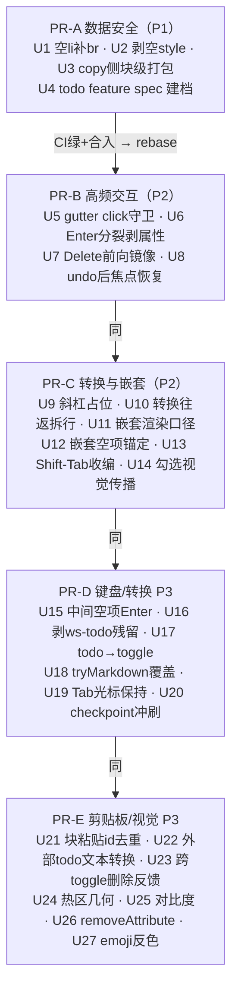

# fix: Todo list UX sweep 全量修复

## 概要

2026-07-22 的 todo-list 全维度 UX sweep（6 探索员真机驱动 + 14 核实员证伪式代码核查）产出 26 条 confirmed/保留 发现：3 P1（丢数据/断流）+ 10 P2（明显错误，全部 CONFIRMED 带 file:line 根因）+ 13 P3（手感/一致性）。本计划把全部 26 条修完，按 5 个串行 PR 落地（PR-A 数据安全 → PR-B 高频交互 → PR-C 转换与嵌套 → PR-D 键盘/转换 P3 → PR-E 剪贴板/视觉 P3），每条修复带可翻红的门 + 变异自检。另有 2 条 sweep 发现（visual-4 拖拽粒度、select-5 真机拖选）按拍板留在 deferred，不在本计划内修。

## 问题框架

Wendi 反馈 todo list UX bug 很多。昨天（2026-07-21）已修一批（bug2/3/4/6、#314/#317/#319/#324），sweep 确认那批全部站住；本计划针对的是 sweep 新挖出的更深一层问题。三条 P1 都是「文档会坏 / 输入会丢」级别；P2 里有一半（keys-2/keys-3/keys-5/select-3）集中在同一条架构缝上——**列表键盘分支把处理裸交 Chromium 原生、缺 post-split / 层级清理**。全部修复集中在 `src/editor/blockedit.js` 一带（少量涉及 `src/editor/serialize.js`、`src/editor/undo.js`、`src/renderer/shell.js`），这是被 49 个 e2e spec 共享的高危核心，因此串行 PR + 全量 e2e 兜底是硬要求。

---

## 基线与引用约定

- 行号全部锚定 **origin/main = `fca9545`**（其 `src/editor/` 内容与 sweep 基线 `e745bf2` 完全一致，已核实零漂移）。
- 串行 PR 会让行号随批次漂移。**执行时把行号当初始定位锚，落点以函数名 + 守卫条件原文为准**（每个单元都给了两者），不盲信行号。
- 本计划自包含：全部根因、机制事实、修法、测试场景都在文内，执行者不需要 sweep 报告原文即可开工。

---

## Requirements

数据完整性：

- R1. 任何创建/转换路径产出的块都能立即接收输入——不存在「零高死块吞输入」；undo/redo 之后立刻打字不丢。
- R2. 正常编辑流（选删、打字、复制粘贴）永不把非合规字节写入磁盘——文档不会因为编辑器自身行为降级基础编辑。
- R3. 剪贴板往返保住块结构与勾选语义：部分选项复制粘出完整待办项；块级粘贴不制造重复 id。

交互正确性：

- R4. 点勾选框只勾选：不进编辑态、不放光标、不与打字快照纠缠、热区几何符合直觉。
- R5. 列表键盘流对齐 Notion 语义：Enter 分裂不克隆 id/勾选态；嵌套空项 Enter/Backspace 正确锚定所在层级；Shift-Tab 保持文档顺序；块末 Delete 与 Backspace 对称。
- R6. 块转换不丢结构、不留脏属性：多项列表与文本互转可往返；转换产物不残留占位文本 / `ws-todo` class；todo→toggle 保 id。

渲染一致性：

- R7. 编辑器内渲染与磁盘文件在浏览器直开的渲染一致（嵌套列表、勾选视觉）；勾选父项不污染未勾选子项的视觉。
- R8. 勾选框对比度达 WCAG 3:1（两主题）；取消勾选不留 `data-checked="false"` 脏字节；深色模式 emoji 压暗在时间盒内尽力修复——无低成本解则以实测记录 + Colin 拍板结案为完成态（与 U27 口径一致，不做无限定承诺）。

流程：

- R9. 每个修复单元有能翻红的自动化门 + 变异自检证明门有牙（先 commit 再变异 → 翻红 → 还原 → 翻绿）。
- R10. todo-list 行为有 feature spec（现状：没有任何 spec 拥有它），且每个改动行为的 PR 在同 PR 内更新该 spec（仓库铁律）。

---

## Key Technical Decisions

- **只修根因，不顺手重构**：blockedit.js 是共享高危核心；每个单元的改动半径以本计划写明的为限。特别地，**不碰**「删/退格/剪切/打字改读 rangeSelEls」的核心重构（IME 欠账，Colin 已拍板暂不修）。
- **嵌套子项保持圆点子列表**（Colin 2026-07-22 拍板）：嵌套 bullet 转 todo 后子项不变成可勾选项，编辑器与入盘 CSS 双侧对齐「子项显示圆点」。不放宽 gutter 勾选判定。
- **入盘 CSS 升级零成本**：`refreshSemanticStyles()`（blockedit.js，attach 时调）的 ① 升级分支按**内容比对**覆写旧 style（`st.textContent !== css` 即换新）。所以改 `TODO_CSS` 常量即可，老文档下次打开自动升级，**不需要**新建版本化机制。
- **clip-1 修 copy 侧而非 paste 侧**：跨 li 选区改走块级打包保住待办语义（Notion 口径）；只在 paste 侧挡只能防非法嵌套、仍丢勾选语义。
- **5 个 PR 串行**（Colin 拍板）：全部改动集中同一文件带，并行必冲突。每个 PR 合完（required checks `{test, e2e-all}` 绿 + auto-merge 落地）再从最新 main 切下一个分支。PR 内按单元分 commit。
- **e2e 新 spec 用 per-test launch 范式**：照抄 `e2e/paste-list.spec.js`（独占 `WS2_USERDATA`、`open-file` 打开种子文档、`frameLocator('#doc-frame')`、`serializeDocument` + DOMParser reparse `classify().conform` 磁盘合规门、`expect.poll` 不用固定睡）。共享 app 的 beforeAll 范式（`e2e/block-range-select.spec.js`）只在扩展该文件时沿用。
- **纯逻辑修复用 node:test + jsdom 单测**：仓库单测框架是 `node --test test/*.test.js`（不是 vitest）；`test/serialize.test.js`、`test/schema-model.test.js`、`test/schema-validate.test.js` 已存在，直接扩展。
- **check-2 的 CSS 机制需实证**（教训要实证铁律）：CSS 规范下 text-decoration 传播**不可从后代取消**的风险真实存在，核实员的「重置落在嵌套 ul 上」未经真浏览器验证。单元验收锚定渲染结果（computed style / 像素），机制给候选清单，执行时实测选型。
- **visual-5 兼容读旧值**：写侧改 `removeAttribute`；读侧继续把 `data-checked="false"` 当未勾选（存量文档里有这种字节，不迁移、不报错）。

---

## High-Level Technical Design

### PR 串行车队

每个 PR 出门前：受影响 spec 定向跑通 → 变异自检全过 → 本地 `npm run test:e2e:dot` 全量兜底（blockedit.js 属共享核心，每个 PR 都要）→ **本 PR 改动的可观察行为已同步进 `docs/features/todo-list.md`**（R10 铁律的机械检查点，别只靠 U4 里的承诺）→ push → required checks `{test, e2e-all}` → auto-merge。

### 发现 → 单元 → PR 总表

| Finding | 级 | 单元 | PR | 一句话 |
|---|---|---|---|---|
| create-1（含 clip-2 同根） | P1 | U1 | A | markdown「[] 」产零高死块吞输入 |
| select-1 | P1 | U2 | A | 空 style="" 入盘 → 整篇降级 |
| clip-1 | P1 | U3 | A | 部分选项复制走行内携带裸 li |
| —（spec 铁律） | — | U4 | A | todo-list feature spec 建档 |
| check-1 | P2 | U5 | B | 点勾选框同时进编辑态 |
| keys-2 | P2 | U6 | B | Enter 原生分裂克隆 id/勾选态 |
| select-3 | P2 | U7 | B | 块末 Delete 撞列表全 no-op |
| clip-3 | P2 | U8 | B | undo 后打字被吞（全块型） |
| create-2 | P2 | U9 | C | 斜杠占位「列表项」是真文本 |
| create-3 | P2 | U10 | C | 多项转换往返塌缩 |
| create-4 | P2 | U11 | C | 嵌套子项无 marker、两侧渲染不一致 |
| keys-3（含 keys-4） | P2 | U12 | C | 嵌套空项锚定顶层 ul + 幽灵空 ul |
| keys-5 | P2 | U13 | C | Shift-Tab 顺序错乱 |
| check-2（含 visual-2） | P2 | U14 | C | 勾选父项划线/变灰传播到子项 |
| keys-7 | P3 | U15 | D | 中间空项回车堆空项、不退出 |
| create-5 | P3 | U16 | D | 转出后 ws-todo class 残留 |
| create-6 | P3 | U17 | D | todo→toggle 拍进 summary、丢 id |
| create-7（含 create-8） | P3 | U18 | D | tryMarkdown 覆盖不足 |
| keys-8 | P3 | U19 | D | Tab 缩进后光标甩项末 |
| check-3 | P3 | U20 | D | debounce 窗口勾选并进打字快照 |
| clip-4 | P3 | U21 | E | 块级粘贴重复 id |
| clip-5 | P3 | U22 | E | 外部「- [ ] 」纯文本不转 todo |
| select-4 | P3 | U23 | E | 跨 toggle 删除半应用/零反馈 |
| check-4（含 visual-6） | P3 | U24 | E | 勾选热区几何 |
| visual-3 | P3 | U25 | E | 勾选框对比度不达 3:1 |
| visual-5 | P3 | U26 | E | data-checked="false" 脏字节 |
| visual-7 | P3 | U27 | E | 深色反色压暗 emoji |

---

## 执行纪律（仓库既有铁律，逐条适用于本计划）

- **分支与合并**：每批从最新 main 切 `fix/todo-sweep-a` … `fix/todo-sweep-e`；PR + required checks `{test, e2e-all}`（4 分片矩阵 + 聚合门）+ auto-merge；PR 落后 main 变 BEHIND 时 `gh pr update-branch <PR>`。push/PR 用 `jizhoutang10thglobal` 账号 token（默认凭证 403）。
- **开发迭代只跑受影响 spec**（`npx playwright test e2e/<spec>.spec.js`，或 `-g "<用例名>"`）；全量 231+ 条交 CI。**例外**：blockedit.js 是共享核心，每个 PR 推前本地跑一次 `npm run test:e2e:dot` 兜底。读结果用 dot reporter / grep 收窄，别把全量输出灌上下文。
- **变异自检两条铁律**：① 先 commit 再变异（变异后 `git checkout --` 还原会冲掉未提交修复，已实踩）；② fixture 字符串长度也是测试变量，同长度巧合会造哑门。变异翻红 + 还原翻绿，才算门有牙。
- **负向断言绝不折进 expect.poll**（假绿）；固定 `waitForTimeout` 只用于已知竞态（如 openDoc 后 400ms）。
- **undo/redo 的 e2e 必须走菜单加速器路径触发**（`page.keyboard.press('Meta+z')` 不触发菜单加速器 = 假 FAIL；参照 #319 落地的 undo 测试写法）。
- **e2e 里 CJK 打字打不进**：种子文档直接写合规 HTML；需要「输入」动作时用 ASCII 或 `insertText`。
- **别 pkill 裸 electron**（并行 session 在跑）；只杀带本 worktree 路径的进程；每次 launch 独占 `WS2_USERDATA`。
- **每单元一个 commit**（并行 session 靠 git log 对齐）；PR 描述列出覆盖的 finding-id；改动可观察行为的单元把 `docs/features/todo-list.md` 一并列入该 PR 改动面。

---

## Implementation Units

### PR-A：数据安全（P1）

### U1. turnInto 空 li 补 ` `——消灭「[] 」零高死块

- **覆盖**：create-1（P1，含 clip-2 同根表象）→ R1
- **依赖**：无
- **Files**：`src/editor/blockedit.js`；新建 `e2e/todo-markdown-shortcut.spec.js`
- **根因**：四环链——① `tryMarkdown()`（blockedit.js:1834，从 `onInput` 调）清 marker 用 `editingEl.innerHTML = ''`，把 Chromium 给空块的占位 ` ` 一并抹掉；② `turnInto()` 列表分支把零子节点内容包成裸 `<li></li>` 不补 ` `（:741-744，744 行注释自称「合法、可继续编辑」——只在有 `::marker` 时成立）；③ `ul.ws-todo{list-style:none}`（EDITOR_CSS :2177-2178 与入盘 TODO_CSS :215）删掉 marker → 空 li 无 line box、高度 0，Blink 落不住 caret，后续键入被整体静默丢弃（beforeinput/input 根本不产生）；④ 斜杠路径因 `execCommand('delete')` 留下 `
 
` 被包成 `<li> </li>` 而幸免。点击救不回：gutter 命中要求 clientY 落在 li rect 内（零高永不命中）。
- **修法**：`turnInto` 列表分支（:741-744 附近）包出的 li 若无子节点则 append 一个 ` `（对齐斜杠路径产物；核实员已实测补 ` ` 即恢复输入）。对普通 ul/ol 同样补，无副作用。**注意**：clip-2 探索员观察到的「undo 吞输入」是本 bug 的表象——undo/checkpoint 行为全部符合设计（`turnInto` 列表分支本就打 checkpoint），不要动 undo。
- **测试场景**（`e2e/todo-markdown-shortcut.spec.js`，per-test launch 范式）：
  - 空 `
` 中打 `[] `（逐键 `keyboard.type`）→ 转换成 `ul.ws-todo`，继续 type `abc` → poll 断言 li 文本为 `abc`；serialize 后 reparse conform=true。
  - 同场景检查转换产物：li 至少含一个子节点（` ` 或文本），`getBoundingClientRect().height > 0`。
  - 对照负例：`- ` 转 bullet 后 type 正常（既有行为，防误伤）。
- **验证**：变异——还原补 ` ` 逻辑 → 上述第一条必翻红（li 空、文本丢）；恢复翻绿。

### U2. cleanRoot 通用剥空 `style=""`——堵「编辑流残留 → 整篇降级」

- **覆盖**：select-1（P1，含 keys-6）→ R2
- **依赖**：无
- **Files**：`src/editor/serialize.js`；扩展 `test/serialize.test.js`；新建 `e2e/todo-select-clean.spec.js`
- **根因**：Blink 原生 contenteditable 的删除/typing-style 机制自己往块元素上留空 `style=""`（app 从不写——`deleteSelection()` 在编辑态单块内选区分支 return false 交原生，blockedit.js:864；打字同为原生）。放大器①：`cleanRoot()`（serialize.js:26-49）只对 `[data-ws-pushed]` 分支剥空 style（:34-39），普通块不剥 → 残留入盘。放大器②：`schema-validate.js` 的 `hasAttribute('style')` 即判 block-style 违规、空值也中（:59/:82/:96/:118/:136/:144）。存盘无合规门 → 重开 classify conform=false → 整篇永久降级基础编辑，无自愈。
- **修法**：`cleanRoot` 遍历元素时通用化：`if (n.hasAttribute('style') && !n.getAttribute('style')) n.removeAttribute('style')`。仓内已有三处同款先例可对齐（`src/editor/draghandle.js:115`、`src/editor/pagination.js:147`、`src/renderer/shell.js:1416`）。空 style 是语义 no-op，不碰保真红线、不削弱校验器（**非空** style 照旧入盘照旧判违规——那是真越权）。serialize.js:30-33 注释本就承认「块级 style 漏入磁盘 = 瞬间非合规」，当时只防了分页来源。
- **测试场景**：
  - 单测（`test/serialize.test.js`，node:test + jsdom）：body 内 `
x
` → cleanRoot 后无 style 属性；`
x
` → style 保留原样（不误剥）；`[data-ws-pushed]` 既有行为不回归。
  - e2e（`e2e/todo-select-clean.spec.js`）：种子 `
上文
<ul class="ws-todo"><li>甲甲</li><li data-checked="true">乙乙</li><li>丙丙</li></ul>
下文
`；点进 li1 → 选中列表内全部文字（li1 起点→li3 终点）→ Backspace → type `x` → serialize 字节不含 `style=""` 且 reparse conform=true；关开重开不降级（无降级条）。
- **验证**：变异——注释掉 cleanRoot 新增行 → e2e conform 断言翻红；恢复翻绿。

### U3. onCopy 跨 li 选区改走块级打包——剪贴板不再携带裸 `<li>`

- **覆盖**：clip-1（P1）→ R2、R3
- **依赖**：无
- **Files**：`src/editor/blockedit.js`；新建 `e2e/todo-clipboard.spec.js`
- **根因**：多项列表的「块」粒度 = 整个 `<ul>`：`blockOf()`（blockedit.js:291-297）把选区两端都上卷到同一 ul → `sameBlock=true`（:1876）；选部分项时 `wholeBlock=false`（:1878，按 `norm(sel.toString()) === norm(sBlk.textContent)` 判）→ 误入**行内分支**（:1879-1892），`cloneContents` 产出的裸 `<li>` 无「片段含块级元素」守卫，整包打进 ``；粘贴侧 :1965 无条件信 `'i'` 哨兵 → `insertInlineAtCaret()` 把 `<li>` 塞进 `
` → 非法嵌套 + 自动保存后整篇降级 + 勾选语义丢失。
- **修法**：copy 侧（:1876-1892 区间）加判定：`sameBlock` 且 `sBlk` 是 UL/OL 且选区两端不在同一个 `<li>` 内（各自 `closest('li')` 不同）→ 不走行内分支，改走块级打包：按选区覆盖的完整 li 序列构造一个与源同 tag/class 的列表片段（`<ul class="ws-todo"><li …>…</li>…</ul>`，保留 `data-checked`），装进 `
`（复用 :1893-1906 块级分支的 cleanClone 写法）。**同一 li 内的行内选区维持现状**；端点归一：选区端落在 li 边界外（如 endContainer 是 ul 本身）时 `closest('li')` 为 null，按最近覆盖的 li 归一后再判「是否跨 li」，防止单 li 选区误走块级打包。Cmd+X 路径（:1478-1487 先 copy 后删）自动受益，删除侧行为不动。**粘贴落点**：'b' 包内容为单一列表且粘贴目标是同类列表编辑态时，不走 `insertBlocksAtCaret`（它会经 splitBlock 把目标 ul 劈开，一次粘贴裂出 2-3 个相邻列表）——按纯文本列表分支（:2013-2014）的纪律「每项一个新 li、绝不建新 ul」把包内 li 逐项插到当前 li 之后、保留 data-checked；混合包（列表+段落混选）落点维持现状，spec 记一句现状即可。同时核查 :1967-1970 else 分支的**真实形状**（代码内注释有误导，别照抄）：mode='i' 且**无** editingEl 时，clip 的元素子节点走 :1969 `insertBlocksAtCaret`（裸 li 会被当块直插顶层）；无元素子节点且有 editingEl 才走 :1970 `insertInlineAtCaret`。本修复后跨 li 产物已是 `'b'` 哨兵，两条路都不再收到裸 li；另补纵深防御——`insertInlineAtCaret` 入口若片段含块级元素（`li/ul/ol/p/div/h1-h4/blockquote/details`）则改走 `insertBlocksAtCaret`。
- **测试场景**（`e2e/todo-clipboard.spec.js`）：
  - 种子 3 项 todo（li2 有 `data-checked="true"`）+ 段落。从 li1 开头选到 li2 末尾 → 真键盘 Cmd+C（`ControlOrMeta+c`）→ 点段落末尾 → Cmd+V → poll 断言：文档新增一个 `ul.ws-todo` 含 2 li，li2 保留 `data-checked="true"`；无任何 `
` 内含 `<li>`；serialize reparse conform=true。
  - Cmd+X 变体：剪切后源列表剩 1 项、结构健康；粘贴产物同上。
  - 粘进另一个 todo 列表中部 → 项并入当前列表、全文仍单个 `ul.ws-todo`、勾选态保留（最高频路径，别只测粘进段落）。
  - 同一 li 内选两个字复制→粘进段落：仍走行内（纯文本并入段落），防误伤。
- **验证**：变异——还原 copy 侧新分支 → 粘贴产物断言翻红（p 内出现 li 或 conform=false）；恢复翻绿。

### U4. todo-list feature spec 建档

- **覆盖**：R10（仓库铁律：改真 app UI/交互必须同 PR 更新 spec；现状 `docs/features/` **没有任何 spec 拥有 todo 行为**——grep 只有 `editor-cross-block-selection.md`、`editor-select-all.md`、`user-template.md` 顺带提及）
- **依赖**：无（与 U1-U3 同 PR 落地）
- **Files**：新建 `docs/features/todo-list.md`
- **Approach**：按 `docs/features/README.md` 模板四段写：`## 行为契约`（勾选语义、markdown/斜杠创建、Enter/Backspace/Delete/Tab 流、剪贴板、转换、视觉——写行为不写实现，以本计划各单元的「期望行为」为蓝本）；`## 文件映射`（维度 / ui-demo / 真 app 表格）；`## 有意分歧`（⌘A 整 ul 粒度 [见 editor-select-all.md]；嵌套子项保持圆点 [Colin 2026-07-22]；文本转换往返不保勾选态 [Colin 2026-07-22]）；`## 对齐锚点`；`## 欠账`（ui-demo 侧行为未审计——记账不阻塞）。**后续每个 PR（B-E）改到行为时同 PR 更新本 spec 的行为契约与对齐锚点。**
- **测试场景**：Test expectation: none——纯文档单元。
- **验证**：spec 存在、四段齐全、PR-B~E 每个 PR diff 里都碰了这个文件。

---

### PR-B：高频交互（P2）

### U5. onClick 补 gutter 守卫——点勾选框不再进编辑态

- **覆盖**：check-1（P2）→ R4
- **依赖**：PR-A 已合
- **Files**：`src/editor/blockedit.js`；新建 `e2e/todo-gutter.spec.js`
- **根因**：`onMouseDown` 的勾选分支（blockedit.js:1285-1291）`preventDefault + return` 只取消 mousedown 默认行为，DOM 规范下后续 click 照发；`onClick`（:1335-1377）没有任何 todo gutter 守卫（对照：toggle 的 summary chevron 在 :1345-1355 有 click 层守卫），点击穿过 early-return 后 `blockOf` → 顶层 UL → :1375 `enterEdit(UL, {mode:'point'})` 置 contenteditable + focus，`placeCaret` 把 gutter 坐标吸附到行首。代码 :1269 注释自述「切 data-checked，不放光标」，与实际行为矛盾。
- **修法**：`onClick` 开头加与 :1285 分支**同式**的 gutter 命中判定（同一 li 定位 + 同一 clientX/clientY 判据，抽成共享 helper 避免两处漂移），命中则 `preventDefault + return`。**绝不能在 click 层再 toggle 一次**（mousedown 已 toggle）。
- **测试场景**（`e2e/todo-gutter.spec.js`）：
  - 冷启动（焦点从未进正文）点 li1 勾选框正中 → `data-checked` 翻转恰好一次；`document.activeElement` 不是 UL、UL 无 `contenteditable` 属性；随后按 `Z` → li 文本不变。
  - 已在编辑该项文字时点勾选框 → 勾选翻转、焦点/光标留原位、继续打字落原处（sweep verified-OK 行为，防回归）。
  - 快速连点 2 次 → 状态归位（恰好翻转两次，不是四次）。
- **验证**：变异——去掉 onClick 新守卫 → 「按 Z 文本不变」翻红；变异——click 层误加 toggle → 「翻转恰好一次」翻红。

### U6. list Enter 分裂后剥 id / data-checked——新项不再天生已勾选

- **覆盖**：keys-2（P2，含 visual-1）→ R5
- **依赖**：PR-A 已合
- **Files**：`src/editor/blockedit.js`；新建 `e2e/todo-enter-split.spec.js`
- **根因**：Enter 分流的 list 分支 :1503 `return`（注释「非空/非末项 → 交原生」）裸交 Chromium 原生 insertParagraph；原生 li split 克隆源 li **全部属性**（含 id、data-checked），全链路无 post-split 清理（`onInput` :1808 只 `markDirty(); tryMarkdown()`；cleanRoot 按保真红线保留用户 id/data-checked）。对照：非列表块的 `splitBlock()` 在 :937-938 明确剥后块 id（注释「对齐 duplicateBlock」）——list 原生路径恰缺这半套。后果：已勾选项回车产出天生已勾选+划线的新项（Notion 语义新项永远未勾选）；重复 id 入盘坏 doc-linking 锚点。
- **修法**：不改「交原生」本身（原生 li split 的光标/内容行为是对的），补 post-split 清理：keydown 的 list-Enter 分支在 `return` 前记录当时的兄弟集合，注册**一次性同步 `input` 监听**（别用 requestAnimationFrame——按住 Enter 连发时一帧可能攒多次分裂），触发时取兄弟差集找出**全部新增 li**（方向无关——行首 Enter 时 Chromium 可能把新 li 插在源之前，只查「源后新增」会漏）。属性归属**按内容判定而非 DOM 先后**：分裂产物中**空的那个 li** 剥 `id` + `data-checked`（todo），**含原内容的 li** 保留两者——行首 Enter 的产物是「空 li 在前 + 内容 li 在后」，机械按先后剥会把语义弄反（空项带着 checked、内容项丢锚点）。普通 ul/ol 的 id 克隆同样兜（两类列表都过）。
- **测试场景**（`e2e/todo-enter-split.spec.js`）：
  - 种子 `<li id="a1" data-checked="true">已完成的事</li>`：End + Enter → 新 li 无 id、无 data-checked、无划线（computed text-decoration none）；源 li 两者保留；serialize 无重复 id、conform=true。
  - 光标在文字中间 Enter（劈半）→ 前半保 id+checked，后半两者皆无。
  - 行首 Enter（Home+Enter）→ 上方新空项无 id/无 data-checked，内容项两者保留（属性跟内容走）。
  - 普通 `<ul><li id="b1">x</li></ul>` End+Enter → 新 li 无 id。
  - undo 一步（菜单路径）→ 恢复单项原状（sweep verified-OK，防回归）。
- **验证**：变异——去掉 post-split 清理 → 「新 li 无 data-checked」翻红；恢复翻绿。

### U7. Delete 前向合并补列表镜像——与 Backspace 对称

- **覆盖**：select-3（P2）→ R5
- **依赖**：PR-A 已合
- **Files**：`src/editor/blockedit.js`；新建 `e2e/todo-delete-forward.spec.js`
- **根因**：Delete 前向合并分支两处显式排除列表：:1704 `if (classify(editingEl) === 'list') return;`（光标在列表内直接弃管交原生，但每个块是独立 contenteditable，原生跨不出块边界 → no-op）；:1712 `if (classify(next) === 'list' || !isEditableEl(next)) return;`（段末遇列表拒绝吞并）；场景 b 还会被第三处守卫挡住——:1715 `if (!isLeafTextBlock(cur) || !isLeafTextBlock(next)) return;`（next 是 UL 时 isLeafTextBlock 为 false），列表 next 需在此之前分流。Backspace 侧镜像逻辑齐全（:1594-1613 空 li 接管、:1624-1653 首 li 行首跨块并入 = bug3 #319 修复），Delete 侧零镜像。
- **修法**：镜像 Backspace 三个场景（落点在 :1702-1722 区间改写，注意 keydown 分发顺序——非折叠选区在 :1461 已被 deleteSelection 截走，本分支只见折叠光标）：
  - a) 光标在**末项尾**（`isCaretAtRealEnd` 于末 li）且 ul 有下一块：下一块是叶子文字块 → 其内容并入末 li、块删除、光标留接合点（镜像 :1624-1653 的搬子节点 + joinAt 写法）；下一块不可并（图片/toggle 等）→ 安全 no-op。
  - b) 光标在**段落末**、下一块是列表：吞列表**首项**——首 li 的行内内容并入段落（li 移除、data-checked 丢弃即可），列表剩余项保留；列表被掏空则移除整个 ul；**光标落接合点**（原段落末字符与并入内容之间，对齐场景 a 与 Backspace 镜像的 joinAt 写法）。首 li 含嵌套子列表 → 参照 :1641-1643 的 nested 处理（与 Backspace 镜像保持一致，不做 no-op——同型操作两侧行为要可预测）。
  - c) 光标在**空 li**：前向合并下一 li 上来（镜像 :1604-1607）；无下一 li → 维持既有语义。
  - 非末项内的 Delete（前方还有内容）继续交原生（原生管得了）。
- **测试场景**（`e2e/todo-delete-forward.spec.js`）：
  - 末 li 尾 Delete，下一块 `
尾段
` → li 文本拼接、p 消失、conform=true；光标在接合点（type `x` 落位正确）。
  - `
前段
` 末 Delete，下接 3 项 todo → p 文本含首项文字、列表剩 2 项；光标在接合点（type 落位验证，对齐场景一的断言）。
  - 空 li Delete → 下一项并上来。
  - 对照：Backspace 三镜像场景跑一遍防回归（#319 行为）。
- **验证**：变异——恢复 :1704 早退 → 场景一翻红；恢复翻绿。

### U8. runUndoRedo 后恢复编辑态——undo 后打字不再被吞

- **覆盖**：clip-3（P2，不限 todo、全块型中招）→ R1
- **依赖**：PR-A 已合
- **Files**：`src/renderer/shell.js`、`src/editor/blockedit.js`（如需暴露 helper）、`src/editor/undo.js`（如需暴露路径 API）；新建 `e2e/todo-undo.spec.js`
- **根因**：undo/redo 的 html 快照分支 `body.innerHTML` 整体重写（undo.js:132-135 / :153），正在编辑的块被销毁、焦点按规范回落不可编辑的 BODY；`runUndoRedo()`（shell.js:322-332）只调 `blockEdit.reset()` + `markDirty()`，reset 纯清状态不恢复焦点。此后打字：onKeyDown 无「无 editingEl + 无选区」的可打印字符分支，#324 救援守卫要求非折叠选区不命中 → 字符静默丢弃。undo.js:160 注释自认「不还原光标位置，v1 接受」，但「打字全吞」超出该取舍范围。
- **修法**：`runUndoRedo` 在调 undo/redo **前**记录当前编辑块的路径（`pathOf(editingEl, body)`——undo.js:6-16 已有，需从 blockedit 拿到 editingEl 或由 blockedit 暴露 `currentBlockPath()`），恢复后 `resolvePath` 重定位 → `blockEdit` 重新 enterEdit 该块（mode:'end'）。路径解析失败**或解析结果不过 `isEditableEl`**（同索引在旧快照上可能命中 hr/figure/details 等非可编辑块——resolvePath 照样返回元素、不算 null，enterEdit 落上去打字照样被吞）→ 落到重写后 body 的第一个可编辑块 enterEdit，仍保证打字有宿主。**光标精确位置不还原**（维持 v1 取舍，spec 记入有意分歧）。redo 同构。
- **测试场景**（`e2e/todo-undo.spec.js`；undo 触发走菜单路径）：
  - todo li 打字 → 等 checkpoint 落（>500ms）→ 再打一段 → undo 一步 → **立刻 type `xy`** → poll 断言 `xy` 出现在文档中（恢复块内）、无字符丢失；conform=true。
  - redo 后立刻打字同断言。
  - 非 todo 段落同场景（覆盖全块型）。
  - undo 后原索引位置在旧快照上对应非可编辑块（如 `
`）→ 打字仍有宿主、不被吞（fallback 分支的门）。
- **验证**：变异——去掉恢复逻辑 → 「xy 出现」翻红；恢复翻绿。

---

### PR-C：转换与嵌套语义（P2）

### U9. 斜杠菜单非空块插块改空产物——占位文本不再入盘

- **覆盖**：create-2（P2，含引用/标题/callout 同病）→ R6
- **依赖**：PR-B 已合
- **Files**：`src/editor/blockedit.js`；扩展 `e2e/blockedit-turn-into.spec.js`
- **根因**：`newBlock()`（blockedit.js:580-591）四个分支用 i18n label 当**真实 textContent** 种进新块：:583 ul/ol → `T('editor.listItem')`（zh「列表项」）、:584 callout → `T('editor.calloutContent')`、:585 blockquote → `T('editor.quoteContent')`、:586 h* → `T('editor.newHeading')`；applySlash 非空块分支 :1181 `insertAfter + enterEdit(nx, {mode:'start'})` 把光标折叠到占位文本**之前** → 打字前插（「买菜列表项」），占位随自动保存入盘。空块路径走 turnInto 无此病。仓库**不存在**「插入即全选/首击替换」现成模式（placeCaret 只有 keep/point/start/end 四种恒折叠 mode）。
- **修法**：四个分支全部改种**空产物**，对齐 turnInto 空内容路径：ul/ol → `<li> </li>`（U1 之后这是标准空 li 形态）；blockquote/h*/callout → 空元素（既有 `min-height:1lh` 空块规则罩 p/h1-h3/blockquote/.ws-callout，caret 落得住；h4 若不在规则内则一并补进）。不做首击替换占位（无现成模式，不为 P2 修复引入新交互机制；视觉占位提示走既有 `placeholderCss` 的模式属可选加分项，不强制）。
- **测试场景**（扩展 `e2e/blockedit-turn-into.spec.js`，该文件同 per-test 范式）：
  - 非空段落上斜杠插「待办」→ 新 li 无「列表项」字样、type 即落进 li、serialize 全文不含占位词、conform=true。
  - 同断言跑引用/标题/callout 三分支。
  - 对照：空块斜杠插待办 → `<li> </li>` 干净（既有 verified-OK 防回归）。
  - 三类空产物（li/quote/heading）各一条真输入用例：插入后直接 type → 字符落入（与 U1 死块场景的等价性实证，别只信 min-height 规则）。
- **验证**：变异——还原 :583 种占位 → 「不含占位词」翻红；恢复翻绿。

### U10. turnInto 回程按 ` ` 拆行——多项转换往返不塌缩

- **覆盖**：create-3（P2）→ R6
- **依赖**：PR-B 已合
- **Files**：`src/editor/blockedit.js`（或 `src/lib/schema-model.js` 若拆行 helper 落那边更顺）；扩展 `e2e/blockedit-turn-into.spec.js`
- **根因**：去程 todo→文本：`flattenListToPhrasing`（调用点 blockedit.js:770）经 `collectLiLines`（schema-model.js:45-58）只克隆 li 的行内 childNodes——li 元素连同 data-checked 整个丢弃，:67-68 用 ` ` 连行塞进单个 `
`。回程 文本→todo：BR 在 PHRASING_TAGS 白名单 → `hasBlockLevelDescendant`=false → `containerLines`=null → 落进 :741-744 分支把整块（含 ` `）原样包进**单个** li。而粘贴路径 :2013-2014 明明有按行建 li 的现成逻辑没被用上。嵌套子列表同样被拍平（同根因延伸，本单元一并受益于拆行、不承诺恢复嵌套结构）。
- **修法**：turnInto 列表目标分支在 :741 包单 li **之前**：内容含顶层 ` ` 则按 ` ` 切分成行、每行一个 `<li>`（行内标记保留；空行跳过——对齐粘贴路径的防悬空守卫），行数≥2 才走多 li。去程行为不动（拍平成 ` ` 连接是既定设计）；**勾选态经文本往返不保留**（Colin 拍板，记入 spec 有意分歧）。
- **测试场景**：
  - 3 项 todo（甲/乙/丙，乙 checked）→「转为」文本 → `
` 含 `甲 乙 丙`（既有行为）→ 转回待办 → 3 个 li、文本逐项对应、全部未勾选、conform=true。
  - 含行内加粗的项往返 → 加粗保留在对应行。
  - 单项 todo 往返 → 仍单项（不误拆）。
  - 手写 `
a  b
` 转 todo → 2 li、无空 li。
- **验证**：变异——去掉拆行逻辑 → 「3 个 li」翻红；恢复翻绿。

### U11. 嵌套子列表保持圆点——编辑器与磁盘渲染对齐

- **覆盖**：create-4（P2）→ R7；执行 KTD「嵌套子项保持圆点」拍板
- **依赖**：PR-B 已合
- **Files**：`src/editor/blockedit.js`（EDITOR_CSS 与 TODO_CSS 两份常量）；新建 `e2e/todo-nested-render.spec.js`
- **根因**：`ul.ws-todo{list-style:none}` 的 `list-style-type` **继承**进嵌套 ul；编辑器 EDITOR_CSS 另有 `ul.ws-todo ul{list-style:none}` 显式抹圆点（:2177-2179 附近），而勾选框 `::before` 只画给 `.ws-todo > li` 直接子级 → 编辑器内子项成无 marker 裸文本；入盘 TODO_CSS（:215）**没有**嵌套规则 → 浏览器直开子项吃 UA 默认圆点 → 两侧渲染不一致。gutter 勾选守卫（:1275、:1285）要求 `li.parentElement === 顶层 todoUl`。**前提校准（feasibility 复核）**：「嵌套 li 不可勾」只对**无 class 的裸嵌套 ul**（转换路径产物）成立——Tab 缩进产生的子列表**继承 ws-todo class**（D3 既有设计，:1570-1574 注释「todo 缩进仍是 todo」，sweep verified-OK 确认其勾选框/命中/勾选全部正常），其 li 命中 `.ws-todo>li` 照画勾选框、gutter 判定按其自身 ul 成立、可勾。拍板「子块保持自身类型」据此精确适用：**转换不递归赋予 todo 语义（裸 ul 显圆点、不可勾）；Tab 产的 ws-todo 子列表保持既有 todo 行为（D3 不动、不许回归）**。
- **修法**：两份 CSS 从 descendant-scoped 改 **class-scoped**：删掉编辑器里 `ul.ws-todo ul{list-style:none}` 这类按后代抹圆点的规则，todo 语义只按 class 生效——无 class 嵌套列表显式恢复圆点（如 `ul.ws-todo ul:not(.ws-todo){list-style:disc}`，多级对照普通 ul 既有层级样式写齐；`list-style-type` 会继承，必须显式覆盖），`ul.ws-todo` 类（含 Tab 产的嵌套）维持无圆点 + 勾选框现状。ol 嵌套同理确认不受影响。入盘 CSS 同步同规则，升级零成本：`refreshSemanticStyles()` ① 分支按内容比对自动覆写老文档（改常量即可，不动机制）。spec（U4 建的 todo-list.md）记录该 scoping：拍板适用于转换路径，D3 的 Tab-嵌套 todo 保持。
- **测试场景**（`e2e/todo-nested-render.spec.js`）：
  - 种子：todo 含**裸**嵌套 `<ul><li>子项</li></ul>` → 编辑器内子项 computed `list-style-type` ≠ none（有可见 marker）；父项勾选框照常；点子项行首左侧 → **不**出现 data-checked（进入编辑放光标属预期副作用，spec 记明）。
  - **D3 防回归**：todo 项打字后 Tab 缩进产生 `ul.ws-todo` 子列表 → 子项仍有勾选框、gutter 点击可正常勾选（sweep verified-OK 行为不许回归）。
  - serialize 后检查入盘 `style[data-ws-schema-css="todo"]` 内容含新规则；老文档（head 里种旧版 TODO_CSS）打开后 style 被覆写为新版。
- **验证**：变异——删掉新加嵌套规则 → computed 断言翻红；恢复翻绿。

### U12. 嵌套空项 Enter/Backspace 锚定真实父列表——光标不再瞬移、不再留幽灵空 ul

- **覆盖**：keys-3（P2，含 keys-4 镜像）→ R5
- **依赖**：U11（同 PR，嵌套渲染口径先定）
- **Files**：`src/editor/blockedit.js`；新建 `e2e/todo-nested-keys.spec.js`
- **根因**：列表键盘分支用 `closest('li')` 取到嵌套子项却恒以 `editingEl`（顶层 ul）为锚：Enter 半边 :1496 空+无兄弟判定不分层级命中嵌套 li → :1498 `const ul = editingEl; li.remove()` 留下宿主 li 内的空 `<ul>` → :1499 `insertAfter(ul, …)` 把新段落插到**整个顶层列表之后**（光标瞬移过尾项）。Backspace 镜像 :1594 `editingEl.contains(cli)` 放进嵌套空 li → prevLi=null 走 :1609-1613 插到整个列表**之前**、只删空的顶层 ul、嵌套空 ul 残留入盘（cleanRoot 只删哨兵不删空 ul；schema-validate 对空 ul 零违规 → 幽灵字节永久化）。旁证：紧邻的非空首 li 分支 :1624-1625 已有 `cli.parentElement === editingEl` 层级守卫——#319 恰好没盖到这两个空 li 分支。
- **修法**：两个空 li 分支改用 `li.parentElement`（真实父列表）为锚：
  - 嵌套空项 Enter → **outdent**：li 移出成宿主 li 的下一个兄弟（保持在顶层列表内、仍是列表项），掏空的嵌套 ul 移除（对齐 Notion「空项回车升一级」）。**出列前先收编后继兄弟**（与 U13 抽公共 helper 共用）：把该 li 的 `nextElementSibling` 们依序并进它自己的子列表再移出——否则后继项在文档顺序上跑到出列项之前，正是 U13 修的 keys-5 错序在 Enter-outdent 路径复发。
  - 嵌套空项 Backspace → 有同级 prevLi 则并入（:1604-1607 逻辑作用于嵌套列表）；无 prevLi → li 移除 + 掏空的嵌套 ul 移除，光标落宿主 li 末尾。
  - 顶层空项既有行为不动。删 li 后的「列表空则清理」检查同时查真实父列表与顶层 ul。
- **测试场景**（`e2e/todo-nested-keys.spec.js`）：
  - 种子 `<li>宿主<ul><li>（空）</li></ul></li><li>尾项</li>`：光标进嵌套空项 → Enter → 该项成为宿主与尾项之间的顶层项、serialize 无空 `<ul>`、光标在该项内（type 落位验证）、conform=true。
  - 同种子 Backspace → 光标落宿主 li 末尾、无幽灵 ul。
  - 嵌套两项（前项非空+后项空）Backspace → 并入前项。
  - 嵌套空项后还有两个兄弟 → Enter outdent 后文档顺序不变、兄弟成其子项（keys-5 错序不复发）。
  - 顶层末空项双回车退出列表（既有 verified-OK 防回归）。
- **验证**：变异——把锚改回 editingEl → 「无空 ul」翻红；恢复翻绿。

### U13. Shift-Tab 出列时收编后继兄弟——顺序不再错乱

- **覆盖**：keys-5（P2，ul/ol/todo 三类通用）→ R5
- **依赖**：U12（同 PR、同分支区域，避免冲突）
- **Files**：`src/editor/blockedit.js`；扩展 `e2e/todo-nested-keys.spec.js`
- **根因**：Shift-Tab 反缩进分支（:1557-1564）只做 :1561 `hostLi.after(li)`：当前 li 单独搬到宿主之后，子列表里的**后继兄弟零处理** → 后继项留在宿主子列表内、文档顺序排在出列项之前（宿主|子甲|子乙|子丙 → 宿主|子甲|子丙|子乙）。结构仍合法，校验拦不住，错序被自动保存固化。
- **修法**：outdent 前把 li 的 `nextElementSibling` 们依序 append 进 li 自己的子列表（li 无子列表则新建一个、tag/class 继承原父列表），再 `hostLi.after(li)`（对齐 Notion：后继兄弟变成出列项的子项，文档顺序保持）。
- **测试场景**：
  - 宿主 + 子甲/子乙/子丙，光标在子乙 Shift-Tab → 文档顺序仍 宿主→子甲→子乙→子丙；子丙成为子乙的子项；conform=true。
  - 末位子项 Shift-Tab → 无后继，行为同现状（精确还原，verified-OK 防回归）。
  - 普通 ol 同场景（三类列表通用）。
- **验证**：变异——去掉收编逻辑 → 顺序断言翻红；恢复翻绿。

### U14. 勾选视觉传播反制——父项勾选不再划穿未勾选子项

- **覆盖**：check-2（P2，含 visual-2）→ R7
- **依赖**：U11（同 PR，两单元都改同两份 CSS 常量，顺序执行）
- **Files**：`src/editor/blockedit.js`（EDITOR_CSS :2180 与 TODO_CSS :215 两份）；新建 `e2e/todo-checked-visual.spec.js`
- **根因**：`.ws-todo>li[data-checked="true"]{color:#9b9891;text-decoration:line-through}`——`color` 继承下渗嵌套 li；`text-decoration` 按 CSS 装饰传播规则绘制穿过 in-flow 块级后代。数据层干净（gutter 只 set 单个 li），纯视觉污染。
- **修法**（**机制需实证**——CSS 规范下 text-decoration 传播原则上不可从后代取消，核实员的候选未经真浏览器验证；验收锚定渲染结果，机制从下列候选实测选型）：
  - 候选①：嵌套列表上重置 `.ws-todo>li[data-checked="true"] :is(ul,ol){color:#37352f;text-decoration:none}`——先实测 Chromium 是否真挡得住划线。
  - 候选②：若①挡不住——把 line-through 的作用域改成「只勾无子列表的项」：`.ws-todo>li[data-checked="true"]:not(:has(ul,ol)){text-decoration:line-through}`，含子列表的勾选项退而只给**自身文本**变灰（color 不加在 li 上而是接受子项同灰？不可——改成子列表显式重置 color）。Chromium 支持 `:has()`。
  - 候选③：嵌套 ul 设为原子化盒（`display:inline-block;width:100%`）阻断装饰传播——布局副作用最大，最后手段。
  - 选型后**两份 CSS 同步**改（老文档靠 refreshSemanticStyles 自动升级）；深浅两主题都验。
- **测试场景**（`e2e/todo-checked-visual.spec.js`）：
  - 种子：父项 checked、嵌套子项未 checked → 子项 computed `color` = 正文色（非 #9b9891）、子项文本区域**无划线**（computed text-decoration-line 为 none；若机制经由传播绘制无法从 computed 读出，则退像素断言：子项文字行中部横向扫描无连续贯通墨线——参照 sweep visual 维度的像素验证写法）。
  - 父项自身仍灰+划线（不因反制丢掉既有视觉）。
  - 磁盘直开等价性：入盘 CSS 与编辑器 CSS 同规则（内容断言）。
- **验证**：变异——删反制规则 → 子项视觉断言翻红；恢复翻绿。

---

### PR-D：键盘与转换（P3）

### U15. 中间空项 Enter 退出/拆分列表——不再无限堆空项

- **覆盖**：keys-7 → R5
- **依赖**：PR-C 已合
- **Files**：`src/editor/blockedit.js`；扩展 `e2e/todo-enter-split.spec.js`
- **根因**：:1496 空项分支要求 `!li.nextElementSibling`（只认末项）；中间空项 Enter 落到 :1503 交原生 → 原生再生一个空 li（连按无限堆），「双回车退出」只对末项生效。
- **修法**：空项判定去掉「末项」限制：空 li Enter（不分位置）→ 该 li 移除；若前后都还有项则把 ul 劈成两个列表（同 tag/class，勾选态各自保留）、中间插 `
 `；只剩单侧则退化为现有 insertAfter/insertBefore 行为；光标进新段落（对齐 Notion「空项回车 = 脱离列表」）。与 U12 的嵌套锚定复合：嵌套里的中间空项按 U12 outdent 优先。
- **测试场景**：3 项 todo 中间项清空 → Enter → 两个 ul（各 1 项、勾选态保留）夹一个空段落、光标在段落（type 验证）、conform=true；连按 Enter 不产生第二个空 li。
- **验证**：变异——恢复末项限制 → 拆分断言翻红。

### U16. turnInto 非列表分支剥 `ws-todo`——转出不再残留

- **覆盖**：create-5 → R6
- **依赖**：PR-C 已合
- **Files**：`src/editor/blockedit.js`；扩展 `e2e/blockedit-turn-into.spec.js`；可加 `test/schema-model.test.js` 层面单测（若逻辑落 schema-model）
- **根因**：列表目标分支 :735 是 `removeAttribute('class')`（全剥），非列表目标 :774 与通用分支 :786 只剥 `ws-callout`、其余 class 保留（保用户自定义 class 的设计）→ todo 转 text/h/quote 后 `class="ws-todo"` 残留入盘。
- **修法**：:774 / :786 两处在剥 `ws-callout` 同式追加剥 `ws-todo`（只摘这两个语义 class，用户自定义 class 继续保留；**不要**改成全剥——列表分支与非列表分支的不对称是有意的）。
- **测试场景**：`<ul class="ws-todo">` 转文本 → `
` 无 ws-todo；`<ul class="ws-todo custom">` 转文本 → `custom` 保留、ws-todo 消失；conform=true。
- **验证**：变异——去掉追加剥除 → 断言翻红。

### U17. todo→toggle 保属性 + 项拆分——锚点不断、不再全拍进 summary

- **覆盖**：create-6 → R6
- **依赖**：PR-C 已合
- **Files**：`src/editor/blockedit.js`；扩展 `e2e/blockedit-turn-into.spec.js`
- **根因**：文本→details 分支（:754-765）手工 `createElement('details') + replaceWith`，**不走 retagElement** → 源元素 id 等用户属性全丢（锚点引用断）；列表源经 `flattenListToPhrasing`（:759）全部项拍进 summary、正文只有空 p。
- **修法**：details 构造后把源元素的 id（及其他非 ws2 哨兵属性）复制到 details 上（或改走 retagElement 后再改造结构，取实现顺手者）；列表源的项拆分改为：首项行内内容 → summary，其余项 → details 正文中逐项 `
`（勾选态丢弃——toggle 无勾选语义，spec 记分歧）。
- **测试场景**：`<ul class="ws-todo" id="anchor1">` 3 项转折叠块 → `details` 带 `id="anchor1"`；summary=首项文本；正文 2 个 p 对应余项；conform=true。反向 details→todo 既有行为不回归。
- **验证**：变异——去掉属性复制 → id 断言翻红。

### U18. tryMarkdown 覆盖扩展——`[x] `、前缀触发、非 1 起始

- **覆盖**：create-7（含 create-8）→ R6
- **依赖**：PR-C 已合
- **Files**：`src/editor/blockedit.js`；扩展 `e2e/todo-markdown-shortcut.spec.js`
- **根因**：`tryMarkdown()`（:1821-1836）正则 `/^(#{1,4}|[-*]|1\.|\[\s?\]|>)[\s ]$/` **锚定整块 textContent**（`^...$`；注意含 `>` 转引用分支，改写正则时保留其既有行为）——块里已有任何其他文字永不触发（marker 成正文垃圾字符）；`[x] ` 不支持；序号只认 `1.`。触发面还限 `classify==='text'`（只 `
`）。
- **修法**：三点扩展，保守推进：
  - `[x] `/`[X] ` → todo 且新 li 带 `data-checked="true"`。
  - 前缀触发：块首打 marker+空格且**光标紧跟其后**时触发（marker 之外的既有文字保留进转换后的块）——实现上从「整块正则」改为「块 textContent 以 marker 开头 + caret 位置校验」，且触发必须绑定**触发字符本身**——本次 input 是插入且插入的正是补全 marker 的空格（beforeinput/`inputType==='insertText'` 且 data 为空格，或 keydown 侧记录），否则「删字后 caret 恰好停在 marker 末」也满足前两个条件、一次退格会把段落误转成列表（Notion 只在敲空格那一击转换）。仅块首，行中不触发（verified-OK 负例保持）。
  - 任意 `N.` 触发 numbered：若 `schema-validate.js` 允许 `ol[start]` 属性则设 `start=N`；**校验器不放行 start 则本子项降级为只接受 `1.`**（执行时先查校验器白名单再定，结果记 spec）。
  - 触发面维持 `
`（标题/引用内不扩，Notion 同样不转）。
- **测试场景**：空块 `[x] ` → checked todo、继续打字落入、conform=true；块首已有「买菜」再于块首打 `[] `（光标在 marker 后）→ 转 todo 且「买菜」保留为项文本；行中打 `[] ` 不触发（防回归）；「- x」删掉 x 后 caret 停在 marker 末 → 不转换（删除路径负例）；`3. ` 按校验器结论走对应断言。
- **验证**：变异——去掉 `[x]` 分支 → checked 断言翻红。

### U19. Tab/Shift-Tab 保留光标位置

- **覆盖**：keys-8 → R5
- **依赖**：U15（同 PR、同键盘区）
- **Files**：`src/editor/blockedit.js`；扩展 `e2e/todo-nested-keys.spec.js`
- **根因**：缩进/反缩进后 `selectNodeContents + collapse` 无条件把光标甩到项末（未保存原 range）。
- **修法**：移动 li 前记录 `anchorNode/anchorOffset`（DOM 节点随 li 一起移动、引用不失效），移动后原样 `setStart/collapse` 恢复；节点意外失效则回退现状（项末）。
- **测试场景**：光标停在项文本中间（offset 记录）→ Tab → 光标仍在同字符间（type 一个字符验证插入位置）；Shift-Tab 同断言。
- **验证**：变异——去掉恢复 → 插入位置断言翻红。

### U20. gutter 勾选前冲刷 pending checkpoint——勾选与打字不再并进同一快照

- **覆盖**：check-3 → R4
- **依赖**：PR-C 已合
- **Files**：`src/editor/blockedit.js`；扩展 `e2e/todo-undo.spec.js`
- **根因**：打字走 `scheduleCheckpoint()` 500ms 防抖（undo.js:82-85）；防抖窗口内点 gutter 勾选，pending 文字与勾选并进同一快照 → 一次 undo 双双回滚。
- **修法**：onMouseDown 勾选分支（:1287 附近）在改 `data-checked` **之前**先 `undoMgr.checkpoint()`（冲掉 pending 打字成独立快照），toggle 后再照常记录。**留意** undo.js:67 的静默跳过：栈顶是 prop op 时 `checkpoint()` 直接 return——执行时确认该分支不影响本场景（打字产生的是 html 快照路径），受影响则先落 html 快照再 toggle。
- **测试场景**：type「abc」→ 300ms 内点 gutter → undo 一步（菜单路径）→ 勾选还原、「abc」**仍在**；再 undo 一步 → 「abc」消失。redo 对称。
- **验证**：变异——去掉冲刷 → 「abc 仍在」翻红。

---

### PR-E：剪贴板与视觉（P3）

### U21. 块级粘贴 id 去重

- **覆盖**：clip-4（不限 todo）→ R3
- **依赖**：PR-D 已合
- **Files**：`src/editor/blockedit.js`；扩展 `e2e/todo-clipboard.spec.js`
- **根因**：onCopy 块级路径 cleanClone 保留 id、`insertBlocksAtCaret()`（:1935-1950）不剥（cleanRoot 白名单无 id）→ 同文档复制粘贴产重复 id，锚点/互链只命中第一份。对照先例：`splitBlock` :937-938 明确剥后块 id。
- **修法**：`insertBlocksAtCaret` 插入前对每个块（含其后代）检查 id：**文档中已存在同 id 才剥**（同文档复制粘贴 → 剥；跨文档粘贴不撞 id → 保留，护住互链价值）。
- **测试场景**：带 `id="a1"` 的块复制粘贴到同文档 → 第二份无 id（或与 a1 不同）、serialize 无重复 id、原块 id 不动；conform=true。
- **验证**：变异——去掉去重 → 重复 id 断言翻红。

### U22. 外部纯文本「- [ ] 」粘贴转 todo

- **覆盖**：clip-5（feature gap，不违反 ED-A4 红线——不引入外部富 HTML，只识别纯文本模式）→ R3
- **依赖**：PR-D 已合
- **Files**：`src/editor/blockedit.js`；扩展 `e2e/todo-clipboard.spec.js`
- **根因**：外部纯文本粘贴逐行落字面文本，与打字触发的 markdown 转换不一致。
- **修法**：onPaste 纯文本多行分支前加窄判定：**全部非空行**都匹配 `^- \[( |x|X)\] ` → 目标非列表块时构造 `ul.ws-todo`（每行一 li、`[x]` 行带 `data-checked="true"`，marker 剥除）插为块；目标是 todo 列表时逐行建 li 并按 marker 设勾选。任一行不匹配 → 整段回落现有行为（保守，不做混合解析）。匹配段中的空行构造时跳过（不建空 li，对齐 U1/粘贴守卫）；目标是普通 bullet/numbered 列表 → 维持现状落字面文本（本轮不扩，spec 记现状）。
- **测试场景**：3 行 `- [ ] a / - [x] b / - [ ] c` 粘进空段落 → 3 项 todo、b 为 checked、conform=true；混合文本（第 2 行无 marker）→ 现状行为不变；粘进已有 todo 列表 → 追加 3 项。
- **验证**：变异——去掉判定 → 3 项断言翻红。

### U23. 跨 toggle 选区删除——消除半应用、给出反馈

- **覆盖**：select-4 → R5
- **依赖**:PR-D 已合
- **Files**：`src/editor/blockedit.js`；扩展 `e2e/block-range-select.spec.js`（注意该文件是 beforeAll 共享 app 生命周期，openDoc 后有 1600ms 自动保存竞态等待——沿用其模式）；同步更新 `docs/features/editor-cross-block-selection.md`
- **根因**：`deleteSelection()` :860 跨 summary 边界 `return true`（安全空操作、静默吞掉）；部分路径只删待办侧成半应用——与选区高亮承诺不符且零反馈。
- **修法**：本单元**不做**完整跨 toggle 删除（deferred，见 Scope Boundaries）：目标是行为一致化 + 可感知——① **拓扑边界**：只有**选区端点落在 details 内外两侧**（部分跨 summary/details 边界）才 no-op；**toggle 整块被选区包含**的删除维持现状可删——别一刀切，否则 ⌘A 全篇删、跨段整删 toggle 会回归成删不掉。半应用路径定位后归并到 :860 守卫。② no-op 时反馈**定为 CSS 动画**：选区短暂抖动/闪烁，随既有 `data-ws2-rangesel` 高亮视觉语言走（不用系统 beep——app 无音频反馈先例，静音/耳机场景失效）。行为写进 editor-cross-block-selection spec。
- **测试场景**：todo → toggle 跨块选删（部分跨界）→ DOM 前后完全不变（无半删）、conform=true、反馈动画 class 出现后消失；选区整体罩住 toggle → 删除成功（防回归）。
- **验证**：变异——去掉一致化守卫 → 「DOM 不变」在半应用路径翻红。

### U24. 勾选热区几何收敛

- **覆盖**：check-4（含 visual-6）→ R4
- **依赖**：U23（同 PR）
- **Files**：`src/editor/blockedit.js`（gutter 命中判定 + EDITOR_CSS/TODO_CSS 的 cursor 规则）；扩展 `e2e/todo-gutter.spec.js`
- **根因**：X 轴命中带 = ul 左缘到文字左缘 +4px（约 31px，文字左缘零缓冲易误触）；项间 ~9px margin 是点击死区；`cursor:pointer` 只覆盖 16px 框体。
- **修法**：① X 带收窄到勾选框体 ±4px 缓冲（右缘与文字左缘间留 ≥4px 非勾选区）；② Y 容差 ±(margin/2) 吸附最近 li（消死区；等距时吸附上方项）；③ CSS 给整个命中带 `cursor:pointer`（::before 尺寸或独立规则）。U5 的共享 helper 是唯一命中判定来源，onMouseDown/onClick 同步生效。
- **测试场景**：点框体正中 → 翻转（既有）；点文字左缘 -2px → **不**翻转（进编辑）；点两项间缝隙中线 → 吸附翻转较近项；hover 框体坐标 computed cursor=pointer。既有 gutter 用例全量防回归。
- **验证**：变异——恢复旧宽带 → 「文字左缘不翻转」翻红。

### U25. 勾选框对比度达标（WCAG 3:1，两主题）

- **覆盖**：visual-3 → R8
- **依赖**：U24（同 PR、同 CSS 区）
- **Files**：`src/editor/blockedit.js`（两份 CSS）；深色侧可能涉及主题/反色相关文件（执行时定位，见修法）；扩展 `e2e/todo-checked-visual.spec.js`
- **根因**：未勾选边框两态对比 ~1.6:1；深色下勾选蓝被**反色配方**压成 1.25:1（只剩 ✓ 字形可辨）。
- **修法**：浅色：加深未勾选边框色使 ≥3:1（对纸底实算亮度）。深色：反色配方在 `src/lib/doc-dark-recipe.js`（`FILTER='invert(1) hue-rotate(180deg)'`；媒体双反机制与 img 豁免先例在该文件注释里），选：给勾选框色做反色友好取值（反完仍 ≥3:1），或把勾选框纳入反色豁免清单（img 已有双反先例）。取实现半径小者。**验收锚亮度比值**：e2e 读 computedStyle 算 WCAG 相对亮度对比（仓内 S4 va-eval 有现成亮度断言范式可参照）。
- **测试场景**：浅色主题：未勾选框边框 vs 纸底对比 ≥3:1；已勾选蓝底 vs 纸底 ≥3:1。深色主题（显式切主题后同断言）。✓ 字形 vs 蓝底 ≥3:1。
- **验证**：变异——边框色改回旧值 → 比值断言翻红。

### U26. 取消勾选 removeAttribute——不写 `data-checked="false"`

- **覆盖**：visual-5 → R8
- **依赖**：U24（同 PR）
- **Files**：`src/editor/blockedit.js`；扩展 `e2e/todo-gutter.spec.js`
- **根因**：取消勾选写 `data-checked="false"` 而非删属性 → 脏字节永久入盘、diff 噪音、三态处理负担。
- **修法**：gutter toggle 的取消侧改 `removeAttribute('data-checked')`。读侧兼容不变：CSS 只认 `[data-checked="true"]`、代码判定继续把 `"false"` 当未勾选（存量文档不迁移、不报错；已含 `"false"` 的文档在该项下次被勾选/取消时自然清洗）。
- **测试场景**：勾选→取消 → serialize 无 `data-checked` 属性；种子含 `data-checked="false"` 的老文档 → 渲染未勾选、点一下变 checked、再点一下属性彻底消失；undo/redo 对称不回归。
- **验证**：变异——改回写 false → 「无属性」断言翻红。

### U27. 深色反色对文本 emoji 的压暗缓解

- **覆盖**：visual-7（非 todo 专属，todo 场景最显眼）→ R8
- **依赖**：U25（同 PR、同配方文件，顺序执行）
- **Files**：`src/lib/doc-dark-recipe.js`（反色配方与 img 双反先例所在）；测试挂 `e2e/todo-checked-visual.spec.js` 或独立
- **根因**：深色反色滤镜把文本 emoji 压暗约 40% 变浑浊；`img` 有双反还原、字体 emoji 不在豁免名单（CSS 无法直接按「字符是 emoji」选择文本节点——这是本单元的真难点）。
- **修法**（投入设上限的调查单元）：候选——① 反色配方参数调整（降低对高饱和色的压暗，整体权衡）；② emoji 专用字体声明 + `unicode-range` 把 emoji 交给 color font 渲染管线、观察是否绕开滤镜（需实测）；③ 实测后若无低半径方案 → 输出实测记录与结论，**allowed to报告不可低成本修复**，连同建议（如接受现状/排 backlog）交 Colin 拍板结案。时间盒：候选①②各实测一轮即定。
- **测试场景**：若落地修复：深色下含 emoji 的 todo 项截图像素亮度 ≥ 浅色同项的 75%（或配方调整后的既定阈值）；若结论为不可低成本修 → Test expectation: none——调查单元，产出为实测记录。
- **验证**：落地修复则变异（还原配方）翻红；否则以实测记录归档为完成态。

---

## Scope Boundaries

### Deferred to Follow-Up Work

- visual-4（⋮⋮ 手柄以整列表为块、只能整清单拖拽）：块粒度是架构/产品选择，待 Colin/Wendi 拍板，不是 bug fix。
- select-5（真实鼠标拖选跨块令 CDP 合成输入挂死）：先真机定性是否测试工件；顺带欠账「真实拖选路径零自动化覆盖」。
- create-3 去程的勾选态保留（todo→文本→todo 往返恢复 checked）：需另设计行文标记，Colin 拍板本轮不保（记 spec 有意分歧）。
- select-4 的**完整**跨 toggle 删除（结构正确的跨 details 删除语义）：U23 只做一致化 + 反馈。
- ui-demo 侧 todo 行为对齐审计：U4 spec 记欠账，不阻塞本计划。
- undo 光标精确位置还原（undo.js:160 v1 取舍维持；U8 只恢复「打字有宿主」）。

### 明确不碰

- 「删/退格/剪切/打字改读 rangeSelEls」核心重构与中文 IME 激活问题（Colin 已拍板的欠账，红线）。
- 校验器（`src/lib/schema-validate.js`）的规则强度——U2 在序列化侧剥语义 no-op，不削弱任何校验。
- 非本清单的顺手重构/格式化。

---

## Risks & Dependencies

- **串行行号漂移**：每个 PR 合入后，后续单元引用的行号会漂。已用「函数名 + 守卫原文」双锚缓解；执行者改动前先用锚文本重定位。
- **blockedit.js 共享核心回归**：49 个 e2e spec 共享此文件。每个 PR 推前本地 `npm run test:e2e:dot` 全量是硬门；CSS 常量改动（U11/U14/U24/U25）尤其可能碰到既有视觉断言，翻红先判「断言该更新」还是「真回归」。
- **keydown 分发顺序**：新分支（U7/U15）插入位置决定可达性——非折叠选区在 :1461 已被 deleteSelection 截走、跨块打字在 :1469、Cmd+X 在 :1478；新逻辑只处理折叠光标场景，插在对应单块分支区内。
- **undo 的 prop-op 静默跳过**（undo.js:67）：U8/U20 依赖 checkpoint 行为，注意栈顶 prop op 时 `checkpoint()` 直接 return 的分支。
- **check-2 机制不确定性**（U14）：text-decoration 传播按规范不可从后代取消；候选清单 + 渲染结果验收兜底，最坏走 `:has()` 或原子盒方案。
- **refreshSemanticStyles 升级不 markDirty**：CSS 常量升级在老文档上「打开即内存升级、下次真实编辑才落盘」——测试断言入盘 CSS 时注意先触发一次真实编辑。
- **R2 的未证伪面**：U2 只堵**空** style；Blink 原生合并/typing-style 在某些路径理论上可能留**非空** inline style 于块级元素（sweep 未实测到）。U2 的 e2e conform 门天然覆盖该面（任何块级 style 都判非合规）——若哪天翻红且 style 非空，按新发现处理，不扩 U2 范围。
- **并行 session**：其他 session 可能同时在 main 上合入 editor 改动（如 bug3d 后续）。每个 PR 开工前 fetch + 从最新 main 切分支；发现同区域改动先读再动。

---

## Sources

- Sweep 报告（本计划的事实来源，全部根因已内嵌）：Artifact `https://claude.ai/code/artifact/ca86dbd4-47ad-4781-8a07-ab78d5e8caa5`；核实基线 `e745bf2`（≡ `fca9545` 的 src/editor）。
- 机制核实（2026-07-22 对 origin/main 的定向勘查）：单测框架 node:test + jsdom（`test/*.test.js`）；`refreshSemanticStyles` 内容比对升级机制；`tryMarkdown` 全块锚定正则；onCopy/onPaste 哨兵结构与 `insertBlocksAtCaret` 不剥 id；`splitBlock` :937-938 剥 id 先例；`pathOf/resolvePath`（undo.js:6-25）；e2e 两种生命周期范式（per-test：`e2e/paste-list.spec.js`；共享 app：`e2e/block-range-select.spec.js`）。
- 相关既有 spec：`docs/features/editor-select-all.md`（⌘A 粒度分歧）、`docs/features/editor-cross-block-selection.md`（U23 归属）、`docs/features/README.md`（spec 模板）。
- 昨日修复批（防回归对照）：#314（跨块选区高亮）、#317（剪贴板哨兵）、#319（bug3 首 li Backspace 并入）、#324（跨块打字救援）。
