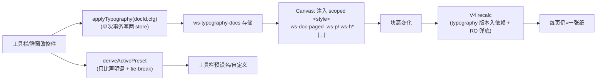

# feat: Schema 2 分页文档标准化排版层（ui-demo 优先）

> **Target：ui-demo（本仓 `ui-demo/`）。本期不碰真 app。** 计划基线 origin/main（工作 worktree checkout 于 c63d1c5）。所有路径 repo-relative。
> **本版已过 ce-doc-review（2026-07-24，5 persona）**，修入：字体栈拼接甩中文 bug、article inline 盖不住 .ws-p、H4 块级不存在、U7 越界删除、deriveActivePreset 撞车、lastPresetId 存储、交互态/ARIA、AE5 往返门、F2–F4 trace。

## Summary

给 Schema #2「分页文档」加一层**标准化排版能力**：一条顶部排版工具栏 + 一批可编辑排版控件 + 一组具名标准预设（国标公文 / 学术论文 / 商务 / APA / MLA）。选预设一键把整份文档排版设成该标准全套值；此后每个旋钮可单独改、改了脱离预设、可另存自定义预设。**先在 ui-demo 做到 production-ready，再 align 真 app**（独立后续事）。

需求全部来自 origin 需求文档（四项拍板 + R1–R23 + AE1–AE7 + 附录 A/B/C 精确值）。本 plan 只定 HOW，不重造需求。

## Problem Frame

分页文档当前只有**页面级**（@page 几何）可编辑：`PageConfig = {on,size,orientation,margin,pageNumbers}`（`ui-demo/src/lib/page.ts:19-25`），埋在 `PageSetupModal`。**文档排版级全部写死**：正文渲染用 `--font-ui`（从 `body` 继承，`.ws-doc` 不设 font-family，见 `ui-demo/src/components/Canvas.css:14` + `ui-demo/src/styles/global.css:24`），字号/行距**显式**声明在 `.ws-p{font-size:var(--fs-lg);line-height:var(--lh-doc)}`（`Canvas.css:258`）、`.ws-ul li{line-height:1.7}`（`Canvas.css:260`）、`.ws-h1/h2/h3{font-size:30/20/16px}`（`Canvas.css:255-257`）——正文字体/字号/行距/缩进/对齐/标题各级全不可调。

要让分页文档承载有硬性排版标准的正式文档（公文/标书/论文），这些必须可编辑。两条核心约束（侦察 + 评审确认）：
- **排版 ≠ @page**。字体/字号/行距是 body CSS，塞不进 `@page`。故引入独立 `TypographyConfig`，与 `PageConfig` 分层并存（KTD1）。
- **应用不能靠 article inline style**。正文/列表/标题的字号行距是**显式声明**在低层 class 上的，祖先 article 的 inline 继承值压不过它们（CSS 继承 vs 显式声明规则）。必须注入 scoped `<style>` 块用类级选择器覆盖（KTD6）。

## Requirements Trace

| 需求文档 | 落到本 plan |
|---|---|
| R1–R5 预设库（≥5，脱离/另存） | U1（预设定义/脱离逻辑）+ U2（存储/另存/lastPresetId）+ U5（下拉）|
| R6–R9 页面级（纸张/边距双单位/页眉页脚/页码）| U6（弹窗，边距双单位）；纸张/方向/页码已存在于 `PageSetupModal` |
| R10–R15 正文排版 | U1（模型）+ U3（scoped-style 应用）+ U5（常用控件上栏）+ U6（其余进弹窗）|
| R16–R17 标题各级 H1–H4 | U1（模型）+ U4（加 level-4 块 + H1–H4 应用，KTD8）+ U6（弹窗编辑）|
| R18–R20 顶部工具栏、仅分页显示、即时重排 | U5 + U3（分页联动）|
| R21–R23 持久化 / 门控 / strip 分清 | U2（ui-demo localStorage 分层存储）；真 app 入盘 = deferred |
| F1 套用预设 / F5 AI 自带 | U5（用户主动选预设）；F5 的 AI 自带块 = deferred（DEP-3）|
| F2 微调后另存 | U2 + U6（saveAs）|
| F3 中英切换感知 | U5（同一套控件承载两标准）|
| F4 单位切换 | U6（mm/inch，KTD3）|
| AE1–AE7 | U3/U4/U5/U6/U7 的 Playwright computed-style 门；AE5 往返门在 U6 |

## Key Technical Decisions

- **KTD1 · 分层数据模型（Colin 2026-07-24 拍板）。** `PageConfig` 保持纯 @page 几何不动；新建 `TypographyConfig`（正文 + 标题各级）与之并列。一个「预设」= `{ id, nameKey, page: Partial<PageConfig>, type: TypographyConfig }`。真 app align 时 `type` 变第二个 `data-ws-schema-css` 块、与 `@page` 解耦。见 origin KD5/RISK-2。

- **KTD2 · 中西文分设 = font-family 回退链，但泛型族只能有一个、且在末尾（评审修正）。** 中西分设 = 西文字体名在前、中文字体名在后拼一个 `font-family` 串，靠浏览器 per-glyph fallback 分派。**关键修正**：`FONT_STACKS` 只存**具体字体名、不带泛型族**（`serif`/`sans-serif`）；`composeFontFamily(latin, cn)` = `[...latinNames, ...cnNames, 终末泛型]`，**只在最末尾追加一个**泛型族，且该泛型由中文字体性质决定（仿宋/宋=serif、黑体=sans-serif）。若泛型混在中间（如西文栈自带 `serif` 落在仿宋前），中文字符会命中中间那个泛型→映射到系统 CJK 衬线→仿宋永远够不着（评审实证的假字体 bug）。回答 origin OQ3。

- **KTD3 · 单位恒存 mm、只换显示（Colin 拍板）。** 存储层永远 mm（单一真相），mm↔inch 只在显示/输入层换算（inch 显示保留 2 位），避免往返浮点累积误差。

- **KTD4 · 字体可用性 = 系统替身 + 回退栈（origin RISK-1）。** `typography.ts` 为每个「意图字体」定义 web-safe 具体字体名回退栈（仿宋→`"FangSong","STFangsong"`；黑体→`"SimHei","Heiti SC","PingFang SC"`；宋→`"SimSun","Songti SC"`；楷→`"KaiTi","STKaiti"`；均**不含**泛型，泛型由 KTD2 末尾统一加）。视觉≈非逐字节国标；预设记「意图字体名 + 回退栈」。真 app 字体内嵌 deferred。

- **KTD5 · 预设身份靠「值反推」——只比预设声明过的键，且预设两两必须可区分（评审修正）。** 复用 `PageSetupModal` 的 `presetKey` 范式（`ui-demo/src/components/PageSetupModal.tsx:48-55`）。`deriveActivePreset(page, type, lastPresetId)`：**只比对预设 `Partial<page>` 里实际声明的键 + 全部 type 键**；全匹配→预设名，否则「自定义·基于〈lastPresetId〉」。**两个修正**：① 通用预设值相近（学术 vs 商务、APA vs MLA），必须保证内置预设两两全值不同（U1 加断言），否则「选 MLA 显示 APA」；② 多个匹配时用 `lastPresetId` tie-break，选中哪个显示哪个。

- **KTD6 · 排版应用走 scoped `<style>` 块，不走 article inline（评审修正，correctness）。** 字号/行距/标题大小**显式声明在低层 class**（`.ws-p`/`.ws-ul li`/`.ws-h1..3`），祖先 article 的 inline 继承值压不过。必须复用 `Canvas.tsx:2542` 的 `scopedTplCss` 注入机制，注入 `.ws-doc-paged .ws-p{…}` 等**类级特异性**规则盖过 base。font-family/text-indent/text-align 虽能继承，为口径统一也一并走 scoped 块。

- **KTD7 · 验证门双轨 + 强断言纪律（含 per-glyph 假绿告警）。** 页算变化→扩 `test-page.mjs`（node）。真渲染→照 `verify-paged-v4.mjs` 的 Playwright **computed-style 真像素**范式，**不查 class**，新建 `verify-typography.mjs` 挂 `package.json`（顺带补挂现有未 script 化的 paged 门）。**告警**：`getComputedStyle().fontFamily` 返回声明串（含"仿宋"）≠ 真 per-glyph 渲染字体——它验不了 KTD2 是否真分派对；per-glyph 正确性靠 U1 的字符串结构断言（泛型唯一且在末尾）+ 人工/截图抽验兜，测试注释写明此限。

- **KTD8 · H4 标题级：本期就给 ui-demo 加第 4 级标题块（Colin 2026-07-24 拍板）。** ui-demo 块模型 heading 现为 `level: 1|2|3`（`ui-demo/src/mock/pagedSamples.ts:40`），无 `.ws-h4`。为满足 origin R16「H1–H4」，本期给 ui-demo 块模型加 level 4：动 heading 块 type/level 联合类型、渲染器（`<h4 class="ws-h4">`）、斜杠/块菜单「标题 4」项、markdown `####`↔level 4（若 ui-demo 有 md 适配）、`.ws-h4` base CSS。这是跨块模型的改动、比纯排版层大，Colin 明确要在本期做进 ui-demo（真 app Schema 本就封顶 h4，将来 align 对得上）。落在 U4（含加块 + 上样式，可能拆 2 PR）。

- **KTD9 · 控件复用 + 新建可输入下拉。** 分段/输入/按钮复用 `.pg-seg`/`.ws-input`/`.ws-btn`。字号/字体/行距是多选项，`.pg-seg` 装不下且无共享 select——U5 新建**可编辑 combobox**（下拉列表 + 同域自由数字输入，满足 R11「任意 pt」）+ 完整 ARIA/键盘（listbox/combobox、`aria-expanded`/`aria-activedescendant`、方向键/Enter/Esc），对齐现有 `role=radiogroup/switch` 无障碍口径。

## High-Level Technical Design

**数据模型（分层，方向性示意，非最终签名）：**

```
PageConfig（page.ts，不动）          TypographyConfig（新 typography.ts）
  on,size,orientation,               body:   { cnFont, latinFont, sizePt, lineHeight{mode:'multiple'|'fixedPt', value},
  margin{t,r,b,l}(mm), pageNumbers            firstIndentEm, align, spaceBeforePt, spaceAfterPt }
                                     headings: { h1..h4: { cnFont, latinFont, sizePt, bold } }   ← H4 = 本期加 level-4 块(KTD8)

Preset = { id, nameKey, page: Partial<PageConfig>, type: TypographyConfig }
  预设库 = [国标公文, 学术论文, 商务, APA, MLA]（值来自 origin 附录 A）+ 用户 customPresets[]
  内置预设两两全值必须不同（KTD5 断言）

存储（U2）：ws-typography-docs = Record<docId, { config: TypographyConfig, lastPresetId: string|null }>
          ws-typography-presets = Preset[]（用户自定义）
FontStack: 意图字体名 → 具体字体名回退栈（不含泛型）；composeFontFamily 末尾加唯一泛型（KTD2/KTD4）
首行缩进：CSS text-indent:2em（em 自动跟随字号，无需 JS 随字号重算——评审建议）
```

**配置 → 渲染 → 分页 的流（关键联动 AE3/R20）：**



分页联动铁则：typography 经 scoped `<style>` 应用（KTD6）→ `.ws-blocks` 内块高变 → 现有 V4 recalc 必须重跑。recalc effect 当前依赖 `[paged, doc, pageBox]`（`Canvas.tsx:977`，不含 typography）；靠 `.ws-blocks` 高变触发 ResizeObserver 兜底，**并显式把 typography 版本号加入 recalc 依赖**双保险。这是本 plan 最高风险联动点，U3 专门验（先写失败门）。

## Implementation Units

分四阶段：地基（U1–U2）→ 应用生效（U3–U4）→ 交互（U5–U6）→ 门与对齐（U7）。每个引入文案的 UI 单元必须同 PR 加 zh+en key 并过 `npm run i18n:scan`（scan/parity/usage 三门）。

---

### U1. 排版数据模型 + 预设定义（纯逻辑）

**Goal**：定义 `TypographyConfig`/`Preset` 类型、五个具名预设精确值、字号号↔pt 表、字体回退栈、`composeFontFamily`、单位换算、预设身份反推——纯函数，node 单测。

**Requirements**：R1、R5、R10–R17、KTD1/2/3/4/5/8。

**Dependencies**：无（地基）。

**Files**：`ui-demo/src/lib/typography.ts`（新）；`ui-demo/scripts/test-typography.mjs`（新，node，仿 `test-page.mjs`）。

**Approach**：
- `TypographyConfig` = body（cnFont/latinFont/sizePt/lineHeight{mode,value}/firstIndentEm/align/spaceBeforePt/spaceAfterPt）+ headings（h1–h3 各 cnFont/latinFont/sizePt/bold；**H4 见 KTD8**）。
- `PRESETS: Preset[]` 值抄 origin 附录 A。**国标公文冻结值**：A4/上37下35左28右26mm/仿宋三号16pt/**固定行距 29pt（由版心225mm÷22行导出，AE2 断言此值）**/首行缩进 2em/两端对齐/H1 小标宋二号22pt居中/H2 黑体三号16pt/H3 楷体三号16pt。APA/MLA 硬值（附录 A.4/A.5）；学术/商务通用默认（附录 A.2/A.3）。
- `FONT_STACKS`（KTD4，具体字体名、**不含泛型**）；`GENERIC_OF(cnFont)`→`'serif'|'sans-serif'`；`composeFontFamily(latin, cn)` = latin 名 + cn 名 + **末尾唯一泛型**（KTD2）。
- `ZIHAO_PT`（附录 B）+ `ptToZihao`/`zihaoToPt`；`mmToInch`/`inchToMm`（KTD3）。
- `deriveActivePreset(page, type, lastPresetId)`（KTD5：只比预设声明键 + tie-break）→ `{presetId|null, isCustom, basedOn}`。

**Test scenarios**（`test-typography.mjs`，node）：
- 每个预设 `deriveActivePreset(preset.page, preset.type)` 反推回它自己。Covers AE3 前置。
- **内置预设两两全值不同**（遍历所有对，断言无两个预设 config 深等）——防「选 MLA 显示 APA」（KTD5①）。
- 改 `type.body.sizePt` 一档 → `deriveActivePreset` 返回 `isCustom=true, basedOn=原预设`。
- **`composeFontFamily('Times New Roman','仿宋')` 断言：泛型族只出现一次且在最末位**（把中间含泛型的错误串判红——KTD2 correctness 门）。
- `mmToInch(37)`≈1.4567、`inchToMm(mmToInch(37))` 往返回 37（±1e-9）。
- `zihaoToPt('三号')===16`、`ptToZihao(10.5)==='五号'`、非表内 pt（13）→ 不崩、返回 null。
- 国标公文边距四值===`{37,35,28,26}` 且固定行距===29pt（钉死硬值防漂）。

**Verification**：`node scripts/test-typography.mjs` 全绿；变异自检——把国标边距或固定行距改错值/把 composeFontFamily 泛型放中间，门必红（先 commit 再变异，还原翻绿）。

---

### U2. 排版存储 + 预设脱离/另存（分层 store）

**Goal**：per-doc `TypographyConfig` + `lastPresetId` 持久化（localStorage，与 `usePaged` 分层并存）+ 全局自定义预设库；`applyPreset` 单次事务写两 store。

**Requirements**：R2、R4、R21、F2、KTD1/KTD5。

**Dependencies**：U1。

**Files**：`ui-demo/src/mock/typography.ts`（新，仿 `ui-demo/src/mock/paged.ts` zustand+localStorage）。

**Approach**：
- `useTypography`：`docs: Record<docId, {config: TypographyConfig, lastPresetId: string|null}>`、`getConfig/setConfig`，`localStorage['ws-typography-docs']`。**`lastPresetId` 有明确存储落点**（评审：deriveActivePreset 要它、reload 后「自定义·基于X」要能复原，故必须落盘，不能只在内存）。
- `useCustomPresets`：全局 `customPresets: Preset[]`，`saveAs(name)/list/remove`，`localStorage['ws-typography-presets']`。
- `applyPreset(docId, presetId)`：**单次事务**——先在内存同时算好 page + type，再各持久化一次；同时写 `usePaged.setConfig` 与 `useTypography.setConfig(config, lastPresetId=presetId)`；**合并重排触发**（避免两次 store 写各触发一次重排=双重分页 + 一帧「自定义」闪烁——评审 P3）。若 type 持久化 throw（quota），回滚 page 侧，不留半套预设。
- `pruneConfig(docId)`：删文档时清 ws-typography-docs 对应条目（评审 residual：deleteDoc 现不清 paged/typography config，孤儿累积）——在 store 暴露，U7 或删文档流接（本期至少留 hook + TODO）。

**Test scenarios**（node，扩 `test-typography.mjs` 或 store 薄测）：
- `applyPreset` 后 `getConfig(docId).config` 深等预设 type、`lastPresetId===presetId`，paged 侧 margin 同步。
- Covers F2：`saveAs('本公司公文')`→`list()` 含之→`applyPreset` 该自定义预设可复原。
- reload：写 config+lastPresetId→重载 `load()`→深等（含 lastPresetId 存活，支撑 AE5/「自定义·基于X」复原）。
- localStorage throw 时 setConfig 不崩、退化会话内有效；applyPreset 第二写失败回滚不留半套。

**Verification**：store 单测绿；lastPresetId reload 往返验证；变异——把 applyPreset 回滚去掉、第二写失败留半套，断言必红。

---

### U3. 正文排版应用（scoped-style）+ V4 分页联动（最高风险）

**Goal**：把 `TypographyConfig.body` 经 scoped `<style>` 应用到分页正文（font-family 回退链/字号/行距/首行缩进/对齐/段间距），并保证改排版后 V4 分页即时重排、每页仍=一张纸。

**Requirements**：R10–R15、R20、AE2/AE3/AE6、KTD2/KTD6、HTD 联动铁则。

**Dependencies**：U1、U2。

**Files**：`ui-demo/src/components/Canvas.tsx`（注入 scoped `<style>`；typography 版本入 recalc 依赖）；`ui-demo/src/components/Canvas.css`（若需 `.ws-doc-paged` 排版钩子）；`ui-demo/scripts/verify-typography.mjs`（新，Playwright computed-style）。

**Approach**：
- `paged` 时读 `useTypography` → **生成 scoped CSS 文本**（复用 `Canvas.tsx:2542` 的 `scopedTplCss` 注入机制，KTD6）：`.ws-doc-paged .ws-p{font-family;font-size;line-height;text-indent:2em;text-align;margin:段前/段后}`、`.ws-doc-paged .ws-ul li{font-family;font-size;line-height}`（硬编 1.7 要盖）。**不用 article inline**（盖不住低层显式声明——评审 correctness）。
- font-family=`composeFontFamily`（KTD2，末尾唯一泛型）；行距 `lineHeight.mode`：multiple→数值、fixedPt→`Npt`。首行缩进用 `text-indent:2em`（em 跟字号，无需随字号 JS 重算——评审建议，去掉一条重算路径）。
- **联动**：typography 版本号加入 recalc effect 依赖（`Canvas.tsx:977` 现为 `[paged,doc,pageBox]`）+ `.ws-blocks` 高变 ResizeObserver 兜底，双保险重排。

**Test scenarios**（`verify-typography.mjs`，Playwright 真渲染 computed-style）：
- Covers AE2：套国标公文，`getComputedStyle('.ws-p').fontFamily` 串结构含仿宋且泛型唯一在末、`fontSize`≈16pt→px、`lineHeight`≈29pt→px（固定值口径）、`textAlign==='justify'`、`textIndent`≈2em。
- Covers AE3（**核心回归**）：先量页几何（每页高≈1122.5px 均匀），改字号一档后**再量**——页数可变但每页仍均匀=一张纸（照 `verify-paged-v4.mjs` uniform-page-height 断言）。
- Covers AE6：套 APA，`fontFamily` 含 Times、`lineHeight`≈2.0、`textAlign==='left'`、`textIndent`≈0.5in 等价 em。
- **注释写明**（KTD7 告警）：computed fontFamily 串验的是声明结构不是 per-glyph 真字体；per-glyph 正确性靠 U1 结构断言 + 截图抽验。

**Verification**：`node scripts/verify-typography.mjs`（起 dev server）全绿；变异——① 改成 article inline 应用（不生效），AE2 字号断言必红；② recalc 不纳入 typography 依赖 + 禁 RO，AE3 改字号后错位必红。

**Execution note**：先写 AE3「改字号后每页仍=一张纸」失败门，再接联动——最易假绿处（改字号但分页没重算，视觉错位而纯逻辑门发现不了）。

---

### U4. 标题各级：ui-demo 加第 4 级标题块 + H1–H4 样式应用

**Goal**：给 ui-demo 块模型加第 4 级标题（level 4 = `<h4 class="ws-h4">`），并把 `TypographyConfig.headings` 每级样式（中西字体/字号/粗细）经 scoped `<style>` 应用到 H1–H4。

**Requirements**：R16、R17、AE7、KTD6、KTD8。

**Dependencies**：U3（共用 scoped-style 机制）。**可拆 2 PR**：先 U4a 加 level-4 块（块模型改动），再 U4b 上 H1–H4 排版样式。

**Files**：
- `ui-demo/src/mock/pagedSamples.ts`（`level: 1|2|3` → `1|2|3|4` 及其 `h()` 辅助）
- ui-demo 块编辑器/渲染器（heading 块渲染 `<h4 class="ws-h4">`；实现者按现有 h1–h3 渲染点定位，Canvas 侧 heading block 渲染 + 类型联合）
- ui-demo 斜杠/块菜单（加「标题 4」项，仿现有标题 1–3 项）
- ui-demo markdown 适配（若有：`####` ↔ level 4；实现者确认 ui-demo 是否有 md↔block 适配层）
- `ui-demo/src/components/Canvas.css`（新增 `.ws-h4` base 样式，仿 `.ws-h3`）
- `ui-demo/src/components/Canvas.tsx`（scoped CSS 追加 `.ws-doc-paged .ws-h1..4`）
- `ui-demo/src/i18n/{zh,en}/*`（若菜单项要文案）

**Approach**：
- **U4a 加块**：heading 块的 level 联合类型扩到 4；渲染器按 level 4 输出 `<h4 class="ws-h4">`；斜杠/块菜单加「标题 4」；`.ws-h4` base CSS（仿 h3 递减）；若有 md 适配则 `####`↔4。实现者先 grep 现有 h1–h3 的全部触点（渲染/菜单/类型/CSS/md）再逐点扩。
- **U4b 上样式**：scoped `<style>` 里 `.ws-doc-paged .ws-h1/.ws-h2/.ws-h3/.ws-h4{font-family=composeFontFamily; font-size; font-weight}` 从 config.headings 注入（类级盖过 base，KTD6）。国标公文预设：H1 小标宋二号22pt居中、H2 黑体三号16pt、H3 楷体三号16pt、H4 仿宋三号16pt加粗（靠字体区分层级）。

**Test scenarios**（`verify-typography.mjs` 追加）：
- **加块**：斜杠菜单能插入标题 4 → 渲染 `<h4 class="ws-h4">`；存盘 round-trip 保住 level 4（若有 md，`####` 往返）。
- Covers AE7：套国标公文，量 h1/h2/h3/h4 computed fontFamily 分别含 宋/黑/楷/仿 栈（四级字体确有差异）。
- 改 H2 字号一档 → 只 H2 变、其余级不动；`deriveActivePreset` 转自定义。

**Verification**：Playwright 加块 + 每级 computed 断言绿；变异——漏掉 h4 渲染或字体应用，加块/AE7 断言必红。

---

### U5. 顶部排版工具栏（组件 + 可编辑 combobox + 挂载 + 门控）

**Goal**：分页文档打开时在文档区上方显示排版工具栏：预设下拉 + 中/西字体 + 字号 + 行距 + 对齐 + ⚙入口；仅分页显示；含完整交互态/无障碍/窄屏溢出。

**Requirements**：R2、R3、R18、R19、F3、AE1、KTD5/KTD9。

**Dependencies**：U1、U2、U3。

**Files**：`ui-demo/src/components/TypographyToolbar.tsx`（新）+ `.css`（新）；`ui-demo/src/components/Canvas.tsx`（挂 `<main class="ws-canvas">` 内、`.ws-canvas-scroll` 前，`{paged && <TypographyToolbar/>}`，见 `Canvas.tsx:2508`）；`ui-demo/src/components/controls.css`（提取共享 combobox 类）；`ui-demo/src/i18n/{zh,en}/editor.ts`。

**Approach**：
- **可编辑 combobox 组件**（KTD9）：下拉列表 + 同域自由数字输入（字号满足 R11「任意 pt」；输入的 pt 无对应号时 号标显示 pt 值本身或「自定义」）。完整交互态：closed/open/hover-item/方向键导航/Enter 选/Esc 关/选中标记。**ARIA**：`role=listbox`/`combobox`、`aria-expanded`、`aria-activedescendant`、键盘全支持，对齐现有 `role=radiogroup/switch` 口径。字号下拉双标「三号 (16pt)」（附录 B）。
- **预设下拉**：`deriveActivePreset` 显示当前预设名或「自定义·基于X」（R3/KTD5）。**脱离态渲染明确**：下拉仍列全部具名预设（含 basedOn 那个，可点回=重套=revert）；「自定义」作独立只读行标当前态；重套一个预设**直接覆盖当前自定义值**（原型无确认，与其它即时生效控件一致——记为有意决策）。
- 常用控件（中/西字体、字号、行距、对齐）直接改 typography → `applyTypography`；⚙ 打开 `PageSetupModal`（U6 扩展版）。
- 门控 `{paged && …}`，流式不挂（R18/AE1）。**窄屏溢出**（评审 P2/RISK-C）：canvas 宽低于阈值时，次要控件（行距/对齐/字体标签）收进「…」溢出菜单或转 icon-only；定一个阈值 + 一条测试。

**Test scenarios**（`verify-typography.mjs` 追加）：
- Covers AE1：分页文档→工具栏在 DOM 且可见；流式→工具栏不存在。
- 选「国标公文」→ 正文 computed 变（同 U3 AE2）、预设名显示「国标公文」。
- Covers F3：选「APA」→ 正文 Times/双倍/左对齐（同 U3 AE6）；再选「国标公文」→ 切回仿宋/两端。
- 改字号 → 预设名变「自定义·基于X」；再点该 X → revert 回预设值。
- 字号 combobox 键盘：输入 `13`（非表内 pt）→ 应用 13pt、号标显示自定义；Esc 关闭不改值。
- 窄屏：canvas 收窄到阈值下 → 次要控件进溢出菜单、无 wrap/clip。
- i18n：新 key zh/en 齐，`npm run i18n:scan` 三门绿。

**Verification**：Playwright 门控 + 交互 + 窄屏绿；`i18n:scan` 绿；变异——门控写成恒真（流式也显示），AE1 断言必红。

---

### U6. ⚙ 页面设置弹窗扩展（分节 + mm/inch 双单位 + 段间距 + 另存预设 + AE5 往返）

**Goal**：把 `PageSetupModal` 从纯页面设置扩成「页面 / 排版 / 标题」**堆叠分节**（非 tab），承载工具栏放不下的重控件；补 AE5 存盘往返门。

**Requirements**：R4、R7、R15、R16、F4、AE4、AE5、KTD3/KTD9。

**Dependencies**：U1、U2、U3、U4。

**Files**：`ui-demo/src/components/PageSetupModal.tsx`（扩堆叠分节）+ `.css`；`ui-demo/src/i18n/{zh,en}/editor.ts`。

**Approach**：
- **堆叠分节**（评审：tab vs 分节是硬 fork，本 plan 定**堆叠可折叠分节**——比 tab 简单、无焦点/滚动位管理、与现有单滚动 body 一致）：「页面」（纸张/方向/边距/页码 + 页眉页脚文本框）、「排版」（字体/字号/行距/首行缩进/对齐/段前段后）、「标题」（H1–H4 各字体/字号/粗细）。默认全展开，顺序页面→排版→标题。
- **边距 mm↔inch**（KTD3）：显示层换算（存储恒 mm），切 inch 时四值按 `mmToInch` 显示保留 2 位、输入回写经 `inchToMm`。
- **「另存为预设」流程明确**（评审：防数据丢失）：点按钮 → 弹内联命名输入（非二次弹窗）；**重名 = 拒绝 + 提示**（不静默覆盖——A1 存公司标准场景数据安全）；取消 = 关输入不改。→ `useCustomPresets.saveAs`。
- 复用 `.pg-field`/`.pg-seg`/`.ws-input`/`.pg-switch` + U5 的 combobox。

**Test scenarios**（`verify-typography.mjs` 追加）：
- Covers AE4：边距 37mm 切 inch 显示 1.46（2 位），版式不变；切回 mm 仍 37（无累积误差，联动 U1 往返）。
- Covers AE5（**评审补的往返门**）：新建分页文档→工具栏/弹窗设排版（字体+字号+边距）→触发存盘→**关闭并重开该文档**→computed style 与预设名与存前一致（含 lastPresetId 复原的「自定义·基于X」）。
- 另存：取名 → 下拉（U5）出现该自定义预设、可复用；**重名 → 拒绝 + 提示，原预设不被覆盖**。
- 排版区改行距 → 正文即时重排（联动 U3）。
- i18n 三门绿。

**Verification**：Playwright 单位换算 + AE5 往返 + 另存/重名绿；`i18n:scan` 绿；变异——① 单位换算写成存储也跟着变，AE4 切回 mm≠37 必红；② 重名改成静默覆盖，另存测试必红。

---

### U7. 验证门收口 + 删档清理 + spec 更新

**Goal**：把 typography Playwright 门挂进 npm script、接删文档时清 typography config、更新 `docs/features/paged-doc.md`（口径 + 欠账）。

**Requirements**：R21–R23、KTD7；执行纪律「同 PR 更 spec」。

**Dependencies**：U1–U6。

**Files**：`ui-demo/package.json`（新增 `verify:typography`；顺带补挂未 script 化的 `verify-paged-v4`/`smoke-paged`）；`ui-demo/src/mock/store.ts`（`deleteDoc` 接 `pruneConfig`，清 ws-typography-docs/ws-paged-docs 孤儿——评审 residual）；`docs/features/paged-doc.md`（更新口径 + 有意分歧 + 欠账）；`docs/brainstorms/2026-07-24-schema-2-paged-standards-requirements.md`（可选回填实现落点链接）。

**Approach**：
- npm script 化 Playwright 门（现只 `test:page` 入脚本）。
- `deleteDoc` 调 U2 的 `pruneConfig(docId)`，避免 config 孤儿无限累积（评审 residual；harmless today 但无清理 hook）。
- **CI 覆盖认知（写进 spec/plan，本单元不改 CI）**：仓库 CI `changes` 过滤对 ui-demo-only PR 置 app=false、跳真 app test/e2e；ui-demo node 门（`test:page`/`i18n:scan`/新 `verify:typography`）是否进 CI 是**待 Colin 拍的独立决策**，本期先做成一条命令可跑。
- 更新 spec：对齐锚点（本期 ui-demo commit）+ 真 app 侧欠账（排版层 + 排版入盘 `data-ws-schema-css` + H4 完整支持）。

**Test scenarios**：happy path——`deleteDoc` 后 `ws-typography-docs` 无该 docId 条目（node 薄测）。其余为脚本挂载 + 文档更新，无行为变更；门的牙在 U1/U3/U4/U5/U6 变异自检里。

**Verification**：`npm run test:page && npm run i18n:scan && npm run verify:typography`（起 dev server）一条龙绿；deleteDoc 清理单测绿；spec diff 覆盖口径 + 有意分歧 + 欠账。

## Scope Boundaries

**范围内（v1）**：U1–U7。五预设、中西字体分设（font-family 链，泛型唯一末尾）、mm/inch 双单位、正文全套排版、标题 **H1–H4（含给 ui-demo 加第 4 级标题块，KTD8）**、段间距、顶部工具栏（可编辑 combobox + ARIA + 窄屏溢出）+ ⚙ 分节弹窗、ui-demo localStorage 分层存储（含 lastPresetId）、Playwright computed-style 门。

**Deferred to Follow-Up Work（本仓后续 PR）**：
- **真 app align**：整体移植真 app，排版入盘 `data-ws-schema-css="type"` + Schema 校验白名单扩展（origin RISK-2）。
- ui-demo 门是否进 CI（U7 记的独立决策）。

**Deferred for later（origin 拍板，非本期）**：奇偶页镜像/首页差异化页眉页脚（国标页码奇右偶左降级为单一规则）；中文避头尾/标点禁则（靠浏览器 `line-break` 兜底）；跨组织共享模板池；真 app 字体内嵌。

**Outside this feature's identity（明确不做）**：完整 Word 工具（分栏/装订线/手动分页符/文字颜色高亮富文本/图文环绕/样式刷/修订批注）。每个控件必须对应一条文档标准设置（origin KD6）。**新建文档自动套默认预设**（评审 scope：origin F1 是用户主动选，非系统自动默认；新分页文档从 baseline 起、用户选预设才变）。

## Risks & Dependencies

- **RISK-A · 改排版后分页不重排（假绿高发区）。** 最高风险（U3）。缓解：typography 入 recalc 依赖 + RO 兜底 + 先写 AE3 失败门 + 变异自检。
- **RISK-B · 字体替身 + per-glyph 假绿（origin RISK-1 / KTD2/KTD4/KTD7）。** 系统无仿宋_GB2312，视觉≈；且 computed fontFamily 串验不了 per-glyph 真分派。缓解：回退栈 + 泛型唯一末尾 + U1 结构断言 + 截图抽验 + 测试注释写明限。真 app 内嵌 deferred。
- **RISK-C · 工具栏空间（origin ASSUMPTION-1）。** 「常用在栏、其余进⚙」硬约束 + 窄屏溢出菜单（U5）。
- **DEP-1 · V4 分页引擎（page.ts + Canvas recalc）。** 全程坐其上，不改分页数学、只加排版应用层。
- **DEP-2 · schema-2 AI 创作指南（origin DEP-2）。** 真 app align 时 `docs/schema-2-ai-authoring.md` 补排版块写法——deferred。

## Open Questions

- **OQ-e（已由 Colin 拍板 2026-07-24）· H4 = 本期给 ui-demo 加第 4 级标题块。** 选 (b)：本期就在 ui-demo 块模型加 level 4（U4 含加块 + H1–H4 样式），不折中。跨块模型改动是有意为之的范围包含（KTD8/U4）。
- OQ-a（origin OQ1）真 app 排版 CSS 文件形状 / 校验白名单——deferred 到真 app align plan。
- OQ-b（origin OQ2）字号档位——本 plan 定：列常用号（初号~小五约 12 档，附录 B）+ 可编辑 combobox 自由 pt（U1/U5）。
- OQ-c（origin OQ4）自定义预设存储——ui-demo 全局 localStorage（U2）；真 app 存哪 deferred。
- OQ-d 行距「固定值 N 磅」屏显（px）vs 导出（pt）一致口径——U3 对齐现有 paged 导出常量；国标固定行距已冻结 29pt（U1）。
