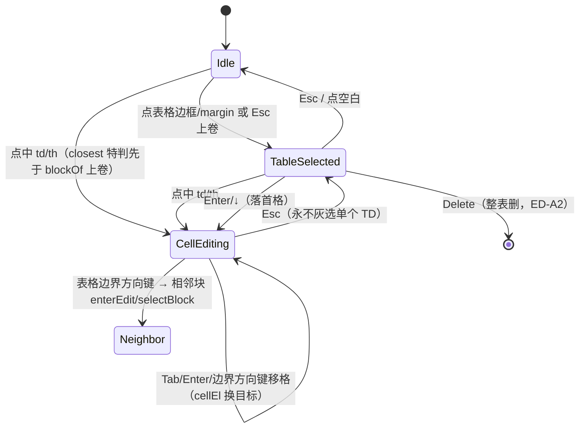
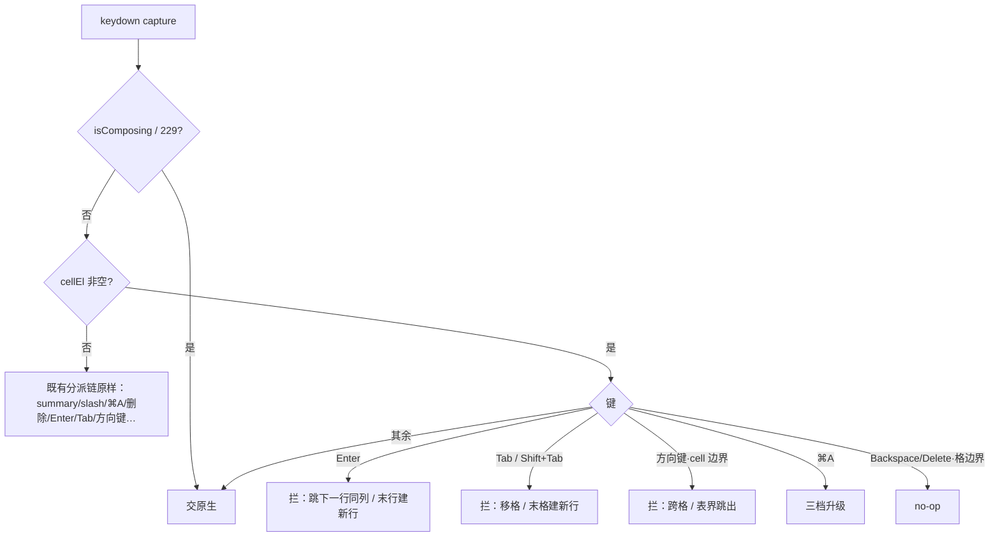

# feat: Schema 1 表格块编辑（真 app）

## Summary

给真 app 块编辑器的 `<table>` 块补上编辑能力：单元格级进入编辑、键盘移格、斜杠造表（P1），行/列增删与 cell 对齐（P2）。架构照搬 toggle 块先例——容器仍整块灰选，编辑能力下放到 TD/TH，新路径门控在「文档含表格」之后，任何编辑序列产出的磁盘字节必须 reparse 仍合规。

---

## Problem Frame

Schema 1 把表格当一等公民（`TOP_BLOCKS` 含 TABLE、有专门 `validateTable`），AI 生成与 markdown 转换都会产出表格，但块编辑器从未实现表格编辑：`classify()` 无 TABLE 分支落 `'other'`，`isEditableEl` 返 false，点击只走 `selectBlock` 灰选；斜杠菜单也没有造表入口。用户拿到含表文档只能整块移动/删除，格子里的字一个都改不了（王波 Notion bug 报告 2026-07-21，Colin 拍板立项 2026-08-03）。`docs/schema-1-draft-v0.md` §2.3 已定 Table v1 文法（矩形、禁合并格、cell phrasing-only、`ws-al-*` 对齐），状态「❌ 未实现」——本 plan 就是把这条欠账做掉。

现状的「灰选不可编辑」是有意防御：原生 contenteditable 在表格上的默认行为（Enter 插 div、拖选删格削成非矩形）任何一下都会让存盘字节非合规、整篇文档降级出块编辑器。所以本 plan 的核心不是拆防御，而是补受控通道——每个交互都自己接管、每步都保矩形。

---

## Execution Context

- **实现必须在 origin/main 新开 worktree**。本 plan 所在的 `docs/*` 分支代码冻结在切分支那刻（team-memory 2026-07-23 实测点名过本分支），在这里改码测绿全是假绿。`git worktree add <dir> origin/main -b feat/table-block-editing`。
- **行号必然漂移，一律按符号定位**（`classify` / `isEditableEl` / `blockOf` / `deleteSelection` / `refreshRangeSel` / `onKeyDown` / `applySlash` / `newBlock` / `openBlockMenu` / `WS2_MARKERS` / `refreshSemanticStyles`）。本 plan 引用行号仅为研究快照（origin/main @ 526549d）。
- **CI 绿灯名是 `e2e-all`**（4 片 matrix 聚合门），required = `{test, e2e-all}`，strict=true——PR BEHIND 要 `gh pr update-branch`。掉测地板：全量 spec < 400 条 e2e-all 红。
- **开发循环只跑受影响 spec + 固定五 spec 冒烟子集**（`--reporter=dot`），全量交 CI；undo 类 e2e 必须走菜单路径不走 `Meta+z`。
- **blockedit.js 是热点共享核心**——开工前发 `/remember-global` 预警（改动面：classify/onClick/onKeyDown/deleteSelection/refreshRangeSel/serialize），勤 commit 让并行 session 凭 git log 避让。
- **P1 = U1–U4 一个 PR 合入**：U2/U3 若先行合入而没有 U4 的粘贴闸，内部富 clip 粘进 cell 即产非合规字节——中间态不进 main。P2 可按 U5 / U6 / U7+U8 拆 PR。
- 发版时机 Colin 定；合入 main ≠ 发版就绪。P1 可发版时进 changelog（双语硬门）。

---

## Requirements

**编辑能力（P1）**

- R1. 点击表格单元格进入该格编辑，可输入/删除/行内格式化文字；中文 IME 组词可用（新键盘分支不打断 229 组词）。
- R2. 键盘契约：Tab/Shift+Tab 前后移格；Enter 跳下一行同列；末行 Enter / 末格 Tab 在下方建新行；方向键 cell 内交原生、cell 边界跨格、表格边界跳出到相邻块；⌘A 三档（cell → 整表 → 全篇）；整表灰选态 Enter/↓ 进入首格（键盘可达闭环，不依赖鼠标）；空行行首 Backspace 删除该行（该行整行为空且非最后一个 tbody 行时——Tab 误建行的最小逆操作，Colin 拍板 2026-08-03）。
- R3. 斜杠菜单「表格」项造出 canonical 2×3 表（含表头），光标落首格，造出即可编辑。
- R4. 两种存量形态都可编辑：AI 生成的 `ws-table` + `ws-al-*` 表，与 md 转换来的无 class + `align` 属性表。

**合规红线（贯穿）**

- R5. 任何编辑序列（打字/粘贴/拖放/undo/行列操作的任意组合）落盘字节 reparse 后仍 conform：矩形、无 colspan/rowspan、cell phrasing-only、无 caption/colgroup/tfoot、thead ≤1 行。
- R6. 存盘干净：cell 编辑态标记、contenteditable、行列操作 UI 覆盖层全部被 serialize 剥净。

**结构操作（P2）**

- R7. 行/列增删：含 thead 特判（表头行插 TH 带 `scope="col"`、新行只落 tbody）、分页 spacer 行过滤、退化态自动收敛（删最后 tbody 行自动补空行；删到零行/零列升级为删整表）。
- R8. cell 级对齐 `ws-al-center` / `ws-al-right` 切换，`text-align` CSS 随文件入盘，浏览器直开生效。
- R9. undo 粒度：结构操作恰一个 undo 步、不吞并 pending 打字；undo/redo 后编辑态不悬空。

**回归与账务**

- R10. 无表格文档行为零变化（门控）；跨块选区端点落表内仍整表蓝 + 整删（ED-A2 不变）；存量 e2e 全绿。
- R11. `docs/features/table.md` spec：U1 建占位，U8 定稿；board 建卡；team-memory 发热点预警。

---

## Key Technical Decisions

- **KTD1 · cell 编辑走独立第四状态 `cellEl`（仿 figcaption `captionEl`），不复用 `editingEl=TD`。** generic 块级分支（Esc→`selectBlock(editingEl)`、`applySlash`、fmtbar「转为」、⌘A 分级、`topBlocks().indexOf` 导航）对 `cellEl` 天然 inert——失败模式从「漏一处 guard → 非矩形 → 整篇降级」降为「功能缺失」。备选（复用 editingEl + SUMMARY 式前置分支）泄漏面 10+ 处，否。文字输入仍靠 TD 自身 contenteditable + 既有 doc 级 `input`→markDirty/scheduleCheckpoint 监听（验证其对 cellEl 生效是 U2 首个断言）。
- **KTD2 · 编辑能力按标签键控（TABLE/TD/TH），不看 class。** 造表产 canonical 形态：`<table class="ws-table">` + `<thead><tr><th scope="col">` + tbody 2 行、空格带 ` `（与 `src/renderer/ai-guide.md` 的 AI 生成契约一致）。已知代价：.md 文档中造出的带 class 表会被 md-adapter 岛化（class 不在 `REPRESENTABLE` 白名单，管道表变 HTML 岛，内容保真但丢 md 可读性）——v1 接受，记 spec 欠账；若真实反馈强烈，后续再分叉「.md 文档造表产无 class + align 属性形态」。对 md 来源表格切 `ws-al-*` 对齐同样触发岛化——同一笔账一起记。
- **KTD3 · 选区语义两分**：同表跨 cell 选区 = 清内容不动结构（全罩 cell 清空为 ` `，端点 cell 在格内 range 裁剪——phrasing-only 使裁剪安全）；跨块选区端点在表内 = 整表蓝 + 整删不变（team-memory 2026-07-24 全局选区契约点名的唯一例外，不动）。v1「被罩集」= DOM 线性 Range 覆盖（与原生高亮及既有 covered() 溢出谓词一致；矩形覆盖语义随「区域复制 TSV」后续项一起做）。
- **KTD4 · Enter 在 cell 内无条件拦**（原生会插 `
`）；建新行（末行 Enter/末格 Tab）恒落 tbody、恒产 TD——无 tbody 则建；GFM 合法的 header-only 表从 th 行触发也不得给 thead 塞第二行（否则 `table-structure` 违规直接降级）；Shift+Enter 放行原生 ` `（phrasing 合法、校验放行）；Backspace/Delete 在 cell 首/末 no-op（不跨格并字、不删结构），唯一例外：整行为空且非最后 tbody 行时，行首 Backspace 删除该行（Tab 误建行的对称逆操作，保矩形、恰一 undo 步）；所有新键盘分支带 `e.isComposing || e.keyCode === 229` guard（仓内铁律）。
- **KTD5 · cell 上下文输入闸**：多行文本粘贴 `join(' ')` 压单行（SUMMARY 守卫同款）；内部 `data-ws2-clip` 富粘贴一律压 `textContent`；图片粘贴拒收——且必须给可感知反馈（Colin 拍板 2026-08-03，反馈要清晰、克制、符合「纸方墨圆」）：cell 上方浮出轻量提示气泡（data-ws2-ui overlay，墨色圆角小签文案「单元格只能放文字」，~200ms 淡入、约 1.6s 后淡出，不抖动不闪红），文案进 i18n 双语字典；fmtbar 的行内格式（B/I/U/S/链接）在 cell 态必须可用——execText 加 cell 分支（选区两端同格时直接对该 cell 的 contenteditable 执行；现状按 blockOf 上卷到 TABLE 会被 isEditableEl 跳过 = 死按钮），这是 R1 的另一半；slash 菜单、fmtbar「转为」、块菜单的色板/转换项在 cell 态禁用（块菜单仍可对整表「复制/删除/下方插入」）。
- **KTD6 · 结构操作的 undo 序 = `checkpoint()`（结算 pending 打字债）→ mutate → `checkpoint()`。** 与多数结构操作的「mutate→checkpoint」单枪写法不同，但仓内已有同款先例——todo 勾选（U20/check-3）就是前后各一枪、先冲掉 pending 打字，照抄它；否则 500ms 防抖中的打字和结构变更塌进同一快照，undo 连字带行一起吞。必须配变异自检（U7）。undo/redo 执行前先退出 cell 编辑态（undo 重写 body.innerHTML，cellEl 会变 detached 死节点）；`pathOf/resolvePath` 恢复编辑位留 P2 打磨项。
- **KTD7 · 门控 + 行集合定义**：新代码路径门控在「文档含 `<table>`」之后（toggle `blockOf` 门控先例），无表格文档 100% 走旧路径；门控谓词每次调用现查 DOM（照 blockOf 的 querySelector 先例，禁止 attach 时缓存——表格会中途出现：内部富粘贴、undo 复活）。一切行列运算/导航及被罩集合枚举的「行集合」= 过滤 `[data-ws2-ui]` 与 `.ws-page-spacer` 后的 `tr`——分页会往表里插 spacer 行，不过滤则加列塞错行、Enter 跳进幽灵行，且只在开分页的文档偶发。
- **KTD8 · 样式零新增一例外**：表格边框/内距/thead 底色已在 `BASELINE_CSS` 随 `ensureSchemaBaseline` 入盘，不需要 ws-table style pair；唯一新增 `ws-al-*` 对齐 pair（`ensureAlignStyle` + `refreshSemanticStyles` 四元组登记，presentSel `[class*="ws-al-"]`），`validateHead` 天然放行 `data-ws-schema-css`。
- **KTD9 · 验收姿势**：纯逻辑 node:test + jsdom（真 app 无 vitest）；e2e 照 `e2e/toggle.spec.js` 范式（launch → openDoc fixture → 交互 → `serialize()` 取磁盘字节 → DOMParser reparse 判 conform）；强断言纪律（computed-style / 磁盘字节，绝不 class-contains）；每道新门变异自检（先 commit 再变异、fixture 字符串长度可变）。

---

## High-Level Technical Design

表格块状态机（新增态：cell 编辑；既有态原样）：

`onKeyDown`（capture 相、先到先得）中 TD/TH 分支的插入位置——必须在 generic Tab 吞噬/方向键导航之前，IME guard 之后：

---

## Implementation Units

### Phase 1 —— 单元格编辑（独立可验收、可先发版）

### U1. Scaffold：分类、门控、造表入口、spec 占位

- **Goal:** 表格进入块类型体系并可从斜杠菜单创建；无表格文档零扰动的门控地基就位。
- **Requirements:** R3, R10, R11
- **Dependencies:** 无
- **Files:** `src/editor/blockedit.js`（classify / SLASH_ITEMS / newBlock / applySlash）、`docs/features/table.md`（新建占位）、`test/blockedit-table.test.js`（新建）、`e2e/table.spec.js`（新建，本单元先落 fixture + 造表用例）
- **Approach:** `classify` 加 `'table'` 分支（`isEditableEl` 对它保持 false——容器灰选/拖拽/整删原样，编辑能力后续单元下放给 cell，照 toggle 双层模型）。`SLASH_ITEMS` 加表格项（filterSlash 现只匹配 t() label 和 key——给表格项加别名字段并让 filterSlash 吃它，对齐 ui-demo 的 kw 惯例，`biaoge` 才搜得到）；`newBlock` 种子产 canonical 2×3（KTD2），空格带 ` `；`applySlash` 加表格分支：U1 阶段落 `selectBlock(新表)`（cell 尚不可编辑），U2 落地后切「落首格进编辑」（details 先例）——R3 的「落首格、即可编辑」验收随 U2。文档级门控谓词（含 `<table>` 才走新路径）在本单元定义、后续单元复用。spec 占位至少含「欠账」一行。
- **Patterns to follow:** toggle 的 U4 scaffold（classify + slash + seed + 同 PR 建 spec 一站式）；`newBlock` 的 details 种子分支。
- **Test scenarios:**
  - 单测：`classify(<table>)` = `'table'`；`isEditableEl(<table>)` 仍 false；`newBlock('table')` 产物 reparse conform 且矩形 2×3、th 带 `scope="col"`、空格含 ` `。
  - e2e：空文档 `/表格` 造表 → serialize 磁盘字节 reparse conform；斜杠过滤词 `table/biaoge` 能搜到；粘贴整表进无表文档 → 门控同 session 即刻生效（U2 后补「cell 可点入」断言）。
  - 回归：无表格文档打开/编辑/存盘行为与 main 完全一致（现有 e2e 全量即此断言）。
- **Verification:** 单测绿 + e2e 造表用例绿 + 全量 e2e CI 绿（门控生效的证据）。

### U2. cell 编辑状态机

- **Goal:** 点进单元格能打字，状态转换永不产生「灰选单个 TD」这类危险中间态。
- **Requirements:** R1, R4, R6, R10
- **Dependencies:** U1
- **Files:** `src/editor/blockedit.js`（onClick / onMouseMove / onMouseUp / 新增 cellEl 状态与 enterCell/exitCell）、`src/editor/serialize.js`（WS2_MARKERS 登记新标记）、`test/blockedit-table.test.js`、`e2e/table.spec.js`
- **Approach:** 独立 `cellEl` 状态（KTD1）：`enterCell(td)` 设 `contenteditable` + `data-ws2-ce` + cell 编辑标记，`exitCell()` 摘净。onClick 在 `blockOf` 上卷**之前** `closest('td,th')` 特判（summary/figcaption 先例）；点表格 margin/边框缝隙 = 灰选整表。Esc 从 cell 上卷为灰选整表——`selectedEl` 永不允许是 TD/TH（否则灰选 Backspace 删单格 → 非矩形）。拖选摘墙拍定：起点在 cell 内的拖动到阈值同样摘墙（exitCell，与 editingEl 同款），mouseUp 时选区局限在原 cell 内 → 恢复该 cell 编辑并保留选区（镜像既有单块恢复、粒度下沉到 cell）——保证「cell 内选词替换」与「从 cell 拖出做跨块选区」都活着。整表灰选态 Enter/↓ → 进入首格编辑（thead 优先 R1C1，键盘可达闭环）。cellEl 生存不变式：一切 cellEl 分支入口先验 `cellEl.isConnected`（否则静默 exitCell 走 generic）——跨块整删（ED-A2）、拖拽移动、undo 重写 innerHTML 都会把 cellEl 变 detached；deleteSelection/deselect/摘墙路径统一顺手 exitCell。undo/redo 入口先 `exitCell()`（KTD6 后半）。EDITOR_CSS 给 td/th 悬停 `cursor:text`（可编辑性的最低发现性提示）。新标记登记进 `WS2_MARKERS`，漏登记 = 入盘脏字节。
- **Test scenarios:**
  - e2e：点 cell 打字 → 字落对格、serialize 后无任何 `data-ws2-*`/contenteditable 残留（磁盘字节 regex 断言）；Esc → 整表带灰选态（断言 `data-ws2-selected` 落在 TABLE 元素上，绝不在 TD 上）→ Backspace → 整表删而非缺格；cell 内拖选两字 → 打字替换成功；点表格外空白 → 编辑态退出。
  - e2e：编辑 cell 中 → 从上方段落拖进表内 → Backspace 整表删 → 继续按键不进死表（isConnected 守卫兜住）；整表灰选按 Enter → 首格进编辑。
  - e2e（IME 冒烟）：`input` 事件路径打字触发 markDirty（自动保存探针）。
  - 单测：enterCell/exitCell 的标记设置/清理幂等；serialize 对含 cell 标记的 fixture 剥净（撤销层/落盘层双断言范式）。
  - 变异自检：注掉 Esc 上卷（让 selectedEl=TD）→「Esc+Backspace 后仍矩形」断言必须翻红。
- **Verification:** 上述 e2e 绿 + 变异翻红/还原翻绿 + 全量回归绿。

### U3. cell 键盘与 IME 契约

- **Goal:** R2 的全部键盘行为，全部自己接管、零原生结构写入。
- **Requirements:** R1, R2, R5
- **Dependencies:** U2
- **Files:** `src/editor/blockedit.js`（onKeyDown 新增 cellEl 前置分支）、`test/blockedit-table.test.js`（导航纯函数）、`e2e/table.spec.js`
- **Approach:** cellEl 分支整体置于 generic 分派之前（HTD 流程图）：Enter 拦→跳下一行同列/末行建新行；Tab/Shift+Tab 移格/末格建新行（与末行 Enter 同答案，KTD4）；方向键 cell 内交原生、边界跨格、表界跳出（进入相邻块用既有 enterEdit/selectBlock，方向语义对齐 `mode:'end'/'start'`）；⌘A 三档 cell→整表→全篇（列表三档先例，整表档 = 表格灰选态）；Backspace/Delete 格边界 no-op。行/列定位一律用 KTD7 的过滤行集合。建新行动作走 KTD6 的 checkpoint 序、并按 KTD4 恒落 tbody 恒产 TD（header-only 表新建 tbody，绝不塞 thead 第二行——md 转换来的表就有这形态）。格间移动抽成纯函数（当前格坐标 + 方向 → 目标格/越界信号），jsdom 可单测。
- **Test scenarios:**
  - 单测（纯函数）：2×3 表各边界的 Tab/Enter/方向目标格；含 thead 时 Enter 从 th 跳 tbody 首行同列；header-only（仅 thead 一行，GFM 合法）fixture：末格 Tab → 新建 tbody 行、conform、thead 仍恰一行；过滤集合含 spacer 行 fixture 时目标不落 spacer（fixture 长度可变，防同长巧合）。
  - e2e：cell 中间 Enter → 不产生 `
`/` ` 且光标到下一行同列（磁盘字节 + 光标落点双断言）；末格 Tab → 新行出现、矩形保持、恰一个 undo 步（undo 走菜单 → 行数还原且不吞打字）；末格 Tab 误建空行 → 行首 Backspace → 该行消失、矩形保持、光标回上一行末（最小逆操作闭环）；非空行行首 Backspace → no-op；⌘A 一次选 cell 内容、两次整表灰选、三次全篇；方向键从首行↑ → 跳到表格上方块。
  - e2e（IME）：`keyCode 229` 模拟组词中按 Enter → 不移格（guard 生效）。真机中文输入验收记入 spec 欠账（IME 只能真机验的既有教训）。
  - 变异自检：注掉 Enter 拦截 → 「cell 内 Enter 后 reparse conform」必须翻红。
- **Verification:** e2e 绿 + 变异有牙 + 五 spec 冒烟子集绿。

### U4. 输入闸与选区语义

- **Goal:** 粘贴/拖放/跨 cell 选区这些「绕过键盘契约的旁路」全部收口，P1 达到合规红线闭环。
- **Requirements:** R4, R5, R10
- **Dependencies:** U2, U3
- **Files:** `src/editor/blockedit.js`（onPaste / insertBlocksAtCaret 守卫 / refreshRangeSel / deleteSelection）、`e2e/table.spec.js`、`test/blockedit-table.test.js`（选区判定纯函数，沿用 U2 文件）
- **Approach:** 粘贴三闸（KTD5）：多行 join、clip 压 textContent、图片拒收——挂在 cell 上下文判定后，SUMMARY 守卫同款位置。slash/fmtbar「转为」在 cellEl 态禁用。同表跨 cell 选区（KTD3）：`refreshRangeSel` 增加 cell 级预示（被罩 cell 高亮），Backspace/Delete/打字 → 清内容不动结构；跨块端点在表内路径原样保持整表蓝 + 整删（ED-A2 回归金丝雀）。跨 cell 判定注意 team-memory 2026-07-23 的幽灵边界教训（选区尾端溢到下格 offset 0），复用 `clampRangeToBlock` 一类现成工具、不裸判。拖放确认既有 ED-A5 全局闸覆盖 cell（回归断言即可，不新写）。行内格式（R1 另一半）：execText 加 cell 分支——选区两端同在一个 TD/TH 内时直接对该 cell 执行（「转为」类仍禁，KTD5）。被罩集合枚举同样过滤 `[data-ws2-ui]`/`.ws-page-spacer`（KTD7 全域口径）。
- **Test scenarios:**
  - e2e：cell 内粘贴三行文本 → 单行落格、conform；灰选复制整个列表 → cell 内粘贴 → 纯文本落格；图片粘贴 → 拒收 + 提示气泡出现（computed opacity 断言）→ 自动消退 → serialize 零残留（overlay 剥净）；cell 里打 `/` → 菜单不弹。
  - e2e：A1 拖选到 B2 → 线性被罩格全部清空为 ` `（KTD3 口径，含途径格）、结构不动、reparse conform；从表上方段落拖进表内 → 整表蓝、Backspace 整表删（ED-A2 入向）；从 cell 内起拖到上方段落 → 整表蓝、Backspace 整表删（ED-A2 出向，验证摘墙路径）；cell 内选词 → fmtbar 加粗 → 磁盘字节含 phrasing 标记 + reparse conform + computed font-weight 真值断言；分页长表跨页缝拖选 → spacer 行不入被罩集。
  - 边界：选区尾端溢出到下一格 offset 0 → 不误判跨 cell（幽灵边界 fixture）。
  - 变异自检：注掉粘贴 join 闸 → 「粘贴多行后 conform」翻红。
- **Verification:** e2e 绿 + ED-A2 既有用例绿 + 变异有牙。**P1 收口：全量 e2e-all 绿 + 含表文档「编辑→存盘→重开仍走块编辑器」的端到端断言。**

### Phase 2 —— 结构操作与打磨

### U5. 行/列增删

- **Goal:** 表格结构可长可缩，每一步保矩形，退化态自动收敛。
- **Requirements:** R7, R5, R9
- **Dependencies:** U2, U3, U4
- **Files:** `src/editor/blockedit.js`（openBlockMenu 表格分支 + 行列 DOM 手术函数）、i18n 字典 zh/en（新按钮文案，位置按 origin/main `t()` 现状定位——i18n scan 门会咬硬编码中文）、`test/table-structure.test.js`（新建）、`e2e/table.spec.js`
- **Approach:** 入口挂块菜单 `classify==='table'` 分支（toggle「转为」先例）：上方/下方插行、左/右插列、删当前行/列——「当前」由 cellEl 或光标定位、取不到退化为末行/末列。DOM 手术纯函数化（表元素 + 操作 → 变更），全部走 KTD7 过滤行集合；thead 特判（KTD 见 R7）：表头行插列产 TH+`scope="col"`、「表头行下方插行」落 tbody 首位、删表头整删 `<thead>` 壳；克隆样板行/列继承 cell 的 class（对齐列的新格继承该列 `ws-al-*`）。退化态：删最后 tbody 行而 thead 存 → 自动补空行；删到零行/零列 → 升级删整表（绝不留 `<table></table>` ghost，空 ul ghost 前车之鉴）。undo 序 = KTD6。操作后焦点显式还给目标 cell（覆盖层按钮 `mousedown preventDefault` 先例——焦点悬空 = macOS IME 唤不起）。结构变更后触发分页 recalc。
- **Test scenarios:**
  - 单测（DOM 手术纯函数，jsdom）：含 thead 2×3 表逐操作断言矩形 + 标签正确（th/td、scope）；含 spacer 行 fixture 加列 → spacer 行不被塞格；删最后 tbody 行 → 自动补空行；1×1 删行 → 表消失；对齐列插行 → 新格继承 `ws-al-*`。
  - e2e：块菜单加行 → 行出现、undo 一步还原且不吞 pending 打字（KTD6 探针场景：打字后立刻加行再 undo，字要还在）；删光标所在行 → 删对行；加完行连续打中文字（焦点回归探针：input 事件到达目标 cell）。
  - 变异自检：注掉「结构 op 前置 checkpoint」→「undo 只回滚行不回滚字」必须翻红（KTD6 与仓内惯例相反，此门必须有牙）。
- **Verification:** 单测全绿 + e2e 绿 + 变异有牙 + 分页文档（`long-table.html` fixture）行列操作后 spacer 行为正常。

### U6. cell 对齐 ws-al-*

- **Goal:** 对齐切换可用且 CSS 随文件入盘，浏览器直开生效。
- **Requirements:** R8
- **Dependencies:** U2（入口摆位与 U5 协调，见 Approach）
- **Files:** `src/editor/blockedit.js`（ensureAlignStyle + refreshSemanticStyles 登记 + fmtbar 或块菜单入口）、`test/blockedit-table.test.js`、`e2e/table.spec.js`
- **Approach:** `ensureAlignStyle` 照 `ensureTodoStyle` 范式产 `<style data-ws-schema-css="align">`（`.ws-al-center{text-align:center}` / `.ws-al-right{text-align:right}`），`refreshSemanticStyles` 四元组表登记（presentSel `[class*="ws-al-"]`——已存在 ws-al 表但缺 style 的文档 attach 自动补注）。入口 v1 只做 per-cell（文法即 cell 级 class），左/中/右三态循环或三按钮，挂 cell 编辑态的 fmtbar 或块菜单表格分支（与 U5 摆位一起定，实现时跟 Colin 过一眼截图）。切换动作 = 恰一个 undo 步（KTD6）。
- **Test scenarios:**
  - 单测：ensureAlignStyle 幂等、查重不重复注；含 `ws-al-*` 无 style 的 fixture attach 后补注且不 markDirty。
  - e2e：切对齐 → `getComputedStyle(td).textAlign` 真值断言（强断言纪律，不查 class）→ serialize 后 `<style data-ws-schema-css="align">` 在盘、重开仍生效；undo 一步还原。
- **Verification:** e2e computed-style 断言绿 + 存盘字节含入盘样式。

### U7. undo 打磨与变异自检门

- **Goal:** undo/redo 跨「打字 + 结构操作」混合序列全序正确，编辑态恢复体验完整；本 feature 的全部变异探针成套固化。
- **Requirements:** R9, R5
- **Dependencies:** U5, U6
- **Files:** `src/editor/blockedit.js`、`src/editor/undo.js`（如需 pathOf 恢复钩子）、`e2e/table.spec.js`
- **Approach:** undo/redo 后用 `pathOf/resolvePath`（undo.js 现成）按路径重定位 cell 并恢复编辑态（U2 的最小解是退出编辑态，此处升级为恢复；光标精确位置不还原是既有 v1 取舍，沿用）。把 U2-U6 各变异探针整理成套（Esc 上卷 / Enter 拦截 / 粘贴闸 / 前置 checkpoint），确保每道门「变异翻红 + 还原翻绿」都在 e2e 固化——注意 toggle 的「哑门陷阱」教训：初态要非对称（如 2×3 加一行验 3 行，别用对称初态让坏实现也绿）。
- **Test scenarios:**
  - e2e：打字→加行→打字→undo×3 逐步断言（字2 消 → 行消 → 字1 消，序不乱）；undo 后点原 cell 位置能直接继续编辑（不悬空、不进死节点）；prop-op 顶栈边角：图片 resize → cell 打字 → 加行 → undo 序仍正确（undo.js 的 checkpoint 在 prop 顶栈会早退，必要时结构 op 前强制 html 快照）。
  - 变异套件：上列四门逐一变异翻红记录（先 commit 再变异铁律）。
- **Verification:** 混合序列 e2e 绿 + 四门变异记录在 PR 描述。

### U8. spec 定稿与账务收口

- **Goal:** 制度账清零：feature spec 定稿、漂移入账、板卡、预警、发版材料就绪。
- **Requirements:** R11
- **Dependencies:** U1–U7
- **Files:** `docs/features/table.md`、`docs/team-memory.md`（走 /remember-global PR）、CHANGELOG.md + CHANGELOG.en.md（若随发版）
- **Approach:** spec 按 `docs/features/toggle.md` 样板定稿：行为契约（创建/磁盘格式/单元格编辑/键盘边界/选区删除 ED-A2 契约/行列增删/对齐/撤销粒度/baked CSS/分页导出），文件映射三列表，有意分歧（ui-demo 是 demo 级 wrapper contentEditable + 按钮条，真 app 是 cell 级 + 块菜单——谁拍的板写清），已知局限（.md 造表岛化、IME 真机待验、undo 光标不还原），欠账（ui-demo 侧未升级 cell 级交互，暂记 demo 定位）。Notion board 建卡（F 编号续排不占老号）。真机演示给 Colin 过目后再谈发版（关键工作质量标准）。
- **Test scenarios:** Test expectation: none —— 纯文档账务单元。
- **Verification:** spec 无缺段（README 模板五必备段齐）+ board 卡建立 + team-memory 预警已发。

---

## Scope Boundaries

**本期不做（v1 文法之外）**

- 列宽拖拽调整、行高调整——v1 文法无列宽概念，加了就要动 Schema（哪个属性承载、校验器怎么放行），是 Schema 层议题。
- 合并单元格（colspan/rowspan）——文法明令禁止，与 Notion 对齐。
- cell 内嵌块（列表/多段落/图片）——文法 cell = phrasing-only；图片粘贴拒收（KTD5）。
- Notion database 式高级表格（排序/公式/视图/列类型）——产品定位之外。
- cell 内 @提及 / 文档互链菜单——cellEl 态下天然 inert（功能缺失、非损坏），v1 不接，记 spec 已知局限。
- 一次性教学气泡（老文档表格可编辑的引导）——Colin 拍板不加（2026-08-03），发现性靠 td/th 悬停 `cursor:text`。

**Deferred to Follow-Up Work**

- .md 文档造表的 md 可读性分叉（无 class + align 形态），等真实反馈（KTD2）。
- 「按行填充下方格子」的多行粘贴语义（Notion 行为），v1 先 join 压单行。
- 表内跨 cell 选区的复制（矩形区域复制为子表/TSV），v1 只做清内容。
- undo 后光标精确还原（沿用既有全局取舍）。
- ui-demo 侧表格升级到 cell 级交互并回流对齐（spec 欠账跟踪）。

---

## Risks & Dependencies

- **blockedit.js 热点撞车**：并行 session 多、本 feature 改动面横跨 onClick/onKeyDown/deleteSelection/serialize。缓解：开工发 team-memory 预警、独立 worktree、勤 commit、P1/P2 分 PR 缩短单次在途时间。
- **Chromium 原生 contenteditable 在 td 内的行为面**：jsdom 测不到，未知默认行为可能绕过契约（如拖拽选区、spellcheck 替换、execCommand 路径）。缓解：e2e 在真 Electron 跑全部键盘/粘贴用例 + 存盘字节 reparse 是最后防线；对抗审查阶段专门找「绕过键盘契约写入 DOM」的路径（Colin 质量标准：动核心必对抗审查 + 变异抽查）。
- **IME 只能真机验**：容器/CI 都验不了中文组词，历史上有真机才炸的先例。缓解：229 guard 全覆盖 + 焦点回归探针进 e2e，真机验收列入发版前 checklist（spec 已知局限记录）。
- **ED-A2 契约回归**：deleteSelection/refreshRangeSel 是全局选区契约的载体，表格改动最可能误伤。缓解：现有 `e2e/app.spec.js` ED-A2 用例 + `e2e/block-range-select.spec.js` P1-P4 是回归金丝雀，动这两个函数前先读 toggle.md 契约节。
- **分页耦合**：spacer 行过滤（KTD7）若有遗漏只在开分页的文档偶发。缓解：U5 的分页 fixture 用例 + 结构操作后触发 recalc。

---

## Sources / Research

- 根因诊断（2026-08-03 本 session）：`classify` 无 TABLE 分支、`isEditableEl(<table>)` jsdom 实测 false、斜杠无造表项、`index.html` 未加载含 TD 白名单的退役模块 text-edit.js。
- 文法与校验：`docs/schema-1-draft-v0.md` §2.3（Table v1 文法）；`src/lib/schema-validate.js` `validateTable`（merge/style/cell-content/structure/ragged 五类规则，不查 class 不查 align 属性）。
- 架构先例：toggle 块 `docs/plans/2026-07-20-001-feat-toggle-list-block-plan.md`（容器灰选 + 内部可编辑 + 门控保旧路径 + 「爆炸半径=blockOf 调用方逐个 reconcile」风险框架）；figcaption `captionEl` 第四状态先例（KTD1 原型）。
- canonical 形态冲突：`src/renderer/ai-guide.md`（ws-table + ws-al-* 契约，三份拷贝防漂移门 `test/skill-guide-sync.test.js`）vs `src/main/md-adapter.js`（GFM 产物无 class + align 属性、class 触发岛化）——KTD2 的据。
- 全局选区契约：`docs/team-memory.md` 2026-07-24 条（端点落 table 内整表蓝整删 = 唯一点名例外）；2026-07-23 幽灵边界条（`clampRangeToBlock`）；2026-07-23 docs/* 分支冻结条。
- ui-demo 参考：`ui-demo/src/components/Canvas.tsx` table 块（借鉴：克隆样板行、spacer 过滤、按钮 preventDefault 保焦点、保底一行；不照抄：wrapper 级 contentEditable、文字按钮条 UI、单表 tbody 假设）。
- e2e 范式：`e2e/toggle.spec.js`（launch/openDoc/serialize reparse/conformOf helper 惯例）；`e2e/list-multiselect-indent.spec.js`（键盘类断言）。
